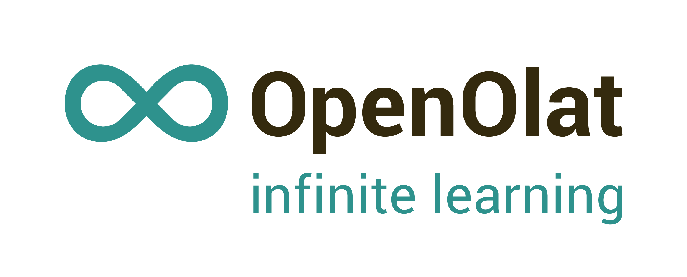

# OpenOlat documentation

This is the documentation project for the [Learning Management System OpenOlat](https://github.com/openolat/OpenOLAT). 

**OpenOlat** is a web-based e-learning platform for teaching, learning, assessment and communication, an LMS, a learning management system. OpenOlat impresses with its simple and intuitive operation and rich feature set.

A sophisticated modular toolkit provides course authors with a wide range of didactic  possibilities. Each OpenOlat installation can be individually extended, adapted to organizational needs, and integrated into existing IT infrastructures. The architecture is designed for minimal resource consumption, scalability and security in order to guarantee high system reliability. 

Visit the [OpenOlat project homepage](https://www.openolat.com) and the [OpenOlat documentation](https://docs.openolat.org) for more information. The documentation generated by this GIT project is published at [https://docs.openolat.org](https://docs.openolat.org).

 

### Resources:  

The OpenOlat documentation is based on MkDocs using the material theme and some plugins. The manual is written using the markdown syntax.

- [https://daringfireball.net/projects/markdown/](https://daringfireball.net/projects/markdown/)
- [https://www.mkdocs.org](https://www.mkdocs.org)
- [https://squidfunk.github.io/mkdocs-material/](https://squidfunk.github.io/mkdocs-material/)
- [https://github.com/backstage/mkdocs-monorepo-plugin](https://github.com/backstage/mkdocs-monorepo-plugin)
- [https://github.com/ultrabug/mkdocs-static-i18n](https://github.com/ultrabug/mkdocs-static-i18n)
- [https://facelessuser.github.io/pymdown-extensions/](https://facelessuser.github.io/pymdown-extensions/)
- [Helpful markdown guide: https://markdownguide.org](https://www.markdownguide.org/basic-syntax/)

## File structure

- Landing page:
	- The page structure is defined in the `mkdocs.yml` file within the space
	- Page files are located in `/docs/`
- Sites
	- Contains all the manual sections (release notes, user manual, admin manual tech doc etc)
	- Each site 
	- The page structure is defined in the `mkdocs.yml`file within the space
	- Page files are located in `/docs/` folder within the site
	- For more info see the [monorepo plugin docu](https://github.com/backstage/mkdocs-monorepo-plugin)
- i18n
	- Normal `xyz.md` files are in EN (default) since not all spaces are available in all languages
	- The corresponding DE version have the `xyz.de.md` file ending
	- The same file pattern applies to images as well.
	- For more info see the [static i18n plugin docu](https://github.com/ultrabug/mkdocs-static-i18n)

## Referencing from OpenOlat

OpenOlat uses the page URL including anchors to link to specific areas of the documentation. Thus, changing page names and anchors must be modified in sync with the corresponding references within the OpenOlat code. The URL is derived from the page file name: `about.md` will lead to the URL `..../about/`. 

Normally markdown generates HTML anchors for each title element automatically. This is unhandy when writing a multi-language documentation where not only the link to pages but also the link to the dedicated chapter in the page must be linkable from OpenOlat. Thus, the anchors must be set explicitly using the `attr-listattr-list` markdown extension:
 
	# This is a title {: #this-is-the-anchor-to-this-title }
 

The hierarchical structure of URL's is defined in the `mkdocs.yml` file. 

## Manual versions

The manual is published from the GIT master version on the server in the `/` directory. Whenever a new main OpenOlat version is published, the documentation is tagged with the same tag and a branch is created. This docu branch is then published in a version directory like `16.2`.

## Working on the documentation

### Install docu development environment {: #install-dev}

MkDocs uses the Python programming language. You first need to install python3 and pip3 to use MkDocs. 

*MacOS*: there are several ways to to install MkDocs on MacOS, one simple ways is to use the brew package manager. 
To continue you must first install [brew](https://brew.sh).    

	# Basic Python 3 installation
	brew install python
	
	# Install MkDocs
	pip3 install mkdocs

	#Install MkDocs theme and plugins
	pip3 install mkdocs-material
	pip3 install mkdocs-monorepo-plugin   
	pip3 install mkdocs-static-i18n
	pip3 install mkdocs-git-revision-date-plugin

You need to install mkdocs-material >= version 8.2.

#### Update 

From time to time you need to update everything: 

	# Basic Python 3 installation. Example how this is done on the mac
	# Upgrade python really only if you need
	brew upgrade python
	
	# Update mkdocs if new releases have been published
	pip3 install mkdocs -U
	pip3 install mkdocs-material -U	
	pip3 install mkdocs-monorepo-plugin -U
	pip3 install mkdocs-static-i18n -U
	pip3 install mkdocs-git-revision-date-plugin -U	
	

### Markdown editor and Git client 

Any Markdown editor and any Git client can be used. To make things simple we recommend to download [Visual Code Studio](https://code.visualstudio.com) that combines a Git client, a decent Markdown editor and a Markdown preview in one single tool. It is available for free for [Mac, Windows and Linux](https://code.visualstudio.com/#alt-downloads).

On the Mac the installation is very simple:

	brew install --cask visual-studio-code

More information about this topic can be found in the [https://docs.openolat.org/manual_dev/documentation/howto-visual-studio/](Working with Visual Studio Code) guide. 

### Git project URL

The public repository is available at the following Git URL: 

	https://github.com/OpenOLAT/OpenOLAT-docs.git

Note that this is a read-only repository. If you are frentix staff and want to modify the repo, please ask for our interal Git Repo. 

### Author documentation

Please read the [OpenOlat manual documentation](https://docs.openolat.org/manual_dev/documentation/) carefully, you will find tips and trick and usefull information.  

### Local preview

When editing the files it is recommended to start a local server to preview the changes. The server reloads the pages on every change. Since the manual is large, reloading of changes can take quite some time. 

	cd OpenOLAT-docs  
	python3 -m mkdocs serve --dirtyreload

Now open [http://127.0.0.1:8000/](http://127.0.0.1:8000/) in your browser to navigate and preview. 

### Export site as static HTML files

For publishing the documentation, compile it and publish it on your server. 

	cd OpenOLAT-docs
	python3 -m mkdocs build
	scp -r site/??* oodocs@docs.openolat.org:/home/oodocs/html/.
