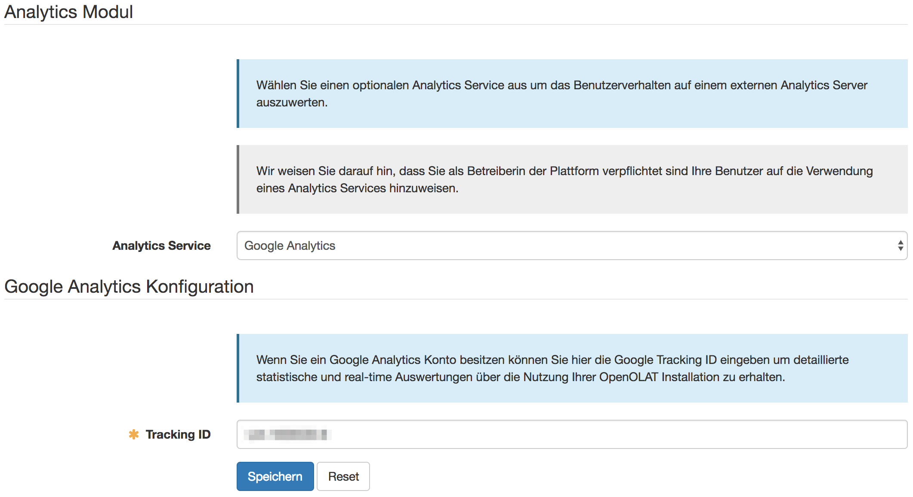

# Analytics Modul

In OpenOlat ist die Infrastruktur zur Unterstützung externer Analytics
Werkzeuge bereitgestellt. Diese dienen der detaillierten Auswertung des
Verhaltens von Anwendern innerhalb von OpenOlat oder zur Analyse der
verwendeten Geräte.

Initial wird Google Analytics unterstützt. Die Aktivierung erfolgt in der
Administration unter "Externe Werkzeuge". Um Google Analytics in OpenOlat zu
nutzen, ist zwingend ein Google Analytics Account notwendig. Zudem muss eine
sogenannte Tracking-ID hinterlegt werden.

{ class="shadow lightbox" }

Sind die Konfigurationen abgeschlossen, bildet Google Analytics beispielsweise
folgende Daten ab:

  * Wo verbringen die User die meiste Zeit in OpenOlat?
  * Welchen Browser verwenden die User dabei?
  * Verwenden die User ein Smartphone?

Echtzeit-Analyse steht ebenfalls zur Verfügung.

