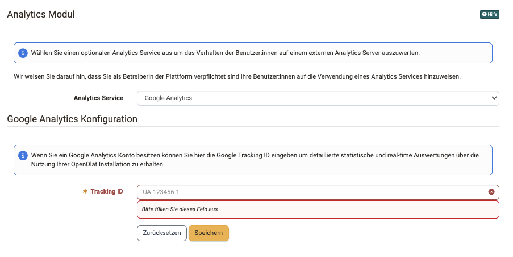
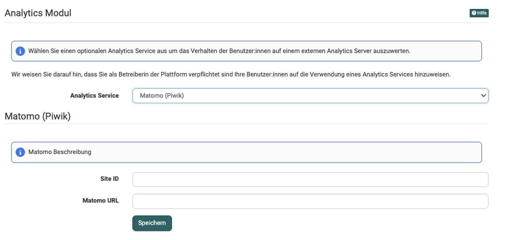

# Analytics Modul

In OpenOlat ist die Infrastruktur zur Unterstützung externer Analytics
Werkzeuge bereitgestellt. Diese dienen der detaillierten Auswertung des
Verhaltens von Anwendern innerhalb von OpenOlat oder zur Analyse der
verwendeten Geräte.

Sie aktivieren das Modul in der System-Administration unter: 
`Administration > Externe Werkzeuge > Analytics`

Im Feld "Analytics Service" wählen Sie den gewünschten Dienst aus. Zur Auswahl
stehen Google Analytics und Matomo (Piwik). Mit der Einstellung "Analytics
Module nicht verwenden" schalten Sie die Auswertung ab.

!!! info "Wichtig"
    Als Betreiberin der Plattform sind Sie verpflichtet, Ihre Benutzer:innen auf
    die Verwendung eines Analytics Services hinzuweisen.

## Google Analytics [:octicons-tag-16:{ title="ab Release 12.3 (OO-3243)" }](https://track.frentix.com/issue/OO-3243)

Um Google Analytics in OpenOlat zu nutzen, ist zwingend ein Google Analytics
Account notwendig. Zudem muss eine sogenannte Tracking-ID hinterlegt werden.

{ class="shadow lightbox" }

Sind die Konfigurationen abgeschlossen, bildet Google Analytics beispielsweise
folgende Daten ab:

  * Wo verbringen die User die meiste Zeit in OpenOlat?
  * Welchen Browser verwenden die User dabei?
  * Verwenden die User ein Smartphone?

Echtzeit-Analyse steht ebenfalls zur Verfügung.

## Matomo (Piwik) [:octicons-tag-16:{ title="ab Release 13.2 (OO-3769)" }](https://track.frentix.com/issue/OO-3769)

Matomo (Piwik) bietet einen vergleichbaren Funktionsumfang wie Google Analytics
und lässt sich auf einem eigenen Server betreiben. Die Auswertungsdaten bleiben
damit in Ihrer eigenen Infrastruktur.

Für die Konfiguration hinterlegen Sie zwei Werte:

  * **Site ID**: die numerische ID der Website in Ihrer Matomo Installation.
  * **Matomo URL**: die Adresse Ihres Matomo Servers.

OpenOlat nimmt die hinterlegte Matomo URL automatisch als vertrauenswürdige
Quelle in die Content-Security-Policy auf. Eine zusätzliche Anpassung der
Sicherheitsrichtlinien ist nicht nötig.

{ class="shadow lightbox" }
