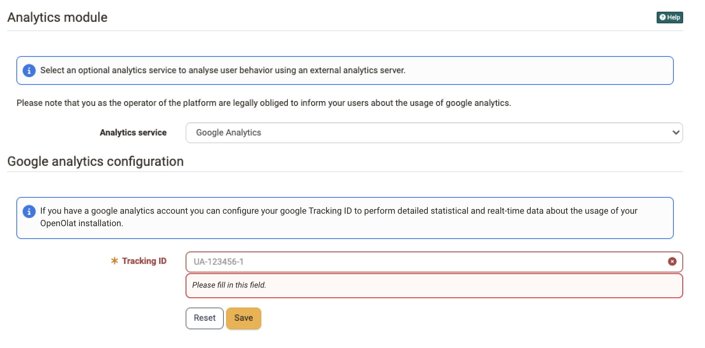
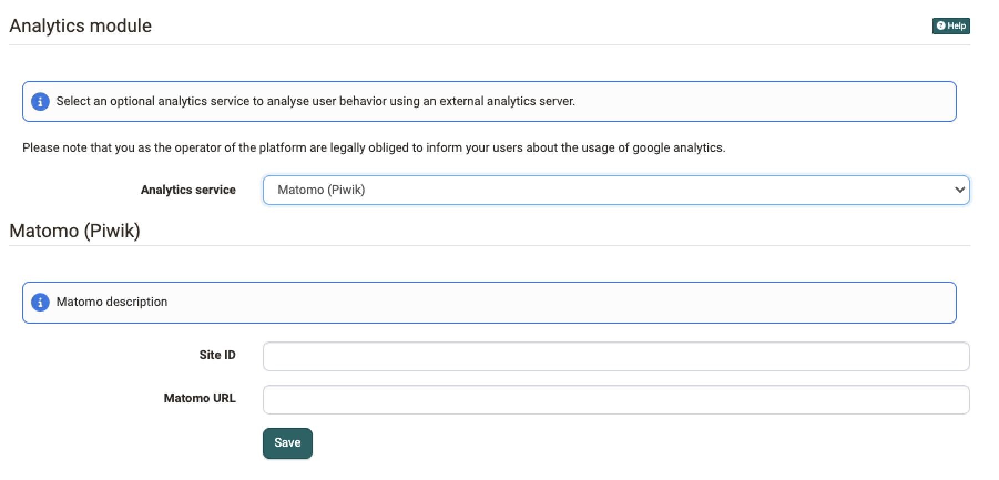

# Analytics module

In OpenOlat the infrastructure to support external analytics tools is built.
Therewith a detailed analysis of user behavior or the applied equipment while
using OpenOlat is possible.

You activate the module in the system administration under: 
`Administration > External tools > Analytics`

In the field "Analytics service" you select the service you want to use. Google
Analytics and Matomo (Piwik) are available. With the setting "Disable analytics
module" you switch the analysis off.

!!! info "Important"
    As the operator of the platform you are obliged to inform your users about
    the usage of an analytics service.

## Google Analytics [:octicons-tag-16:{ title="from Release 12.3 (OO-3243)" }](https://track.frentix.com/issue/OO-3243)

To use Google Analytics in OpenOlat a Google Analytics account is mandatory. In
addition you must enter a so-called Tracking ID.

{ class="shadow lightbox" }

Once configured, Google Analytics will show for example

  * where your users spend most of the time,
  * which browsers they use,
  * if they are on a smartphone.

It also offers "real-time" analysis.

## Matomo (Piwik) [:octicons-tag-16:{ title="from Release 13.2 (OO-3769)" }](https://track.frentix.com/issue/OO-3769)

Matomo (Piwik) offers a range of functions comparable to Google Analytics and
can be operated on your own server. The analysis data therefore stays in your
own infrastructure.

For the configuration you enter two values:

  * **Site ID**: the numeric ID of the website in your Matomo installation.
  * **Matomo URL**: the address of your Matomo server.

OpenOlat automatically adds the configured Matomo URL as a trusted source to the
Content Security Policy. An additional adjustment of the security policy is not
necessary.

{ class="shadow lightbox" }

