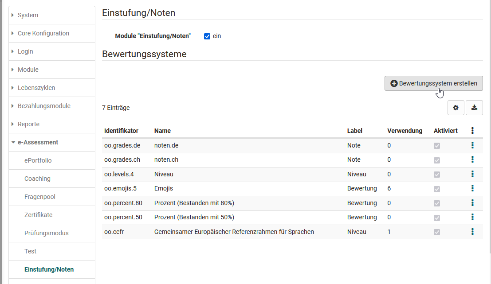
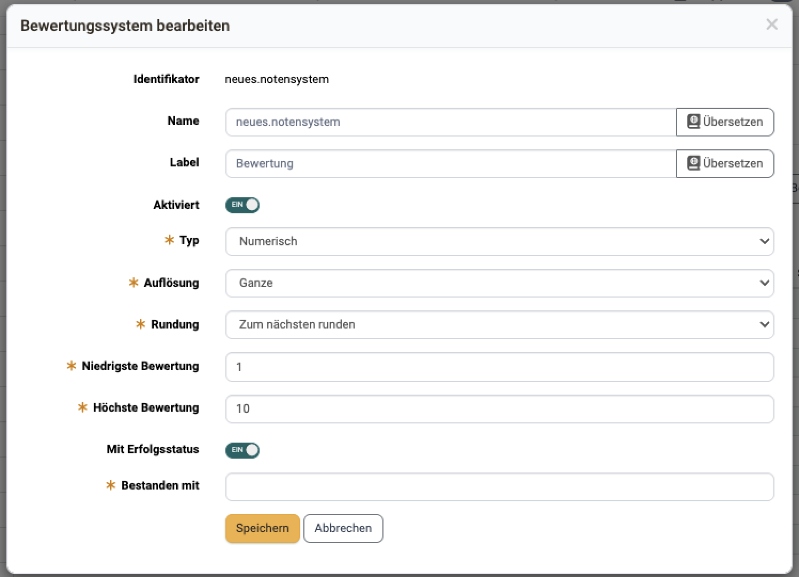
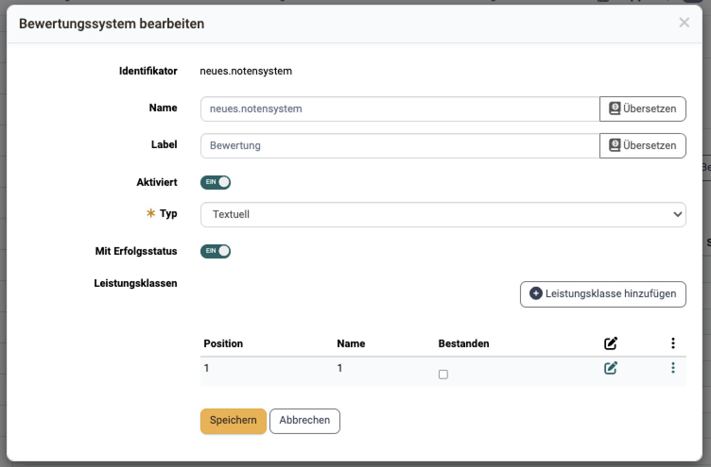

# e-Assessment Administration: Einstufung/Noten {: #grades_points}

[:octicons-tag-16:{ title="ab Release 16.2 (OO-6007)" }](https://track.frentix.com/issue/OO-6007)

Administrator:innen schalten das Modul "Einstufung/Noten" ein und erstellen die Bewertungssysteme, mit denen sich Punkte in Noten umwandeln lassen. Sie finden das Modul in der System-Administration unter: 
`Administration > e-Assessment > Einstufung/Noten`

{ class="shadow lightbox" }

Der Begriff "Note" wird hier als Platzhalter für alle möglichen Ausgabeformate verwendet. (Beispiele könnten sein: 1-6, A-F, "sehr gut" - "ungenügend", "Einsteiger"/"Spezialist"/"Experte" etc.).

Nach der Aktivierung können Kursbesitzer:innen die Einstufung/Noten im Kurseditor in bewertbaren Kursbausteinen einschalten, zum Beispiel in Test, Aufgabe, Bewertung oder Videoaufgabe.

## Bewertungssystem

Folgende Einstellungen können Systemadministrator:innen vornehmen, um die Bewertungssysteme zu konfigurieren:

{ class="shadow lightbox" }

### Numerischer Typ

Numerische Bewertungssysteme lassen sich in der Auflösung (Ganze, Halbe, Viertel, Zehntel) und in der Rundung anpassen. Die niedrigste und die höchste Bewertung legen fest, welche Noten es in diesem System gibt. Die Grenze "Bestanden mit" bestimmt, ab welcher Note eine Leistung als bestanden gilt. Daraus ergibt sich die Bewertungsskala.

### Textueller Typ

Eine Leistungsklasse ist eine benannte Stufe eines Bewertungssystems, zum Beispiel "Anfänger", "Fortgeschritten" oder "Experte". Statt einer Note erhält eine Person den Namen der Stufe, die sie mit ihrer Punktzahl erreicht.

Bei textuellen Bewertungssystemen definiert man die Anzahl der Leistungsklassen und deren Name/Label. Die maximale Punktzahl und die Punkte Untergrenze je Leistungsklasse bestimmen dann die Rahmenbedingungen der Bewertungsskala.

{ class="shadow lightbox" }

Weitere Beispiele für sinnvolle Label sind: Einsteiger, Fortgeschritten, Profi oder verschiedene Emojis.

In der System-Administration können mehrere Bewertungssysteme hinterlegt und zur Verfügung gestellt werden.
