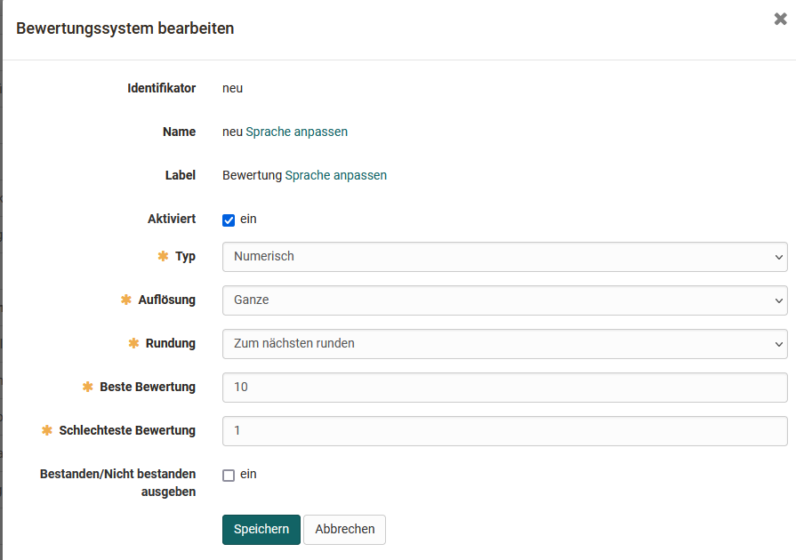

# Modul Einstufung/Noten

:octicons-tag-24: Release 16.2

OpenOlat Administratoren können die Option Umwandlung von Punkten in Noten einschalten und Bewertungssysteme erstellen.

Der Begriff "Note" wird hier als Platzhalter für alle möglichen Ausgabeformate verwendet. (Beispiele könnten sein: 1-6, A-F, "sehr gut" - "ungenügend", "Einsteiger"/"Spezialist"/"Experte" etc.). 

Nach der Aktivierung können Kursbesitzer die Option im Kurseditor für einen Assessment Kursbaustein aktivieren. 

## Bewertungssystem

Folgende Einstellungen können Systemadministratoren vornehmen um die Bewertungsskalen zu konfigurieren: 

{class="shadow"}

### Numerischer Typ 
Numerische Bewertungstypen können in ihrer Auflösung (Ganze-, Halbe-, Viertel-, Zentelnoten) und ihrem Rundeverhalten angepasst werden. Dabei werden die Leistungsklassen anhand der eingegeben maximalen Punktzahl und der Bewertungsschwelle berechnet und ergeben den Bewertungsschlüssel.

### Textueller Typ
Bei textuellen Bewertungstypen definiert man die Anzahl der Leistungsklassen und deren Name/Label. Die maximale Punktzahl und die jeweilige Notenuntergrenze bestimmen dann die Rahmenbedingungen des Bewertungsschlüssels.

{class="shadow"}

Weitere Beispiele für sinnvolle Labelbezeichnungen sind: Einsteiger, Fortgeschritten, Profi oder verschieden Smilies usw.. 

In der Administration können mehrere Bewertungssysteme hinterlegt und zur Verfügung gestellt werden. 

