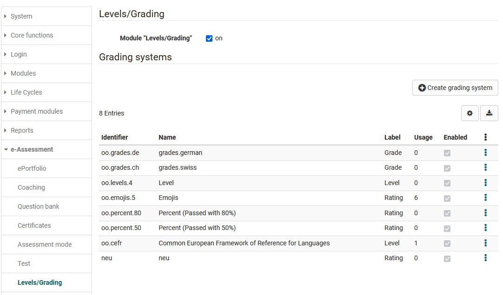
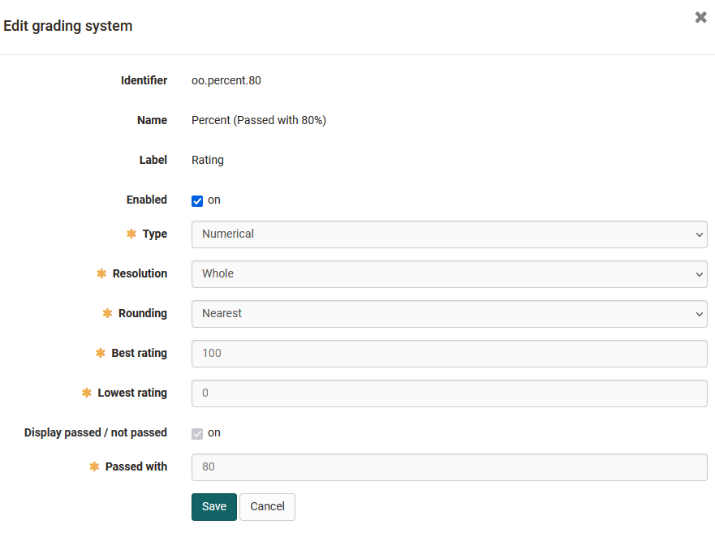
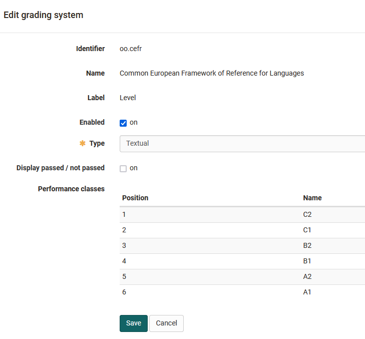

# Module Levels/Grading

:octicons-tag-24: Release 16.2

OpenOlat administrators can enable the option to convert points to grades and create grading systems.

The term "Note" is used here as a placeholder for all possible output formats. (Examples could be: 1-6, A-F, "very good" - "unsatisfactory", "Beginner"/"Advanced"/"Expert" etc.). 

After activation, course owners can activate the option in the course editor for an assessment course element.

## Grading system

System administrators can make the following settings to configure the rating scales:

{class="shadow"}

### Numeric type 
Numeric types can be customised in their resolution (whole, half, quarter, cent) and rounding behaviour. In this case, the performance classes are calculated on the basis of the entered maximum number of points and the grade threshold and result in the grade key.

### Textual type
With textual types, one defines the number of performance classes and their name/label. The maximum number of points and the respective grade threshold then determine the general conditions of the grading scale

{class="shadow"}

Examples are: Beginner, Advanced, Professional, different Smileys etc.

Several rating systems can be stored and made available in the administration.