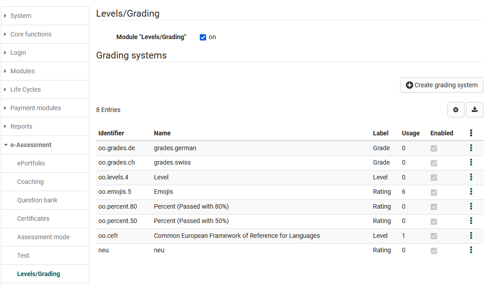
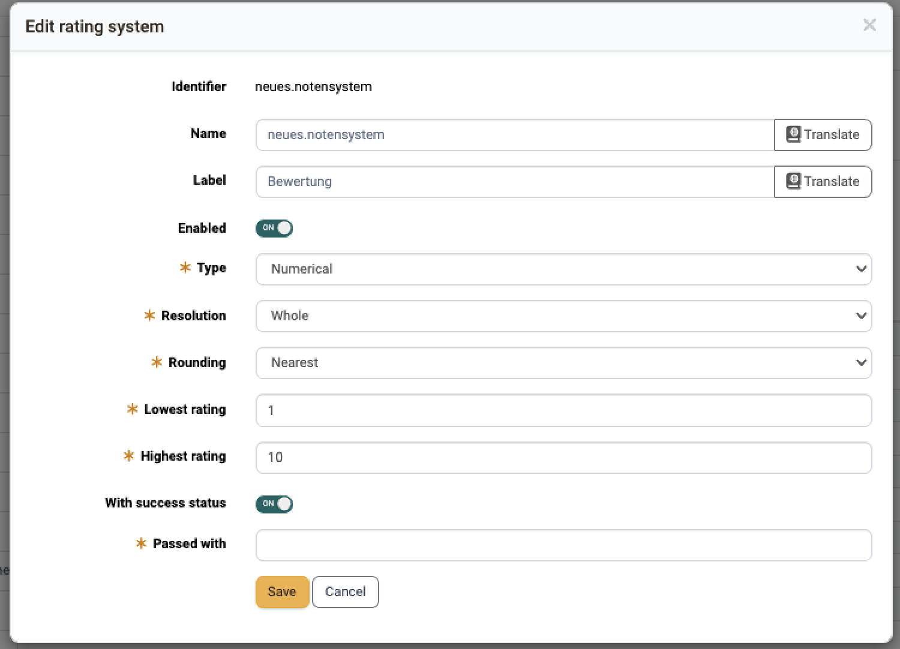
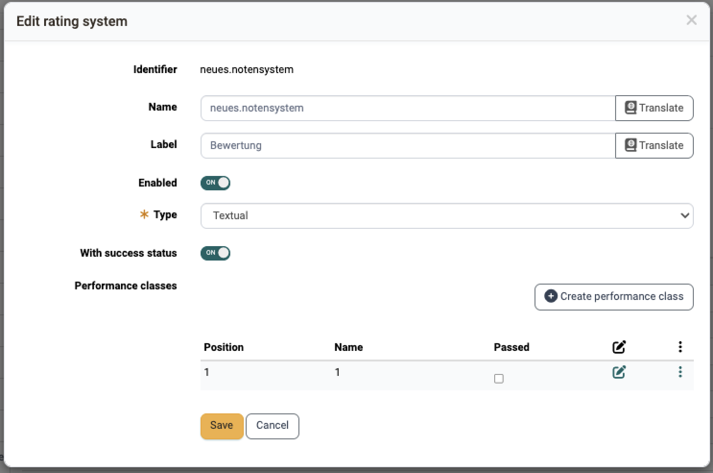

# e-Assessment Administration: Levels/Grading {: #grades_points}

[:octicons-tag-16:{ title="from Release 16.2 (OO-6007)" }](https://track.frentix.com/issue/OO-6007)

Administrators enable the module "Levels/Grading" and create the rating systems that convert points into grades. You find the module in the system administration under: 
`Administration > e-Assessment > Levels/Grading`

{ class="shadow lightbox" }

The term "Note" is used here as a placeholder for all possible output formats. (Examples could be: 1-6, A-F, "very good" - "unsatisfactory", "Beginner"/"Advanced"/"Expert" etc.).

After activation, course owners can enable Levels/Grading in the course editor in assessable course elements, for example in Test, Task, Assessment or Video task.

## Grading system

System administrators can make the following settings to configure the rating systems:

{ class="shadow lightbox" }

### Numeric type

Numeric rating systems can be customised in their resolution (whole, half, quarter, tenth) and in their rounding behaviour. In this case, the performance classes are calculated on the basis of the entered maximum number of points and the grade threshold and result in the rating scale.

### Textual type

With textual rating systems, one defines the number of performance classes and their name/label. The maximum number of points and the respective grade threshold then determine the general conditions of the rating scale.

{ class="shadow lightbox" }

Further examples of useful label names are: Beginner, Advanced, Professional or various emojis.

Several rating systems can be stored and made available in the system administration.
