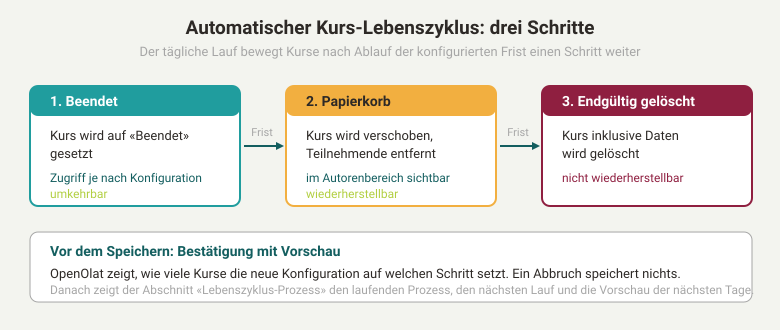
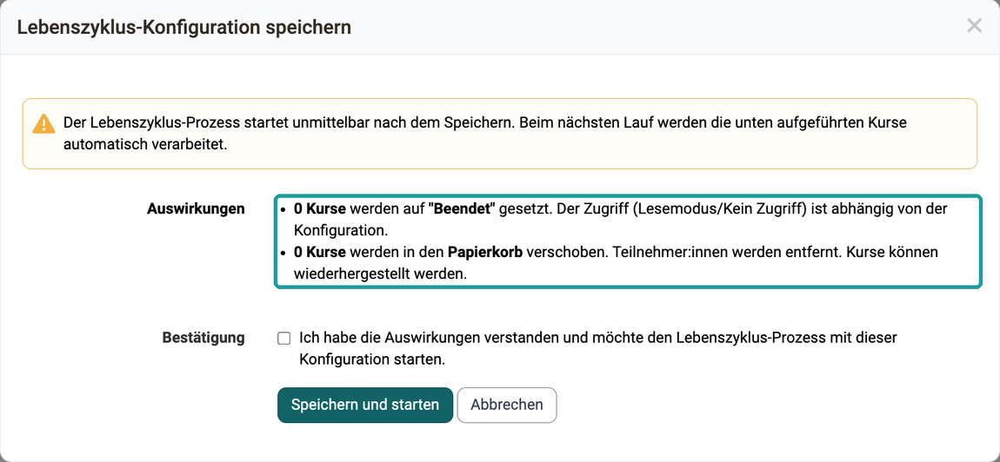
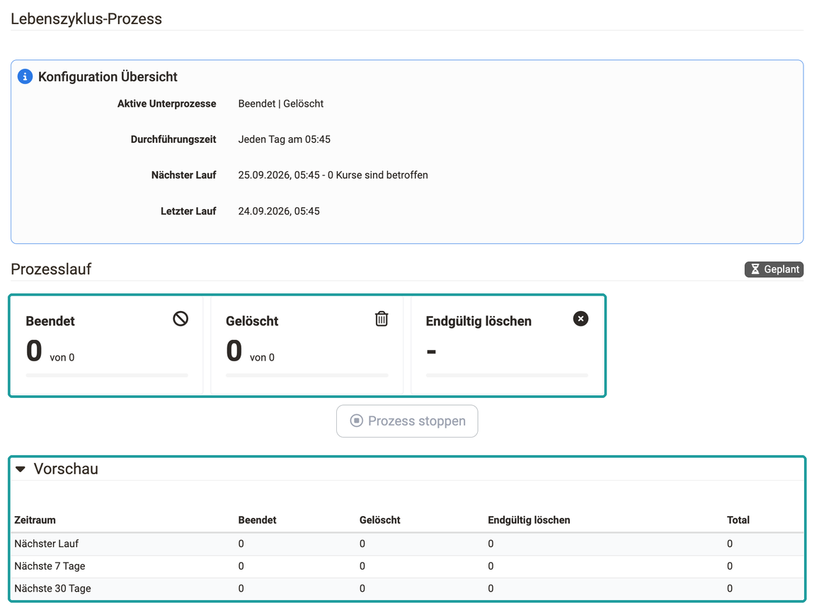

# Automatischer Kurs-Lebenszyklus {: #course_lifecycle}

Wer viele Kurse betreibt, möchte alte Kurse nach dem Kursende geordnet beenden, in den Papierkorb verschieben und zuletzt endgültig löschen, ohne jeden Kurs einzeln anzufassen. Der automatische Kurs-Lebenszyklus erledigt das in einem täglichen Lauf nach den Fristen, die Sie festlegen. Bevor Sie eine Konfiguration speichern, zeigt OpenOlat, wie viele Kurse sie auf welchen Schritt setzt. Danach sehen Sie im Abschnitt "Lebenszyklus-Prozess", was gerade läuft und was in den nächsten Tagen ansteht.

Die Konfiguration nehmen Administrator:innen in der System-Administration vor unter: 
`Administration > Lebenszyklen > Kurse`

{ class="lightbox" }

## Die drei Schritte {: #steps}

Ein Kurs verlässt den Betrieb in drei Schritten, damit sich ein Fehlgriff bis zum letzten Schritt rückgängig machen lässt. Jeden Schritt schalten Sie einzeln ein, und jeder hat seine eigene Frist.

* **1 Beendet** 
  "Beendet" ist ein Status des Kurses: Die Durchführung ist abgeschlossen, der Kurs bleibt aber mit seinen Mitgliedern bestehen. Welchen Zugriff Teilnehmende auf einen beendeten Kurs haben, legt eine systemweite Einstellung im [Modul Lernressource, Tab Zugang](Modules_Learning_Resource.de.md#tab_accesss) fest: Nur-Lese-Zugriff oder Kein Zugriff. Pro Kurs lässt sie sich überschreiben. Ein beendeter Kurs lässt sich wieder auf einen aktiven Status setzen.

* **2 Papierkorb** 
  Im Papierkorb ist der Kurs gelöscht, aber noch vorhanden. OpenOlat entfernt die Teilnehmer:innen, die Besitzer:innen bleiben eingetragen. Der Kurs steht im Autorenbereich im Tab "Gelöscht" mit dem Status "Papierkorb" und lässt sich von dort wiederherstellen. Im Abschnitt "Lebenszyklus-Prozess" heisst dieser Schritt "Gelöscht".

* **3 Endgültig gelöscht** 
  Der letzte Schritt löscht den Kurs inklusive seiner Daten. Danach lässt er sich nicht wiederherstellen.

## Konfiguration {: #configuration}

Mit der Konfiguration legen Sie fest, welche Schritte der tägliche Lauf ausführt und wie lange ein Kurs vor jedem Schritt wartet. Das Formular "Automatische Verwaltung des Lebenszyklus" enthält dafür drei Kontrollkästchen, eines pro Schritt. Sobald Sie ein Kontrollkästchen wählen, erscheinen dahinter eine ganze Zahl als Pflichtfeld und eine Einheit: Tag, Woche, Monat oder Jahr.

* **1 Beendet** 
  Das Kontrollkästchen trägt den Text "wechselt zu beenden (Benutzer:innen behalten den Zugriff, Lesemodus)". Die Frist zählt ab dem Kursende ("nach Kursende").

* **2 Löschen (Papierkorb)** 
  Das Kontrollkästchen trägt den Text "wechselt zu gelöscht (Teilnehmer:innen werden entfernt, Kurs befindet sich im Papierkorb)". Die Frist zählt ebenfalls ab dem Kursende ("nach Kursende").

* **3 Endgültig löschen** 
  Das Kontrollkästchen trägt den Text "alle Daten werden gelöscht und können nicht wiederhergestellt werden". Die Frist zählt ab dem Tag, an dem der Kurs in den Papierkorb kam ("nachdem der Kurs gelöscht wurde").

Massgebend für das Kursende ist das Enddatum des Durchführungszeitraums in den [Kurseinstellungen, Tab Durchführung](../../manual_user/learningresources/Course_Settings_Execution.de.md#execution_period). Kurse ohne Enddatum erfasst der Lauf nicht. Eine Frist endet jeweils am Ende des Tages.

Auf "Beendet" setzt der Lauf Kurse in den Status "Vorbereitung" bis "Veröffentlicht", deren Enddatum plus Frist überschritten ist. In den Papierkorb verschiebt er Kurse in den Status "Vorbereitung" bis "Beendet", deren Enddatum plus Frist überschritten ist. Endgültig löscht er Kurse im Papierkorb, deren Löschdatum plus Frist überschritten ist und auf die keine andere Lernressource mehr verweist. Kursvorlagen und Kurse, deren Status extern verwaltet wird, erfasst der Lauf nicht.

Damit Besitzer:innen erfahren, wenn jemand ihren Kurs von Hand beendet oder löscht, steht im Formular "Benachrichtigung bei Beenden/Löschen eines Kurses" in der Zeile "E-Mail-Benachrichtigung erzwungen" das Kontrollkästchen "Besitzer:innen über Statusänderungen informieren". Die Einstellung wirkt in den Dialogen "Beenden" und "Löschen" im Autorenbereich: Dort ist das Kontrollkästchen für die Benachrichtigung der Besitzer:innen vorausgewählt, und nur Administrator:innen können es abwählen. Der automatische Lauf selbst ändert den Status ohne E-Mail-Versand.

## Speichern mit Bestätigung und Vorschau [:octicons-tag-16:{ title="ab Release 21.0 (OO-9588)" }](https://track.frentix.com/issue/OO-9588) {: #confirmation}

Eine neue Konfiguration kann beim ersten Lauf viele Kurse auf einmal erfassen. Deshalb zeigt OpenOlat vor dem Speichern, was sie bewirkt. Ist mindestens ein Schritt eingeschaltet, öffnet der Button "Speichern" den Dialog "Lebenszyklus-Konfiguration speichern" mit dem Hinweis: "Der Lebenszyklus-Prozess startet unmittelbar nach dem Speichern. Beim nächsten Lauf werden die unten aufgeführten Kurse automatisch verarbeitet."

Unter "Auswirkungen" steht für jeden eingeschalteten Schritt eine Zeile mit der Anzahl der betroffenen Kurse, zum Beispiel "12 Kurse werden in den Papierkorb verschoben. Teilnehmer:innen werden entfernt. Kurse können wiederhergestellt werden." OpenOlat berechnet die Anzahlen für die eben eingegebene Konfiguration, bevor sie gespeichert ist.

{ class="shadow lightbox" }

!!! warning "Achtung"
    Auf einer Instanz mit vielen alten Kursen erfasst die Konfiguration bereits beim ersten Lauf sehr viele Kurse auf einmal, und der Prozess startet unmittelbar nach dem Speichern. Lesen Sie die Anzahlen im Dialog, bevor Sie bestätigen.

Um zu speichern, wählen Sie unter "Bestätigung" das Kontrollkästchen "Ich habe die Auswirkungen verstanden und möchte den Lebenszyklus-Prozess mit dieser Konfiguration starten." und klicken auf "Speichern und starten". Ohne dieses Häkchen meldet der Dialog "Bestätigen Sie bitte." und speichert nichts. Nach der Bestätigung speichert OpenOlat die Konfiguration und startet den Prozess sofort. Läuft bereits ein Prozess, hält OpenOlat ihn an und startet ihn mit der neuen Konfiguration neu.

Mit "Abbrechen" oder durch Schliessen des Dialogs speichert OpenOlat nichts. Das Formular behält Ihre Eingaben, so dass Sie die Fristen anpassen und erneut speichern können. Sind alle drei Schritte ausgeschaltet, speichert OpenOlat ohne Dialog.

## Lebenszyklus-Prozess: Status und Vorschau [:octicons-tag-16:{ title="ab Release 21.0 (OO-9590)" }](https://track.frentix.com/issue/OO-9590) {: #status}

Nach dem Speichern möchten Sie wissen, ob der Prozess läuft, wie weit er ist und was in den nächsten Tagen auf die Kurse zukommt. Diese Angaben stehen oberhalb des Formulars im Abschnitt "Lebenszyklus-Prozess", aufgeteilt in drei Teile.

{ class="shadow lightbox" }

* **Konfiguration Übersicht** 
  "Aktive Unterprozesse" nennt die eingeschalteten Schritte, zum Beispiel "Beendet | Gelöscht | Endgültig löschen". "Durchführungszeit" nennt die tägliche Startzeit des Laufs, standardmässig "Jeden Tag am 05:45". Eine Instanz kann eine andere Zeit konfigurieren, verbindlich ist die Anzeige. "Nächster Lauf" nennt Datum und Zeit des nächsten Laufs und dahinter die Anzahl der Kurse, die er betrifft. "Letzter Lauf" nennt den vorangegangenen Lauf.

* **Prozesslauf** 
  Die Kennzeichnung "Am laufen" oder "Geplant" zeigt, ob der Prozess gerade arbeitet oder auf seinen nächsten Start wartet. Die drei Anzeigen "Beendet", "Gelöscht" und "Endgültig löschen" zählen je Schritt den Fortschritt als "x von N" mit einem Fortschrittsbalken. Bei einem ausgeschalteten Schritt steht ein Strich.

* **Vorschau** 
  Die Tabelle ist zugeklappt und öffnet sich mit einem Klick auf "Vorschau". Sie zählt für die gespeicherte Konfiguration, wie viele Kurse jeder eingeschaltete Schritt erfasst, in den Zeilen "Nächster Lauf", "Nächste 7 Tage" und "Nächste 30 Tage". Die Spalten heissen "Zeitraum", "Beendet", "Gelöscht", "Endgültig löschen" und "Total".

### Laufenden Prozess steuern [:octicons-tag-16:{ title="ab Release 21.0 (OO-9589)" }](https://track.frentix.com/issue/OO-9589) {: #stop_process}

Bemerken Sie während eines Laufs, dass eine Frist falsch eingestellt ist, korrigieren oder stoppen Sie den Prozess, ohne das Ende des Durchlaufs abzuwarten. Eine gespeicherte Änderung der Konfiguration wirkt sich **sofort** auf einen bereits laufenden Prozess aus: Vor jedem einzelnen Kurs prüft der Prozess erneut, ob der Schritt noch eingeschaltet ist. Schalten Sie einen Schritt ab, bricht der Durchlauf beim nächsten Kurs ab, statt die alte Einstellung zu Ende zu verarbeiten.

Mit dem Button **"Prozess stoppen"** im Teil "Prozesslauf" halten Sie einen laufenden Durchlauf sofort an. Der Button ist nur aktiv, solange ein Prozess läuft. So greift eine korrigierte Einstellung auch dann unmittelbar, wenn bereits viele Kurse zur Verarbeitung ausgewählt wurden. Die übrigen Kurse verarbeitet der nächste geplante Lauf.

## Lebenszyklus im Autorenbereich {: #authoring}

Wer einen Kurs zurückholen möchte, den der Lauf in den Papierkorb verschoben hat, findet ihn im Autorenbereich. Er steht dort im Tab "Gelöscht" mit dem Status "Papierkorb" und lässt sich wiederherstellen. Endgültig löschen können ihn dort Administrator:innen und Lernressourcenverwalter:innen. Die einzelnen Schritte beschreiben die Seite [Löschen (eines Kurses/einer Lernressource)](../../manual_user/learningresources/Course_Delete.de.md) und die Anleitung [Wie manage ich Lebenszyklen von Gruppen, Kursen oder Benutzerkonten?](../../manual_how-to/lifecycle/lifecycle.de.md#course_lifecycle).

## Weiterführende Informationen {: #further_information}

**Auf dieser Seite erwähnt** 
[Modul Lernressource >](Modules_Learning_Resource.de.md) 
[Kurseinstellungen - Tab Durchführung >](../../manual_user/learningresources/Course_Settings_Execution.de.md) 
[Löschen (eines Kurses/einer Lernressource) >](../../manual_user/learningresources/Course_Delete.de.md) 
[Wie manage ich Lebenszyklen von Gruppen, Kursen oder Benutzerkonten? >](../../manual_how-to/lifecycle/lifecycle.de.md)

**Weiterführend** 
[Lebenszyklen: Übersicht >](Life_cycles_-_Administration.de.md) 
[Automatischer Gruppen-Lebenszyklus >](Automatic_Group_Lifecycle.de.md) 
[Autorenbereich - Übersicht >](../../manual_user/area_modules/Authoring.de.md)

[Zum Seitenanfang ^](#course_lifecycle)
