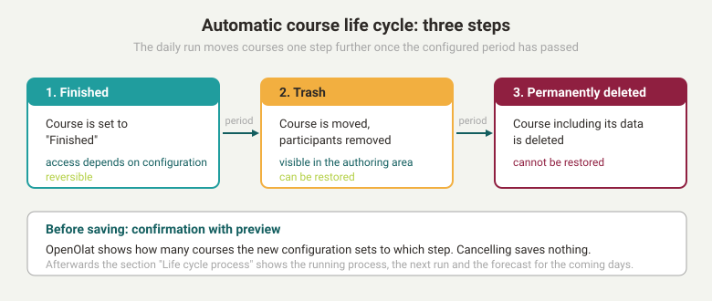
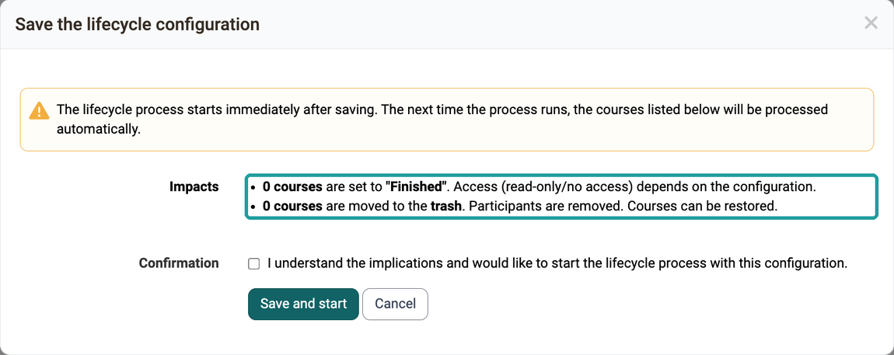
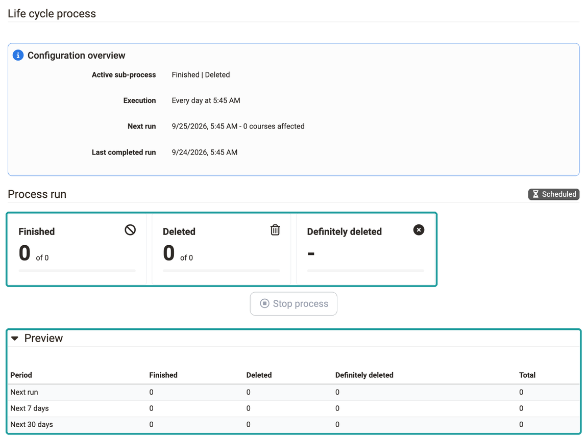

# Automatic Course Life Cycle {: #course_lifecycle}

Anyone who runs many courses wants to finish old courses in an orderly way after the course end, move them to the trash and finally delete them permanently, without handling each course individually. The automatic course life cycle does this in a daily run according to the periods you define. Before you save a configuration, OpenOlat shows how many courses it sets to which step. Afterwards you see in the section "Life cycle process" what is running at the moment and what is due in the coming days.

Administrators configure it in the system administration under: 
`Administration > Life cycles > Courses`

{ class="lightbox" }

## The three steps {: #steps}

A course leaves operation in three steps, so that a mistake can be undone up to the last step. You switch on each step individually, and each step has its own period.

* **1 Finished** 
  "Finished" is a status of the course: the execution is completed, but the course remains in place with its members. Which access participants have to a finished course is defined by a system-wide setting in the [Module Learning resource, Access tab](Modules_Learning_Resource.md#tab_accesss): Read-only or No access. It can be overridden per course. A finished course can be set back to an active status.

* **2 Trash** 
  In the trash, the course is deleted but still present. OpenOlat removes the participants, the owners remain registered. The course appears in the authoring area in the "Deleted" tab with the status "Trash" and can be restored from there. In the section "Life cycle process", this step is called "Deleted".

* **3 Permanently deleted** 
  The last step deletes the course including its data. Afterwards it cannot be restored.

## Configuration {: #configuration}

With the configuration you define which steps the daily run carries out and how long a course waits before each step. The form "Automatic Life-cycle management" contains three checkboxes for this, one per step. As soon as you select a checkbox, a whole number as a mandatory field and a unit appear behind it: Day, Week, Month or Year.

* **1 Finish** 
  The checkbox carries the text "change to finished (read only, keep user access)". The period counts from the course end ("after the course ends").

* **2 Delete (Trash)** 
  The checkbox carries the text "change to deleted (remove participants, put into trash)". The period also counts from the course end ("after the course ends").

* **3 Definitely deleted** 
  The checkbox carries the text "all data is deleted and cannot be restored". The period counts from the day on which the course was moved to the trash ("after the course has been deleted").

The course end is the end date of the execution period in the [Course Settings, Tab Execution](../../manual_user/learningresources/Course_Settings_Execution.md#execution_period). The run does not include courses without an end date. A period always ends at the end of the day.

The run sets courses with a status from "Preparation" to "Published" to "Finished" when their end date plus period has passed. It moves courses with a status from "Preparation" to "Finished" to the trash when their end date plus period has passed. It permanently deletes courses in the trash when their deletion date plus period has passed and no other learning resource refers to them any more. The run does not include templates and courses whose status is managed externally.

So that owners learn when someone finishes or deletes their course manually, the form "Notification after closing / deleting a course" contains the checkbox "Notify owners about status changes" in the row "Enforce E-mail notifications". The setting takes effect in the dialogs "Finish" and "Delete" in the authoring area: there the checkbox for notifying the owners is preselected, and only administrators can deselect it. The automatic run itself changes the status without sending an e-mail.

## Saving with confirmation and preview [:octicons-tag-16:{ title="from Release 21.0 (OO-9588)" }](https://track.frentix.com/issue/OO-9588) {: #confirmation}

A new configuration can include many courses at once in its first run. That is why OpenOlat shows what it causes before saving. If at least one step is switched on, the button "Save" opens the dialog "Save the lifecycle configuration" with the note: "The lifecycle process starts immediately after saving. The next time the process runs, the courses listed below will be processed automatically."

Under "Impacts", there is one line for each step switched on, with the number of affected courses, for example "12 courses are moved to the trash. Participants are removed. Courses can be restored." OpenOlat calculates the numbers for the configuration you have just entered, before it is saved.

{ class="shadow lightbox" }

!!! warning "Attention"
    The process starts immediately after you confirm, and in its first run it processes all courses whose period has already passed. On an instance with many old courses, hundreds of courses can land in the trash or be permanently deleted in one go, and the participants lose their access. Check the numbers under "Impacts" before you confirm. If in doubt, switch on only the step "Finish" first and add the other steps once the result is correct.

To save, select the checkbox "I understand the implications and would like to start the lifecycle process with this configuration." under "Confirmation" and click "Save and start". Without this checkmark, the dialog reports "Please confirm." and saves nothing. After the confirmation, OpenOlat saves the configuration and starts the process immediately. If a process is already running, OpenOlat stops it and restarts it with the new configuration.

With "Cancel" or by closing the dialog, OpenOlat saves nothing. The form keeps your entries, so that you can adjust the periods and save again. If all three steps are switched off, OpenOlat saves without a dialog.

## Life cycle process: status and preview [:octicons-tag-16:{ title="from Release 21.0 (OO-9590)" }](https://track.frentix.com/issue/OO-9590) {: #status}

After saving, you want to know whether the process is running, how far it has got and what lies ahead for the courses in the coming days. This information appears above the form in the section "Life cycle process", divided into three parts.

{ class="shadow lightbox" }

* **Configuration overview** 
  "Active sub-process" names the steps switched on, for example "Finished | Deleted | Definitely deleted". "Execution" names the daily start time of the run, by default "Every day at 05:45". An instance can configure a different time; the display is authoritative. "Next run" names the date and time of the next run, followed by the number of courses it affects. "Last completed run" names the previous run.

* **Process run** 
  The label "Running" or "Scheduled" shows whether the process is working at the moment or waiting for its next start. The three displays "Finished", "Deleted" and "Definitely deleted" count the progress per step as "x of N" with a progress bar. For a step that is switched off, a dash appears.

* **Preview** 
  The table is collapsed and opens with a click on "Preview". For the saved configuration, it counts how many courses each step switched on includes, in the rows "Next run", "Next 7 days" and "Next 30 days". The columns are called "Period", "Finished", "Deleted", "Definitely deleted" and "Total".

### Controlling a running process [:octicons-tag-16:{ title="from Release 21.0 (OO-9589)" }](https://track.frentix.com/issue/OO-9589) {: #stop_process}

If you notice during a run that a period is set incorrectly, correct or stop the process without waiting for the end of the pass. A saved change to the configuration takes effect **immediately** on a process that is already running: before each single course, the process checks again whether the step is still switched on. If you switch a step off, the pass stops at the next course instead of processing the old setting to the end.

Using the button **"Stop process"** in the part "Process run", you stop a running pass immediately. The button is only active while a process is running. This way a corrected setting takes effect right away, even when many courses have already been selected for processing. The next scheduled run processes the remaining courses.

## Life cycle in the authoring area {: #authoring}

Anyone who wants to get back a course that the run has moved to the trash finds it in the authoring area. It appears there in the "Deleted" tab with the status "Trash" and can be restored. Administrators and learning resource managers can delete it permanently there. The individual steps are described on the page [Delete (a course or learning resource)](../../manual_user/learningresources/Course_Delete.md) and in the guide [How do I manage lifecycles of groups, courses or user accounts?](../../manual_how-to/lifecycle/lifecycle.md#course_lifecycle).

## Further information {: #further_information}

**Mentioned on this page** 
[Module Learning resource >](Modules_Learning_Resource.md) 
[Course Settings - Tab Execution >](../../manual_user/learningresources/Course_Settings_Execution.md) 
[Delete (a course or learning resource) >](../../manual_user/learningresources/Course_Delete.md) 
[How do I manage lifecycles of groups, courses or user accounts? >](../../manual_how-to/lifecycle/lifecycle.md)

**Further reading** 
[Life cycles - Overview >](Life_cycles_-_Administration.md) 
[Automatic Group Life Cycle >](Automatic_Group_Lifecycle.md) 
[Authoring - Overview >](../../manual_user/area_modules/Authoring.md)

[To the top of the page ^](#course_lifecycle)
