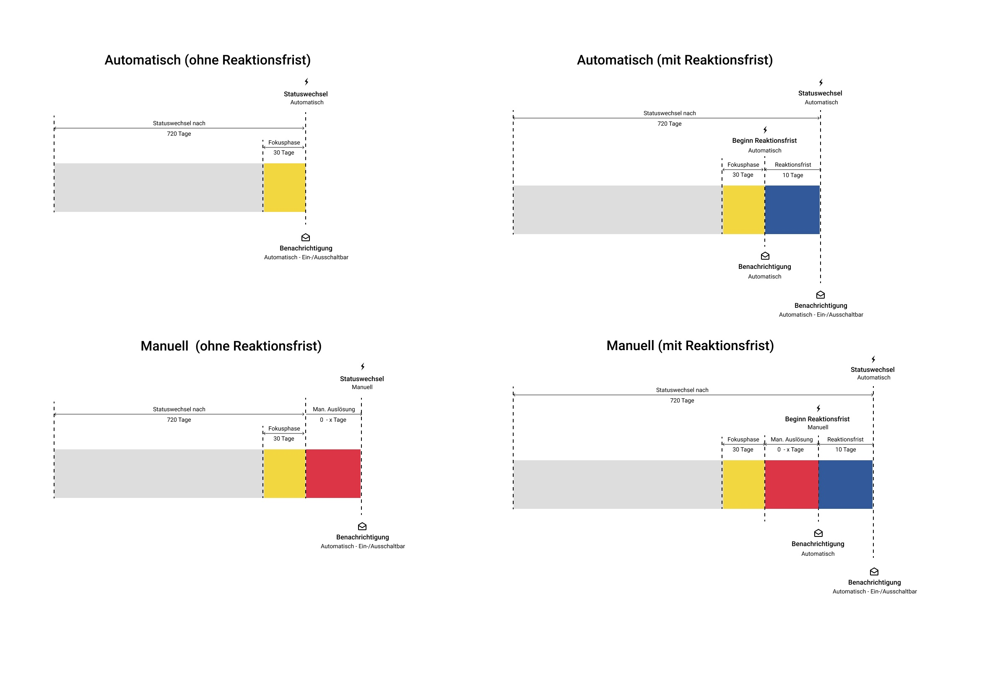

#  [Automatischer Gruppenlebenszyklus](Automatischer+Gruppenlebenszyklus.html)

Der neue Gruppenlebenszyklus macht es einfach, nicht benutzte Gruppen nach
einer bestimmten Frist **automatisch** zu inaktivieren und dann zu löschen,
ähnlich dem Lebenszyklusmanagement von Benutzern und Kursen. Die
Gruppenverwaltung wurde dahingehend umgebaut und erweitert.

Jeder dieser Schritte kann auch manuell ausgeführt werden. Mit der Erneuerung
führen wir drei Status ein, die nicht genutzte Gruppen besitzen können. Um als
Gruppenverwalte auf die jeweiligen Gruppen zugreifen zu können, reicht ein
Klick auf die Pfeile.  
  

  *  **aktiv:** Die Gruppe wird benutzt und es hat sie jemand noch in der eingestellten Frist besucht. (Standard 660 Tage ohne Besuch).

  *  **inaktiv:  **Die Gruppe ist inaktiv. Eine Mail wurde, wenn eingestellt verschickt. Wenn niemand mehr etwas an dieser Gruppe ändert, wird sie gelöscht.

  *  **gelöscht:  **Im Status "gelöscht" ist die Gruppe widerherstellbar. Allerdings sind nicht alle Daten wiederherstellbar. Nach 2 Tagen wird diese komplett gelöscht.

  

 Zusammenhänge verbildlicht

