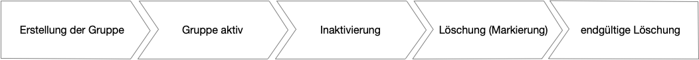
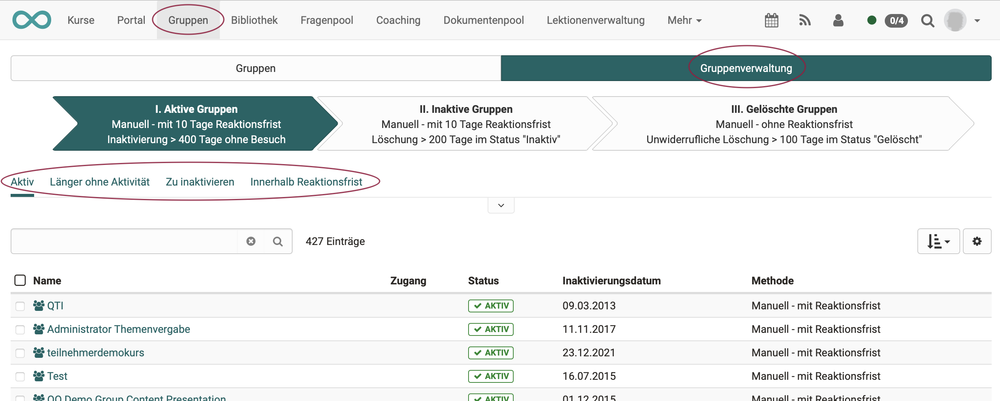
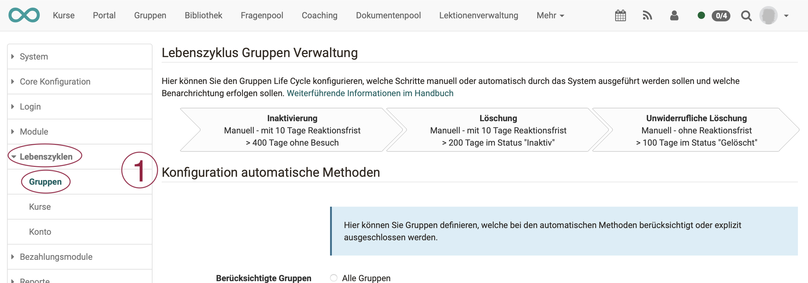
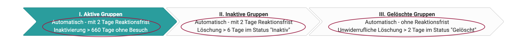
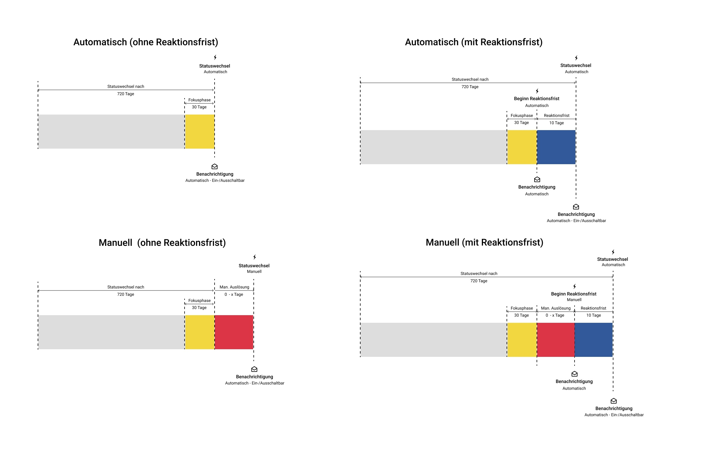
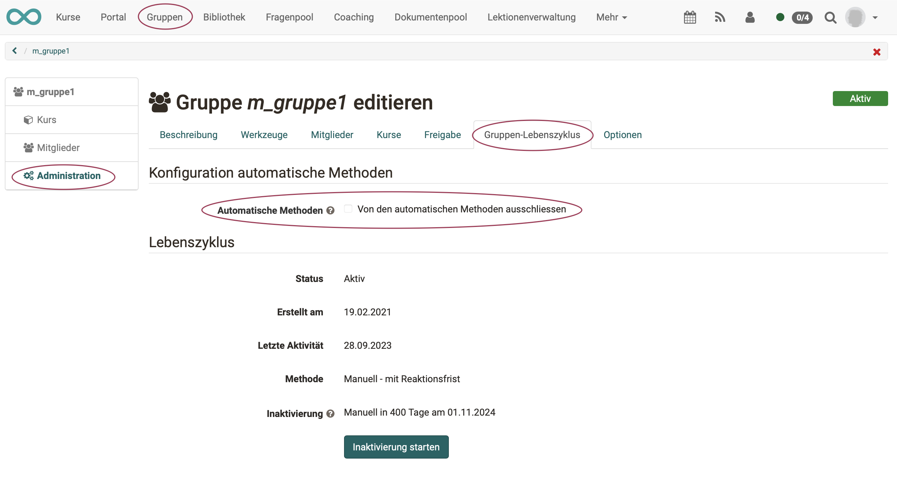
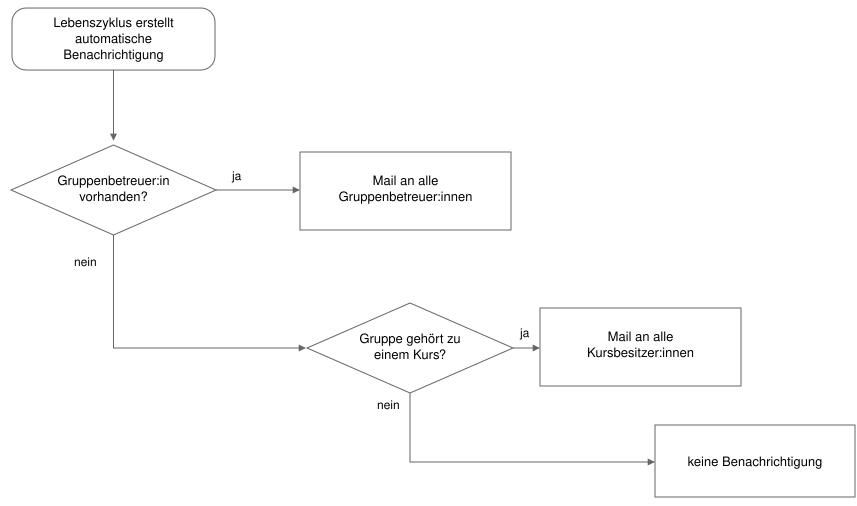

# Automatischer Gruppenlebenszyklus

Der Gruppenlebenszyklus macht es einfach, nicht benutzte Gruppen nach einer bestimmten Frist **automatisch** zu inaktivieren und dann zu löschen.

{ class="lightbox" }

!!! note "Hinweis"

    Der Prozess gleicht dem Lebenszyklusmanagement von Benutzerkonten und Kursen.

## Gruppenstatus überprüfen [:octicons-tag-16:{ title="ab Release 16.1 (OO-5190)" }](https://track.frentix.com/issue/OO-5190)

Berechtigte Personen (Gruppenverwalter:innen, Administrator:innen) erhalten bei Klick auf "Gruppen" in der Hauptnavigation ein zusätzliches Tab "**Gruppenverwaltung**".

{ class="shadow lightbox" }

Durch Klick auf einen der 3 Pfeile (Phasen/Status) werden alle vorhandenen Gruppen sortiert in 3 Kategorien aufgelistet:

* I. Aktive Gruppen
* II. Inaktive Gruppen
* III. Gelöschte Gruppen

Unterhalb der Pfeile besteht die Möglichkeit die Listen weiter einzugrenzen (z.B. Aktive Gruppen - Innerhalb Reaktionsfrist). 

Die Zusatzinformationen in den 3 Pfeilen beschreiben die Konfiguration, die von dem/der Administrator:in für diese Phase eingerichtet wurde.

## Konfiguration

Administrator:innen können den Verlauf des Gruppenlebenszyklus in der System-Administration konfigurieren unter: 
`Administration > Lebenszyklen > Gruppen`

{ class="shadow lightbox" }

Die Konfiguration definiert in 4 Abschnitten:

* **1 Konfiguration automatische Methoden** 
  Hier können Sie Gruppen definieren, welche bei den automatischen Methoden berücksichtigt oder explizit ausgeschlossen werden.

* **2 Inaktivierung** 
  Bei der Inaktivierung wird der Status der Gruppe von "Aktiv" auf "Inaktiv" gestellt und die Mitglieder können nur noch schreibgeschützt auf die Gruppe zugreifen. Inaktive Gruppen können vollständig reaktiviert werden. 
  **Optionen:**
    * Anzahl der Tage, die eine Gruppe ohne Aktivität im Status "Aktiv" verbleibt, bis sie inaktiviert wird
    * automatische oder manuelle Inaktivierung?
    * Benachrichtigungen über bevorstehende Inaktivierung
    * Reaktionsfrist
    * falls Reaktivierung erfolgt, Wartezeit bis zur erneuten Inaktivierung
    * Benachrichtigungen über erfolgte Inaktivierung

* **3 Löschung** 
  Beim Löschen werden alle Mitglieder aus der Gruppe und die Verknüpfungen auf Kurse entfernt. Alle restlichen Daten bleiben erhalten und sind einsehbar. Die Gruppe kann wiederhergestellt werden. 
  **Optionen:**
    * automatische oder manuelle Löschung?
    * Benachrichtigungen über bevorstehende Löschung
    * Reaktionsfrist
    * Anzahl der Tage, die eine Gruppe im Status "Inaktiv" verbleibt, bis sie gelöscht wird
    * Benachrichtigungen über erfolgte Löschung

* **4 Unwiderrufliche Löschung** 
  Beim unwiderruflichen Löschen wird die Gruppe vollständig entfernt. 
  **Optionen:**
    * Anzahl der Tage, die eine Gruppe im Status "Gelöscht" verbleibt, bis sie endgültig gelöscht wird
    * automatische oder manuelle Löschung?

Das Resultat der gemachten Einstellungen ist sowohl in den 3 Pfeilen im oberen Teil des Konfigurationsscreens (für Administrator:innen) zusammengefasst, als auch in den Pfeilen im Tab "Gruppenverwaltung", das Gruppenverwalter:innen und Administrator:innen unter der Hauptnavigation in "Gruppen" sehen.

**Beispiel: Ansicht für Gruppenverwalter:innen**

{ class="shadow lightbox" }

  *  **aktiv:** Die Gruppe wird benutzt und es hat sie jemand innerhalb der eingestellten Frist noch besucht. (Standard 660 Tage ohne Besuch).

  *  **inaktiv:** Die Gruppe ist inaktiv. Eine Mail wurde verschickt (falls so konfiguriert). Wenn niemand mehr etwas an dieser Gruppe ändert, wird sie gelöscht.

  *  **gelöscht:** Im Status "gelöscht" ist die Gruppe wiederherstellbar. Allerdings sind nicht alle Daten wiederherstellbar. Nach 2 Tagen wird diese Gruppe komplett gelöscht.

## Beispiele zum zeitlichen Verlauf eines Statuswechsels 

{ class="lightbox" }

## Ausschluss einer Gruppe vom Gruppenlebenszyklus [:octicons-tag-16:{ title="ab Release 17.1 (OO-5887)" }](https://track.frentix.com/issue/OO-5887)

Gruppenbetreuer:innen haben die Möglichkeit, ihre Gruppe aus den automatischen Methoden explizit auszuschliessen. Das heisst, dass alle Aktionen im Gruppenlebenszyklus manuell angestossen werden müssen. Sie finden die Option unter: 
`Gruppe > Administration > Gruppen-Lebenszyklus`

{ class="shadow lightbox" }

!!! info "Wichtig"

    Ist die Option bereits aktiviert und schreibgeschützt, gehört die Gruppe zu einem bestimmten Gruppentyp (extern verwaltet oder mit eingebundenen Kursen), welcher in der System-Administration unter `Administration > Lebenszyklen > Gruppen` bereits global ausgeschlossen wurde.

## Wer bekommt die Benachrichtigungen?

Sobald durch die eingestellten Bedingungen eine automatische Benachrichtigung ausgelöst wurde, prüft OpenOlat, an wen die Benachrichtigung als Mail verschickt wird.

{ class="lightbox" }

