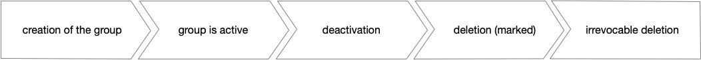
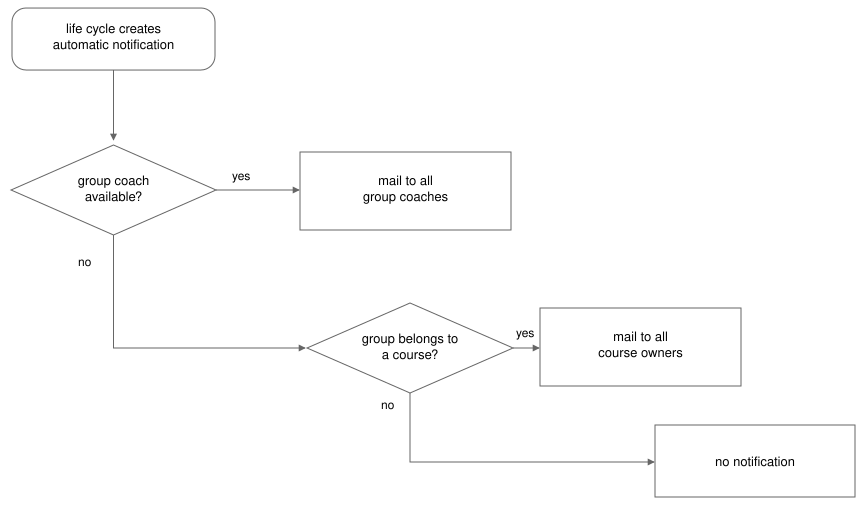

# Automatic Group Lifecycle

The group life cycle makes it easy to **automatically** deactivate and then delete unused groups after a certain period of time.

{ class="lightbox" }

!!! note "Note"

    The process is similar to the lifecycle management of user accounts and courses.

## Check group status [:octicons-tag-16:{ title="from Release 16.1 (OO-5190)" }](https://track.frentix.com/issue/OO-5190)

Authorized persons (group managers, administrators) receive the additional tab "**Group management**" when they click on "Groups" in the main navigation.

{ class="shadow lightbox" }

By clicking on one of the 3 arrows (phases/status), all existing groups are listed sorted into 3 categories:

* I. Active groups
* II. Inactive groups
* III. Deleted groups

Below the arrows it is possible to further narrow down the lists (e.g. Active groups - Within response time).

The additional information in the 3 arrows describes the configuration set up by the administrator for this phase.

## Configuration

Administrators can configure the progress of the group life cycle in the system administration under: 
`Administration > Lifecycles > Groups`

{ class="shadow lightbox" }

The configuration is defined in 4 sections:

* **1 Configuration of automatic methods** 
  Here you can define groups that are included or explicitly excluded from the automatic methods.

* **2 Deactivation** 
  When deactivated, the status of the group is changed from "Active" to "Inactive" and members can only access the group in read-only mode. Inactive groups can be fully reactivated. 
  **Options:**
    * Number of days that a group remains in the "Active" status without activity until it is deactivated
    * Automatic or manual deactivation?
    * Notifications about imminent deactivation
    * Response period
    * If reactivation takes place, waiting time until reactivation
    * Notifications about deactivation

* **3 Deletion** 
  When deleting, all members of the group and the links to courses are removed. All remaining data is retained and can be viewed. The group can be restored. 
  **Options:**
    * Automatic or manual deletion?
    * Notifications of impending deletion
    * Response period
    * Number of days a group remains in "Inactive" status until it is deleted
    * Notifications of deletion

* **4 Irrevocable deletion** 
  Irrevocable deletion removes the group completely. 
  **Options:**
    * Number of days a group remains in "Deleted" status until it is finally deleted
    * Automatic or manual deletion?

The result of the settings made is summarized both in the 3 arrows in the upper part of the configuration screen (for administrators) and in the arrows in the "Group management" tab, which group managers and administrators see under the main navigation in "Groups".

**Example: View for group managers**

{ class="shadow lightbox" }

  *  **active:** The group is used and someone has visited it within the set period. (Standard 660 days without a visit).

  *  **inactive:** The group is inactive. An email has been sent (if configured). If no further changes are made to this group, it will be deleted.

  *  **deleted:** In the "deleted" status, the group can be restored. However, not all data can be restored. This group is completely deleted after 2 days.

## Examples of the chronological sequence of a status change 

{ class="lightbox" }

## Exclusion of a group from the group lifecycle [:octicons-tag-16:{ title="from Release 17.1 (OO-5887)" }](https://track.frentix.com/issue/OO-5887)

Group coaches have the option of explicitly excluding their group from the automatic methods. This means that all actions in the group life cycle must be triggered manually. You will find the option under: 
`Group > Administration > Group Life Cycle`

{ class="shadow lightbox" }

!!! info "Important"

    If the option is already activated and write-protected, the group belongs to a specific group type (externally managed or with integrated courses), which has already been globally excluded in the system administration under `Administration > Lifecycles > Groups`.

## Who receives the notifications?

As soon as an automatic notification has been triggered by the set conditions, OpenOlat checks to whom the notification is sent as an email.

{ class="lightbox" }

