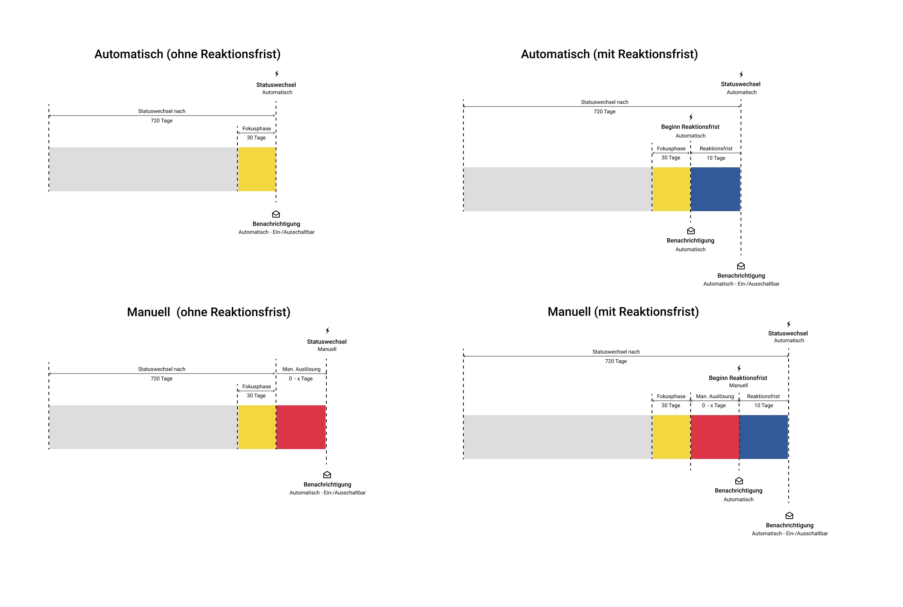

# Automatic group life cycle

The new group lifecycle makes it easy to inactivate and then delete unused groups
a certain period **automatically** inactivated and then deleted,
similar to the lifecycle management of users and courses. The
Group management has been rebuilt and extended to this end.

Each of these steps can also be performed manually. With the renewal
we introduce three statuses that unused groups can have. In order to access the
access to the respective groups as a group administrator, just click on the arrows.
click on the arrows.  
  
{ class="lightbox" }

  * **active:** The group is in use and someone has visited it yet in the set period. (default 660 days without a visit).

  * **inactive:  **The group is inactive. A mail has been sent if set. If no one changes anything else on this group, it will be deleted.

  * **deleted:  **In the "deleted" status, the group is recoverable. However, not all data is recoverable. After 2 days it will be deleted completely.

  

### Contexts illustrated

{ class="lightbox" }
