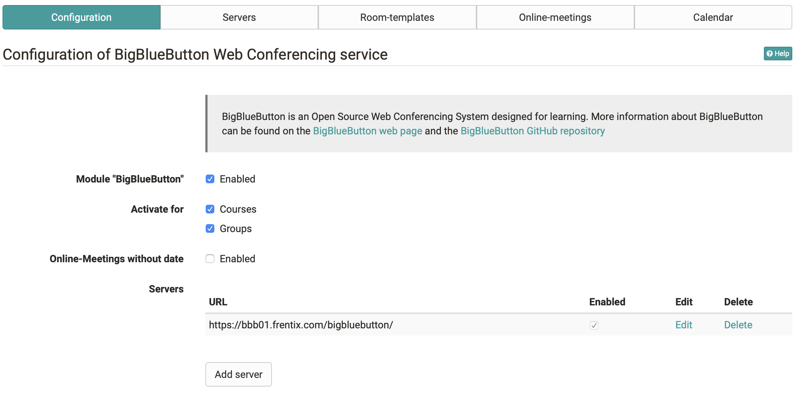
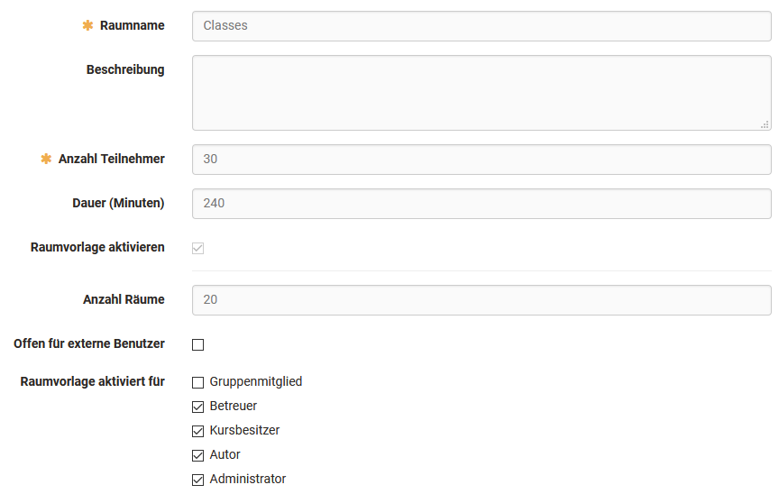
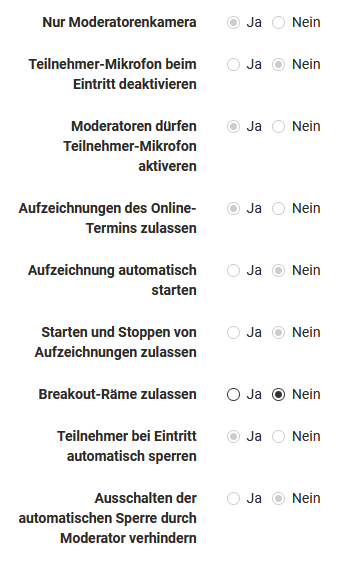
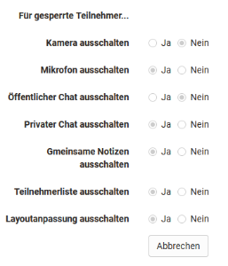
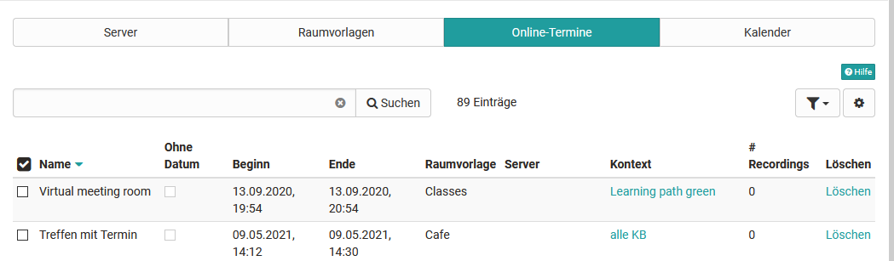
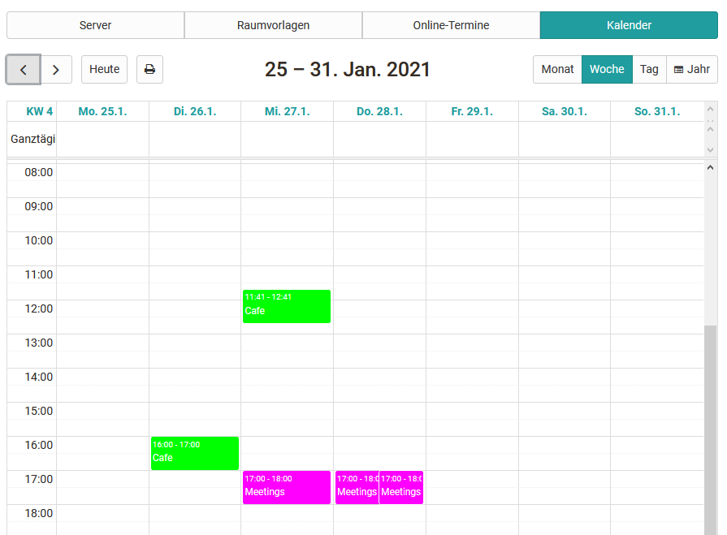

# Modul BigBlueButton

In der Verwaltung kann das virtuelle Klassenzimmer BigBlueButton aktiviert
werden. Dieser Artikel beschreibt die Konfiguration von mehreren
BigBlueButton-Server, das Load-Balancing und das Einrichten von systemweiten
Raumvorlagen.

Die Anleitung zur Konfiguration von einzelnen Online-Terminen für Kursbesitzer
wird im Kapitel [Kursbaustein BigBlueButton](Kursbaustein+BigBlueButton.html)
beschrieben.

 **Inhaltsverzeichnis**

  * 1 Modul BigBlueButton 
    * 1.1Server
    * 1.2Konfiguration
    * 1.3BigBlueButton-Server hinzufügen
    * 1.4Load-Balancing
    * 1.5Raumvorlagen
    * 1.6Online-Termine
    * 1.7Kalender

In der Administration stehen die Tabs Server, Raumvorlagen, Online-Termine und
Kalender zur Verfügung.

## Server

Hier werden die zur Verfügung stehenden BigBlueButton-Server pro OpenOlat-
Instanz angezeigt.

 Konfiguration

## Konfiguration

  *  **Modul "BigBlueButton":** Aktivierung der Funktionalität
  *  **Aktivieren für Kurse/Gruppen:** Freischaltung der Funktionalität für Kurse/Gruppen
  *  **Online-Termine ohne Datum:** Zusätzliche Möglichkeit neben Online-Terminen auch "permanente Raumreservationen" freizuschalten
  *  **Server:** In der Konfiguration werden die zur Verfügung stehenden BigBlueButton-Server pro OpenOlat-Instanz eingetragen.

Online-Termine ohne Datum

Online-Termine ohne Datum (permanente Raumreservationen) sind im Kalender
nicht ersichtlich und zählen zu jedem Zeitpunkt in den Limiten der Raumvorlage
als belegt.

  

  

## BigBlueButton-Server hinzufügen

  *  **BigBlueButton API URL** : URL BBB-Server
  *  **Shared secret** : API Key BBB-Server
  *  **Capacity factor** : Server-Gewichtung im Load-Balancing
  *  **Server aktivieren** : Server steht für das Load-Balancing zur Verfügung

## Load-Balancing

Ziel ist es, die erzeugte Last von gleichzeitigen Online-Terminen durch die
Berücksichtigung von Performance-Parametern (wie Anzahl Videos und Anzahl
Teilnehmenden der Meetings) auf den verfügbaren BigBlueButton-Server zu
verteilen. OpenOlat besitzt dazu ein integriertes Load-Balancing. Beim
initialen Start des Online-Termins (je nach Konfiguration durch den Moderator
oder den ersten Teilnehmenden) wird der Server mit der geringsten Auslastung
für das Meeting ausgewählt. Die Auslastung berechnet sich aus den
unterschiedlichen Messfaktoren und gewichtet das Ergebnis mit dem
Kapazitätsfaktor. Über den Filter können die Server-Kennzahlen über den
gesamten BBB-Server oder nur die Sessions des aktuellen OpenOlat-Servers
ausgegeben werden.

Kapazitätsfaktor

Der Kapazitätsfaktor wird mit einem Wert zwischen 1 und 100 pro Server
erfasst. Die berechneten Anzahl Benutzer* auf dem Server werden mit dem
Kapazitätsfaktor multipliziert. Somit gleicht sich ein Server mit stärkerer
Performance (RAM/CPU/Disk) einem Schwächeren an.  
  
 _* Gewichtung bei der Zählung von Benutzern von hoch zu tief: Video-Benutzer,
Audio-Benutzer, Viewer_

  

## Raumvorlagen

Die Raumvorlagen stehen bei der Erstellung eines neuen Online-Termins zur
Auswahl. Die Vorlagen steuern:

  * Die zur Verfügung stehenden Funktionen und Standard-Einstellungen im Online-Termin
  * Die Anzahl möglicher gleichzeitiger Nutzer pro Raum
  * Einschränkungen betreffend Dauer und Anzahl der zur Verfügung stehenden Online-Räume

 **Konfiguration Raumvorlage**

  *  **Raumname:** Bezeichnung der Raumvorlage
  *  **Beschreibung:** Beschreibung der Raumvorlage (z.B. Lernszenario, Einsatzgebiet)
  *  **Anzahl Teilnehmer:** Maximale Anzahl Teilnehmer (Viewer)
  *  **Dauer (Minuten):** Maximale Länge der Online-Termine
  *  **Raumvorlage aktivieren:** Aktivierte Raumvorlagen stehen in Kursen/Gruppen für neue Online-Termine zur Verfügung und können von Kursbesitzern gewählt werden
  *  **Anzahl Räume:** Maximale Anzahl der gleichzeitigen Räume dieser Raumvorlage
  *  **Offen für externe Benutzer:** Es wird automatisch ein Direktlink für Externe generiert, so dass sie den BigBlueButton Raum betreten können ohne vorher OpenOlat aufrufen zu müssen. Der Link wird dann in der Raumkonfiguration angezeigt und kann auch bei Bedarf vom Kursbesitzer oder -Betreuer geändert werden sowie an Gäste weitergegeben werden.
  *  **Raumvorlage aktiviert für _< Rolle>_:** Bestimmt, welche Rollen die Raumvorlage für neue Online-Termine nutzen können. Wird die Option "Gruppenmitglied" aktiviert, kann die Vorlage auch in OpenOlat [Gruppen ](Gruppenwerkzeuge+nutzen.html)verwendet und weiter konfiguriert werden.

 **Voreinstellungen der Raumvorlage**

 **Voreinstellungen für gesperrte Teilnehmer**

## Online-Termine

Übersicht der konfigurierten Online-Termine mit der Möglichkeit, direkt in den
Kurs/Gruppe (Kontext) zu wechseln und/oder diesen Online-Termin zu löschen.
Über die Suche können auch gezielt BigBlueButton Räume ermittelt und zum
Beispiel schnell markiert und gelöscht werden.

## Kalender

Kalenderübersicht über aller erfassten Online-Termine, um Zeiten mit hoher
Belegung zu prüfen und Überschneidungen grafisch anzuzeigen.

