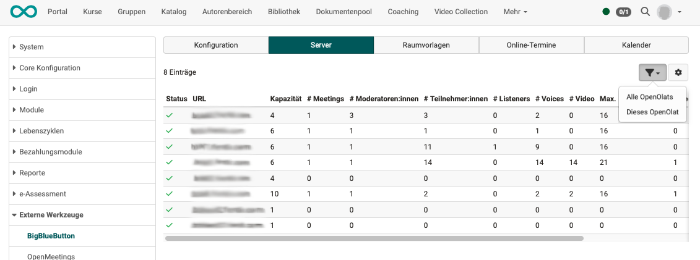
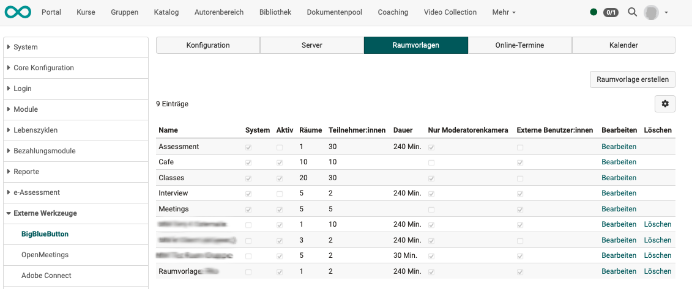

# Modul BigBlueButton {: #bbb}

In der Verwaltung kann das virtuelle Klassenzimmer BigBlueButton aktiviert werden. Dieser Artikel beschreibt die Konfiguration von mehreren BigBlueButton-Servern, das Load-Balancing und das Einrichten von systemweiten Raumvorlagen.

Die Anleitung zur Konfiguration von einzelnen Online-Terminen für Kursbesitzer
wird im Kapitel [Kursbaustein BigBlueButton](../../manual_user/learningresources/Course_Element_BigBlueButton.de.md) beschrieben.

---

## Tab "Konfiguration" {: #tab_config}

  *  **Modul "BigBlueButton":** Aktivierung der Funktionalität
  *  **Aktivieren für:** Freischaltung der Funktionalität einzeln für Kursbaustein BBB, Kursbaustein Terminplanung, Gruppen, Betreuer:innen-Chat
  *  **Online-Termine ohne Datum:** Zusätzliche Möglichkeit neben Online-Terminen auch "permanente Raumreservationen" ohne Datum freizuschalten. Diese sind im Kalender nicht ersichtlich und zählen zu jedem Zeitpunkt in den Limiten der Raumvorlage als belegt.
  *  **Profilbild übernehmen:**
  *  **Server:** In der Konfiguration werden die zur Verfügung stehenden BigBlueButton-Server pro OpenOlat-Instanz eingetragen.
  *  **Button "Server hinzufügen":** [Details siehe unten >](#add_server)
  *  **Aufzeichnungen Handler:** Native oder Opencast
  *  **Online-Termine automatisch löschen:** x Tage nach Termin-Ende
  *  **Limit aller Präsentationsdateien pro Meeting:** Pflichtfeld mit Angabe erlaubter Megabyte

{ class="shadow lightbox" }

### BigBlueButton-Server hinzufügen {: #add_server}

Mit Klick auf den Button "Server hinzufügen" im Tab Konfiguration öffnen Sie ein Popup für die Angaben.

  *  **BigBlueButton API URL**: URL BBB-Server
  *  **Shared secret**: API Key BBB-Server
  *  **Capacity factor**: Server-Gewichtung im Load-Balancing
  *  **Server aktivieren**: Server steht für das Load-Balancing zur Verfügung
  *  **Nur manuelle Auswahl**: Nur manuell ausgewählte Server stehen für das Load-Balancing zur Verfügung
  *  **Button "Serververbindung testen"**: Eine sehr praktische Hilfe um den Zugriff auf den hier angegebenen Server zu prüfen.

{ class="shadow lightbox" }

---

## Tab "Server" {: #tab_server}

Hier werden die zur Verfügung stehenden BigBlueButton-Server pro OpenOlat-Instanz angezeigt.

{ class="shadow lightbox" }

### Load-Balancing {: #load_balancing}

Ziel ist es, die erzeugte Last von gleichzeitigen Online-Terminen durch die Berücksichtigung von Performance-Parametern (wie Anzahl Videos und Anzahl Teilnehmenden der Meetings) auf den verfügbaren BigBlueButton-Server zu verteilen. OpenOlat besitzt dazu ein integriertes Load-Balancing. Beim initialen Start des Online-Termins (je nach Konfiguration durch den Moderator oder den ersten Teilnehmenden) wird der Server mit der geringsten Auslastung für das Meeting ausgewählt. Die Auslastung berechnet sich aus den unterschiedlichen Messfaktoren und gewichtet das Ergebnis mit dem Kapazitätsfaktor. 

Über den Filter können die Server-Kennzahlen über den gesamten BBB-Server oder nur die Sessions des aktuellen OpenOlat-Servers ausgegeben werden.

### Kapazitätsfaktor {: #capacity_factor}

Der Kapazitätsfaktor wird mit einem Wert zwischen 1 und 100 pro Server erfasst. Die berechneten Anzahl Benutzer* auf dem Server werden mit dem Kapazitätsfaktor multipliziert. Somit gleicht sich ein Server mit stärkerer Performance (RAM/CPU/Disk) einem Schwächeren an.  
  
 _* Gewichtung bei der Zählung von Benutzern von hoch zu tief: Video-Benutzer, Audio-Benutzer, Viewer_

---

## Tab "Raumvorlagen" {: #tab_room-templates}

Die Raumvorlagen stehen bei der Erstellung eines neuen Online-Termins zur Auswahl. Die Vorlagen steuern:

  * Die zur Verfügung stehenden Funktionen und Standard-Einstellungen im Online-Termin.
  * Die Anzahl möglicher gleichzeitiger Nutzer pro Raum.
  * Einschränkungen betreffend Dauer und Anzahl der zur Verfügung stehenden Online-Räume.

{ class="shadow lightbox" }

### Konfiguration Raumvorlage {: #room_config}

  *  **Raumname:** Bezeichnung der Raumvorlage
  *  **Beschreibung:** Beschreibung der Raumvorlage (z.B. Lernszenario, Einsatzgebiet)
  *  **Anzahl Teilnehmer:innen:** Maximale Anzahl Teilnehmer:innen (Viewer)
  *  **Dauer (Minuten):** Maximale Länge der Online-Termine
  *  **Raumvorlage aktivieren:** Aktivierte Raumvorlagen stehen in Kursen/Gruppen für neue Online-Termine zur Verfügung und können von Kursbesitzern gewählt werden
  *  **Anzahl Räume:** Maximale Anzahl der gleichzeitigen Räume dieser Raumvorlage
  *  **Offen für externe Benutzer:** Es wird automatisch ein Direktlink für Externe generiert, so dass sie den BigBlueButton Raum betreten können ohne vorher OpenOlat aufrufen zu müssen. Der Link wird dann in der Raumkonfiguration angezeigt und kann auch bei Bedarf vom Kursbesitzer oder -Betreuer geändert werden sowie an Gäste weitergegeben werden.
  * **Benutzer:in bei Eintritt akzeptieren (Warteraum):** 
     * Abgeschaltet (Alle können sofort eintreten.)
     * Alle Benutzer:innen (Jeder Zutritt müssen bestätigt werden.)
     * Nur Gäste und externe Benutzer:innen (Nur der Zutritt von Gästen und externen Benutzer:innen muss bestätigt werden.) 
  *  **Raumvorlage aktiviert für _<Rolle>_:** Bestimmt, welche Rollen die Raumvorlage für neue Online-Termine nutzen können. Wird die Option "Gruppenmitglied" aktiviert, kann die Vorlage auch in OpenOlat [Gruppen ](../../manual_user/groups/Using_Group_Tools.de.md) verwendet und weiter konfiguriert werden.

{ class="shadow lightbox" }

### Voreinstellungen der Raumvorlage

{ class="shadow lightbox" }

### Voreinstellungen für gesperrte Teilnehmer

{ class="shadow lightbox" }

---

## Tab "Online-Termine" {: #tab_online-meetings}

Übersicht der konfigurierten Online-Termine mit der Möglichkeit, direkt in den
Kurs/Gruppe (Kontext) zu wechseln und/oder diesen Online-Termin zu löschen.
Über die Suche können auch gezielt BigBlueButton-Räume ermittelt und zum Beispiel schnell markiert und gelöscht werden.

{ class="shadow lightbox" }

---

## Tab "Kalender" {: #tab_calendar}

Kalenderübersicht über alle erfassten Online-Termine, um Zeiten mit hoher Belegung zu prüfen und Überschneidungen grafisch anzuzeigen.

{ class="shadow lightbox" }

---

## Weitere Informationen

[Anleitung zur Konfiguration von einzelnen Online-Terminen für Kursbesitzer:innen im Kursbaustein BigBlueButton](../../manual_user/learningresources/Course_Element_BigBlueButton.de.md)

