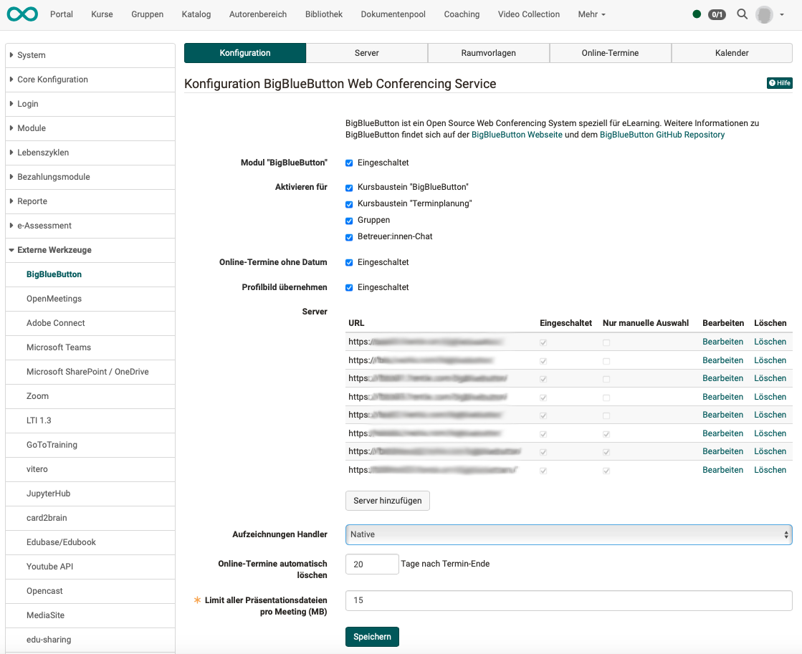
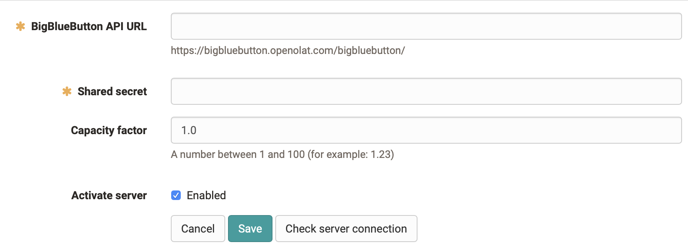
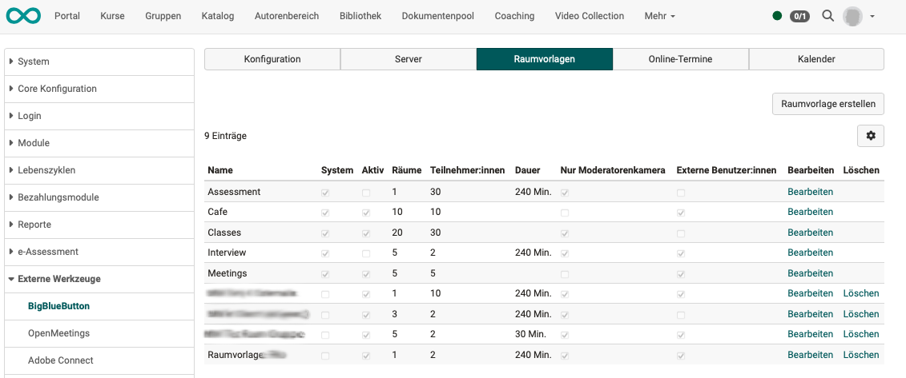
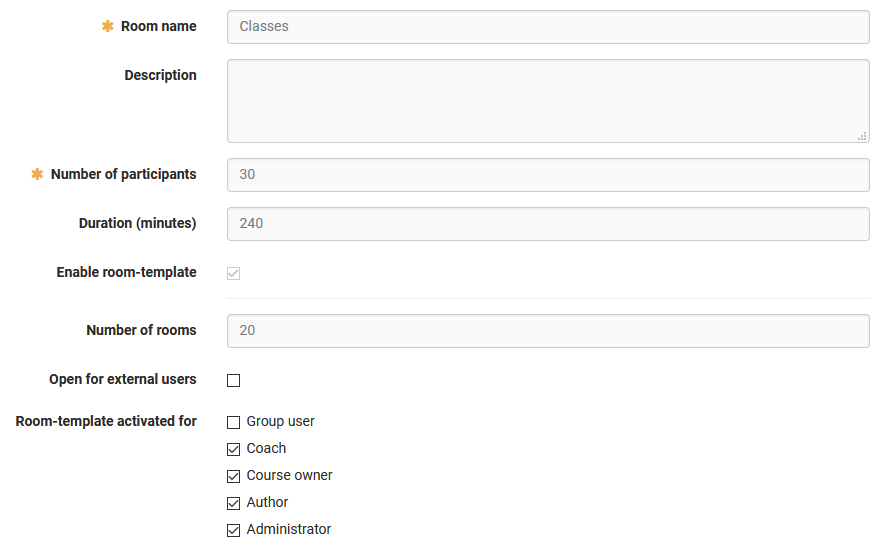
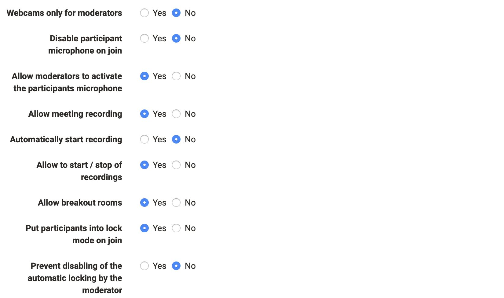
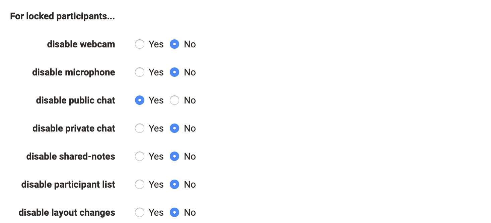
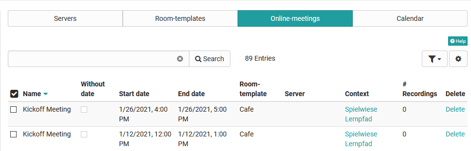
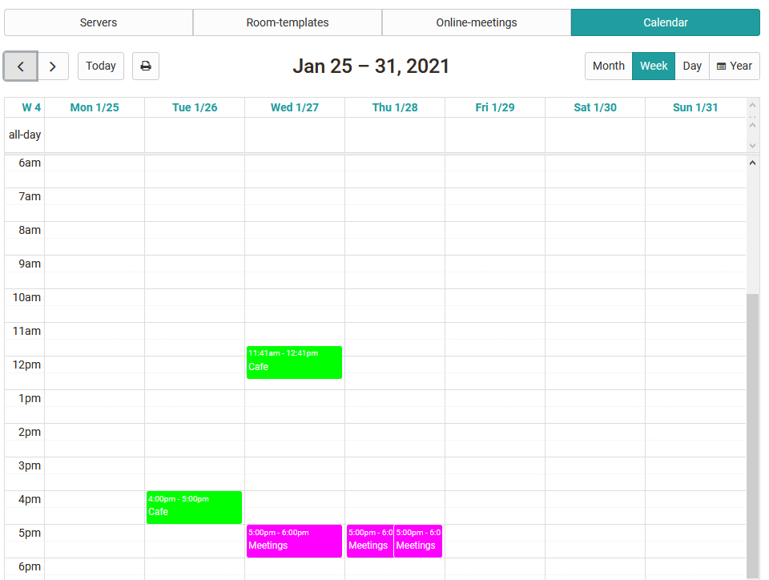

# BigBlueButton module {: #bbb}

In the administration the virtual classroom BigBlueButton can be activated. This article describes the configuration of multiple BigBlueButton servers, load balancing and setting up system-wide room templates.

Instructions on how to configure individual online dates are described in the
chapter [Course Element BigBlueButton](../../manual_user/learningresources/Course_Element_BigBlueButton.md).

---

## Tab "Configuration" {: #tab_config}

  *  **Module "BigBlueButton":**  Activation of the functionality
  *  **Activate for:** Activation of the functionality individually for course element BBB, course element  "Appointment scheduling", groups, coach chat
  *  **Online appointments without date:** Additional option to activate "permanent room reservations" without a date in addition to online appointments. These are not visible in the calendar and count as booked at any time in the limits of the room template.
  *  **Adopt profile picture:** 
  *  **Servers:**  In the configuration the available BigBlueButton servers per OpenOlat instance are entered.
  *  **Add server button:** [see below for details >](#add_server)
  *  **Recording handler:** Native or Opencast
  *  **Automatically delete online appointments:** x days after the end of the appointment
  *  **Limit of all presentation files per meeting:** Mandatory field with specification of permitted megabytes

{ class="shadow lightbox" }

## Add BigBlueButton-Server

Click on the "Add server" button in the Configuration tab to open a pop-up for the details.

  *  **BigBlueButton API URL**: URL of the BBB-Server
  *  **Shared secret**: API Key of the BBB-Server
  *  **Capacity factor**: Server weighting in load balancing
  *  **Activate server**: Server is available for load balancing
  *  **Manual selection only**: Only manually selected servers are available for load balancing
  *  **Button "Test server connection"**: A very practical help to check access to the server specified here.

{ class="shadow lightbox" }

---

## Tab "Server" {: #tab_server}

The available BigBlueButton servers per OpenOlat instance are displayed here.

{ class="shadow lightbox" }

## Load balancing {: #load_balancing}

The goal is to distribute the generated load of simultaneous online meetings to the available BigBlueButton server by considering a set of performance parameters (such as number of videos and number of participants in the meetings). OpenOlat has an integrated load-balancing for this purpose. At the initial start of the online-meeting (depending on the configuration by the moderator or the first participant) the server with the lowest load is selected for the meeting. The load is calculated from the different measurement factors and weights the result with the capacity factor.

Using the filter above the list, the server key figures can be displayed over the entire BBB server or only the sessions of the current OpenOlat server.

### Capacity factor {: #capacity_factor}

The capacity factor is recorded with a value between 1 and 100 per server. The calculated number of users* on the server is multiplied by the capacity factor. This way, a server with stronger performance (RAM/CPU/disk) adapts to a weaker one.  
  
 _*  Weighting when counting users from high to low: video users, audio users, viewer_

{ class="shadow lightbox" }

## Room templates

The room templates are available for selection when creating a new online-meeting. Templates control the following characteristics:

  * The available functions and standard settings in the online-meeting
  * The number of possible simultaneous users per room
  * Limits regarding duration and number of online rooms available

{ class="shadow lightbox" }

### Configuration of a room template

  *  **Room name:** Name of the room template
  *  **Description:**  Description of the room template (e.g. learning scenario, field of application)
  *  **Number of participants:**  Maximum number of participants
  *  **Duration (minutes):**  Maximum length of online-meeting
  *  **Enable room-template:** Activated room templates are available in courses/groups for new online appointments and can be chosen by course owners
  *  **Number of rooms:**  Maximum number of concurrent rooms of the template
  *  **Open for external users:** A direct link is automatically generated for external users so that they can enter the BigBlueButton room without having to call OpenOlat first. The link is then displayed in the room configuration and can also be changed by the course owner or coach if necessary, as well as passed on to guests.
  *  **Accept user on entry (waiting room):**
     * Switched off (All can enter immediately.)
     * All users (All access must be confirmed.)
     * Only guests and external users (Only the access of guests and external users must be confirmed). 
  *  **Room-template activated for <Role>:** Determines which roles can use the room template for new online-meetings. If the "Group member" option is activated, the template can also be used and further configured in OpenOlat [groups](../../manual_user/groups/Using_Group_Tools.md).

{ class="shadow lightbox" }

  
### Default settings of the room template

{ class="shadow lightbox" }

### Default settings for locked participants

{ class="shadow lightbox" }

---

## Online-Meetings

Overview of configured online-meetings with the possibility to switch directly
to the course/group (context) and/or delete this online-meeting. The search function can also be used to find specific BigBlueButton rooms and quickly mark and delete them, for example.

{ class="shadow lightbox" }

---

## Calendar

Calendar overview of all recorded online appointments to check times with high occupancy and display overlaps graphically.

{ class="shadow lightbox" }

---

## Further information

[Instructions for configuring individual online appointments for course owners in the BigBlueButton course element](../../manual_user/learningresources/Course_Element_BigBlueButton.md)
  

