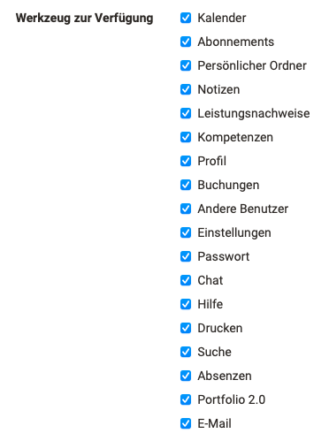
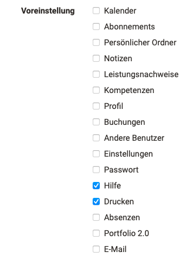

# Core Konfiguration: Übersicht {: #core_config}

{ class="shadow lightbox aside-left-lg" }

Administrator:innen haben in der System-Administration Zugriff auf das nebenstehende Menü: 
`Administration > Core Konfiguration`

## Sprache und Region

In diesem Bereich kann die Standardsprache gewählt und definiert werden, welche Sprachen den Benutzer:innen generell zur Verfügung stehen. Darüber hinaus können Sprachpakete importiert und exportiert werden.

Auch Einstellungen bezüglich einer geschlechterspezifischen Sprache können hier von den OpenOlat Administrator:innen ausgewählt werden.

Im Abschnitt **Formate** wird das **Zahlenformat** festgelegt. Es bestimmt, mit welchen Tausender- und Dezimaltrennzeichen OpenOlat Zahlen und Preise systemweit anzeigt. [:octicons-tag-16:{ title="ab Release 20.0 (OO-8470)" }](https://track.frentix.com/issue/OO-8470)

[Zum Seitenanfang ^](#core_config)

## Startseite [:octicons-tag-16:{ title="ab Release 10.0 (OO-986)" }](https://track.frentix.com/issue/OO-986)

Administrator:innen können für verschiedene Rollen oder Benutzer:innen mit bestimmten Benutzerattributen eine Default-Startseite festlegen.

[Zu den Details >](../administration/Landing_pages.de.md) 
[Zum Seitenanfang ^](#core_config)

## Persönliche Werkzeuge

Hier können Administrator:innen einstellen, welche OpenOlat
[Werkzeuge](../../manual_user/personal_menu/index.md) den
Benutzer:innen standardmässig zur Verfügung gestellt werden, z.B. Kalender, persönliche Ordner, E-Portfolio, Chat usw. sowie welche Werkzeuge in der Menüleiste für
den Schnellzugriff aktiviert sind (Voreinstellung).

{ class="shadow lightbox thumbnail-xl" } { class="shadow lightbox thumbnail-xl" } 

[Zum Seitenanfang ^](#core_config)

## REST API

Neben der Aktivierung der Schnittstelle werden hier auch die gemanagten Objekte bestimmt. 

[Zu den Details >](../administration/REST_API.de.md) 
[Zum Seitenanfang ^](#core_config)

## Kalender {: #calendar_administration}

An dieser Stelle können die Systemadministrator:innen die OpenOlat-Kalender ein- oder ausschalten.

{ class="shadow lightbox" width="450px" }

[Zum Seitenanfang ^](#core_config)

## E-Mail

Als Administrator:in finden Sie hier Konfigurationsmöglichkeiten der OpenOlat-E-Mail-Versandoptionen und des Postfachs, sowie die Mail-Vorlage.

[Zu den Details >](../administration/E-Mail_Settings.de.md) 
[Zum Seitenanfang ^](#core_config)

## Dateien und Ordner

Hier finden Sie Optionen zu allgemeinen Einstellungen/Konfigurationen betreffend Dateien und Ordnern.

{ class="shadow lightbox" }

[Zu den Details >](../administration/Files_and_Folders.de.md) 
[Zum Seitenanfang ^](#core_config)

## WebDAV

Hier kann der WebDAV-Zugang systemweit eingerichtet und konfiguriert werden.

[Zu den Details >](../administration/WebDAV.de.md) 
[Zum Seitenanfang ^](#core_config)

## Zugangskontrolle

Hier können Sie die Zugangskontrolle für Lernressourcen und Gruppen für das gesamte System ein- und ausschalten. Bei eingeschalteter Zugangskontrolle können Sie die zur Verfügung stehenden Angebotsarten auswählen.

[Zum Seitenanfang ^](#core_config)

## Statistiken

Hier finden Sie Angaben zur Statistikgenerierung und Sie können das Updaten der Statistik durch komplettes Neuberechnen oder inkrementelles Updaten auslösen.

[Zum Seitenanfang ^](#core_config)

## Volltextsuche

Hier finden Sie Angaben über die Indexierung der Volltextsuche.

[Zum Seitenanfang ^](#core_config)

## Benachrichtigungen

Die Benachrichtigungsmails für abonnierte Themen (z.B. Foren) werden standardmässig jeweils einmal pro Tag versendet. Benutzer:innen können kürzere Intervalle einstellen. 
Administrator:innen können hier ein sofortiges Senden veranlassen.

[Zum Seitenanfang ^](#core_config)

## GUI-Einstellungen

Hier können eingestellte Werte zum Graphical User Interface zurückgesetzt werden. 

[Zum Seitenanfang ^](#core_config)

## Lizenzen [:octicons-tag-16:{ title="ab Release 12.4 (OO-3170)" }](https://track.frentix.com/issue/OO-3170)

Hier kann das optionale Lizenzmanagement konfiguriert werden.

[Zu den Details >](../administration/Licenses.de.md) 
[Zum Seitenanfang ^](#core_config)

