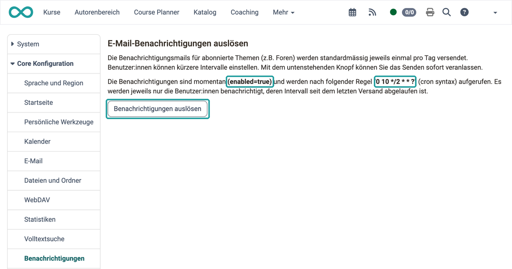
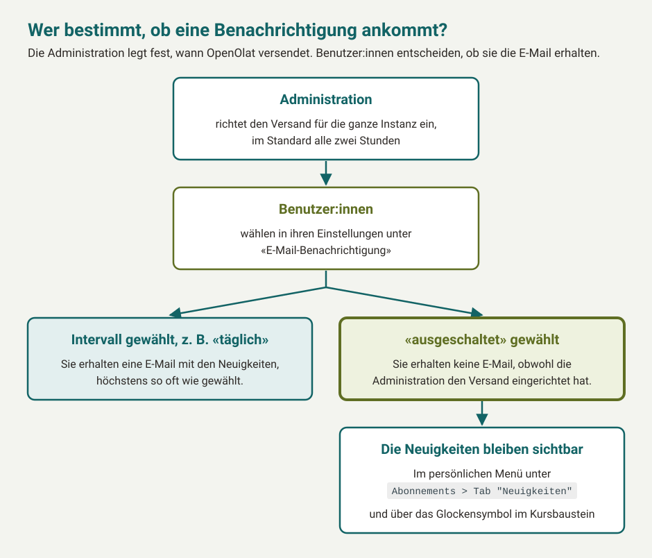

# Core Konfiguration: Übersicht {: #core_config}

{ class="shadow lightbox aside-left-lg" }

Administrator:innen haben in der System-Administration Zugriff auf das nebenstehende Menü: 
`Administration > Core Konfiguration`

## Sprache und Region

In diesem Bereich kann die Standardsprache gewählt und definiert werden, welche Sprachen den Benutzer:innen generell zur Verfügung stehen. Darüber hinaus können Sprachpakete importiert und exportiert werden.

Auch Einstellungen bezüglich einer geschlechterspezifischen Sprache können hier von den OpenOlat Administrator:innen ausgewählt werden.

Im Abschnitt **Formate** wird das **Zahlenformat** festgelegt. Es bestimmt, mit welchen Tausender- und Dezimaltrennzeichen OpenOlat Zahlen und Preise systemweit anzeigt. [:octicons-tag-16:{ title="ab Release 20.0 (OO-8470)" }](https://track.frentix.com/issue/OO-8470)

[Zum Seitenanfang ^](#core_config)

## Startseite [:octicons-tag-16:{ title="ab Release 10.0 (OO-986)" }](https://track.frentix.com/issue/OO-986)

Administrator:innen können für verschiedene Rollen oder Benutzer:innen mit bestimmten Benutzerattributen eine Startseite vorgeben.

[Zu den Details >](../administration/Landing_pages.de.md) 
[Zum Seitenanfang ^](#core_config)

## Persönliche Werkzeuge {: #personal_tools}

Hier können Administrator:innen einstellen, welche OpenOlat
[Werkzeuge](../../manual_user/personal_menu/index.de.md) den
Benutzer:innen standardmässig zur Verfügung gestellt werden, z.B. Kalender, persönliche Ordner, E-Portfolio, Chat usw. sowie welche Werkzeuge in der Menüleiste für
den Schnellzugriff aktiviert sind (Voreinstellung).

{ class="shadow lightbox thumbnail-xl" } { class="shadow lightbox thumbnail-xl" } 

[Zum Seitenanfang ^](#core_config)

## REST API

Neben der Aktivierung der REST API (Representational State Transfer) werden hier auch die extern verwalteten Objekte bestimmt. 

[Zu den Details >](../administration/REST_API.de.md) 
[Zum Seitenanfang ^](#core_config)

## Kalender {: #calendar_administration}

An dieser Stelle können die Systemadministrator:innen die OpenOlat-Kalender ein- oder ausschalten.

{ class="shadow lightbox" width="450px" }

[Zum Seitenanfang ^](#core_config)

## E-Mail

Als Administrator:in finden Sie hier Konfigurationsmöglichkeiten für den E-Mail-Versand und das Postfach, sowie die E-Mail-Vorlagen.

[Zu den Details >](../administration/E-Mail_Settings.de.md) 
[Zum Seitenanfang ^](#core_config)

## Dateien und Ordner

Hier finden Sie Optionen zu allgemeinen Einstellungen/Konfigurationen betreffend Dateien und Ordnern.

{ class="shadow lightbox" }

[Zu den Details >](../administration/Files_and_Folders.de.md) 
[Zum Seitenanfang ^](#core_config)

## WebDAV

Hier kann der WebDAV-Zugang (Web-based Distributed Authoring and Versioning) systemweit eingerichtet und konfiguriert werden.

[Zu den Details >](../administration/WebDAV.de.md) 
[Zum Seitenanfang ^](#core_config)

## Zugangskontrolle

Hier können Sie die Zugangskontrolle für Lernressourcen und Gruppen für das gesamte System ein- und ausschalten. Bei eingeschalteter Zugangskontrolle können Sie die zur Verfügung stehenden Angebotsarten auswählen.

[Zum Seitenanfang ^](#core_config)

## Statistiken

Hier finden Sie Angaben zur Statistikgenerierung und Sie können das Updaten der Statistik durch komplettes Neuberechnen oder inkrementelles Updaten auslösen.

[Zum Seitenanfang ^](#core_config)

## Volltextsuche

Hier finden Sie Angaben über die Indexierung der Volltextsuche.

[Zum Seitenanfang ^](#core_config)

## Benachrichtigungen {: #notifications}

Wer ein Forum, einen Ordner oder ein anderes Element abonniert hat, erhält die Neuigkeiten per E-Mail: OpenOlat verschickt je Person eine einzige E-Mail, die die Neuigkeiten aus allen ihren Abonnements auflistet. Hier sehen Sie, wann OpenOlat diese Benachrichtigungen verschickt, und können einen Versand sofort auslösen. Sie finden die Seite in der System-Administration unter: 
`Administration > Core Konfiguration > Benachrichtigungen`

{ class="shadow lightbox" }

Den Versand steuern drei Dinge:

* **Zeitplan des Versands**: Die Seite zeigt an, ob die Benachrichtigungen eingeschaltet sind und nach welcher Regel in Cron-Syntax der Versand läuft. Im Standard läuft er alle zwei Stunden, jeweils zehn Minuten nach der vollen Stunde (00.10, 02.10, 04.10 Uhr usw.). In der Oberfläche lassen sich weder die Regel noch das Ein- und Ausschalten ändern. Die Regel ist Teil der Serverkonfiguration und gilt nach einer Änderung erst ab dem nächsten Neustart von OpenOlat. frentix-Kund:innen wenden sich für eine Änderung an den frentix Support: [support@frentix.com](mailto:support@frentix.com)
* **Sofortiger Versand**: Der Button "Benachrichtigungen auslösen" startet den Versand sofort, ohne den nächsten Termin abzuwarten. Auch dabei erhalten nur Benutzer:innen eine E-Mail, deren Intervall abgelaufen ist und für die es Neuigkeiten gibt.
* **Intervall pro Person**: Wie oft eine Person höchstens eine E-Mail erhält, legt sie in ihren [Einstellungen](../../manual_user/personal_menu/Settings.de.md#notification_interval) unter "E-Mail-Benachrichtigung" selbst fest, von "alle zwei Stunden" bis "monatlich". Mit "ausgeschaltet" erhält sie keine Benachrichtigungen per E-Mail mehr. Wählt sie nichts, gilt "täglich". Administrator:innen, Benutzerverwalter:innen und Rollenverwalter:innen ändern das Intervall einer Person auch in der Benutzerverwaltung im Tab "Systemeinstellungen", siehe [Konto konfigurieren](../usermanagement/Configure_User.de.md).

Der Zeitplan bestimmt nur, wann OpenOlat prüft, nicht wer eine E-Mail erhält. Bei jedem Lauf erhält eine Person nur dann eine E-Mail, wenn ihr Intervall seit der letzten E-Mail abgelaufen ist und es in einem ihrer Abonnements etwas Neues gibt. Gibt es nichts Neues, verschickt OpenOlat keine E-Mail. Abonnements, die eine Person ausgesetzt hat, bleiben unberücksichtigt.

Die beiden Einstellungen ergänzen sich, sie überschreiben sich nicht. Wer "ausgeschaltet" gewählt hat, erhält keine E-Mail, auch wenn der Versand der Instanz läuft. Ist der Versand der Instanz ausgeschaltet, erhält niemand eine E-Mail, gleich welches Intervall eine Person gewählt hat. In beiden Fällen gehen keine Neuigkeiten verloren: Jede Person sieht sie selbst unter `Persönliches Menü > Abonnements > Tab "Neuigkeiten"` und über das Glockensymbol im jeweiligen Kursbaustein.

{ class="shadow lightbox" title="Wer bestimmt, ob eine Benachrichtigung ankommt?" }

[Zum Seitenanfang ^](#core_config)

## GUI-Einstellungen

Hier können gespeicherte GUI-Einstellungen (Graphical User Interface) zurückgesetzt werden. 

[Zum Seitenanfang ^](#core_config)

## Lizenzen [:octicons-tag-16:{ title="ab Release 12.4 (OO-3170)" }](https://track.frentix.com/issue/OO-3170)

Hier können die optionalen Lizenzen konfiguriert werden.

[Zu den Details >](../administration/Licenses.de.md) 
[Zum Seitenanfang ^](#core_config)

## Weiterführende Informationen {: #further_information}

**Weiterführend** 
[Persönliche Werkzeuge: Abonnements >](../../manual_user/personal_menu/Subscriptions.de.md) 
[Module: Übersicht >](Modules.de.md)

[Zum Seitenanfang ^](#core_config)
