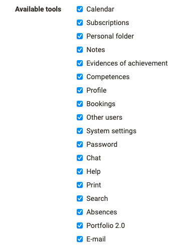
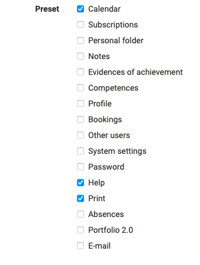
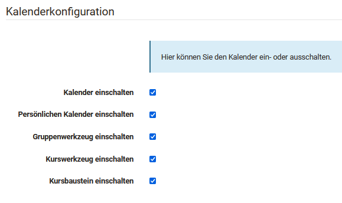

# Core functions

## Languages

In this area the default language can be selected and it can be defined which
languages are generally available to the users. Furthermore, language packages
can be imported and exported.

Auch Einstellungen bezüglich einer geschlechterspezifischen Sprache können hier von den OpenOlat Administratoren ausgewählt werden.

##  User tool

Here administrators can set which OpenOlat
[tools](../../manual_user/personal/Personal_Menu.md) are made available to users
by default, e.g. calendar, personal folders, e-portfolio, chat, etc. as well
as which tools are enabled in the menu bar for quick access (Preset).

{ class="shadow lightbox thumbnail-xl" } { class="shadow lightbox thumbnail-xl" }

## Calendar Administration

At this point the system administrators can enable or disable the OpenOlat
calendars.

{ class="shadow lightbox" width="450px" }

