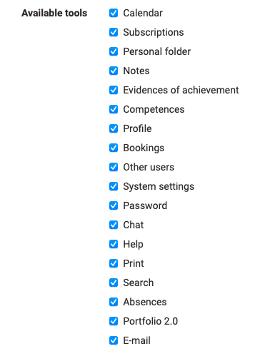
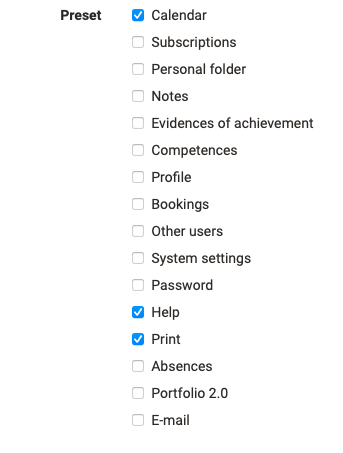
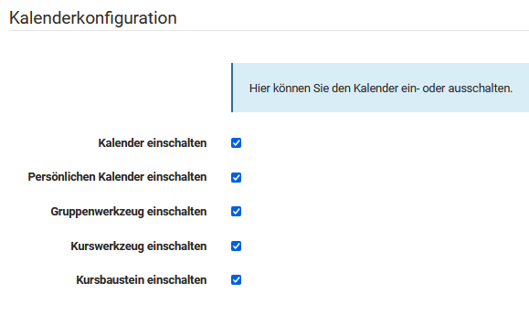

# Core functions: Overview {: #core_config}

{ class="shadow lightbox aside-left-lg" }

Administrators have access to the adjacent menu in the system administration: 
`Administration > Core functions`

## Language and region

In this area the default language can be selected and it can be defined which languages are generally available to the users. Furthermore, language packages can be imported and exported.

Settings relating to a gender-specific language can also be selected here by the OpenOlat administrators.

In the section **Formats** the **number format** is defined. It determines which thousands separator and decimal separator OpenOlat uses to display numbers and prices system-wide. [:octicons-tag-16:{ title="from Release 20.0 (OO-8470)" }](https://track.frentix.com/issue/OO-8470)

[To the tp of the page ^](#core_config)

## Starting page [:octicons-tag-16:{ title="from Release 10.0 (OO-986)" }](https://track.frentix.com/issue/OO-986)

Administrators can define a default start page for different roles or users with certain user attributes.

[See the details >](../administration/Landing_pages.md) 
[To the top of the page ^](#core_config)

## Personal tools

Here administrators can set which OpenOlat [tools](../../manual_user/personal_menu/index.md) are made available to users by default, e.g. calendar, personal folders, e-portfolio, chat, etc. as well as which tools are enabled in the menu bar for quick access (Preset).

{ class="shadow lightbox thumbnail-xl" } { class="shadow lightbox thumbnail-xl" }

[To the top of the page ^](#core_config)

## REST API

Besides activating the interface, the managed objects are also determined here.

[To the details >](../administration/REST_API.md) 
[To the top of the page ^](#core_config)

## Calendar {: #calendar_administration}

At this point the system administrators can enable or disable the OpenOlat calendars.

{ class="shadow lightbox" width="450px" }

[To the top of the page ^](#core_config)

## E-mail

As an administrator, you will find configuration options for the OpenOlat email sending options and the mailbox, as well as the mail template.

[See the details >](../administration/E-Mail_Settings.md) 
[To the top of the page ^](#core_config)

## Files and folders

Here you will find options for general settings/configurations relating to files and folders.

{ class="shadow lightbox" }

[See the details >](../administration/Files_and_Folders.md) 
[To the top of the page ^](#core_config)

## WebDAV

WebDAV access can be set up and configured system-wide here.

[See the details >](../administration/WebDAV.md) 
[To the top of the page ^](#core_config)

## Access control

Here you can switch access control for learning resources and groups on and off for the entire system. If access control is switched on, you can select the available offer styles.

[To the top of the page ^](#core_config)

## Statistics

Here you will find information on statistics generation and you can trigger the update of the statistics by completely recalculating or incrementally updating.

[To the top of the page ^](#core_config)

## Full text search

Here you will find information on indexing the full text search.

[To the top of the page ^](#core_config)

## Notifications

The notification emails for subscribed topics (e.g. forums) are sent once a day by default. Users can set shorter intervals. 
Administrators can arrange for them to be sent immediately.

[To the top of the page ^](#core_config)

## GUI settings

Values set for the graphical user interface can be reset here.

[To the top of the page ^](#core_config)

## Licenses [:octicons-tag-16:{ title="from Release 12.4 (OO-3170)" }](https://track.frentix.com/issue/OO-3170)

The optional license management can be configured here.

[See the details >](../administration/Licenses.md) 
[To the top of the page ^](#core_config)
