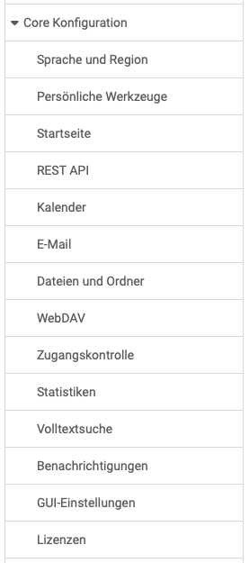
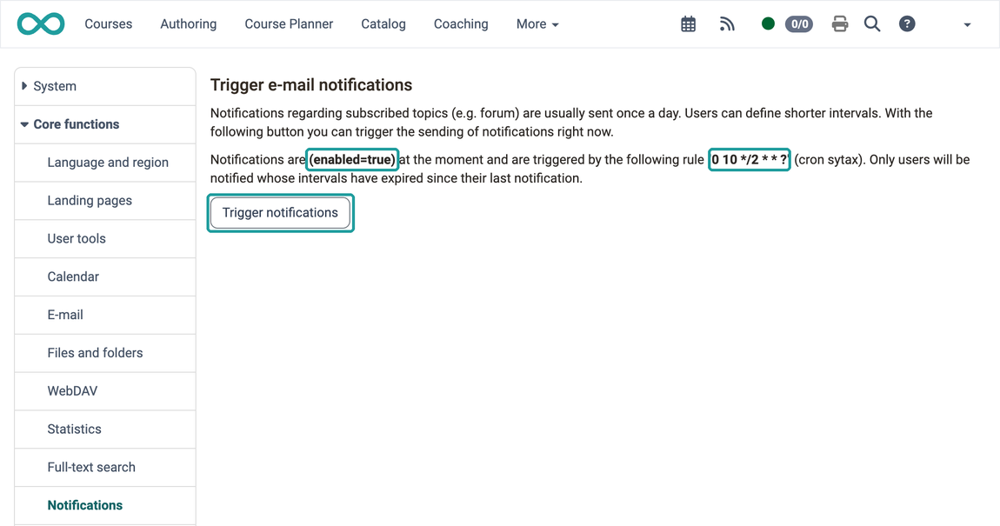
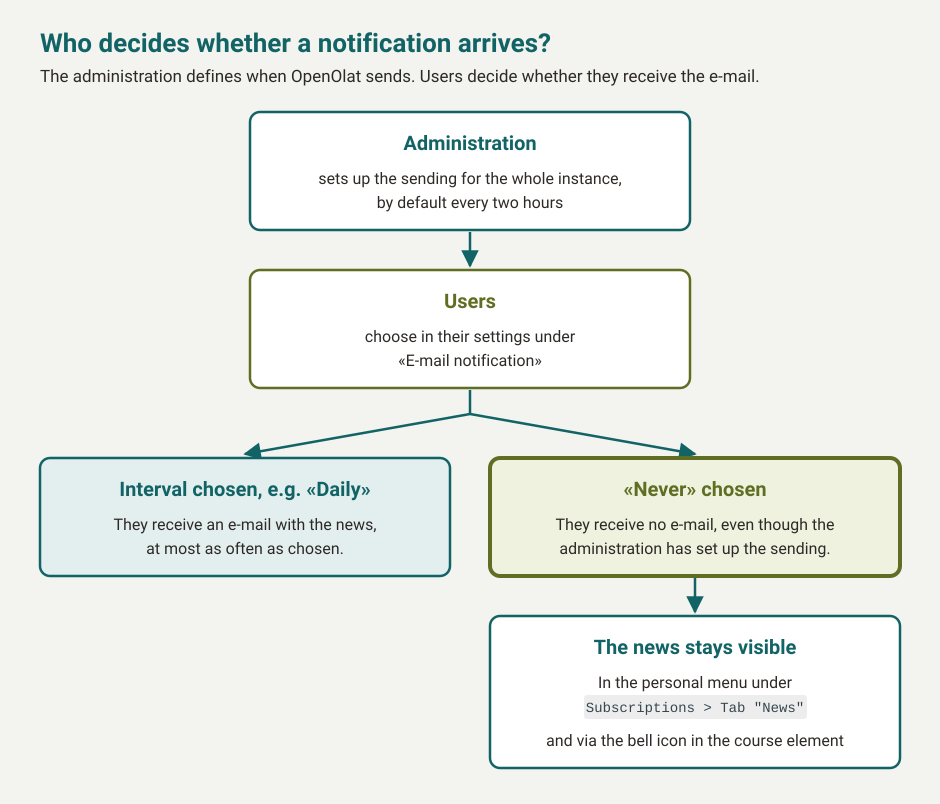

# Core functions: Overview {: #core_config}

{ class="shadow lightbox aside-left-lg" }

Administrators have access to the adjacent menu in the system administration: 
`Administration > Core functions`

## Language and region

In this area the default language can be selected and it can be defined which languages are generally available to the users. Furthermore, language packages can be imported and exported.

Settings relating to a gender-specific language can also be selected here by the OpenOlat administrators.

In the section **Formats** the **number format** is defined. It determines which thousands separator and decimal separator OpenOlat uses to display numbers and prices system-wide. [:octicons-tag-16:{ title="from Release 20.0 (OO-8470)" }](https://track.frentix.com/issue/OO-8470)

[To the tp of the page ^](#core_config)

## Starting page [:octicons-tag-16:{ title="from Release 10.0 (OO-986)" }](https://track.frentix.com/issue/OO-986)

Administrators can preset a start page for different roles or users with certain user attributes.

[See the details >](../administration/Landing_pages.md) 
[To the top of the page ^](#core_config)

## User tools {: #personal_tools}

Here administrators can set which OpenOlat [tools](../../manual_user/personal_menu/index.md) are made available to users by default, e.g. calendar, personal folders, e-portfolio, chat, etc. as well as which tools are enabled in the menu bar for quick access (Preset).

{ class="shadow lightbox thumbnail-xl" } { class="shadow lightbox thumbnail-xl" }

[To the top of the page ^](#core_config)

## REST API

Besides activating the REST API (Representational State Transfer), the externally managed objects are also determined here.

[To the details >](../administration/REST_API.md) 
[To the top of the page ^](#core_config)

## Calendar {: #calendar_administration}

At this point the system administrators can enable or disable the OpenOlat calendars.

{ class="shadow lightbox" width="450px" }

[To the top of the page ^](#core_config)

## E-mail

As an administrator, you will find configuration options for sending email and for the mailbox, as well as the mail templates.

[See the details >](../administration/E-Mail_Settings.md) 
[To the top of the page ^](#core_config)

## Files and folders

Here you will find options for general settings/configurations relating to files and folders.

{ class="shadow lightbox" }

[See the details >](../administration/Files_and_Folders.md) 
[To the top of the page ^](#core_config)

## WebDAV

WebDAV access (Web-based Distributed Authoring and Versioning) can be set up and configured system-wide here.

[See the details >](../administration/WebDAV.md) 
[To the top of the page ^](#core_config)

## Access control

Here you can switch access control for learning resources and groups on and off for the entire system. If access control is switched on, you can select the available offer styles.

[To the top of the page ^](#core_config)

## Statistics

Here you will find information on statistics generation and you can trigger the update of the statistics by completely recalculating or incrementally updating.

[To the top of the page ^](#core_config)

## Full text search

Here you will find information on indexing the full text search.

[To the top of the page ^](#core_config)

## Notifications {: #notifications}

Anyone who has subscribed to a forum, a folder or another element receives the news by e-mail: OpenOlat sends each person one single e-mail that lists the news from all their subscriptions. Here you see when OpenOlat sends these notifications, and you can trigger a sending immediately. You find the page in the system administration under: 
`Administration > Core functions > Notifications`

{ class="shadow lightbox" }

Three things control the sending:

* **Schedule of the sending**: The page shows whether the notifications are switched on and by which rule in cron syntax the sending runs. By default it runs every two hours, ten minutes past the full hour (00:10, 02:10, 04:10 and so on). Neither the rule nor switching on and off can be changed in the user interface. The rule is part of the server configuration and applies after a change only from the next restart of OpenOlat. frentix customers contact the frentix support for a change: [support@frentix.com](mailto:support@frentix.com)
* **Immediate sending**: The button "Trigger notifications" starts the sending immediately, without waiting for the next scheduled time. Here too, only users whose interval has expired and for whom there is news receive an e-mail.
* **Interval per person**: How often a person receives an e-mail at most, they set themselves in their [Settings](../../manual_user/personal_menu/Settings.md#notification_interval) under "E-mail notification", from "Every two hours" to "Monthly". With "Never" they no longer receive notifications by e-mail. If they choose nothing, "Daily" applies. Administrators, user managers and role managers also change the interval of a person in the user management in the tab "System settings", see [Configure user](../usermanagement/Configure_User.md).

The schedule only determines when OpenOlat checks, not who receives an e-mail. At each run, a person only receives an e-mail if their interval has expired since the last e-mail and there is something new in one of their subscriptions. If there is nothing new, OpenOlat sends no e-mail. Subscriptions that a person has paused are not taken into account.

The two settings complement each other, they do not override each other. Anyone who has chosen "Never" receives no e-mail, even when the sending of the instance runs. If the sending of the instance is switched off, nobody receives an e-mail, whatever interval a person has chosen. In both cases no news is lost: every person sees it themselves under `Personal menu > Subscriptions > Tab "News"` and via the bell icon in the respective course element.

{ class="shadow lightbox" title="Who decides whether a notification arrives?" }

[To the top of the page ^](#core_config)

## GUI settings

Stored GUI settings (Graphical User Interface) can be reset here.

[To the top of the page ^](#core_config)

## Licenses [:octicons-tag-16:{ title="from Release 12.4 (OO-3170)" }](https://track.frentix.com/issue/OO-3170)

The optional licenses can be configured here.

[See the details >](../administration/Licenses.md) 
[To the top of the page ^](#core_config)

## Further information {: #further_information}

**Further reading** 
[Personal tools: Subscriptions >](../../manual_user/personal_menu/Subscriptions.md) 
[Modules: Overview >](Modules.md)

[To the top of the page ^](#core_config)
