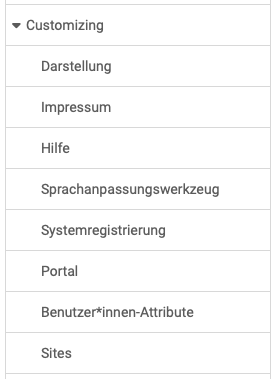
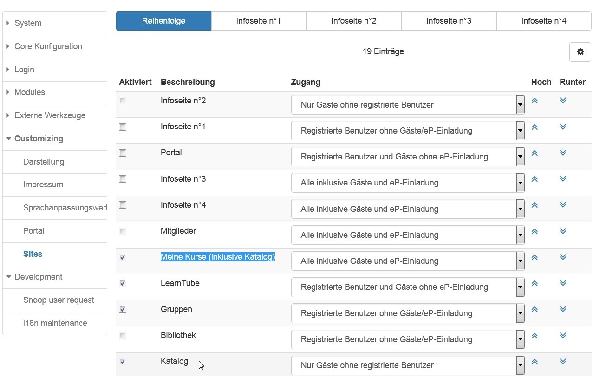

# Customizing: Übersicht {: #customizing}

{ class="shadow lightbox aside-left-lg" }

Das Menü "Customizing" umfasst Einstellungen bezüglich der hier aufgeführten Menüpunkte.

---

## Darstellung, Layout

Hier können das Systemlayout, ein Firmenlogo und Eigenschaften bezüglich der Fusszeile hinterlegt werden.

[Zum Seitenanfang ^](#customizing)

## Impressum

Aktivierung und Konfigurationen zum Impressum, auch für verschiedene Sprachen.

[Zum Seitenanfang ^](#customizing)

## Hilfe

Hier kann definiert werden welche Hilfeseiten über das Hilfe-Icon  :fontawesome-solid-circle-question: im allgemeinen Menü bereitgestellt werden. Auch ein Link zum Support Kontaktformular ist möglich.

{ class="shadow lightbox" }

[Zum Seitenanfang ^](#customizing)

## Sprachpassungswerkzeug

Hier können bei Bedarf einzelne Textelemente angepasst werden

[Zum Seitenanfang ^](#customizing)

## Systemregistrierung

[Zum Seitenanfang ^](#customizing)

## Portal

[Zum Seitenanfang ^](#customizing)

## Benutzer:innen-Attribute

[Zum Seitenanfang ^](#customizing)

## Sites

Hier wird definiert welche OpenOlat Bereiche systemweit zur Verfügung gestellt
werden und welche Rechte- und Rollengruppen Zugang zu den einzelnen Bereichen
erhalten.

Wenn Gäste Zugriff auf Kurse erhalten sollen, muss entweder der "Katalog" oder
"Meine Kurse (inklusive Katalog)" für die Gäste aktiviert sein.

Wenn die Kurse, welche für Gäste zugänglich sind, im Katalog erscheinen
sollen, müssen diese Kurse dem Katalog hinzugefügt werden. Dies ist möglich
durch den Kursbesitzer, den Katalogverwalter oder den Systemadministrator.

{ class="shadow lightbox" }

[Zum Seitenanfang ^](#customizing)

