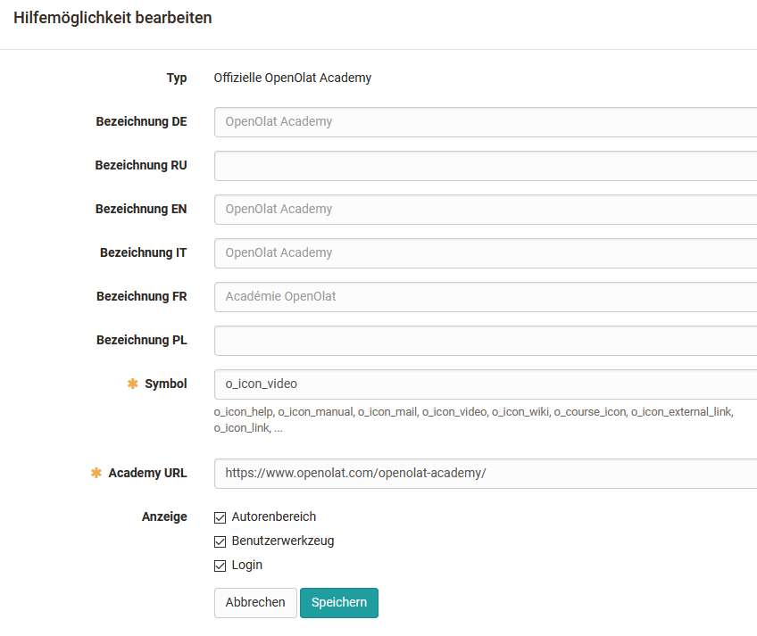
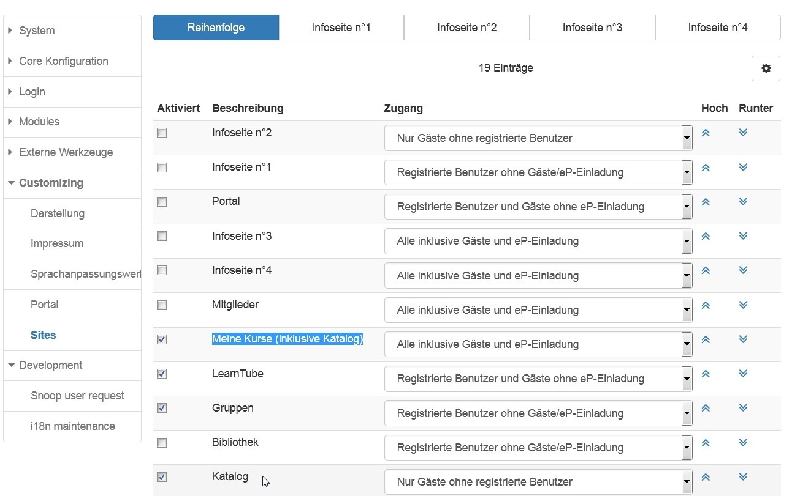

# Customizing

Das Menü "Customizing" umfasst Einstellungen bezüglich:

  * Darstellung
  * Impressum
  * Hilfe
  * Sprachanpassungswerkzeug
  * Portal
  * Sites

## Darstellung, Layout

Hier können das Systemlayout, ein Firmenlogo und Eigenschaften bezüglich der
Fusszeile hinterlegt werden.

## Impressum

Aktivierung und Konfigurationen zum Impressum, auch für verschiedene Sprachen

## Hilfe

Hier kann definiert werden welche Hilfeseiten über das Hilfe-Icon
im
allgemeinen Menü bereitgestellt werden. Auch ein Link zum Support
Kontaktformular ist möglich.

## Sprachpassungswerkzeug

Hier können bei Bedarf einzelne Textelemente angepasst werden

## Portal

Einstellungen für den Tab "Home"

## Sites

Hier wird definiert welche OpenOlat Bereiche systemweit zur Verfügung gestellt
werden und welche Rechte- und Rollengruppen Zugang zu den einzelnen Bereichen
erhalten.

Wenn Gäste Zugriff auf Kurse erhalten sollen, muss entweder der "Katalog" oder
"Meine Kurse (inklusive Katalog)" für die Gäste aktiviert sein.

Wenn die Kurse, welche für Gäste zugänglich sind, im Katalog erscheinen
sollen, müssen diese Kurse dem Katalog hinzugefügt werden. Dies ist möglich
durch den Kursbesitzer, den Katalogverwalter oder den Systemadministrator.

  

  

