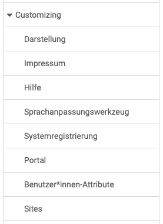
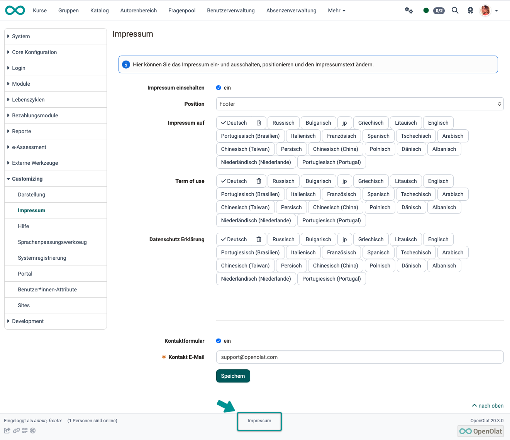
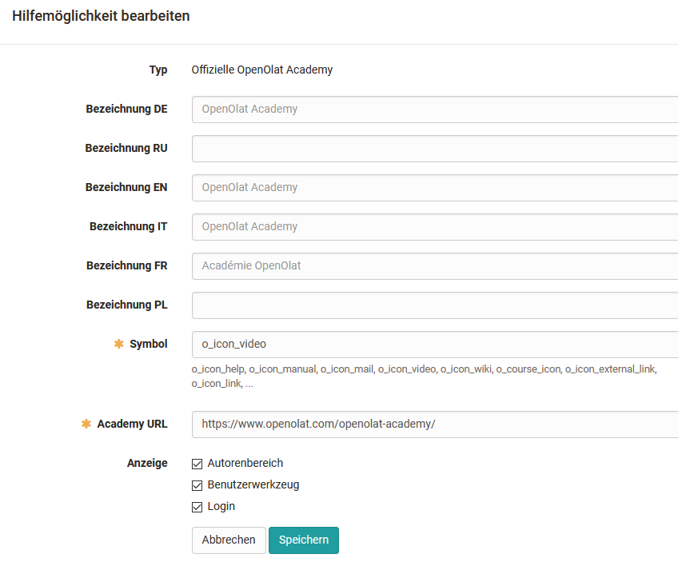
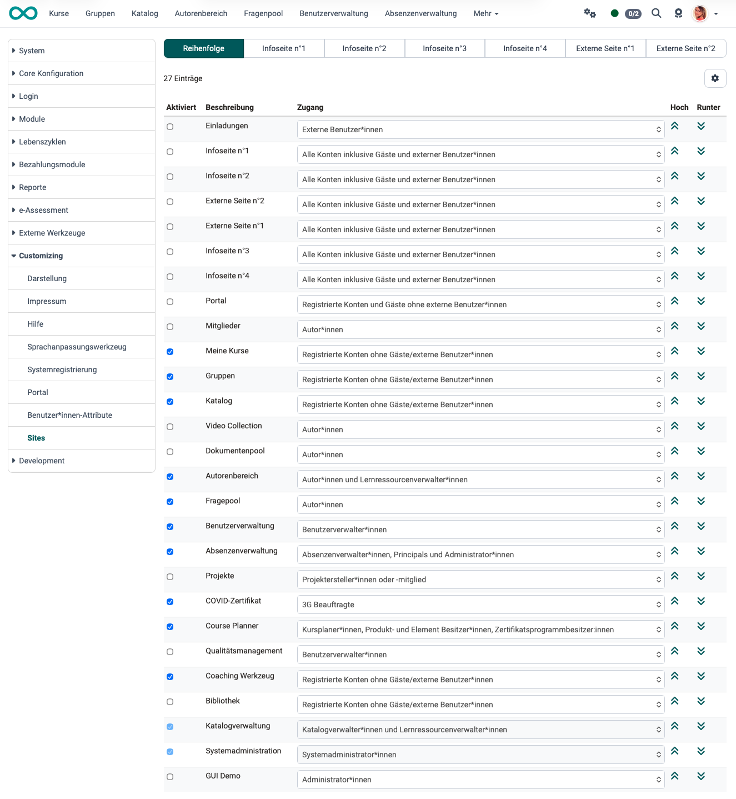

# Customizing: Übersicht {: #customizing}

{ class="shadow lightbox aside-left-lg" }

Das Menü "Customizing" umfasst Einstellungen bezüglich der hier aufgeführten Menüpunkte.

---

## Darstellung, Layout {: #layout}

### Abschnitt Layout

Dieser Abschnitt dient dazu, die verfügbaren Layout-Themes auszuprobieren.

### Abschnitt Firmen- oder Institutslogo

Sie können ein eigenes Logo hochladen (png-Datei), das dann in der Kopfzeile links oben angezeigt wird. Beachten Sie, dass dieses Logo innerhalb des Themes (Gesamtlayoputs) verwendet wird. Als voreingestellter Standard wird das OpenOlat-Logo angezeigt.

### Abschnitt Fusszeile Eigenschaften

Firmenlogo und Eigenschaften des Links in der Fusszeile rechts unten können ebenfalls eingestellt werden.

[Zum Seitenanfang ^](#customizing)

## Impressum {: #imprint}

Administrator:innen legen fest, 

* wo der Link zum Impressum erscheint (z.B. im Footer)
* ob ein Impressumstext erscheint und wie er lautet
* ob ein Text zu den Nutzungsbedingungen innerhalb des Impressums erscheint und wie der Text lautet
* ob ein Text zur Datenschutzerklärung innerhalb des Impressums erscheint und wie der Text lautet
* ob ein Kontaktformular für allgemeine Anfragen erscheinen soll und an wen die Anfrage ggf.geschickt wird

Alle Texte können in verschiedenen Sprachen hinterlegt werden.

{ class="shadow lightbox" }

[Zum Seitenanfang ^](#customizing)

## Hilfe {: #help}

Hier kann definiert werden, welche Hilfeseiten über das Hilfe-Icon  :fontawesome-solid-circle-question: im allgemeinen Menü bereitgestellt werden. Auch ein Link zum Support Kontaktformular ist möglich.

{ class="shadow lightbox" }

[Zum Seitenanfang ^](#customizing)

## Sprachpassungswerkzeug {: #language_adaption_tool}

Hier können bei Bedarf einzelne Textelemente für die ganze Instanz angepasst werden

[Zum Seitenanfang ^](#customizing)

## Systemregistrierung {: #system_registration}

OpenOlat ist Open-Source und braucht eine aktive Community von Anwender*innen. Es besteht die Möglichkeit, dass auch Sie in dieser Community dabei sind.

[Zum Seitenanfang ^](#customizing)

## Portal {: #portal}

Für den Tab "Home" können verschiedene Portlets ausgewählt werden.

[Zum Seitenanfang ^](#customizing)

## Benutzer:innen-Attribute {: #user_properties}

Für Administrator:innen besteht hier die Möglichkeit, die in der Benutzerverwaltung angezeigten Attribute zu bestimmen und einer Darstellungsgruppe zuzuordnen.
Ausserdem können die Übersetzungen bearbeitet werden.

[Zum Seitenanfang ^](#customizing)

## Sites {: #sites}

### Tab Reihenfolge

Sites/Bereiche entsprechen den Menüpunkte des Hauptmenüs in der Kopfzeile.

Administrator:innen können definieren, welche OpenOlat-Bereiche dort angezeigt und systemweit zur Verfügung gestellt
werden. Die Anzeige im Hauptmenü/der Zugriff kann auf bestimmte Rechte- und Rollengruppen beschränkt werden.

Mit den Pfeilen am rechten Rand kann die Anzeigereihenfolge festgelegt werden.

{ class="shadow lightbox" }

### Übrige Tabs

In den übrigen Tabs können individuell Infoseiten eingebunden werden, die via Hauptmenü in der Kopfzeile aufgerufen werden können. 
Es können sowohl externe URLs sein, als auch OpenOlat-Lernressourcen (z.B. Kurse, die evtl. nur eine oder wenige Seiten enthalten).

[Zum Seitenanfang ^](#customizing)

