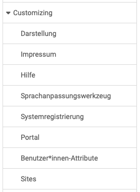
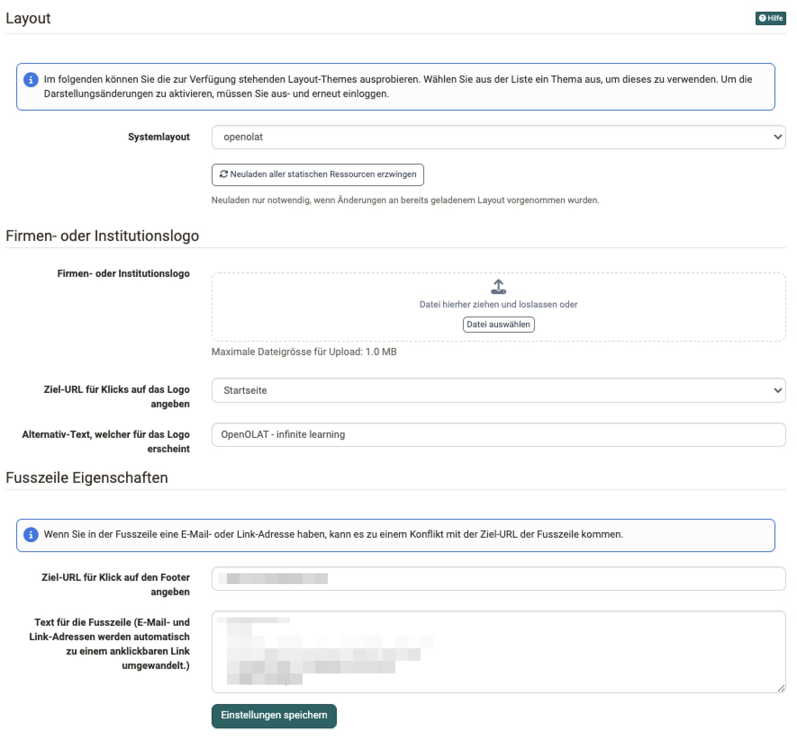
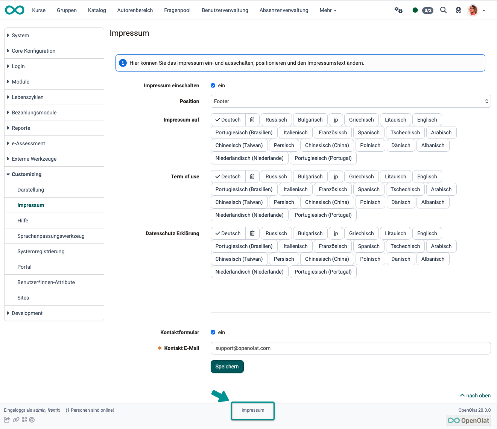
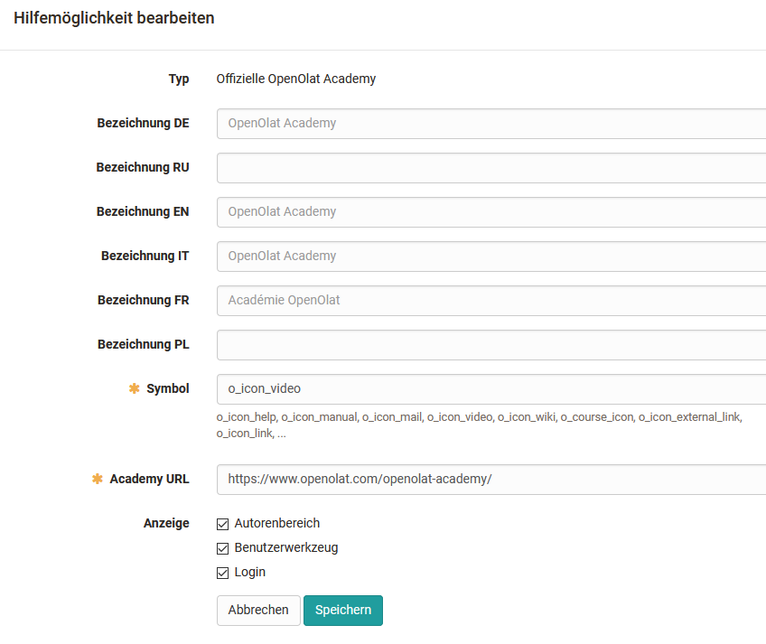
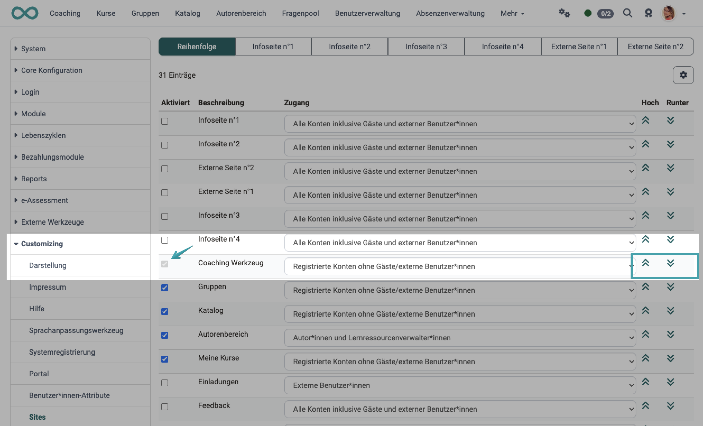
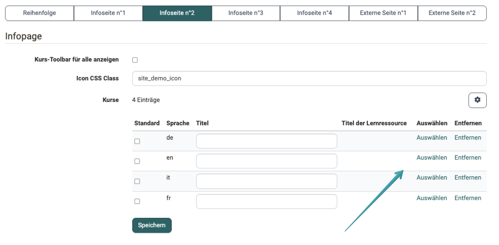
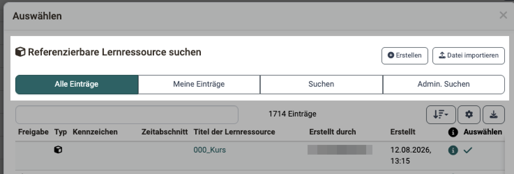

# Customizing: Übersicht {: #customizing}

{ class="shadow lightbox aside-left-lg" }

Das Menü "Customizing" umfasst Einstellungen bezüglich der hier aufgeführten Menüpunkte. Sie finden diese Einstellungen in der System-Administration unter: 
`Administration > Customizing`

---

## Darstellung, Layout {: #layout}

{ class="shadow lightbox" }

### Abschnitt Layout

Dieser Abschnitt dient dazu, die verfügbaren Layout-Themes auszuprobieren.

Das Hintergrundbild der Anmeldeseite ist Bestandteil des Layout-Themes und lässt sich nicht in der System-Administration konfigurieren. Es wird über ein individuelles Theme angepasst. Wenden Sie sich bei gehosteten Instanzen dazu an den Betreiber.

### Abschnitt Firmen- oder Institutionslogo [:octicons-tag-16:{ title="ab Release 10.0 (OO-1167)" }](https://track.frentix.com/issue/OO-1167){:target="_blank"}

Sie können ein eigenes Logo hochladen (png-Datei), das dann in der Kopfzeile links oben angezeigt wird. Beachten Sie, dass dieses Logo innerhalb des Themes (Gesamtlayouts) verwendet wird. Als voreingestellter Standard wird das OpenOlat-Logo angezeigt.

Zusätzlich legen Sie fest, wohin ein Klick auf das Logo führt: auf die Startseite oder auf eine selbst gewählte Ziel-URL. Im Feld für den Alternativ-Text hinterlegen Sie den Text, der anstelle des Logos erscheint.

### Abschnitt Fusszeile Eigenschaften

In diesem Abschnitt legen Sie den Text der Fusszeile rechts unten fest sowie die Ziel-URL, auf die ein Klick auf die Fusszeile führt. E-Mail- und Link-Adressen im Text werden automatisch in einen anklickbaren Link umgewandelt.

[Zum Seitenanfang ^](#customizing)

## Impressum [:octicons-tag-16:{ title="ab Release 10.0 (OO-1166)" }](https://track.frentix.com/issue/OO-1166){:target="_blank"} {: #imprint}

Administrator:innen legen fest, 

* wo der Link zum Impressum erscheint (z.B. im Footer)
* ob ein Impressumstext erscheint und wie er lautet
* ob ein Text zu den Nutzungsbedingungen innerhalb des Impressums erscheint und wie der Text lautet
* ob ein Text zur Datenschutzerklärung innerhalb des Impressums erscheint und wie der Text lautet
* ob ein Kontaktformular für allgemeine Anfragen erscheinen soll und an wen die Anfrage ggf. geschickt wird

Alle Texte können in verschiedenen Sprachen hinterlegt werden.

{ class="shadow lightbox" }

[Zum Seitenanfang ^](#customizing)

## Hilfe {: #help}

Hier kann definiert werden, welche Hilfeseiten über das Hilfe-Icon :fontawesome-solid-circle-question: im allgemeinen Menü bereitgestellt werden. Auch ein Link zum Support Kontaktformular ist möglich.

{ class="shadow lightbox" }

[Zum Seitenanfang ^](#customizing)

## Sprachanpassungswerkzeug {: #language_adaption_tool}

Hier können bei Bedarf einzelne Textelemente für die ganze Instanz angepasst werden.

[Zum Seitenanfang ^](#customizing)

## Systemregistrierung {: #system_registration}

OpenOlat ist Open-Source und braucht eine aktive Community von Anwender:innen. Es besteht die Möglichkeit, dass auch Sie in dieser Community dabei sind.

[Zum Seitenanfang ^](#customizing)

## Portal {: #portal}

Für den Tab "Portal" können verschiedene Portlets ausgewählt werden.

!!! tip "Tipp"
    Wir empfehlen diese Einrichtung nicht einzusetzen. Sie ist überholt durch etliche Module in OpenOlat und ist damit ein historisches Überbleibsel, welches dennoch nicht einfach ausgeschaltet werden kann. Vielen Dank für Ihr Verständnis.

[Zum Seitenanfang ^](#customizing)

## Benutzer:innen-Attribute {: #user_properties}

Für Administrator:innen besteht hier die Möglichkeit, die in der Benutzerverwaltung angezeigten Attribute zu bestimmen und einer Darstellungsgruppe zuzuordnen.
Ausserdem können die Übersetzungen bearbeitet werden.

[Zum Seitenanfang ^](#customizing)

## Sites {: #sites}

### Tab Reihenfolge

Sites/Bereiche entsprechen den Menüpunkten (Tabs) des Hauptmenüs in der Kopfzeile, z.B. "Kurse", "Gruppen", "Katalog", "Autorenbereich" oder "Coaching".

Administrator:innen können definieren, welche OpenOlat-Bereiche dort angezeigt und systemweit zur Verfügung gestellt werden. Die Anzeige im Hauptmenü/der Zugriff kann auf bestimmte Rechte- und Rollengruppen beschränkt werden. Einzelne Einträge heissen in der Liste anders als der Tab im Hauptmenü, z.B. erscheint der Eintrag "Meine Kurse" im Hauptmenü als Tab "Kurse".

Mit den Pfeilen am rechten Rand kann die Anzeigereihenfolge festgelegt werden.

Der Eintrag "Coaching Werkzeug" kann [:octicons-tag-16:{ title="ab Release 21.0.1 (OO-9661)" }](https://track.frentix.com/issue/OO-9661) nicht deaktiviert werden, da das Coaching Tool obligatorisch ist: Die Checkbox "Aktiviert" ist ausgegraut. Die Anzeigereihenfolge und der Zugang lassen sich weiterhin anpassen.

{ class="shadow lightbox" }

### Übrige Tabs

In den übrigen Tabs können individuell Infoseiten eingebunden werden, die via Hauptmenü in der Kopfzeile aufgerufen werden können. 
Es können sowohl externe URLs sein, als auch OpenOlat-Lernressourcen (z.B. Kurse, die evtl. nur eine oder wenige Seiten enthalten).

{ class="shadow lightbox" }

Je Sprache hinterlegen Sie einen eigenen Titel und eine eigene Lernressource. Mit "Auswählen" öffnen Sie die Suche nach der referenzierbaren Lernressource. Erst dort verbinden Sie den Tab mit einem Kurs.

{ class="shadow lightbox" }

[Zum Seitenanfang ^](#customizing)

