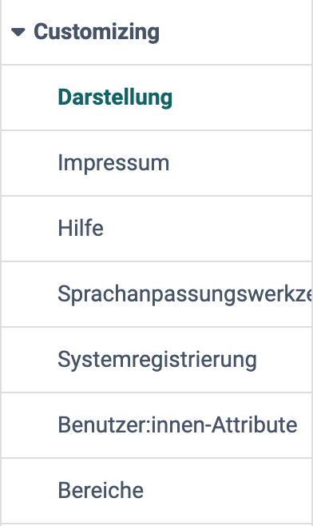
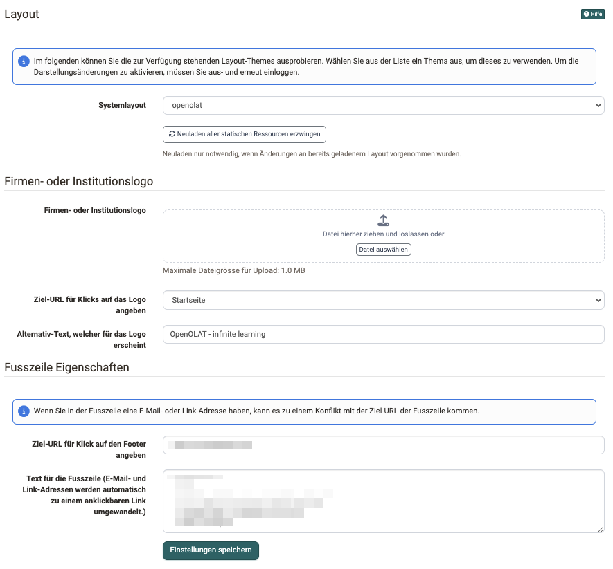
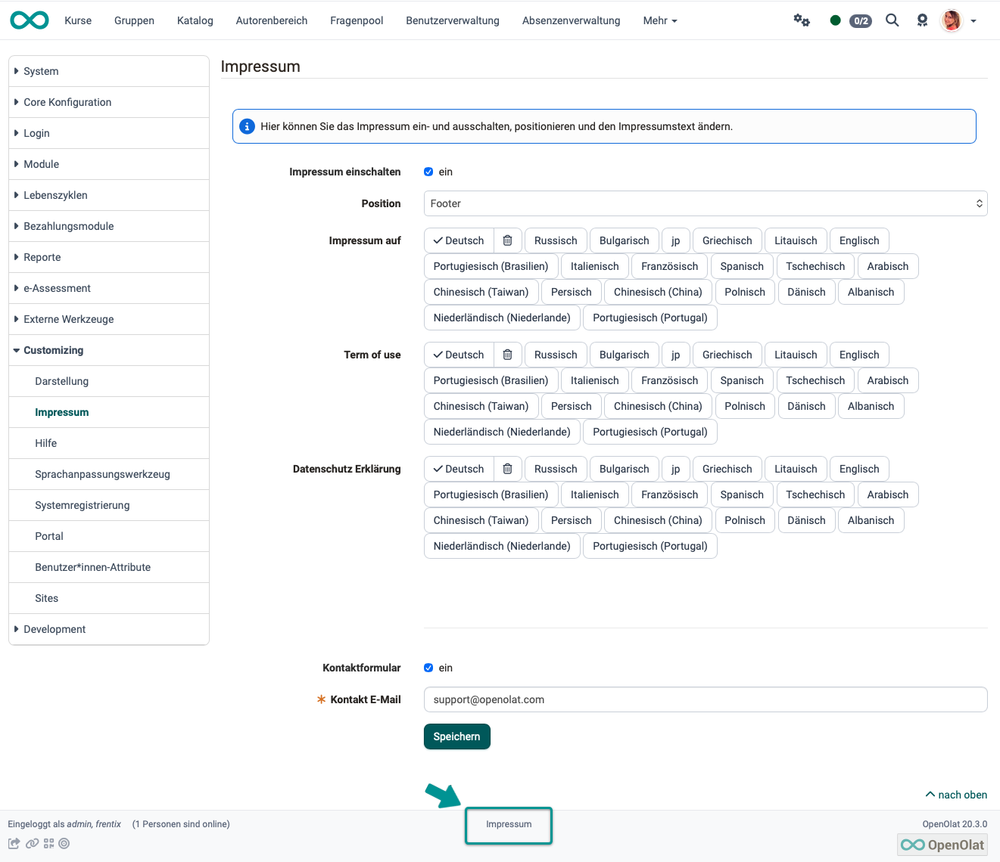
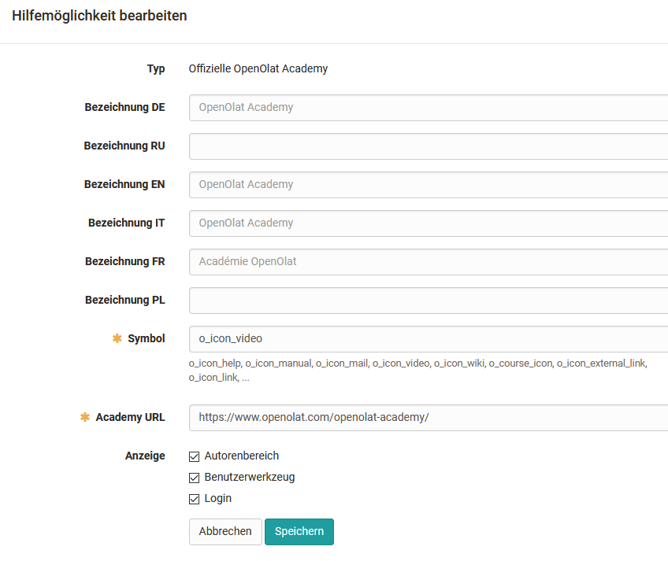
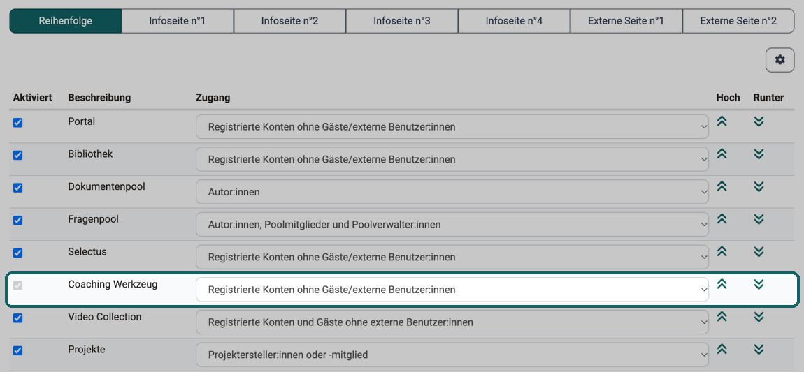
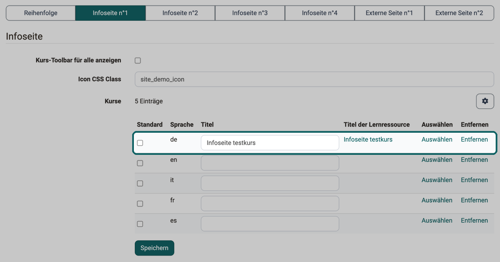
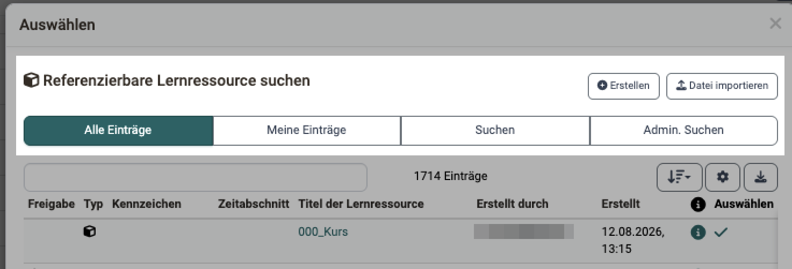

# Customizing: Übersicht {: #customizing}

{ class="shadow lightbox aside-left-lg" }

Im Menü "Customizing" passen Administrator:innen und Systemadministrator:innen das Erscheinungsbild und die Hauptnavigation der ganzen Instanz an. Sie finden diese Einstellungen in der System-Administration unter: 
`Administration > Customizing`

## Steckbrief

Name | Customizing
---------|----------
Verfügbar seit | Release 8.0 (2011)

---

## Darstellung {: #layout}

{ class="shadow lightbox" title="Seite Darstellung im Menü Customizing" }

### Abschnitt Layout

Hier legen Sie fest, wie die ganze Instanz aussieht: Sie wählen in der Liste "Systemlayout" eines der installierten Themes. Die Auswahl gilt für alle Personen der Instanz, nicht nur für Ihre eigene Ansicht.

Ein neues Theme lässt sich nicht in der System-Administration erstellen. Die Liste "Systemlayout" zeigt nur die Themes, die auf dem Server Ihrer Instanz installiert sind. Zum Theme gehört auch das Hintergrundbild der Anmeldeseite. Für ein neues oder individuelles Theme wenden Sie sich bei gehosteten Instanzen an den Betreiber. frentix-Kund:innen wenden sich dafür an den frentix Support: [support@frentix.com](mailto:support@frentix.com). Betreiben Sie OpenOlat selbst, legen Sie das Theme als Ordner im Verzeichnis für eigene Themes auf dem Server ab.

Wurde ein bereits geladenes Theme auf dem Server geändert, zeigen Browser oft noch die alte Fassung aus ihrem Zwischenspeicher. Mit dem Button "Neuladen aller statischen Ressourcen erzwingen" laden alle Browser die Dateien des Themes neu. [:octicons-tag-16:{ title="ab Release 12.3 (OO-3235)" }](https://track.frentix.com/issue/OO-3235)

### Abschnitt Firmen- oder Institutionslogo [:octicons-tag-16:{ title="ab Release 10.0 (OO-1167)" }](https://track.frentix.com/issue/OO-1167){:target="_blank"}

Sie können ein eigenes Logo hochladen (png-Datei), das dann in der Hauptnavigation links oben angezeigt wird. Beachten Sie, dass dieses Logo innerhalb des Themes (Gesamtlayouts) verwendet wird. Als voreingestellter Standard wird das OpenOlat-Logo angezeigt.

Zusätzlich legen Sie fest, wohin ein Klick auf das Logo führt: auf die Startseite oder auf eine selbst gewählte Ziel-URL. Im Feld für den Alternativ-Text hinterlegen Sie den Text, der anstelle des Logos erscheint.

### Abschnitt Fusszeile Eigenschaften

In diesem Abschnitt legen Sie den Text der Fusszeile rechts unten fest sowie die Ziel-URL, auf die ein Klick auf die Fusszeile führt. E-Mail- und Link-Adressen im Text werden automatisch in einen anklickbaren Link umgewandelt.

[Zum Seitenanfang ^](#customizing)

## Impressum [:octicons-tag-16:{ title="ab Release 10.0 (OO-1166)" }](https://track.frentix.com/issue/OO-1166){:target="_blank"} {: #imprint}

Administrator:innen legen fest,

* wo der Link zum Impressum erscheint (z.B. im Footer)
* ob ein Impressumstext erscheint und wie er lautet
* ob ein Text zu den Nutzungsbedingungen innerhalb des Impressums erscheint und wie der Text lautet
* ob ein Text zur Datenschutzerklärung innerhalb des Impressums erscheint und wie der Text lautet
* ob ein Kontaktformular für allgemeine Anfragen erscheinen soll und an wen die Anfrage ggf. geschickt wird

Alle Texte können in verschiedenen Sprachen hinterlegt werden.

{ class="shadow lightbox" title="Seite Impressum im Menü Customizing" }

[Zum Seitenanfang ^](#customizing)

## Hilfe [:octicons-tag-16:{ title="ab Release 15.1 (OO-4562)" }](https://track.frentix.com/issue/OO-4562){:target="_blank"} {: #help}

Hier kann definiert werden, welche Hilfeseiten über das Hilfe-Icon :fontawesome-solid-circle-question: im allgemeinen Menü bereitgestellt werden. Auch ein Link zum Support Kontaktformular ist möglich.

{ class="shadow lightbox" title="Dialog Hilfemöglichkeit bearbeiten auf der Seite Hilfe" }

[Zum Seitenanfang ^](#customizing)

## Sprachanpassungswerkzeug {: #language_adaption_tool}

Hier können bei Bedarf einzelne Textelemente für die ganze Instanz angepasst werden.

[Zum Seitenanfang ^](#customizing)

## Systemregistrierung {: #system_registration}

OpenOlat ist Open-Source und braucht eine aktive Community von Anwender:innen. Es besteht die Möglichkeit, dass auch Sie in dieser Community dabei sind.

[Zum Seitenanfang ^](#customizing)

## Portal {: #portal}

Für den Tab "Portal" können verschiedene Portlets ausgewählt werden.

!!! tip "Tipp"
    Wir empfehlen diese Einrichtung nicht einzusetzen. Sie ist überholt durch etliche Module in OpenOlat und ist damit ein historisches Überbleibsel, welches dennoch nicht einfach ausgeschaltet werden kann. Vielen Dank für Ihr Verständnis.

[Zum Seitenanfang ^](#customizing)

## Benutzer:innen-Attribute {: #user_properties}

Für Administrator:innen besteht hier die Möglichkeit, die in der Benutzerverwaltung angezeigten Attribute zu bestimmen und zu gruppieren.
Ausserdem können die Übersetzungen bearbeitet werden.

[Zum Seitenanfang ^](#customizing)

## Bereiche {: #sites}

Auf der Seite "Bereiche" legen Administrator:innen fest, welche Bereiche die Hauptnavigation in der obersten Zeile anbietet, in welcher Reihenfolge und für welche Rollen. Sie finden die Seite in der System-Administration unter: 
`Administration > Customizing > Bereiche`

Was ein Bereich ist und wovon abhängt, ob eine Person ihn sieht, erklärt das Benutzerhandbuch auf der Seite [Bereiche und Module](../../manual_user/area_modules/index.de.md#conditions).

### Tab Reihenfolge

Im Tab "Reihenfolge" schalten Sie die Bereiche für die ganze Instanz frei und ordnen sie. Die Checkbox "Aktiviert" gibt einen Bereich frei, die Pfeile "Hoch" und "Runter" legen die Reihenfolge fest. Einzelne Einträge heissen in der Liste anders als der Bereich in der Hauptnavigation: Der Eintrag "Meine Kurse" erscheint dort als "Kurse".

Der Eintrag "Coaching Werkzeug" lässt sich nicht deaktivieren, weil Betreuer:innen und Besitzer:innen ihre Lernressourcen über das Coaching erreichen: Die Checkbox "Aktiviert" ist ausgegraut. Reihenfolge und Zugang bleiben einstellbar. [:octicons-tag-16:{ title="ab Release 21.0.1 (OO-9661)" }](https://track.frentix.com/issue/OO-9661)

{ class="shadow lightbox" title="Tab Reihenfolge auf der Seite Bereiche · 2026.10.09" }

Die Liste gilt für die ganze Instanz. Drei weitere Punkte entscheiden mit darüber, ob eine Person einen Bereich sieht.

**Das Modul muss aktiv sein.** Ein Eintrag erscheint nur, wenn zusätzlich das zugehörige Modul eingeschaltet ist. Ein aktivierter Eintrag "Katalog" bleibt ohne Wirkung, solange das [Modul Katalog](Modules_Catalog_2.0.de.md) ausgeschaltet ist. Bei ausgeschaltetem Modul ist die Checkbox "Aktiviert" des Eintrags ausgegraut.

**Die Spalte "Zugang" entscheidet je Rolle.** Sie bestimmt, welche Rollen den Bereich sehen, zum Beispiel "Registrierte Konten ohne Gäste/externe Benutzer:innen" oder "Autor:innen und Lernressourcenverwalter:innen". Zwei Personen mit verschiedenen Rollen sehen deshalb eine verschiedene Hauptnavigation.

**Der Platz in der Zeile entscheidet über die Darstellung.** Bereiche, die nicht mehr in die oberste Zeile passen, sammelt OpenOlat im Menü "Mehr" am rechten Rand. Das hängt von der Bildschirmbreite der Betrachterin ab und lässt sich nicht einstellen.

### Übrige Tabs [:octicons-tag-16:{ title="ab Release 9.1 (OO-715)" }](https://track.frentix.com/issue/OO-715){:target="_blank"}

In den Tabs "Infoseite n°1" bis "Infoseite n°4" binden Sie je einen Kurs als eigenen Bereich in die Hauptnavigation ein, zum Beispiel für Informationen an alle Personen der Instanz.

{ class="shadow lightbox" title="Tab Infoseite n°1 auf der Seite Bereiche · 2026.10.09" }

Je Sprache hinterlegen Sie einen eigenen Titel und eine eigene Lernressource. Mit "Auswählen" öffnen Sie die Suche nach der referenzierbaren Lernressource. Erst dort verbinden Sie den Bereich mit einem Kurs. Die Checkbox "Standard" bestimmt den Eintrag, der gilt, wenn für die Sprache einer Person keiner hinterlegt ist.

Im Feld "Icon CSS Class" legen Sie das Symbol des Bereichs fest. Mit der Checkbox "Kurs-Toolbar für alle anzeigen" sehen alle Personen die Toolbar des Kurses. Ohne Häkchen sehen sie nur Personen, die den Kurs verwalten dürfen, zum Beispiel Besitzer:innen.

{ class="shadow lightbox" title="Dialog Referenzierbare Lernressource suchen" }

In den Tabs "Externe Seite n°1" und "Externe Seite n°2" binden Sie je Sprache eine externe URL mit eigenem Titel als Bereich ein. [:octicons-tag-16:{ title="ab Release 18.2 (OO-7398)" }](https://track.frentix.com/issue/OO-7398)

[Zum Seitenanfang ^](#customizing)

## Weiterführende Informationen {: #further_information}

**Auf dieser Seite erwähnt** 
[Bereiche und Module >](../../manual_user/area_modules/index.de.md) 
[Modul Katalog >](Modules_Catalog_2.0.de.md)

**Weiterführend** 
[Module: Übersicht >](Modules.de.md) 
[Startseite >](Landing_pages.de.md) 
[Navigation >](../../manual_user/basic_concepts/Navigation.de.md)

[Zum Seitenanfang ^](#customizing)

