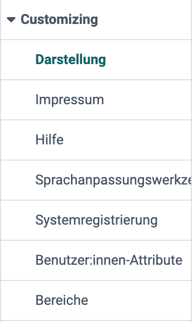
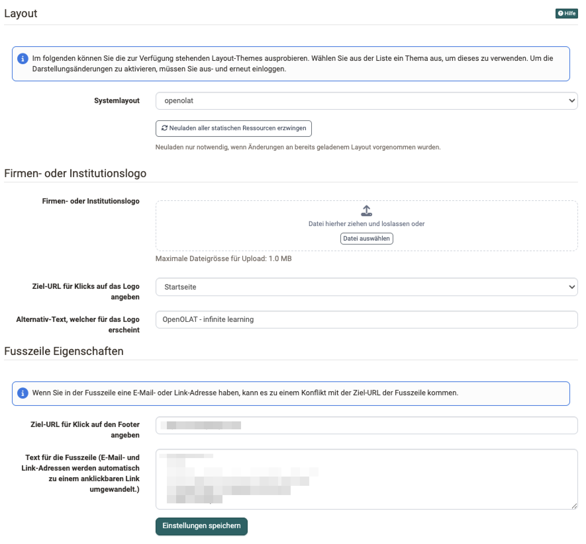
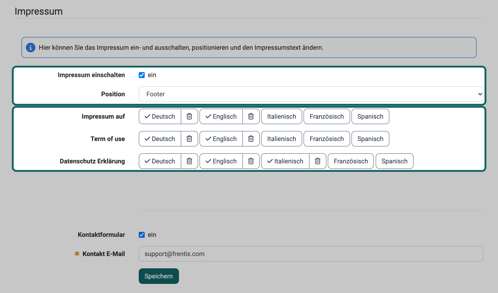
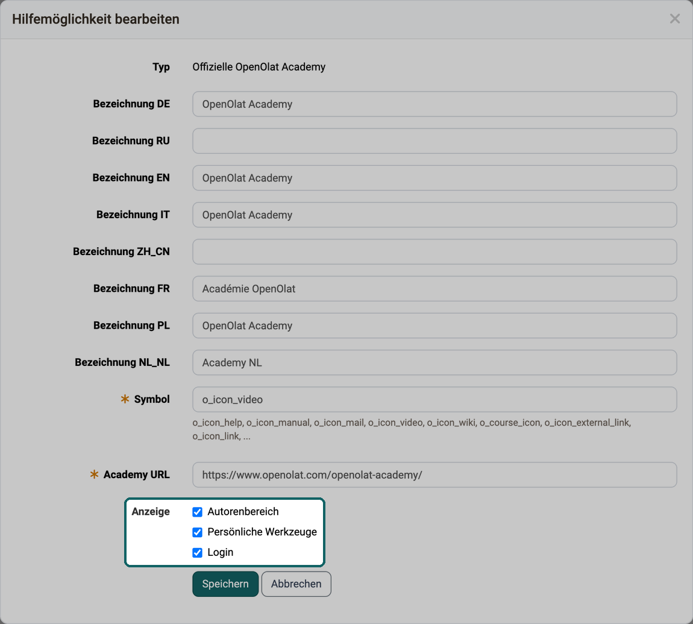
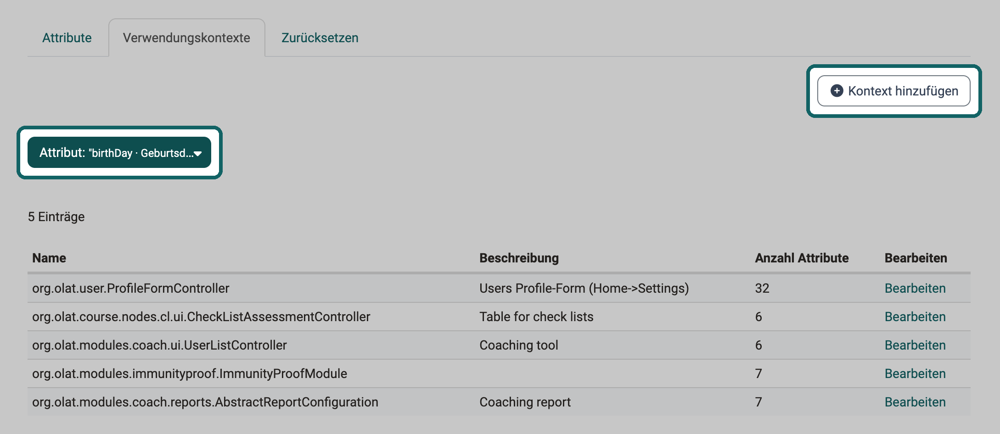
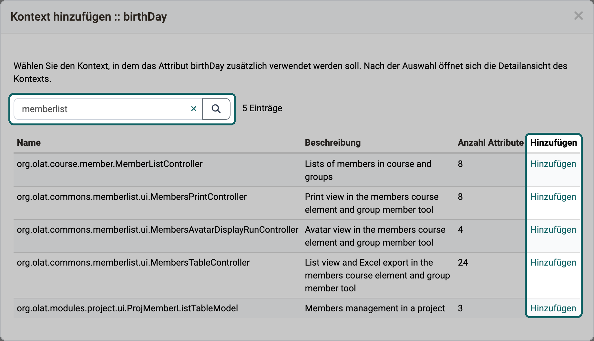
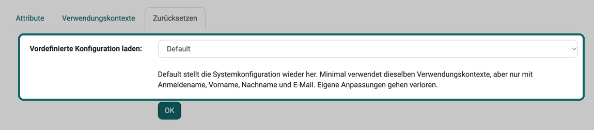
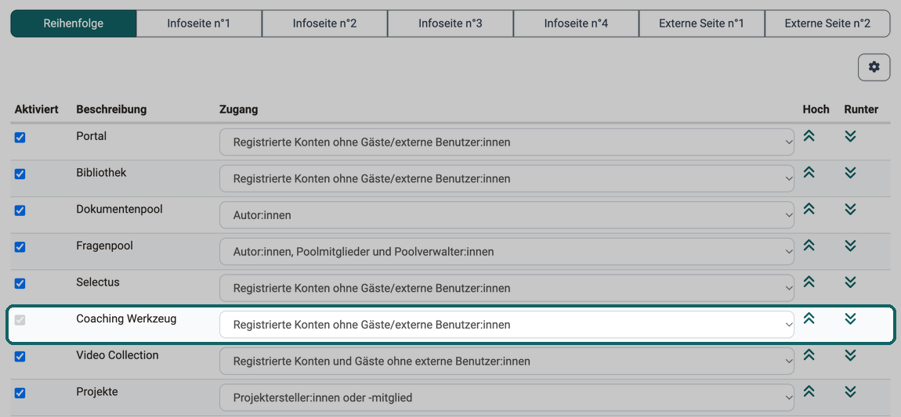
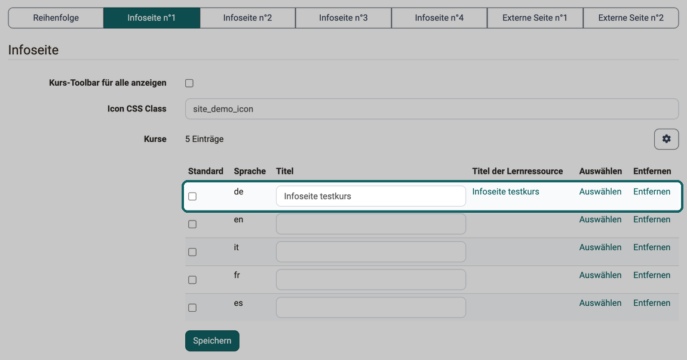
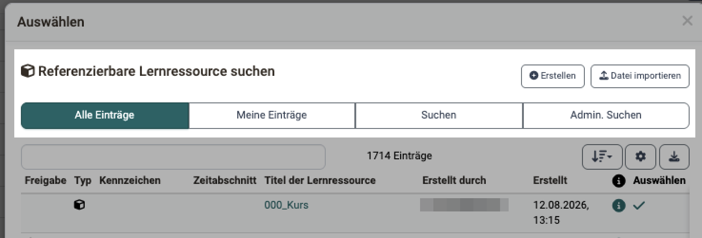

# Customizing: Übersicht {: #customizing}

{ class="shadow lightbox aside-left-lg" }

Im Menü "Customizing" passen Administrator:innen und Systemadministrator:innen das Erscheinungsbild und die Hauptnavigation der ganzen Instanz an. Sie finden diese Einstellungen in der System-Administration unter: 
`Administration > Customizing`

## Steckbrief

Name | Customizing
---------|----------
Verfügbar seit | Release 8.0 (2011)

---

## Darstellung {: #layout}

{ class="shadow lightbox" title="Seite Darstellung im Menü Customizing" }

### Abschnitt Layout

Hier legen Sie fest, wie die ganze Instanz aussieht: Sie wählen in der Liste "Systemlayout" eines der installierten Themes. Die Auswahl gilt für alle Personen der Instanz, nicht nur für Ihre eigene Ansicht.

Ein neues Theme lässt sich nicht in der System-Administration erstellen. Die Liste "Systemlayout" zeigt nur die Themes, die auf dem Server Ihrer Instanz installiert sind. Zum Theme gehört auch das Hintergrundbild der Anmeldeseite. Für ein neues oder individuelles Theme wenden Sie sich bei gehosteten Instanzen an den Betreiber. frentix-Kund:innen wenden sich dafür an den frentix Support: [support@frentix.com](mailto:support@frentix.com). Betreiben Sie OpenOlat selbst, legen Sie das Theme als Ordner im Verzeichnis für eigene Themes auf dem Server ab.

Wurde ein bereits geladenes Theme auf dem Server geändert, zeigen Browser oft noch die alte Fassung aus ihrem Zwischenspeicher. Mit dem Button "Neuladen aller statischen Ressourcen erzwingen" laden alle Browser die Dateien des Themes neu. [:octicons-tag-16:{ title="ab Release 12.3 (OO-3235)" }](https://track.frentix.com/issue/OO-3235)

### Abschnitt Firmen- oder Institutionslogo [:octicons-tag-16:{ title="ab Release 10.0 (OO-1167)" }](https://track.frentix.com/issue/OO-1167){:target="_blank"}

Damit Personen Ihre Organisation auf jeder Seite erkennen, laden Sie ein eigenes Logo als PNG-Datei bis 1 MB hoch. OpenOlat zeigt es links oben in der Hauptnavigation, eingebettet in das gewählte Theme. Ohne eigenes Logo erscheint das OpenOlat-Logo.

Zusätzlich legen Sie fest, wohin ein Klick auf das Logo führt: auf die Startseite oder auf eine selbst gewählte Ziel-URL. Im Feld für den Alternativ-Text hinterlegen Sie den Text, der anstelle des Logos erscheint.

### Abschnitt Fusszeile Eigenschaften

In diesem Abschnitt legen Sie den Text der Fusszeile rechts unten fest sowie die Ziel-URL, auf die ein Klick auf die Fusszeile führt. E-Mail- und Link-Adressen im Text wandelt OpenOlat automatisch in anklickbare Links um. Enthält der Text eine solche Adresse, kann sie mit der Ziel-URL der Fusszeile in Konflikt geraten.

[Zum Seitenanfang ^](#customizing)

## Impressum [:octicons-tag-16:{ title="ab Release 10.0 (OO-1166)" }](https://track.frentix.com/issue/OO-1166){:target="_blank"} {: #imprint}

Damit Personen die rechtlichen Angaben Ihrer Organisation finden, richten Sie auf der Seite "Impressum" das Impressum der Instanz ein. Sie finden die Seite in der System-Administration unter: 
`Administration > Customizing > Impressum`

Die Checkbox "Impressum einschalten" blendet den Link zum Impressum ein. Erst danach erscheinen die übrigen Einstellungen der Seite. Unter "Position" wählen Sie, ob der Link oben ("Top") oder in der Fusszeile ("Footer") steht.

Für "Impressum auf", "Term of use" und "Datenschutz Erklärung" steht je Sprache der Instanz ein Button, über den Sie den Text in dieser Sprache hinterlegen. Ein Häkchen auf dem Button zeigt, dass für diese Sprache ein Text vorhanden ist. Mit dem Papierkorb daneben löschen Sie ihn. Im Impressum erscheinen die Texte unter "Impressum", "Nutzungsbedingungen" und "Datenschutzerklärung".

Mit der Checkbox "Kontaktformular" bieten Sie zusätzlich ein Formular für allgemeine Anfragen an. Die Anfragen gehen an die Adresse im Feld "Kontakt E-Mail", die Sie mit "Speichern" sichern.

{ class="shadow lightbox" title="Seite Impressum im Menü Customizing · 2026.10.21" }

[Zum Seitenanfang ^](#customizing)

## Hilfe [:octicons-tag-16:{ title="ab Release 15.1 (OO-4562)" }](https://track.frentix.com/issue/OO-4562){:target="_blank"} {: #help}

Damit Personen bei Fragen die passende Hilfe finden, legen Sie auf der Seite "Hilfe" fest, welche Hilfemöglichkeiten das Hilfe-Icon :fontawesome-solid-circle-question: anbietet, zum Beispiel das offizielle OpenOlat Handbuch, einen eigenen Hilfekurs oder ein Kontaktformular für den Support. Je Hilfemöglichkeit wählen Sie unter "Anzeige", ob sie im Autorenbereich, in den persönlichen Werkzeugen oder auf der Login-Seite erscheint. Sie finden die Seite in der System-Administration unter: 
`Administration > Customizing > Hilfe`

{ class="shadow lightbox" title="Dialog Hilfemöglichkeit bearbeiten auf der Seite Hilfe · 2026.10.20" }

[Zum Seitenanfang ^](#customizing)

## Sprachanpassungswerkzeug {: #language_adaption_tool}

Passt eine Beschriftung der Oberfläche nicht zur Sprache Ihrer Organisation, ändern Sie mit dem Sprachanpassungswerkzeug einzelne Textelemente für die ganze Instanz. Sie finden das Werkzeug in der System-Administration unter: 
`Administration > Customizing > Sprachanpassungswerkzeug`

Der Button "Start" öffnet das Werkzeug in einem neuen Fenster.

[Zum Seitenanfang ^](#customizing)

## Systemregistrierung {: #system_registration}

OpenOlat ist Open-Source und braucht eine aktive Community von Anwender:innen. Mit der Systemregistrierung melden Sie Ihre Installation bei openolat.org an. Sie finden die Seite in der System-Administration unter: 
`Administration > Customizing > Systemregistrierung`

Sie wählen dabei, ob OpenOlat statistische Daten anonym an openolat.org überträgt, ob die Installation auf openolat.org veröffentlicht wird und ob Sie über neue Releases und Sicherheitsupdates informiert werden.

[Zum Seitenanfang ^](#customizing)

## Portal [:octicons-tag-16:{ title="ab Release 10.0 (OO-982)" }](https://track.frentix.com/issue/OO-982) {: #portal}

Das Portal ist ein Bereich der Hauptnavigation, auf dem Personen Schnellzugänge, etwa zu ihren Gruppen, Kursen oder zum Kalender, selbst anordnen. Sie schalten es auf der Seite "Bereiche" im Tab "Reihenfolge" mit dem Eintrag "Portal" frei. Welche Schnellzugänge eine Person auf ihrem Portal zeigt, legt sie selbst mit "Seite konfigurieren" fest, siehe [Portal konfigurieren](../../manual_user/basic_concepts/Portal_configuration.de.md).

!!! tip "Tipp"
    Wir empfehlen diese Einrichtung nicht einzusetzen. Sie ist überholt durch etliche Module in OpenOlat und ist damit ein historisches Überbleibsel, welches dennoch nicht einfach ausgeschaltet werden kann.

[Zum Seitenanfang ^](#customizing)

## Benutzer:innen-Attribute {: #user_properties}

Welche Angaben OpenOlat zu einer Person führt, wie diese Angaben heissen und wo sie erscheinen, legen Administrator:innen und Systemadministrator:innen für die ganze Instanz fest. So bestimmen Sie an einer Stelle, welche Daten Ihre Organisation erhebt und welche Felder Personen im Profil, beim Erstellen eines Kontos oder bei der Selbstregistrierung ausfüllen. Sie finden die Einstellungen in der System-Administration unter: 
`Administration > Customizing > Benutzer:innen-Attribute`

Die Seite hat drei Tabs: "Attribute" für die einzelnen Angaben, "Verwendungskontexte" für die Stellen, an denen die Angaben erscheinen, und "Zurücksetzen" für die ganze Konfiguration auf einmal.

### Was ist ein Attribut? {: #user_properties_attribute}

Jedes Feld, das eine Person in ihrem Profil ausfüllt, ist ein Attribut: eine einzelne Angabe zu einer Person, zum Beispiel "Geburtsdatum" oder "Organisationseinheit / Studiengruppe". Ein Attribut ist für die ganze Instanz entweder aktiv oder deaktiviert.

Der Tab "Attribute" listet alle Attribute mit ihrem technischen Namen und ihrer Beschriftung. Dort ordnen Sie ein Attribut einer Gruppe zu und passen in der Spalte "Übersetzen" seine Beschriftung je Sprache an. Die Gruppe bestimmt, unter welcher Überschrift das Feld im Profil steht: Felder der Gruppe "account" stehen dort unter "Personalien".

### Was ist ein Verwendungskontext? {: #user_properties_context}

Dasselbe Attribut erscheint an vielen Stellen von OpenOlat: im Profil, als Spalte in der Tabelle der Benutzerverwaltung, im Formular zum Erstellen eines Kontos, beim Importieren von Benutzer:innen, in der Selbstregistrierung und in den Angaben der REST API. Jede dieser Stellen ist ein Verwendungskontext. Ein Verwendungskontext führt seine eigene Auswahl an Attributen und legt je Attribut fest, ob es dort zwingend ist. So kann eine Angabe in der Benutzerverwaltung stehen, ohne dass die Selbstregistrierung danach fragt.

Der Tab "Verwendungskontexte" listet alle Verwendungskontexte mit ihrem technischen Namen und einer Beschreibung. Das Profil heisst dort zum Beispiel "org.olat.user.ProfileFormController".

Ob eine Angabe an einer Stelle erscheint, entscheidet sich deshalb zweimal: am Attribut, das aktiv sein muss, und am Verwendungskontext, der das Attribut verwenden muss.

### Attribut aktivieren und deaktivieren [:octicons-tag-16:{ title="ab Release 21.1.1 (OO-9782)" }](https://track.frentix.com/issue/OO-9782) {: #user_properties_activate}

Braucht Ihre Organisation eine Angabe eine Zeit lang nicht, deaktivieren Sie das Attribut, statt es aus jedem Verwendungskontext einzeln zu entfernen. Dazu schalten Sie es im Tab "Attribute" in der Spalte "Aktiv" aus. Vor dem Deaktivieren fragt OpenOlat mit "Deaktivieren?" nach. Ein Attribut aktivieren Sie ohne Rückfrage.

Ein deaktiviertes Attribut blendet OpenOlat in allen Verwendungskontexten aus, also im Profil, in den Tabellen und in den Formularen. Die Werte, die Personen bereits erfasst haben, bleiben gespeichert. Die Attribute "Vorname", "Nachname", "E-Mail", "E-Mail-Adresse geändert" und "E-Mail Versand sperren" lassen sich nicht deaktivieren, ihr Schalter in der Spalte "Aktiv" lässt sich nicht umstellen.

Beim Deaktivieren bleibt die Konfiguration des Attributs in den Verwendungskontexten erhalten. Aktivieren Sie es wieder, erscheint es an denselben Stellen wie vorher und mit denselben Einstellungen zu "Zwingend", "Nur Administrator:innen" und "Benutzer:innen: nur lesend". So blenden Sie zum Beispiel das Geburtsdatum für ein Semester aus und danach unverändert wieder ein.

Steht ein Attribut beim Aktivieren in keinem Verwendungskontext, setzt OpenOlat es in die Verwendungskontexte, in denen die Systemkonfiguration es vorsieht, mit deren Einstellungen. In keinem Verwendungskontext stehen Attribute, die schon vor dem Update auf Release 21.1.1 deaktiviert waren, und Attribute, die "Default" oder "Minimal" im Tab "Zurücksetzen" deaktiviert hat.

### Verwendungskontexte einsehen und bearbeiten [:octicons-tag-16:{ title="ab Release 21.1.1 (OO-9782)" }](https://track.frentix.com/issue/OO-9782) {: #user_properties_context_edit}

Wo eine Angabe überall erscheint, zeigt der Tab "Attribute" in der Spalte "Verwendungskontexte": Die Zahl nennt je Attribut, wie viele Verwendungskontexte es verwenden. Ein Klick auf die Zahl öffnet den Tab "Verwendungskontexte", gefiltert auf dieses Attribut. Bei einem deaktivierten Attribut nennt die Zahl weiterhin die gespeicherten Verwendungskontexte, ist aber nicht anklickbar.

Im Tab "Verwendungskontexte" wählen Sie im Filter "Attribut" entweder "Alle aktiven Attribute" oder ein einzelnes aktives Attribut. Die Einträge nennen den technischen Namen und die Beschriftung, zum Beispiel "birthDay · Geburtsdatum". Die Spalte "Anzahl Attribute" zählt in jedem Verwendungskontext nur die aktiven Attribute.

{ class="shadow lightbox" title="Tab Verwendungskontexte auf der Seite Benutzer:innen-Attribute · 2026.10.21" }

Ist die Liste auf ein Attribut gefiltert und verwenden es noch nicht alle Verwendungskontexte, erscheint oben rechts der Button "Kontext hinzufügen". Damit nehmen Sie das Attribut in weitere Verwendungskontexte auf, ohne jeden einzeln zu öffnen. Der Dialog "Kontext hinzufügen" listet alle Verwendungskontexte, die das Attribut noch nicht verwenden. Über das Suchfeld grenzen Sie die Liste nach Name oder Beschreibung ein. Ein Klick auf "Hinzufügen" in einer Zeile nimmt das Attribut sofort in diesen Verwendungskontext auf und öffnet dessen Dialog "Kontext bearbeiten".

{ class="shadow lightbox" title="Dialog Kontext hinzufügen im Tab Verwendungskontexte · 2026.10.21" }

Im Dialog "Kontext bearbeiten" legen Sie fest, welche Attribute dieser Verwendungskontext zeigt (Spalte "Verwenden") und in welcher Reihenfolge. Ausserdem setzen Sie je Attribut die Einstellungen "Zwingend", "Nur Administrator:innen" und "Benutzer:innen: nur lesend". Denselben Dialog öffnen Sie auch über "Bearbeiten" in einer Zeile der Liste. Deaktivierte Attribute erscheinen darin nicht.

### Konfiguration zurücksetzen [:octicons-tag-16:{ title="ab Release 21.1.1 (OO-9781)" }](https://track.frentix.com/issue/OO-9781) {: #user_properties_reset}

Nach vielen einzelnen Änderungen ist oft nicht mehr nachvollziehbar, welche Einstellung woher stammt. Mit dem Tab "Zurücksetzen" kehren Sie zu einem festen Stand zurück. Die Auswahlliste "Vordefinierte Konfiguration laden:" bietet zwei vordefinierte Konfigurationen:

  * **Default** stellt die Systemkonfiguration wieder her, also den Stand einer neuen Installation.
  * **Minimal** verwendet dieselben Verwendungskontexte, aber nur mit den Attributen "Anmeldename", "Vorname", "Nachname" und "E-Mail". Diese Konfiguration passt, wenn Ihre Instanz so wenige Angaben zu Personen wie möglich führen soll.

OpenOlat berechnet beide aus der Systemkonfiguration der installierten Version. Sie berücksichtigen deshalb jedes Attribut und jeden Verwendungskontext dieser Version, auch nach einem Update.

Ein Zurücksetzen ersetzt alle Einstellungen der Tabs "Attribute" und "Verwendungskontexte": welche Attribute aktiv sind, ihre Gruppen und in jedem Verwendungskontext die verwendeten Attribute, ihre Reihenfolge und die Einstellungen "Zwingend", "Nur Administrator:innen" und "Benutzer:innen: nur lesend". Eigene Anpassungen gehen dabei verloren. Beschriftungen, die Sie in der Spalte "Übersetzen" angepasst haben, bleiben erhalten.

!!! warning "Achtung"
    OpenOlat lädt die gewählte Konfiguration sofort nach "OK", ohne Rückfrage. Der Schritt lässt sich nicht rückgängig machen. Notieren Sie Ihre Einstellungen vorher, wenn Sie sie später wieder herstellen wollen.

Unter der Auswahlliste fasst eine Notiz beide Konfigurationen zusammen. Nach "OK" meldet OpenOlat "Vordefinierte Konfiguration wurde geladen...".

{ class="shadow lightbox" title="Tab Zurücksetzen auf der Seite Benutzer:innen-Attribute · 2026.10.20" }

#### Skype ID, Xing, LinkedIn und ICQ {: #user_properties_social_media}

Die Attribute "Skype ID", "Xing", "LinkedIn" und "ICQ" sind in der Systemkonfiguration deaktiviert. Auf einer neuen Installation und nach "Default" erscheinen sie deshalb weder im Profil noch in der Benutzerverwaltung. Braucht Ihre Organisation eines davon, aktivieren Sie es im Tab "Attribute" in der Spalte "Aktiv".

Auf einer bestehenden Installation hängt es davon ab, ob die Einstellungen dieser Seite schon einmal gespeichert wurden. Wurden sie nie geändert, sind die vier Attribute nach dem Update ebenfalls deaktiviert. Wurden sie schon einmal geändert, bleiben die vier Attribute so, wie sie gespeichert sind, bis Sie "Default" laden. Werte, die Personen bereits erfasst haben, löscht OpenOlat in keinem Fall.

[Zum Seitenanfang ^](#customizing)

## Bereiche {: #sites}

Auf der Seite "Bereiche" legen Administrator:innen fest, welche Bereiche die Hauptnavigation in der obersten Zeile anbietet, in welcher Reihenfolge und für welche Rollen. Sie finden die Seite in der System-Administration unter: 
`Administration > Customizing > Bereiche`

Was ein Bereich ist und wovon abhängt, ob eine Person ihn sieht, erklärt das Benutzerhandbuch auf der Seite [Bereiche und Module](../../manual_user/area_modules/index.de.md#conditions).

### Tab Reihenfolge

Im Tab "Reihenfolge" schalten Sie die Bereiche für die ganze Instanz frei und ordnen sie. Die Checkbox "Aktiviert" gibt einen Bereich frei, die Pfeile "Hoch" und "Runter" legen die Reihenfolge fest. Einzelne Einträge heissen in der Liste anders als der Bereich in der Hauptnavigation: Der Eintrag "Meine Kurse" erscheint dort als "Kurse".

Der Eintrag "Coaching Werkzeug" lässt sich nicht deaktivieren, weil Betreuer:innen und Besitzer:innen ihre Lernressourcen über das Coaching erreichen: Die Checkbox "Aktiviert" ist ausgegraut. Reihenfolge und Zugang bleiben einstellbar. [:octicons-tag-16:{ title="ab Release 21.0.1 (OO-9661)" }](https://track.frentix.com/issue/OO-9661)

{ class="shadow lightbox" title="Tab Reihenfolge auf der Seite Bereiche · 2026.10.09" }

Die Liste gilt für die ganze Instanz. Drei weitere Punkte entscheiden mit darüber, ob eine Person einen Bereich sieht.

**Das Modul muss aktiv sein.** Ein Eintrag erscheint nur, wenn zusätzlich das zugehörige Modul eingeschaltet ist. Ein aktivierter Eintrag "Katalog" bleibt ohne Wirkung, solange das [Modul Katalog](Modules_Catalog_2.0.de.md) ausgeschaltet ist. Bei ausgeschaltetem Modul ist die Checkbox "Aktiviert" des Eintrags ausgegraut.

**Die Spalte "Zugang" entscheidet je Rolle.** Sie bestimmt, welche Rollen den Bereich sehen, zum Beispiel "Registrierte Konten ohne Gäste/externe Benutzer:innen" oder "Autor:innen und Lernressourcenverwalter:innen". Zwei Personen mit verschiedenen Rollen sehen deshalb eine verschiedene Hauptnavigation.

**Der Platz in der Zeile entscheidet über die Darstellung.** Bereiche, die nicht mehr in die oberste Zeile passen, sammelt OpenOlat im Menü "Mehr" am rechten Rand. Das hängt von der Bildschirmbreite der Betrachterin ab und lässt sich nicht einstellen.

### Übrige Tabs [:octicons-tag-16:{ title="ab Release 9.1 (OO-715)" }](https://track.frentix.com/issue/OO-715){:target="_blank"}

In den Tabs "Infoseite n°1" bis "Infoseite n°4" binden Sie je einen Kurs als eigenen Bereich in die Hauptnavigation ein, zum Beispiel für Informationen an alle Personen der Instanz. Ein solcher Bereich "Infoseite" ist ein ganzer Kurs mit eigenem Eintrag in der Hauptnavigation. Er ist nicht dasselbe wie die [Infoseite einer Lernressource](../../manual_user/learningresources/General_Functions_Infopage.de.md), die einen Kurs beschreibt, bevor eine Person ihn betritt.

{ class="shadow lightbox" title="Tab Infoseite n°1 auf der Seite Bereiche · 2026.10.09" }

Je Sprache hinterlegen Sie einen eigenen Titel und eine eigene Lernressource. Mit "Auswählen" öffnen Sie die Suche nach der referenzierbaren Lernressource. Erst dort verbinden Sie den Bereich mit einem Kurs. Die Checkbox "Standard" bestimmt den Eintrag, der gilt, wenn für die Sprache einer Person keiner hinterlegt ist.

Im Feld "Icon CSS Class" legen Sie das Symbol des Bereichs fest. Mit der Checkbox "Kurs-Toolbar für alle anzeigen" sehen alle Personen die Toolbar des Kurses. Ohne Häkchen sehen sie nur Personen, die den Kurs verwalten dürfen, zum Beispiel Besitzer:innen.

{ class="shadow lightbox" title="Dialog Referenzierbare Lernressource suchen" }

In den Tabs "Externe Seite n°1" und "Externe Seite n°2" binden Sie je Sprache eine externe URL mit eigenem Titel als Bereich ein. [:octicons-tag-16:{ title="ab Release 18.2 (OO-7398)" }](https://track.frentix.com/issue/OO-7398)

Mit der Checkbox "iFrame" zeigt OpenOlat die Seite eingebettet im Bereich an. Beim Speichern ruft OpenOlat die Adresse auf und prüft, ob die Seite eine Einbettung erlaubt. Liegt die Adresse im lokalen Netz und ist in der System-Administration unter `Administration > Login > Sicherheit` die Checkbox "SSRF Mitigation" gewählt, weist OpenOlat die Adresse ab. Eine abgewiesene Adresse meldet OpenOlat gleich wie eine Seite, die keine Einbettung erlaubt: "Diese URL unterstützt keine iFrame Einbettung." Eine Adresse aus dem lokalen Netz lässt sich nur über eine Ausnahme in der Serverkonfiguration freigeben, siehe [Sicherheit](Login_Security.de.md#ssrf). [:octicons-tag-16:{ title="ab Release 21.1 (OO-9310)" }](https://track.frentix.com/issue/OO-9310)

[Zum Seitenanfang ^](#customizing)

## Weiterführende Informationen {: #further_information}

**Auf dieser Seite erwähnt** 
[Portal konfigurieren >](../../manual_user/basic_concepts/Portal_configuration.de.md) 
[Bereiche und Module >](../../manual_user/area_modules/index.de.md) 
[Modul Katalog >](Modules_Catalog_2.0.de.md) 
[Allgemeine Funktionen: Infoseite >](../../manual_user/learningresources/General_Functions_Infopage.de.md) 
[Sicherheit >](Login_Security.de.md)

**Weiterführend** 
[Module: Übersicht >](Modules.de.md) 
[Startseite >](Landing_pages.de.md) 
[Navigation >](../../manual_user/basic_concepts/Navigation.de.md)

[Zum Seitenanfang ^](#customizing)

