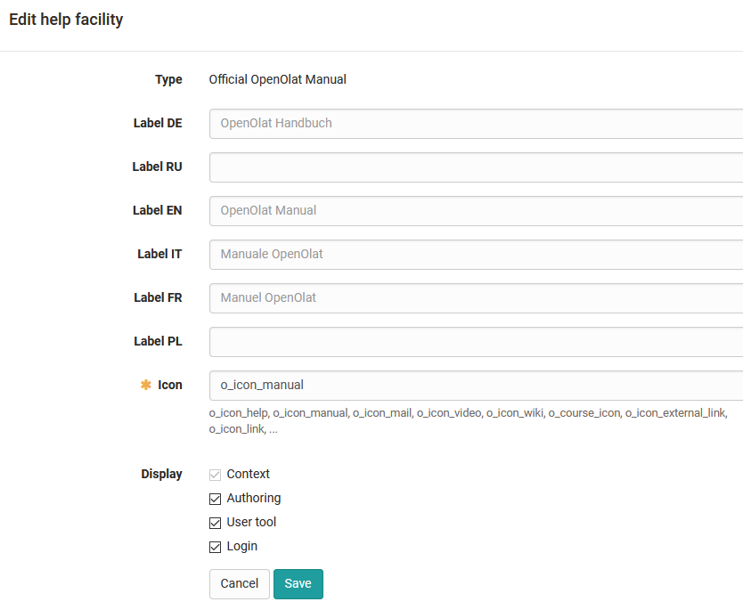
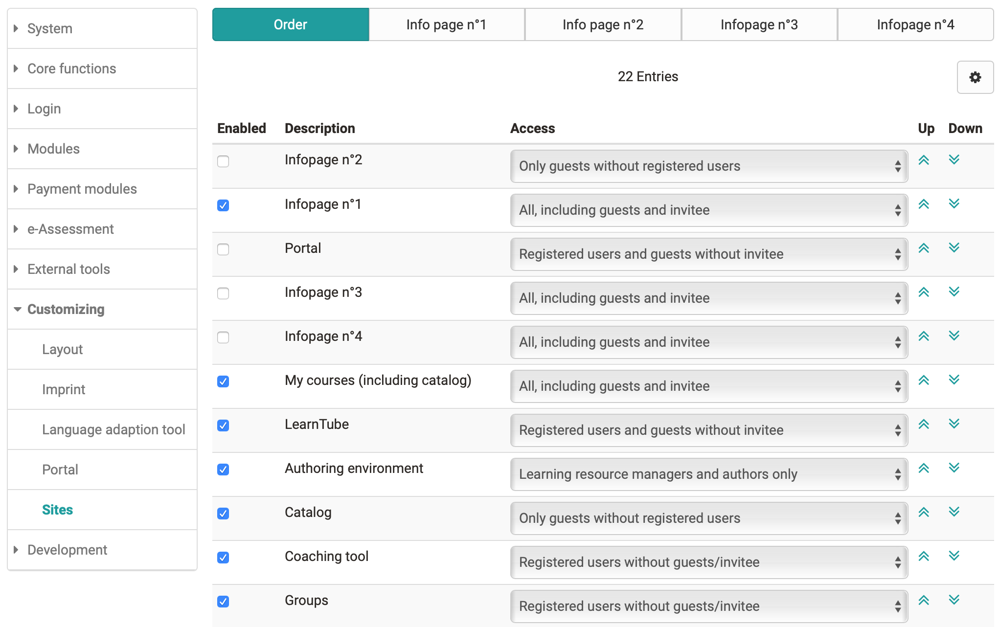

# Customizing

The "Customizing" menu contains settings regarding:

  * Layout
  * Imprint
  * Help
  * Language adaption tool
  * Portal
  * Sites

## Representation, layout

The system layout, a company logo and properties regarding the footer can be
stored here.

## Imprint

Activation and configuration of the imprint, also for different languages

## Help

Here you can define which help pages are provided via the help
icon  :fontawesome-solid-circle-question: in
the general menu. A link to the support contact form is also possible.

{ class="shadow lightbox" }

## Language adaptation tool

Individual text elements can be adjusted here if required.

## Portal

Settings for the tab "Home"

## Sites

Here you define which OpenOlat areas are made available system-wide and which
rights and role groups are granted access to each area.

If guests are to have access to courses either "Catalog" or "My Courses
(including Catalog)" has to be activated for guests.

If courses that are accessible for guests are to appear in the catalog, these
courses have to be added to the catalog. This can be done by the course owner,
the catalog administrator or the system administrator.

{ class="shadow lightbox" }

