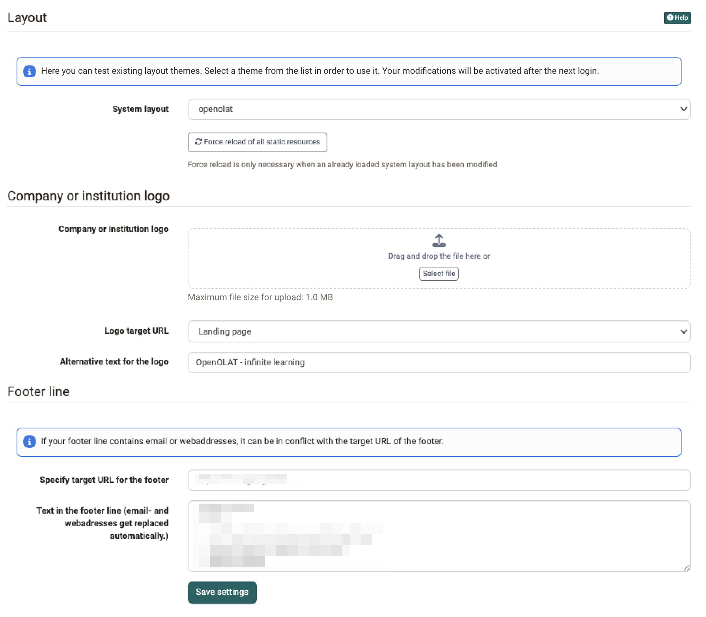
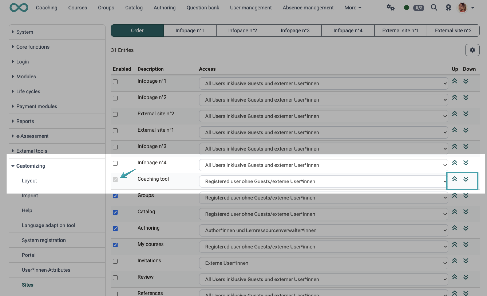
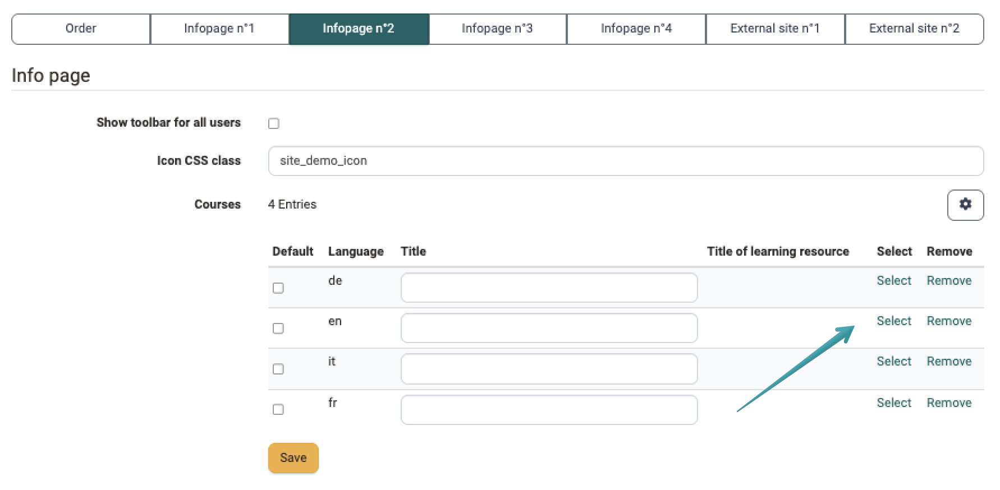
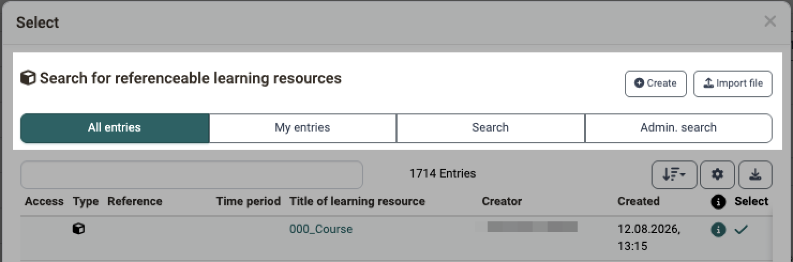

# Customizing

{ class="shadow lightbox aside-left-lg" }

The "Customizing" menu contains settings relating to the menu items listed here. You will find these settings in the system administration under: 
`Administration > Customizing`

---

## Representation, layout {: #layout}

{ class="shadow lightbox" }

### Section Layout

The system layout, a company logo and properties relating to the footer can be stored here.

The background image of the login page is part of the layout theme and cannot be configured in the system administration. It is customized through an individual theme. For hosted instances, please contact your provider.

### Company or Institution Logo Section [:octicons-tag-16:{ title="from Release 10.0 (OO-1167)" }](https://track.frentix.com/issue/OO-1167){:target="_blank"}

You can upload your own logo (PNG file), which will then appear in the top-left corner of the header. Please note that this logo will be used within the theme (overall layout). The OpenOlat logo is displayed by default.

You also define where a click on the logo leads: to the landing page or to a target URL of your choice. In the field for the alternative text, you enter the text that appears in place of the logo.

### Footer Properties Section

In this section, you define the text of the footer in the bottom-right corner and the target URL that a click on the footer leads to. Email and web addresses in the text are automatically converted into a clickable link.

[To the top of the page ^](#customizing)

## Imprint [:octicons-tag-16:{ title="from Release 10.0 (OO-1166)" }](https://track.frentix.com/issue/OO-1166){:target="_blank"} {: #imprint}

Administrators determine, 

* where the link to the legal notice appears (e.g., in the footer)
* whether a legal notice appears and what it says
* whether a text regarding the terms of use appears in the legal notice and what that text says
* whether a privacy policy appears within the legal notice and what the text says
* whether a contact form for general inquiries should be displayed and, if so, to whom the inquiry will be sent

All text can be entered in different languages.

{ class="shadow lightbox" }

[To the top of the page ^](#customizing)

## Help {: #help}

Here you can specify which help pages are displayed via the help icon :fontawesome-solid-circle-question: in the main menu. You can also include a link to the support contact form.

{ class="shadow lightbox" }

[To the top of the page ^](#customizing)

## Language adaptation tool {: #language_adaption_tool}

Individual text elements can be adjusted here if required.

[To the top of the page ^](#customizing)

## System registration {: #system_registration}

OpenOlat is open source and needs an active community of users. You too can be part of this community.

[To the top of the page ^](#customizing)

## Portal {: #portal}

Various portlets can be selected for the "Portal" tab.

!!! tip "Tip"
    We recommend not using this feature. It has been superseded by numerous modules in OpenOlat and is thus a historical remnant that nevertheless cannot simply be switched off. Thank you for your understanding.

[To the top of the page ^](#customizing)

## User properties {: #user_properties}

Administrators can use this feature to select the attributes displayed in user management and assign them to a display group.
In addition, the translations can be edited.

[To the top of the page ^](#customizing)

## Sites {: #sites}

### Tab Order

Sites/Sections correspond to the menu items (tabs) in the main menu at the top of the page, e.g. "Courses", "Groups", "Catalog", "Authoring" or "Coaching".

Administrators can specify which OpenOlat areas are displayed there and made available system-wide. The display in the main menu and access to these areas can be restricted to specific permission and role groups. Some entries in the list are named differently from the tab in the main menu, e.g. the entry "My courses" appears in the main menu as the tab "Courses".

Use the arrows on the right side to set the display order.

The "Coaching tool" entry cannot be deactivated [:octicons-tag-16:{ title="from Release 21.0.1 (OO-9661)" }](https://track.frentix.com/issue/OO-9661), as the Coaching tool is mandatory: the "Enabled" checkbox is greyed out. The display order and the access can still be adjusted.

{ class="shadow lightbox" }

### Other tabs

In the other tabs, you can add custom information pages that can be accessed via the main menu in the header. 
These can be external URLs as well as OpenOlat learning resources (e.g., courses that may consist of only one or a few pages).

{ class="shadow lightbox" }

For each language you store a separate title and a separate learning resource. With "Select" you open the search for the referenceable learning resource. There you connect the tab with a course.

{ class="shadow lightbox" }

[To the top of the page ^](#customizing)