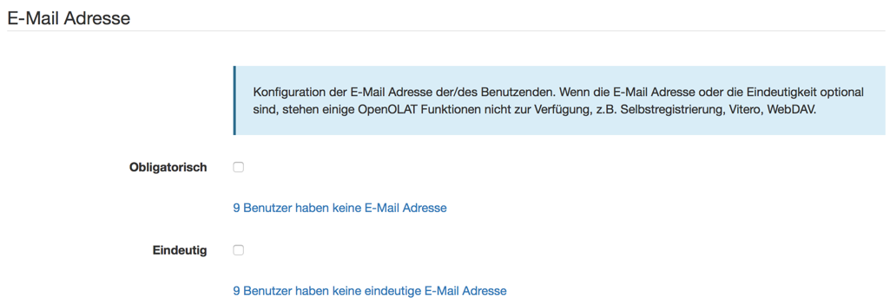

# E-Mail Einstellungen

Die E-Mail Einstellungen liegen in der System-Administration unter: `Administration > Core Konfiguration > E-Mail`. Die Seite hat zwei Segmente: "Einstellungen" mit den Vorgaben zur E-Mail-Adresse und zum OpenOlat Postfach, und "E-Mail Vorlage" mit dem Aussehen der versendeten E-Mails.

## E-Mail Adresse {: #email_address}

Im Abschnitt "E-Mail Adresse" definieren Sie, welche Einschränkungen für die E-Mail-Adresse der Benutzenden gelten. Unter jeder der beiden Optionen nennt ein Link die Anzahl der Konten ohne bzw. ohne eindeutige E-Mail-Adresse. Der Link öffnet die Liste dieser Konten in der Benutzerverwaltung.

{ class="shadow lightbox" }

### Obligatorisch

Wenn diese Option _nicht_ aktiviert ist, bedeutet dies, dass die E-Mail-Adresse für ein Konto optional ist. Dies führt jedoch zu Einschränkungen, da OpenOlat darauf ausgelegt ist, dass jede Person eine E-Mail-Adresse hinterlegt hat.
Folgende Einschränkungen treten auf (Liste nicht abschliessend):

  * Es werden keine realen E-Mails versendet.
  * Es werden keine Benachrichtigungen versendet.
  * Der Login mit der E-Mail-Adresse ist nicht möglich.
  * Das Passwort kann nicht zurückgesetzt werden.

### Eindeutig

Wenn diese Option nicht aktiviert ist, bedeutet dies, dass mehrere
Konten dieselbe E-Mail-Adresse haben können. Folgende Einschränkungen treten
auf (Liste nicht abschliessend):

  * Der Login mit der E-Mail-Adresse ist generell deaktiviert. Das heisst, es kann sich auf der ganzen Plattform niemand mehr mit der E-Mail-Adresse einloggen, nur noch mit dem Anmeldenamen. Dies gilt auch für Konten mit einer eindeutigen E-Mail-Adresse.
  * Bei Konten ohne eindeutige E-Mail-Adresse funktioniert das Zurücksetzen des Passworts nur noch über die Eingabe des Anmeldenamens, aber nicht mehr über die E-Mail-Adresse.

!!! warning "Achtung"

    In beiden Fällen können entweder keine oder keine eindeutigen E-Mails
    verschickt werden. Deshalb ist es zwingend empfohlen, das interne OpenOlat Postfach zu aktivieren! Ansonsten können unerwartete Fehler auftreten!

## E-Mail Postfach und Versand {: #e-mail-inbox-and-outbox}

OpenOlat verfügt über ein internes E-Mail-Postfach-System, das alle im System gesendeten und empfangenen E-Mails im persönlichen Postfach jeder Person auflistet: [Persönliche Werkzeuge: E-Mail](../../manual_user/personal_menu/E-Mail.de.md). Das E-Mail-Postfach in OpenOlat ist eine optionale Komponente.

### OpenOlat Postfach aktivieren

  * Ist das OpenOlat Postfach ausgeschaltet, so werden alle in OpenOlat erstellten E-Mails ausschliesslich an die persönliche E-Mail-Adresse versandt. Das OpenOlat Postfach ist in den persönlichen Werkzeugen nicht sichtbar.
  * Ist das OpenOlat Postfach eingeschaltet, so werden alle empfangenen und gesendeten E-Mails im persönlichen Postfach jeder Person aufgelistet.

Jede Person kann zudem in ihren persönlichen [Einstellungen](../../manual_user/personal_menu/Settings.de.md) festlegen, ob empfangene E-Mails nur intern oder auch an die persönliche E-Mail-Adresse zugestellt werden. Als Administrator:in legen Sie das Standardverhalten fest:

  * E-Mails an das interne OpenOlat Postfach zustellen
  * E-Mails an das interne OpenOlat Postfach und die persönliche E-Mail-Adresse zustellen

## E-Mail Vorlage {: #template}

OpenOlat versendet für verschiedene Ereignisse E-Mails. Um die E-Mails
attraktiver zu gestalten werden diese als HTML-Mails inklusive Formatierung versendet. Mit der E-Mail Vorlage passen Sie das allgemeine Aussehen der E-Mails an.

Die folgenden Variablen müssen in der Vorlage vorkommen:

  *  **$content**: Wird ersetzt mit dem eigentlichen Inhalt der E-Mail. Der Inhalt ist in der Regel an die Sprache des Empfängers angepasst.
  *  **$footer**: Wird ersetzt mit der generischen Fusszeile. Die Fusszeile ist an die Sprache des Empfängers angepasst und kann mit dem Sprachanpassungswerkzeug für jede Sprache angepasst werden. (vgl. footer.no.userdata und footer.with.userdata aus dem Paket org.olat.core.util.mail)

## E-Mail Signatur [:octicons-tag-16:{ title="ab Release 18.0 (OO-6616)" }](https://track.frentix.com/issue/OO-6616) {: #signature}

Mit der E-Mail Signatur hängt OpenOlat den persönlichen Text einer Person an das Ende der E-Mails, die diese Person aus OpenOlat heraus über ein E-Mail-Formular verschickt, zum Beispiel über den Kursbaustein E-Mail, den Kursbaustein Liste der Teilnehmer:innen oder die Mitgliederverwaltung. Der Text steht im Mailfenster am Ende der Nachricht und lässt sich dort vor dem Versand noch bearbeiten. Die Signatur erfasst jede Person selbst: [Persönliche Konfiguration: Profil](../../manual_user/personal_menu/Profile.de.md).

Damit das Feld für die Signatur im Profil erscheint, aktivieren Sie das Attribut "emailSignature" in der System-Administration unter: 
`Administration > Customizing > Benutzer:innen-Attribute`

**Schritt 1: Tab "Properties", Zeile "emailSignature" aktivieren**

    
Screen

	

**Schritt 2: Tab "Contexts", Kontext "org.olat.user.ProfileFormController" bearbeiten**

    
Screen

	

Im Kontext schalten Sie für "emailSignature" die Spalte "Verwenden" ein. Erst damit steht das Feld im Profil zur Verfügung.

    
Screen

	

Die empfohlene Einstellung:

{ class="shadow lightbox" }
