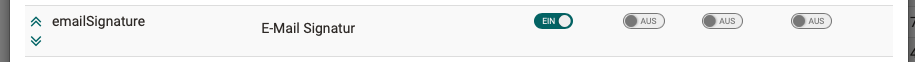

# E-Mail Einstellungen

Hier kann definiert werden, welche Einschränkungen Benutzer in Bezug auf die
E-Mail-Adresse haben.

### Obligatorisch

Wenn diese Option _nicht_ aktiviert ist, bedeutet dies, dass Benutzer keine
E-Mail-Adresse haben müssen. Dies führt jedoch zu Einschränkungen, da OpenOlat
darauf ausgelegt ist, dass jeder Benutzer eine E-Mail-Adresse hinterlegt hat.
Folgende Einschränkungen treten auf (Liste nicht abschliessend):

  * Es werden keine realen E-Mails versendet.
  * Es werden keine Benachrichtigungen versendet.
  * Der Login mit der E-Mail-Adresse ist nicht möglich.
  * Das Passwort kann nicht zurücksetzt werden.

### Eindeutig

Wenn diese Option nicht mehr aktiviert ist, bedeutet dies, dass mehrere
Benutzer dieselbe E-Mail-Adresse haben können. Folgende Einschränkungen treten
auf (Liste nicht abschliessend):

  * Der Login mit der E-Mail-Adresse ist generell deaktiviert. Das heisst, es kann sich auf der ganzen Plattform kein Benutzer mehr mit der E-Mail-Adresse einloggen, nur noch mit dem Benutzernamen. Dies gilt auch für diejenigen Benutzer, welche eine eindeutige E-Mail-Adresse besitzen. 
  * Benutzer ohne eindeutige E-Mail-Adresse können das Passwort nur noch über die Eingabe des Benutzernamens, aber nicht mehr über die E-Mail-Adresse zurücksetzen.

{ class="shadow lightbox" }

!!! warning "Warnung"

	In beiden Fällen können entweder keine oder keine eindeutigen E-Mails
	verschickt werden. Deshalb ist es zwingend empfohlen, das interne OpenOlat
	Postfach zu aktivieren! Ansonsten können unerwartete Fehler auftreten!

## E-Mail: Postfach und Versand

OpenOlat verfügt über ein internes E-Mail-Postfach-System, das alle in dem
System gesendeten und empfangenen E-Mails im Homebereich jedes Benutzers im
persönlichen Postfach auflistet. Das E-Mail-Postfach in OpenOlat ist eine
optionale Komponente.

### OpenOlat Postfach aktivieren:

  * Ist das OpenOlat Postfach ausgeschaltet, so werden alle in OpenOlat erstellten E-Mails ausschliesslich an die persönliche E-Mail-Adresse versandt. Das OpenOlat Postfach ist im Home nicht sichtbar.
  * Ist das OpenOlat Postfach eingeschaltet, so werden alle empfangenen und gesendeten E-Mails im Homebereich jedes Benutzers im persönlichen Postfach aufgelistet.

Jeder Benutzer kann zudem in den Systemeinstellungen konfigurieren, ob
empfangene E-Mails nur intern oder auch an die persönliche E-Mail-Adresse
zugestellt werden soll. Als Administrator können Sie das Standardverhalten
festlegen:

  * E-Mails an das interne OpenOlat Postfach zustellen
  * E-Mails an das interne OpenOlat Postfach und die persönliche E-Mail-Adresse zustellen  
  

##  Tab E-Mail-Vorlage {: #template}

OpenOlat versendet für verschiedene Ereignisse E-Mails. Um die E-Mails
attraktiver zu gestalten werden diese als HTML-Mails inklusive Formatierung
versendet. Mit der E-Mail-Vorlage können Sie das allgemeine Aussehen der
E-Mails anpassen.

Die folgenden Variablen müssen in der Vorlage vorkommen:

  *  **$content**: Wird ersetzt mit dem eigentlichen Inhalt der E-Mail. Der Inhalt ist in der Regel an die Sprache des Empfängers angepasst.
  *  **$footer**: Wird ersetzt mit der generischen Fusszeile. Die Fusszeile ist an die Sprache des Empfängers angepasst und kann mit dem Sprachanpassungswerkzeug für jede Sprache angepasst werden. (vgl. footer.no.userdata und footer.with.userdata aus dem Paket org.olat.core.util.mail)

## Signatur

Die Aktivierung der E-Mail-Signatur befindet sich unter folgendem Pfad: 
**Administration > Customizing > Benutzer:innen-Attribute**

**Schritt 1: Tab "Properties" > Zeile "emailSignature" aktivieren**

    
Screen

	

**Schritt 2: Tab "Contexts" > org.olat.user.ProfileFormController definieren**

    
Screen

	

    
Screen

	

Die empfohlene Einstellung:

{ class="shadow lightbox" }
