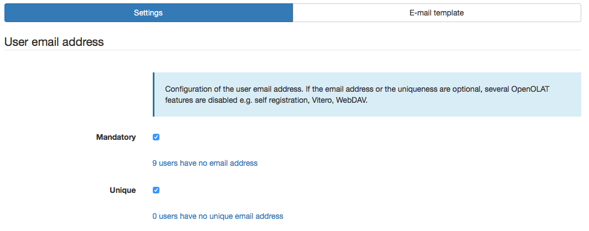
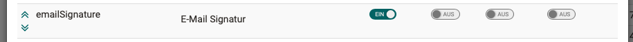

# E-Mail Settings

Here it can be defined which limitations a user has regarding the e-mail address.

### Mandatory

If this option is *not* activated, it means that a user does not need an e-mail address. However, this will lead to limitations, as OpenOlat is set up for users having an e-mail address. The following limitations can occur (list is not closing):

  * No real e-mails will be sent.
  * No notifications will be sent.
  * Login with e-mail address is not possible.
  * Password cannot be reset.

### Unique

If this option is not activated, it means, that several users can have the same e-mail address. However, this will lead to limitations, as OpenOlat is set up for users having an e-mail address. The following limitations can occur (list is not closing):

  * Login with e-mail address is deactivated in general. This means that any user cannot login with the e-mail address, but only with the username. This is also valid for users who possess a unique e-mail address. 
  * Users without a unique e-mail address can reset their password only by inserting the username, but not the e-mail address.

{ class="shadow lightbox" }

!!! warning "Warning"

	In both cases there can either no or no unique e-mail be sent. Therefore we recommend compulsory to activate the internal OpenOlat inbox! Otherwise unexpected errors may occur!

  

## E-mail inbox and outbox

OLAT has an internal e-mail inbox system that lists all sent and received
e-mails of each user in his personal home area. The OLAT e-mail inbox system
is an optional component.

### Enable your OLAT e-mail inbox:

  * If the OLAT inbox system is disabled, all OLAT e-mails will be sent exclusively to the personal e-mail address. The OLAT inbox is not visible in the home area with this configuration.
  * If the OLAT inbox system is enabled, all received and sent e-mails will be listed in the users personal inbox.

In addition, each user can configure in his preferences wether he wants to
receive mails from OLAT to his personal e-mail address or if he prefers to
read the mail within OLAT. As administrator you can define the default
behavior.

  * Send e-mails to the internal OLAT inbox
  * Send e-Mails to the internal OLAT inbox and the personal e-mail address

  
##  E-mail template {: #template}

OpenOlat is sending e-mails for various events. To make the e-mails look more
attractive, those e-mails are sent as HTML mails including formatting. Using
the e-mail template you can modify the general appearance of all e-mails.

The following variable have to be in the template:

  *  **$content**: Is replaced with the actual content of the e-mail. The content is normally written in the recipients language.
  *  **$footer**: Is replaced with the generic footer line. The footer is written in the recipients language and can be modified using the language adaption tool for each language (see footer.no.userdata and footer.with.userdata from package org.olat.core.util.mail)

  ## Signatur

The activation of the e-mail signature can be found under the following path: 
**Administration > Customizing > User attributes**

**Step 1: Tab "Properties" > Activate column "emailSignature"**

    
Screen

	

**Step 2: Tab "Contexts" > Define org.olat.user.ProfileFormController**

    
Screen

	

    
Screen

	

The recommended setting:

{ class="shadow lightbox" }

