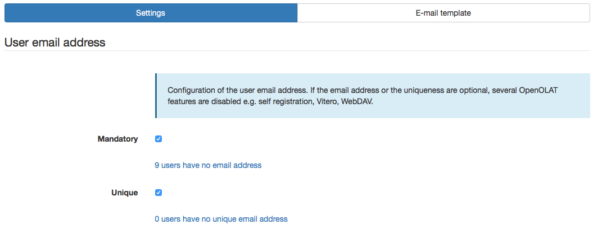
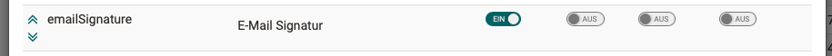

# Email Settings

Here it can be defined which limitations a user has regarding the email address.

### Mandatory

If this option is *not* activated, it means that a user does not need an email address. However, this will lead to limitations, as OpenOlat is set up for users having an email address. The following limitations can occur (list is not closing):

  * No real emails will be sent.
  * No notifications will be sent.
  * Login with email address is not possible.
  * Password cannot be reset.

### Unique

If this option is not activated, it means, that several users can have the same email address. However, this will lead to limitations, as OpenOlat is set up for users having an email address. The following limitations can occur (list is not closing):

  * Login with email address is deactivated in general. This means that any user cannot login with the email address, but only with the username. This is also valid for users who possess a unique email address. 
  * Users without a unique email address can reset their password only by inserting the username, but not the email address.

{ class="shadow lightbox" }

!!! warning "Warning"

	In both cases there can either no or no unique email be sent. Therefore we recommend compulsory to activate the internal OpenOlat inbox! Otherwise unexpected errors may occur!

  

## Email inbox and outbox

OLAT has an internal email inbox system that lists all sent and received
emails of each user in his personal home area. The OLAT email inbox system
is an optional component.

### Enable your OLAT email inbox:

  * If the OLAT inbox system is disabled, all OLAT emails will be sent exclusively to the personal email address. The OLAT inbox is not visible in the home area with this configuration.
  * If the OLAT inbox system is enabled, all received and sent emails will be listed in the users personal inbox.

In addition, each user can configure in his preferences wether he wants to
receive emails from OLAT to his personal email address or if he prefers to
read the email within OLAT. As administrator you can define the default
behavior.

  * Send emails to the internal OLAT inbox
  * Send emails to the internal OLAT inbox and the personal email address

  
##  Email template {: #template}

OpenOlat is sending emails for various events. To make the emails look more
attractive, those emails are sent as HTML emails including formatting. Using
the email template you can modify the general appearance of all emails.

The following variable have to be in the template:

  *  **$content**: Is replaced with the actual content of the email. The content is normally written in the recipients language.
  *  **$footer**: Is replaced with the generic footer line. The footer is written in the recipients language and can be modified using the language adaption tool for each language (see footer.no.userdata and footer.with.userdata from package org.olat.core.util.mail)

  ## Signatur

The activation of the email signature can be found under the following path: 
**Administration > Customizing > User attributes**

**Step 1: Tab "Properties" > Activate column "emailSignature"**

    
Screen

	

**Step 2: Tab "Contexts" > Define org.olat.user.ProfileFormController**

    
Screen

	

    
Screen

	

The recommended setting:

{ class="shadow lightbox" }

