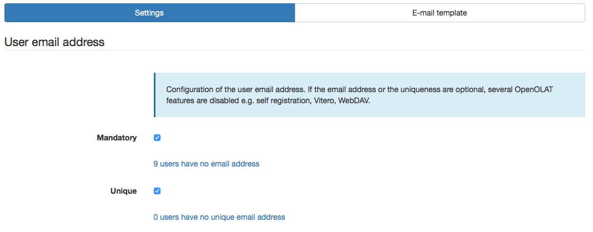
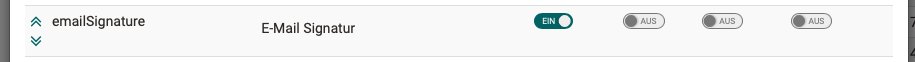

# Email Settings

The email settings are located in the system administration under: `Administration > Core functions > E-mail`. The page has two segments: "Settings" with the specifications for the email address and the OpenOlat inbox, and "E-mail template" with the appearance of the emails sent.

## User email address {: #email_address}

In the section "User email address" you define which limitations apply to the email address of the users. Below each of the two options, a link states the number of accounts without an email address or without a unique one. The link opens the list of these accounts in the user management.

{ class="shadow lightbox" }

### Mandatory

If this option is *not* activated, it means that the email address is optional for an account. However, this will lead to limitations, as OpenOlat is set up for every person having an email address. The following limitations occur (list is not exhaustive):

  * No real emails are sent.
  * No notifications are sent.
  * Login with the email address is not possible.
  * The password cannot be reset.

### Unique

If this option is not activated, it means that several accounts can have the
same email address. The following limitations occur (list is not exhaustive):

  * Login with the email address is deactivated in general. This means that nobody on the whole platform can log in with the email address any more, only with the username. This also applies to accounts with a unique email address.
  * For accounts without a unique email address, resetting the password only works by entering the username, no longer by the email address.

!!! warning "Attention"

    In both cases either no emails or no unique emails can be sent.
    Therefore we strongly recommend activating the internal OpenOlat inbox! Otherwise unexpected errors may occur!

## E-mail inbox and outbox {: #e-mail-inbox-and-outbox}

OpenOlat has an internal email inbox system that lists all emails sent and received within the system in the personal inbox of each person: [Personal tools: E-Mail](../../manual_user/personal_menu/E-Mail.md). The email inbox in OpenOlat is an optional component.

### Enable the OpenOlat inbox

  * If the OpenOlat inbox is switched off, all emails created in OpenOlat are sent exclusively to the personal email address. The OpenOlat inbox is not visible in the personal tools.
  * If the OpenOlat inbox is switched on, all received and sent emails are listed in the personal inbox of each person.

In addition, every person can define in their personal [settings](../../manual_user/personal_menu/Settings.md) whether received emails are delivered internally only or also to the personal email address. As an administrator you define the default behaviour:

  * Send emails to the internal OpenOlat inbox
  * Send emails to the internal OpenOlat inbox and the personal email address

## E-mail template {: #template}

OpenOlat sends emails for various events. To make the emails look more
attractive, they are sent as HTML emails including formatting. Using the email template you modify the general appearance of the emails.

The following variables have to be in the template:

  *  **$content**: Is replaced with the actual content of the email. The content is usually adapted to the language of the recipient.
  *  **$footer**: Is replaced with the generic footer. The footer is adapted to the language of the recipient and can be modified for each language with the language adaptation tool. (see footer.no.userdata and footer.with.userdata from the package org.olat.core.util.mail)

## E-Mail signature [:octicons-tag-16:{ title="from Release 18.0 (OO-6616)" }](https://track.frentix.com/issue/OO-6616) {: #signature}

With the E-Mail signature, OpenOlat appends the personal text of a person to the end of the emails that this person sends from OpenOlat via an email form, for example via the course element E-mail, the course element Participant list or the member management. The text sits at the end of the message in the mail window, where it can still be edited before sending. Every person enters their signature themselves: [Profile](../../manual_user/personal_menu/Profile.md).

For the signature field to appear in the profile, activate the attribute "emailSignature" in the system administration under: 
`Administration > Customizing > User Properties`

**Step 1: Tab "Properties", activate the row "emailSignature"**

    
Screen

	

**Step 2: Tab "Contexts", edit the context "org.olat.user.ProfileFormController"**

    
Screen

	

In the context, switch on the column "include" for "emailSignature". Only then is the field available in the profile.

    
Screen

	

The recommended setting:

{ class="shadow lightbox" }
