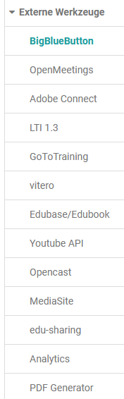

# Externe Werkzeuge - Administration

In diesem Bereich können die OpenOlat Administratoren diverse externe Tools
ein- und ausschalten und je nach Tool bestimmte Basiseinstellungen, die
systemweit gelten, einrichten. Zu den Tools gehören mehrere virtuelle
Klassenzimmer sowie Dokumenten Tools, Analyse Werkzeuge und ein PDF Generator.

## BigBlueButton

[Administrative Konfiguration ](BigBlueButton_module.de.md)von BigBlueButton

## OpenMeetings

In der OpenOlat Systemadministration können Sie das OpenMeetings-Modul
konfigurieren und die Funktionalität freischalten. Um das OpenMeetings-Modul
zu konfigurieren, geben Sie in im Tab "Konfiguration" die URL des
OpenMeetings-Servers, sowie den zuvor in OpenMeetings angelegten Benutzernamen
des Webservices und das zugehörige Passwort ein.  Speichern Sie die Daten
anschließend und drücken Sie die Schaltfläche "Serververbindung testen" um die
Verbindungsdaten zu überprüfen.

Wenn das Modul eingeschaltet und die Verbindungsparameter zum OpenMeetings-
Server korrekt sind, können in OpenOlat an den folgenden Stellen OpenMeetings-
Räume erzeugt und genutzt werden:

  * In Kursen mit dem Kursbaustein OpenMeetings. Jeder Kursbaustein erzeugt einen entsprechenden Raum auf dem OpenMeetings-Server.
  * In Gruppen mit dem Gruppenwerkzeug OpenMeetings. Jede Gruppe hat ihren eigenen OpenMeetings-Raum zur Verfügung der wie alle anderen Gruppenwerkzeuge verwendet werden kann.

Im Tab "Räume" erhalten Administratoren einen Überblick über die in OpenOlat
angelegten OpenMeetings Räume.

  

## Adobe Connect

Aktivierung und Konfiguration von Adobe Connect, sofern Lizenz vorhanden

## LTI 1.3

Hier kann LTI 1.3 aktiviert und näher konfiguriert werden z.B. können externe
LTI Plattformen und Tools verbunden werden.

Diese LTI Version befindet sich aktuell in der Versuchsphase.

## GoToTraining

Aktivierung und Konfiguration sofern Lizenz vorhanden

## vitero

Um die vitero Anbindung nutzen zu können müssen Sie über eine vitero Lizenz
verfügen und in der Administrationsumgebung folgende Einstellungen vornehmen:

Es muss eine gültige vitero Lizenz vorhanden sein und in der
Administrationsumgebung die Zugangsdaten für das Web Service API eingetragen
werden.

Unter "Zeitzone OLAT Server" können Sie die Zeitzone Ihres OLAT Systems
einstellen. Dies ist notwendig um die Zeiten der Termine mit dem vitero System
abzugleichen.

Die folgenden Angaben erhalten Sie von Ihrem vitero oder OLAT Administrator:
"URL vitero Server", "Web Service Benutzername", "Web Service Passwort" und
"Kundenidentifikator".

Nach erfolgter Eingabe wählen Sie die Schaltfläche "Serververbindung testen"
um die Konfiguration und die Verbindung zum vitero Server zu prüfen. Danach
können Sie die Konfiguration speichern und vitero in Ihren in Ihren Kursen
nutzen.

Bitte beachten Sie, dass für die OpenOlat Anbindung auf dem vitero Server
automatisch Benutzerkonten eingerichtet werden. Allfällige bereits bestehende
Benutzerkonten und Termine werden nicht berücksichtigt.

## Edubase/Edubook

Aktivierung und Konfiguration sofern Lizenz vorhanden

## Youtube API

Eingabe, Entfernung oder Prüfen des API Schlüssels

## Opencast

Aktivierung und Konfiguration sofern Lizenz vorhanden

## MediaSite

Aktivierung von MediaSite. MediaSite ist eine automatisierte Videoplattform
für Videoaufzeichnung, Videomanagement und Untertitelung. Das OpenOlat
Mediasite-Modul ermöglicht es Ihnen, MediaSite-Inhalte als Einzelpräsentation,
Kanal oder Modul in Kurse zu integrieren. Weitere Informationen finden Sie in
der Dokumentation von [MediaSite](https://mediasite.com/).

## edu-sharing

Edu-sharing ist eine Software, um Lernplattformen miteinander zu vernetzen, um
Lerninhalte, Metadaten und Tools auszutauschen und in einer Bildungscloud
auffindbar und in allen angeschlossenen Systemen nutzbar zu machen. In der
Administration kann das Modul generell aktiviert und die Nutzung von edu-
sharing als Kursbaustein freigeschaltet werden.

Die Konfiguration erfolgt in vier Schritten:  
1\. Konfigurationswerte eingeben und speichern.  
2\. Schlüssel generieren und speichern.  
3\. Öffentlicher Schlüssel des edu-sharing Repository importieren und
speichern.  
4\. In edu-sharing: OpenOlat als Applikation anbinden. URL mit Metadaten:
<https://testing.frentix.com/test8/edusharing/metadata>

Weitere Information sind auf der [Webseite](https://edu-sharing.com/) von edu-
sharing zu finden.

## Analytics

Möglichkeit, externe Analyse Services zu aktivieren.

## PDF Generator

Aktivierung des PDF Generators. [AthenaPDF](https://www.athenapdf.com) ist ein
PDF Generator der auf Electron und Docker basiert. Diese Implementation
benutzt den Micro Service Variant. Mehr Informationen finden Sie unter
[AthenaPDF](https://www.athenapdf.com) und
[GitHub](https://github.com/arachnys/athenapdf/tree/master/weaver).

  

