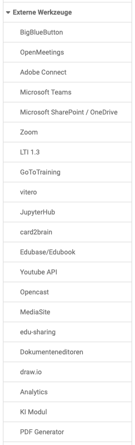

# External Tools: Overview

{ class="shadow lightbox aside-left-lg" }

In this area, the OpenOlat administrators can switch various external tools on and off (e.g. several virtual classrooms) and, depending on the tool, configure certain basic settings that apply system-wide.

## BigBlueButton {: #bbb}

To enable web conferences with BigBlueButton in OpenOlat, BBB must be activated and configured in the administration.
 
[See the details >](BigBlueButton_module.md) 
[View more details >](BigBlueButton_module.md)

## OpenMeetings {: #openmeetings}

OpenMeetings is a solution for web conferences.

In the OpenOlat system administration you can configure the OpenMeetings
module and activate the functionality. To configure the OpenMeetings module,
enter the URL of the OpenMeetings server in the tab "Configuration", as well
as the username of the web service previously created in OpenMeetings and the
corresponding password. Then save the data and press the "Check the
connection" button to check the connection data.

If the module is switched on and the connection parameters to the OpenMeetings
server are correct, OpenOlat can create and use OpenMeetings rooms in the
following locations:

  * In courses with the course element OpenMeetings. Each course element creates a corresponding room on the OpenMeetings server.
  * In groups with the OpenMeetings group tool. Each group has its own OpenMeetings room that can be used like any other group tool.

The tab "Rooms" gives administrators an overview of the OpenMeetings rooms created in OpenOlat.
  
[To the top of the page ^](#ext_tools)

## Adobe Connect {: #adobe_connect}

Adobe Connect is the web conferencing solution from the Adobe product line.

Activation and configuration can be carried out if the required licenses are available.

[To the top of the page ^](#ext_tools)

## Microsoft Teams {: #_microsoft_teams}

Activation and configuration can be carried out if the required licenses are available.

[To the top of the page ^](#ext_tools)

## Microsoft SharePoint / OneDrive {: #microsoft_sharepoint}

To enable writing and copying files to and from SharePoint and OneDrive in the OpenOlat File Hub and OpenOlat Media Center, these two tools must be activated. (They can be activated individually).

The prerequisite is that the required licenses are available.

[View more details >](SharePoint_OneDrive.md)
[To the top of the page ^](#ext_tools)

## Zoom {: #zoom}

To enable Zoom meetings in OpenOlat, Zoom must be activated and configured in the administration. 

[View more details >](Zoom.md)
[To the top of the page ^](#ext_tools)

## LTI 1.3 {: #lti}

Here LTI 1.3 can be activated and configured in more detail e.g. external LTI platforms and tools can be connected.

[Further details >](LTI_Integrations.md)
[To the top of the page ^](#ext_tools)

## GoToTraining {: #go_to_training}

GoToTraining is a virtual training platform.

Activation and configuration can be carried out if the required licenses are available.

[Website GoToTraining](https://www.goto.de/training)
[To the top of the page ^](#ext_tools)

## vitero {: #vitero}

Vitero is a tool for holding web conferences and online meetings.

In order to use the vitero connection, you must have a vitero license and make
the following settings in the administration environment:

A valid vitero license must exist and the access data for the Web Service API
must be entered in the administration environment.

Under "Time Zone OLAT Server" you can set the time zone of your OpenOlat system.
This is necessary to synchronize the times of the appointments with the vitero
system.

You will receive the following information from your vitero or OpenOlat administrator: "URL vitero server", "Web service username", "Web service password" and "Customer identifier".

Once you have entered the password, select the "Test server connection" button to check the configuration and the connection to the vitero server. Then you can save the configuration and use vitero in your courses.

Please note that user accounts are automatically created for the OLAT connection on the vitero server. Any existing user accounts and appointments will not be considered.

[Website vitero](https://www.vitero.com/)
[To the top of the page ^](#ext_tools)

## JupyterHub {: #jupyter}

JupyterHub is used to provide Jupyter images for learners.

[User manual: Course element JupyterHub](../../manual_user/learningresources/Course_Element_JupyterHub.md)
[To the top of the page ^](#ext_tools)

## card2brain {: #card2brain}

card2brain is a software for learning with a flashcard system.

Activation and configuration can be carried out if the required licenses are available.

[Website card2brain](https://card2brain.ch/de)
[To the top of the page ^](#ext_tools)

## Edubase/Edubook {: #edubase}

Edubase is an e-book platform.

Activation and configuration can be carried out if the required licenses are available.

[Website Edubase](https://www.edubase.ch)
[To the top of the page ^](#ext_tools)

## YouTube API {: #youtube_api}

Enter, remove or check API key.

[To the top of the page ^](#ext_tools)

## Opencast {: #opencast}

Opencast is an open source software for planning, recording and publishing audiovisual learning content, especially for the recording and distribution of courses.

After activation, the API and LTI configuration can be carried out. BigBlueButton recordings from OpenOlat can also be used.

[To the top of the page ^](#ext_tools)

## MediaSite {: #mediasite}

Activation of MediaSite. MediaSite is an automated video platform for video
recording, video management and subtitling. The OpenOlat Mediasite module
allows you to integrate MediaSite content into courses as a single presentation, channel, or module. 

[Documentation for MediaSite](https://mediasite.com/)
[To the top of the page ^](#ext_tools)

## edu-sharing {: #edusharing}

Edu-sharing is a software for networking learning platforms, exchanging
learning content, metadata and tools and making them searchable in an
education cloud and usable in all connected systems. In the administration the
module can be activated in general and the use of edu-sharing as course
element can be enabled.

Configuration takes place in four steps:  
1. Enter and save configuration values.  
2. Generate and save keys.  
3. Import and save the edu-sharing repositoiry public key.  
4. In edu-sharing: Connect OpenOlat as an application. URL with metadata: 

	https://your.openolat.domain/olat/edusharing/metadata

[Website edu-sharing](https://edu-sharing.com/)
[To the top of the page ^](#ext_tools)

## Document editors {: #dokumenteneditoren}

Various tools can be used in OpenOlat to edit Office documents:

* ONLYOFFICE
* Microsoft Office

The prerequisite in each case is that the necessary licenses are available.

[To the top of the page ^](#ext_tools)

## draw.io  {: #draw_io}

draw.io is an online tool for creating diagrams that can be used in many places in OpenOlat, e.g. in projects, in the portfolio, in the course element "Document", in the Media Center and in many other places where new documents can be created. In draw.io, several people can also work together on one diagram. To use draw.io, the function must be set up in the administration.

[Website draw.io](https://www.drawio.com)
[To the top of the page ^](#ext_tools)

## Analytics {: #analytics}

Possibility to activate external analytics services., e.g. Google Analytics.

[To the top of the page ^](#ext_tools)

## KI Modul {: #ki_modul}

This is where you activate and configure the artificial intelligence tools that can be integrated into OpenOlat. 

[To the top of the page ^](#ext_tools)

## PDF Generator {: #pdf_generator}

In OpenOlat PDFs can be created in various places, e.g. certificates, test results, member lists or similar. 
These functions are only available if one of the PDF services below is configured. 

### Gotenberg (recommended) {: #gotenberg}

Gotenberg is a PDF Generator based on Google Chrome or Chromium, and it is docker based.

More information on Gotenberg can be found at [Gotenberg](https://gotenberg.dev/docs/getting-started/introduction) and [GitHub](https://github.com/gotenberg/gotenberg).

To learn more about how to install and configure the Gotenberg service please visit the [installation manual](../installation/gotenbergPdf.md).

### Athena PDF (outdated) {: #athena}

[AthenaPDF](https://www.athenapdf.com) is a PDF generator based on Electron and Docker. This implementation uses the
Variant micro service. 

More information on AthenaPDF can be found at
[GitHub](https://github.com/arachnys/athenapdf/tree/master/weaver).

To learn more about how to install and configure the AthenaPDF service please visit
the [installation manual](../installation/athenaPdf.md). 

[To the top of the page ^](#ext_tools)