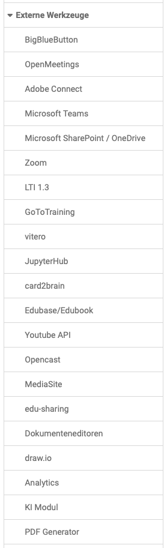

# External Tools: Overview {: #ext_tools}

{ class="shadow lightbox aside-left-lg" }

In this area, the OpenOlat administrators switch various external tools on and off (e.g. several virtual classrooms) and, depending on the tool, configure certain basic settings that apply system-wide. The area is located in the system administration under: `Administration > External tools`

## BigBlueButton {: #bbb}

BigBlueButton is software that enables online conferences or can serve as a virtual classroom.
To enable web conferences with BigBlueButton in OpenOlat, BBB must be activated and configured under `Administration > External tools > BigBlueButton`.

[See the details >](BigBlueButton_module.md) 
[To the top of the page ^](#ext_tools)

## OpenMeetings [:octicons-tag-16:{ title="from Release 8.3.0 (OO-406)" }](https://track.frentix.com/issue/OO-406){:target="_blank"} {: #openmeetings}

OpenMeetings is a solution for web conferences.

In the system administration you configure the OpenMeetings module and activate the functionality, under: 
`Administration > External tools > OpenMeetings`

In the tab "Configuration", enter the "URL OpenMeetings Server", as well as the "Web Service username" previously created in OpenMeetings and the corresponding "Web Service password". Then save the data and press the "Check the connection" button to check the connection data.

If the module is switched on and the connection parameters to the OpenMeetings server are correct, OpenOlat can create and use OpenMeetings rooms in the following locations:

  * In courses with the course element OpenMeetings. Each course element creates a corresponding room on the OpenMeetings server.
  * In groups with the OpenMeetings group tool. Each group has its own OpenMeetings room that can be used like any other group tool.

In the tab "Rooms", administrators get an overview of the OpenMeetings rooms created in OpenOlat.

[To the top of the page ^](#ext_tools)

## Adobe Connect [:octicons-tag-16:{ title="from Release 14.0 (OO-3887)" }](https://track.frentix.com/issue/OO-3887){:target="_blank"} {: #adobe_connect}

Adobe Connect is the web conferencing solution from the Adobe product line.

Activation and configuration can be carried out if the required licenses are available.

[To the top of the page ^](#ext_tools)

## Microsoft Teams [:octicons-tag-16:{ title="from Release 15.4 (OO-5124)" }](https://track.frentix.com/issue/OO-5124){:target="_blank"} {: #_microsoft_teams}

Microsoft Teams is the web conferencing solution from Microsoft. After activation, authors can use the [course element "Microsoft Teams"](../../manual_user/learningresources/Course_Element_Microsoft_Teams.md) in their courses.

**Prerequisites for activation:**

* A Microsoft 365 tenant (Microsoft Entra ID or Azure) with the required Microsoft Teams licenses.
* The access data for the tenant (Application (client) ID, Client secret, Tenant GUID) is stored at server level in the OpenOlat configuration. For hosted instances, this is done by the frentix support.

**Prerequisites for use:**

* Users log in to OpenOlat with the Microsoft account of their organisation (Azure login). This is a prerequisite for opening meetings: OpenOlat creates the online meetings via the Microsoft Graph API on behalf of the logged-in person.

**Configuration in the system administration** under: 
`Administration > External tools > Microsoft Teams`

* Activate the module "Microsoft Teams".
* Under "Activate for", define where Microsoft Teams may be used: course element "Microsoft Teams", course events, course element "Appointment scheduling", groups and supervisor chat.

In addition, the tabs "Online-meetings" (overview of all meetings of the instance) and "Calendar" (room bookings) are available there.

How the roles Organizer, Presenter and Attendee are assigned in a Teams meeting and what the moderator setting does is described in the user manual in the section [Roles in MS Teams](../../manual_user/learningresources/Course_Element_Microsoft_Teams.md#teams_roles).

[To the top of the page ^](#ext_tools)

## Microsoft SharePoint / OneDrive [:octicons-tag-16:{ title="from Release 19.0.0 (OO-7510)" }](https://track.frentix.com/issue/OO-7510){:target="_blank"} {: #microsoft_sharepoint}

To enable writing and copying files to and from SharePoint and OneDrive in the OpenOlat File Hub and OpenOlat Media Center, these two tools must be activated under `Administration > External tools > Microsoft SharePoint / OneDrive`. (They can be activated individually).

The prerequisite is that the required licenses are available.

[See the details >](SharePoint_OneDrive.md) 
[To the top of the page ^](#ext_tools)

## Zoom [:octicons-tag-16:{ title="from Release 17.0.0 (OO-6187)" }](https://track.frentix.com/issue/OO-6187){:target="_blank"} {: #zoom}

Zoom is software that can be used to hold video conferences, meetings, and webinars.
To enable Zoom meetings in OpenOlat, Zoom must be activated and configured under `Administration > External tools > Zoom`.

[See the details >](Zoom.md) 
[To the top of the page ^](#ext_tools)

## LTI 1.3 [:octicons-tag-16:{ title="from Release 15.5.0 (OO-5205)" }](https://track.frentix.com/issue/OO-5205){:target="_blank"} {: #lti}

In the system administration you activate and configure LTI 1.3 under: 
`Administration > External tools > LTI`

This allows e.g. external LTI platforms and tools to be connected.

[See the details >](LTI_Integrations.md) 
[To the top of the page ^](#ext_tools)

## GoToTraining [:octicons-tag-16:{ title="from Release 10.5 (OO-1944)" }](https://track.frentix.com/issue/OO-1944){:target="_blank"} {: #go_to_training}

GoToTraining is a virtual training platform.

Activation and configuration can be carried out if the required licenses are available.

[Website GoToTraining >](https://www.goto.de/training) 
[To the top of the page ^](#ext_tools)

## vitero {: #vitero}

Vitero is a tool for holding web conferences and online meetings.

To use the vitero connection, you must have a valid vitero license and enter the
access data for the Web Service API in the system administration, under: 
`Administration > External tools > vitero`

You receive the following information from your vitero or OpenOlat administrators: "URL vitero server", "Web service username", "Web service password" and "Client identifier".

Under "Time Zone OLAT server" you set the time zone of your OpenOlat system. This is necessary to synchronize the times of the appointments with the vitero system.

Once you have entered the data, select the "Test server connection" button to check the configuration and the connection to the vitero server. Then you save the configuration and use vitero in your courses.

Please note that user accounts are automatically created for the OpenOlat connection on the vitero server. Any existing user accounts and appointments will not be considered.

[Website vitero >](https://www.vitero.com/) 
[To the top of the page ^](#ext_tools)

## JupyterHub [:octicons-tag-16:{ title="from Release 18.0.0 (OO-6901)" }](https://track.frentix.com/issue/OO-6901){:target="_blank"} {: #jupyter}

JupyterHub is used to provide Jupyter images for learners.

[User manual: Course element JupyterHub >](../../manual_user/learningresources/Course_Element_JupyterHub.md) 
[To the top of the page ^](#ext_tools)

## card2brain [:octicons-tag-16:{ title="from Release 11.5 (OO-2699)" }](https://track.frentix.com/issue/OO-2699){:target="_blank"} {: #card2brain}

card2brain is a software for learning with a flashcard system.

Activation and configuration can be carried out if the required licenses are available.

[Website card2brain >](https://card2brain.ch/de) 
[To the top of the page ^](#ext_tools)

## Edubase/Edubook [:octicons-tag-16:{ title="from Release 12.2 (OO-2916)" }](https://track.frentix.com/issue/OO-2916){:target="_blank"} {: #edubase}

Edubase is an e-book platform.

Activation and configuration can be carried out if the required licenses are available.

[Website Edubase >](https://www.edubase.ch) 
[To the top of the page ^](#ext_tools)

## YouTube API [:octicons-tag-16:{ title="from Release 14.1 (OO-4086)" }](https://track.frentix.com/issue/OO-4086){:target="_blank"} {: #youtube_api}

Enter, remove or check the API key. The key is used to automatically import metadata such as title, description and license when embedding YouTube videos.

[To the top of the page ^](#ext_tools)

## Opencast [:octicons-tag-16:{ title="from Release 15.2 (OO-4836)" }](https://track.frentix.com/issue/OO-4836){:target="_blank"} {: #opencast}

Opencast is an open source software for planning, recording and publishing audiovisual learning content, especially for the recording and distribution of courses.

After activation, the API and LTI configuration can be carried out. BigBlueButton recordings from OpenOlat can also be used.

[To the top of the page ^](#ext_tools)

## MediaSite [:octicons-tag-16:{ title="from Release 16.0.4 (OO-5492)" }](https://track.frentix.com/issue/OO-5492){:target="_blank"} {: #mediasite}

Activation of MediaSite. MediaSite is an automated video platform for video
recording, video management and subtitling. The OpenOlat Mediasite module
allows you to integrate MediaSite content into courses as a single presentation, channel, or module.

The MediaSite module can be connected to the MediaSite server via LTI 1.1 or LTI 1.3 [:octicons-tag-16:{ title="from Release 21.0 (OO-9291)" }](https://track.frentix.com/issue/OO-9291){:target="_blank"}. For LTI 1.3, select version 1.3 in the **LTI version** field and enter the **LTI 1.3 Client ID** and **LTI 1.3 Deployment ID** fields as well as the endpoint URLs required by the MediaSite server. Connections via LTI 1.1 remain usable unchanged.

[Documentation for MediaSite >](https://mediasite.com/) 
[To the top of the page ^](#ext_tools)

## edu-sharing {: #edusharing}

Edu-sharing is a software for networking learning platforms, exchanging
learning content, metadata and tools and making them searchable in an
education cloud and usable in all connected systems. In the system
administration you activate the module in general and enable the use of
edu-sharing as a course element, under: 
`Administration > External tools > edu-sharing`

Configuration takes place in four steps:

1. Enter and save configuration values.
2. Generate and save keys.
3. Import and save the public key of the edu-sharing repository.
4. In edu-sharing: Connect OpenOlat as an application. URL with metadata:

	https://your.openolat.domain/olat/edusharing/metadata

[Website edu-sharing >](https://edu-sharing.com/) 
[To the top of the page ^](#ext_tools)

## Document editors [:octicons-tag-16:{ title="from Release 14.0 (OO-4009)" }](https://track.frentix.com/issue/OO-4009){:target="_blank"} {: #dokumenteneditoren}

Various tools can be used in OpenOlat to edit Office documents, configured under `Administration > External tools > Document editors`:

* ONLYOFFICE
* Microsoft Office

The prerequisite in each case is that the necessary licenses are available.

[To the top of the page ^](#ext_tools)

## draw.io [:octicons-tag-16:{ title="from Release 18.1.0 (OO-7090)" }](https://track.frentix.com/issue/OO-7090){:target="_blank"} {: #draw_io}

draw.io is an online tool for creating diagrams that can be used in many places in OpenOlat, e.g. in projects, in the portfolio, in the course element "Document", in the Media Center and in many other places where new documents can be created. In draw.io, several people can also work together on one diagram. To use draw.io, the function must be set up under `Administration > External tools > draw.io`.

[Website draw.io >](https://www.drawio.com) 
[To the top of the page ^](#ext_tools)

## Analytics [:octicons-tag-16:{ title="from Release 12.3 (OO-3243)" }](https://track.frentix.com/issue/OO-3243){:target="_blank"} {: #analytics}

Under `Administration > External tools > Analytics` you activate external analytics services, e.g. Google Analytics.

[To the top of the page ^](#ext_tools)

## AI module [:octicons-tag-16:{ title="from Release 19.0.0 (OO-7787)" }](https://track.frentix.com/issue/OO-7787){:target="_blank"} {: #ai_modul}

Under `Administration > External tools > AI module` you activate and configure the artificial intelligence tools that can be integrated into OpenOlat.

[See the details >](External_Tools_AI.md) 
[To the top of the page ^](#ext_tools)

## PDF Generator [:octicons-tag-16:{ title="from Release 13.2 (OO-3784)" }](https://track.frentix.com/issue/OO-3784){:target="_blank"} {: #pdf_generator}

In OpenOlat PDFs can be created in various places, e.g. certificates, test results, member lists or similar.
These functions are only available if a PDF service is configured.

### Gotenberg (recommended) [:octicons-tag-16:{ title="from Release 17.2.4 (OO-6886)" }](https://track.frentix.com/issue/OO-6886){:target="_blank"} {: #gotenberg}

Gotenberg is a PDF generator based on Google Chrome or Chromium, and it is Docker based.

More information on Gotenberg can be found at [Gotenberg](https://gotenberg.dev/docs/getting-started/introduction) and [GitHub](https://github.com/gotenberg/gotenberg).

To learn more about how to install and configure the Gotenberg service please visit the [installation manual](../installation/gotenbergPdf.md).

### Athena PDF (outdated) {: #athena}

[AthenaPDF](https://www.athenapdf.com) is a PDF generator based on Electron and Docker. This implementation uses the
Variant micro service.

More information on AthenaPDF can be found at
[GitHub](https://github.com/arachnys/athenapdf/tree/master/weaver).

To learn more about how to install and configure the AthenaPDF service please visit
the [installation manual](../installation/athenaPdf.md).

[To the top of the page ^](#ext_tools)
