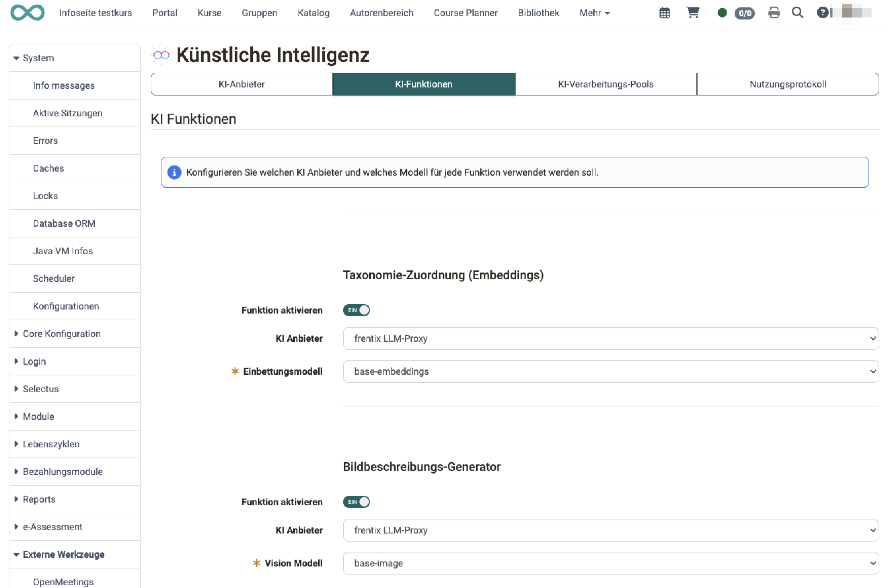
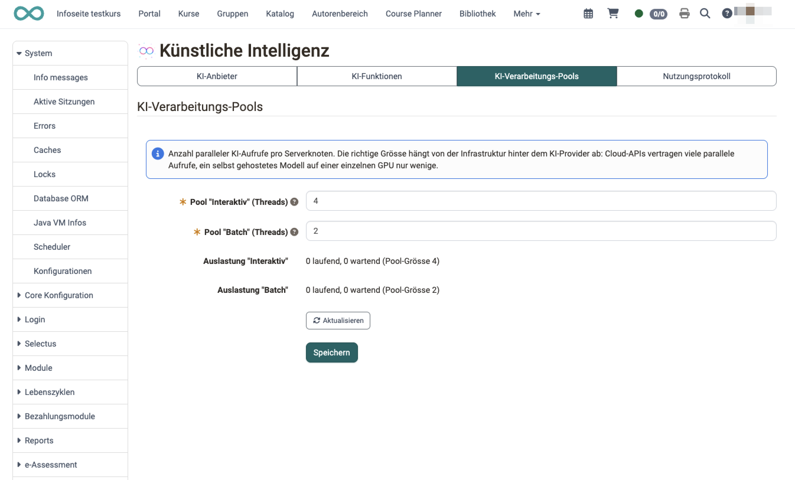
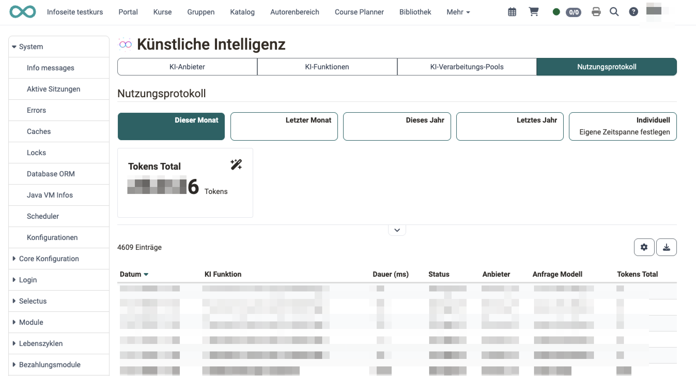

# Externe Werkzeuge: KI Modul {: #ai}


In OpenOlat werden Sie an verschiedenen Stellen durch KI unterstützt. Dazu müssen die verwendeten KI-Tools in den externen Werkzeugen konfiguriert werden. Das KI Modul unterstützt mehrere KI Anbieter; welcher Anbieter und welches Modell verwendet wird, legen Sie pro Funktion fest [:octicons-tag-16:{ title="ab Release 20.3.0 (OO-9253)" }](https://track.frentix.com/issue/OO-9253){:target="_blank"}.


## Konfiguration {: #config}

Die Einstellungen des KI Moduls finden Sie unter `Administration > Externe Werkzeuge > KI Modul`. Sie sind in vier Bereiche (Tabs) gegliedert:

* **"KI-Anbieter"**: die verwendeten KI-Dienste anbinden und mit einem API Schlüssel hinterlegen.
* **"KI-Funktionen"**: pro Einsatzort festlegen, ob KI genutzt wird und mit welchem Anbieter und Modell.
* **"KI-Verarbeitungs-Pools"**: steuern, wie viele KI-Aufrufe gleichzeitig verarbeitet werden.
* **"Nutzungsprotokoll"**: alle KI-Aufrufe der Instanz mit Tokens und Status auswerten.

{ class="shadow lightbox" }

[Zum Seitenanfang ^](#ai)

---


### KI Anbieter {: #ai_provider}

In OpenOlat bezieht sich der Begriff „KI Anbieter“ auf den Dienstleister, dessen KI-Modelle für die verschiedenen KI-gestützten Funktionen in der Plattform genutzt werden.

Aktivieren und konfigurieren Sie die verschiedenen KI Anbieter, die Sie verwenden möchten mit dem **Button "KI Anbieter hinzufügen"** rechts oben.

Für jeden konfigurierten KI Anbieter stehen folgende Aktionen zur Verfügung:

* **Toggle "Aktivieren"**: Der Anbieter kann vorübergehend deaktiviert und wieder aktiviert werden. Die Konfiguration bleibt dabei erhalten.
* **Button "API Schlüssel prüfen"**: Der hinterlegte Schlüssel wird direkt beim Anbieter validiert. Bei Erfolg wird die Anzahl der verfügbaren Modelle angezeigt, im Fehlerfall die Fehlermeldung des Anbieters. Beim generischen KI Anbieter heisst der Button "Verbindung prüfen".
* **Button "Konfiguration löschen"**: Entfernt den Anbieter inklusive API Schlüssel und aller Konfigurationen.

!!! note "Beachten Sie:"

    Einerseits erlaubt das Einbinden vieler verschiedener KI-Werkzeuge die Nutzung der jeweiligen Stärken eines Tools. Andererseits trainieren KI-Tools sich selbst und berücksichtigen vorhergehende Dialoge. Werden Aufgaben an viele verschiedene KI-Tools verteilt und vergeben, hat keines der Tools die Dialoge gesamthaft zur Verfügung.


**Anthropic Claude**

Wenn Sie die KI-Modelle von Anthropic Claude benutzen wollen, können Sie hier Ihren API Schlüssel hinterlegen. Bitte beachten Sie, dass die Verwendung des Anthropic Claude Dienstes Kosten in Ihrem Anthropic Konto verursachen kann.


**OpenAI**

Wenn Sie die KI-Modelle von OpenAI benutzen wollen, können Sie hier Ihren API Schlüssel hinterlegen. Bitte beachten Sie, dass die Verwendung des OpenAI Moduls Kosten in Ihrem OpenAI Konto verursachen kann.


**Generischer KI Anbieter**

In diesem Abschnitt können Sie einen generischen OpenAI-kompatiblen KI Anbieter konfigurieren, z.B.

* vLLM
* Ollama 
* LiteLLM
* NeuralMagic
* ...

Zur weiteren Spezifizierung geben Sie in einer Liste die auf diesem Server verfügbaren Modellnamen an.

[Zum Seitenanfang ^](#ai)

---


### KI Funktionen {: #ai_functions}

Die Konfiguration der KI-Integration erfolgt individuell pro Funktion, wobei die verfügbaren Modelle direkt vom jeweiligen Anbieter geladen werden.

**Sie bestimmen**:<br>
* ob KI verwendet werden soll (Toggle-Button zur Aktivierung),
* welcher KI Anbieter
* und welches Modell verwendet werden soll.

**Derzeit kann KI in den folgenden Funktionen eingebunden werden**:<br>
* Zuordnung zur passenden Taxonomie-Ebene per Einbettungsmodell [:octicons-tag-16:{ title="ab Release 21.0 (OO-9428)" }](https://track.frentix.com/issue/OO-9428){:target="_blank"}
* MC Fragen Generator (Erstellung von MC-Fragen)
* Bildbeschreibungs-Generator (Erstellung von Bildbeschreibungen, Alternativ-Texten, Schlagwörtern) [:octicons-tag-16:{ title="ab Release 20.3.0 (OO-9355)" }](https://track.frentix.com/issue/OO-9355){:target="_blank"}
* Essay Fragen Generator (Erstellung von Freitextfragen samt Bewertungskriterien) [:octicons-tag-16:{ title="ab Release 21.0 (OO-9496)" }](https://track.frentix.com/issue/OO-9496){:target="_blank"}
* Essay Bewertung (formatives KI-Feedback zu Freitextantworten) [:octicons-tag-16:{ title="ab Release 21.0 (OO-9496)" }](https://track.frentix.com/issue/OO-9496){:target="_blank"}

{ class="shadow lightbox" }

Kopieren Sie einen Fachtext in das vorgesehene Eingabefeld. Direkt in OpenOlat werden dann z.B. Multiple-Choice-Fragen mit Antwortmöglichkeiten erstellt, sowie eine Reihe von Metadaten zu den einzelnen Frage-Items (Schlagworte, Thema und Taxonomie) vorausgefüllt.

Zu jeder Funktion kann unter dem Link "Test ausführen" ein KI-generiertes Muster angesehen werden.

**Beispiel MC Fragen Generator:**<br>
{ class="shadow lightbox" }

**Beispiel Bildbeschreibungs-Generator:**<br>
{ class="shadow lightbox" }

[Zum Seitenanfang ^](#ai)

---


### KI-Verarbeitungs-Pools {: #ai_pools}

Im Abschnitt "KI-Verarbeitungs-Pools" legen Sie fest, wie viele KI-Aufrufe pro Serverknoten gleichzeitig ausgeführt werden. Die passende Grösse hängt von der Infrastruktur hinter dem KI Anbieter ab: Cloud-Dienste vertragen viele parallele Aufrufe, ein selbst gehostetes Modell auf einer einzelnen GPU nur wenige.

* **Pool "Interaktiv"**: für KI-Aufgaben, auf die Benutzer:innen aktiv warten, zum Beispiel die KI-Korrektur von Freitextantworten.
* **Pool "Batch"**: für langlaufende Aufträge wie die Fragengenerierung aus Seiteninhalten; ein Auftrag kann mehrere Minuten dauern.

Der Wert je Pool muss zwischen 1 und 64 liegen.

{ class="shadow lightbox" }

[Zum Seitenanfang ^](#ai)

---


### Nutzungsprotokoll [:octicons-tag-16:{ title="ab Release 21.0 (OO-9393)" }](https://track.frentix.com/issue/OO-9393){:target="_blank"} {: #ai_usage_log}

Das "Nutzungsprotokoll" zeichnet jeden KI-Aufruf der Instanz auf und macht so nachvollziehbar, welche KI-Funktionen wie oft genutzt werden und wie viele Tokens dabei anfallen. Die Tabelle enthält unter anderem Datum, KI Funktion, Anbieter, Modell, Status und Dauer sowie Eingabe-, Ausgabe- und Gesamt-Tokens.

Zur Auswertung stehen zur Verfügung:

* **Zeitbereich**: "Letzter Monat", "Dieser Monat", "Letztes Jahr", "Dieses Jahr" oder ein benutzerdefinierter Zeitraum.
* **Spaltenfilter** für "KI Funktion" und "Status".
* **Excel-Download** der gefilterten Tabelle.

Ein Widget über der Tabelle zeigt die Summe der Total-Tokens im gewählten Zeitbereich.

{ class="shadow lightbox" }

[Zum Seitenanfang ^](#ai)

---


### Vorkonfiguration via olat.properties [:octicons-tag-16:{ title="ab Release 20.3.4 (OO-9546)" }](https://track.frentix.com/issue/OO-9546){:target="_blank"} {: #ai_properties}

KI Anbieter und KI Funktionen können auch direkt in der Konfigurationsdatei `olat.properties` vorbelegt werden. Das eignet sich besonders für zentral verwaltete Deployments (z.B. Ansible oder Docker-Images), bei denen derselbe KI Anbieter auf allen Instanzen voreingestellt sein soll.

Dabei gilt folgendes Prioritätsprinzip: Die Werte aus `olat.properties` wirken als Standardwerte. Sobald ein Wert in der Admin-Oberfläche gespeichert wird, hat der gespeicherte Wert dauerhaft Vorrang. Die Presets werden unabhängig davon geladen, ob Anbieter oder Funktion aktiviert sind; zur Nutzung genügt das Aktivieren in der Admin-Oberfläche.

```properties
# OpenAI (GPT) Anbieter
ai.openai.enabled=false
ai.openai.api.key=
# Anthropic (Claude) Anbieter
ai.anthropic.enabled=false
ai.anthropic.api.key=
# Generischer OpenAI-kompatibler Anbieter (z.B. vLLM, Ollama, LiteLLM)
# Leere Basis-URL bedeutet: kein generischer Preset-Anbieter
ai.generic.preset.enabled=false
ai.generic.preset.name=
ai.generic.preset.base.url=
ai.generic.preset.api.key=
# Komma-getrennte Liste der Modellnamen, falls nicht automatisch erkennbar
ai.generic.preset.models=
# Anbieter (spi) und Modell pro KI Funktion
# Moegliche spi-Werte: OpenAI, Anthropic, Generic_0
ai.feature.mc-question-generator.spi=
ai.feature.mc-question-generator.model=
ai.feature.image-description-generator.spi=
ai.feature.image-description-generator.model=
```

!!! info "Wichtig"

    Der generische Preset-Anbieter ist auf jeder Installation unter der festen ID `Generic_0` verfügbar. Er wird in der Admin-Oberfläche angezeigt, kann dort aber nicht gelöscht werden. Weitere generische Anbieter lassen sich weiterhin über die Admin-Oberfläche anlegen.

[Zum Seitenanfang ^](#ai)

---


 