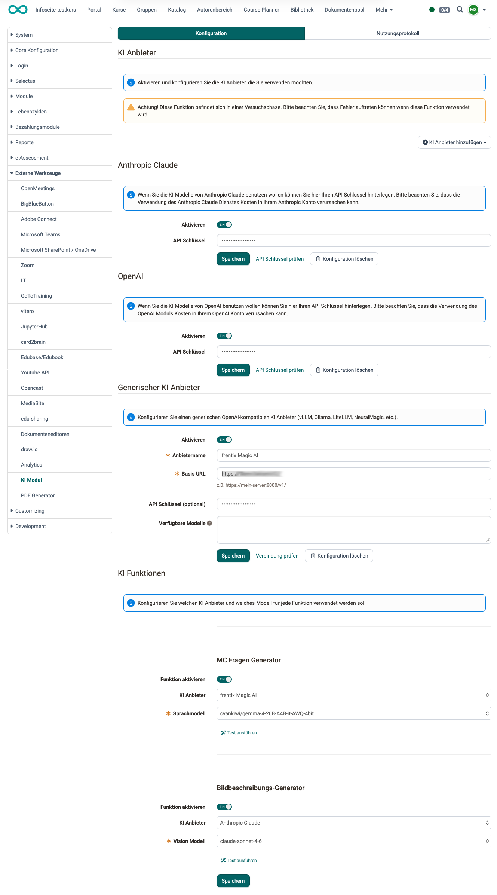
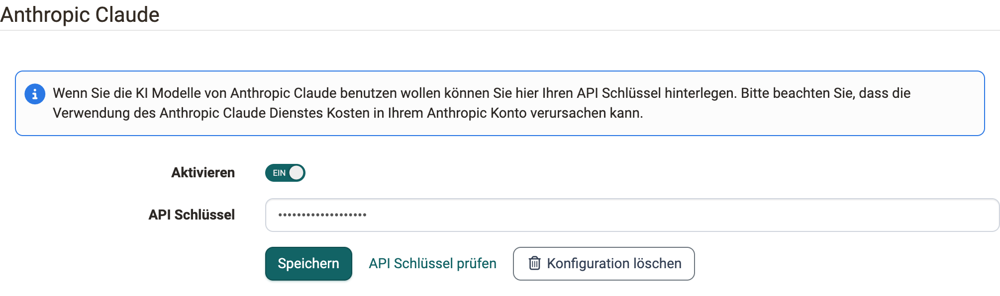
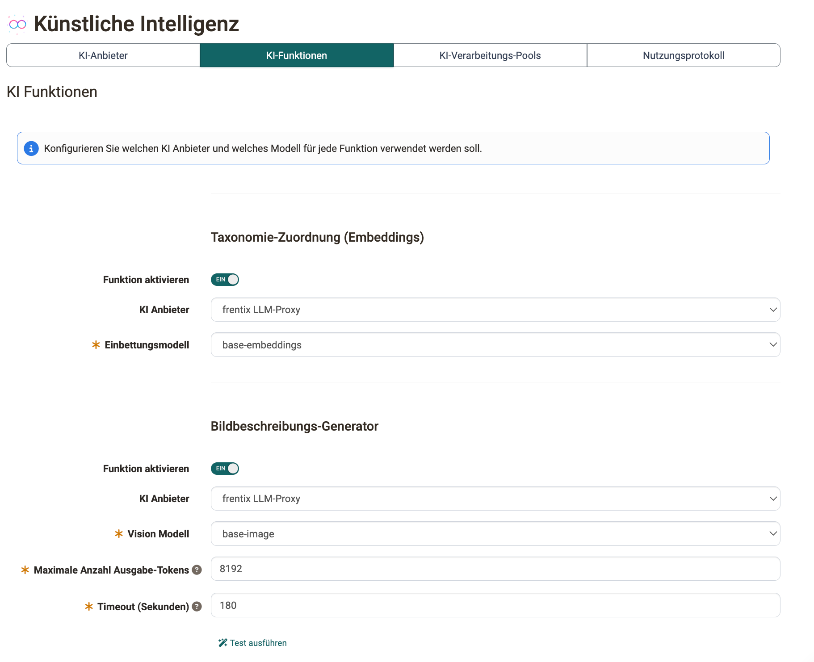
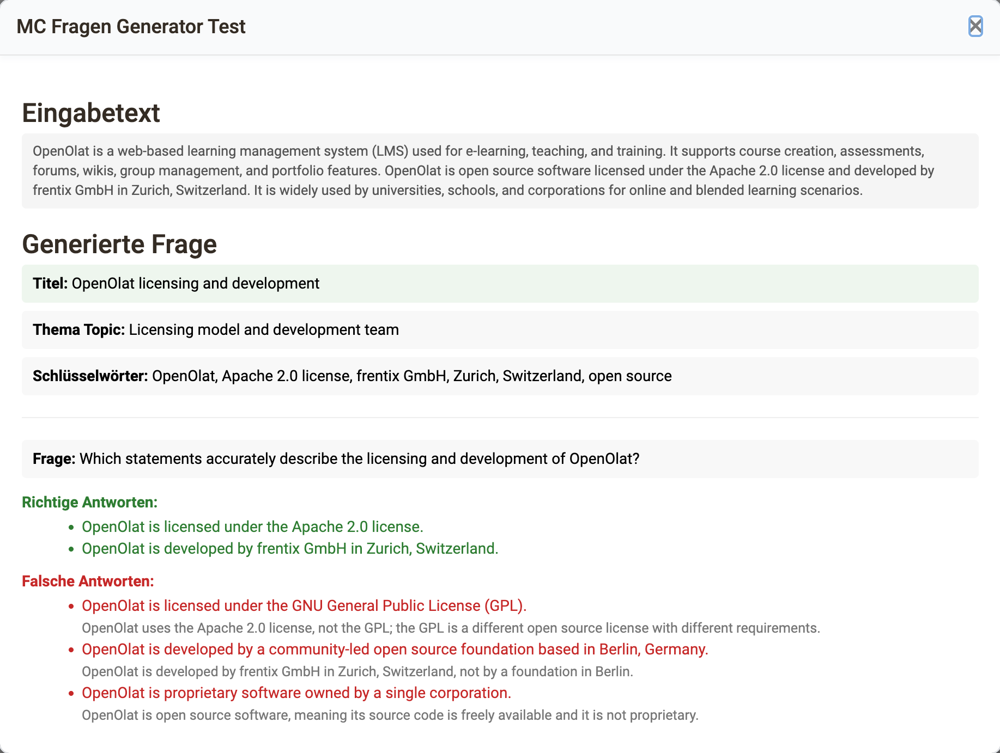
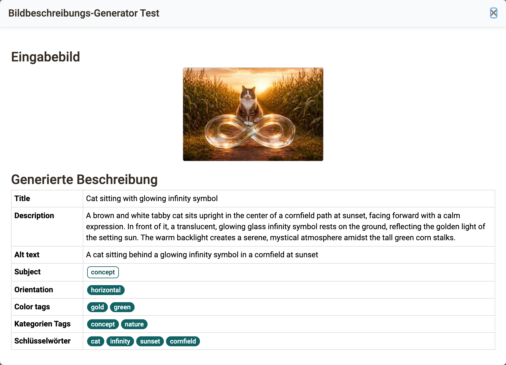
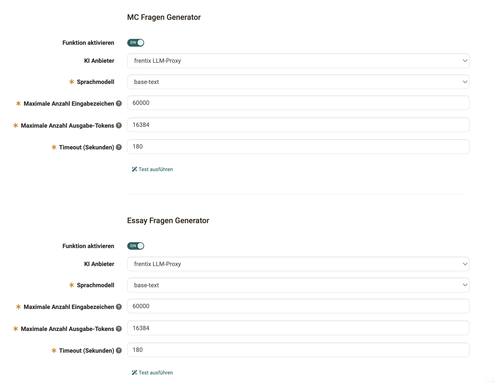
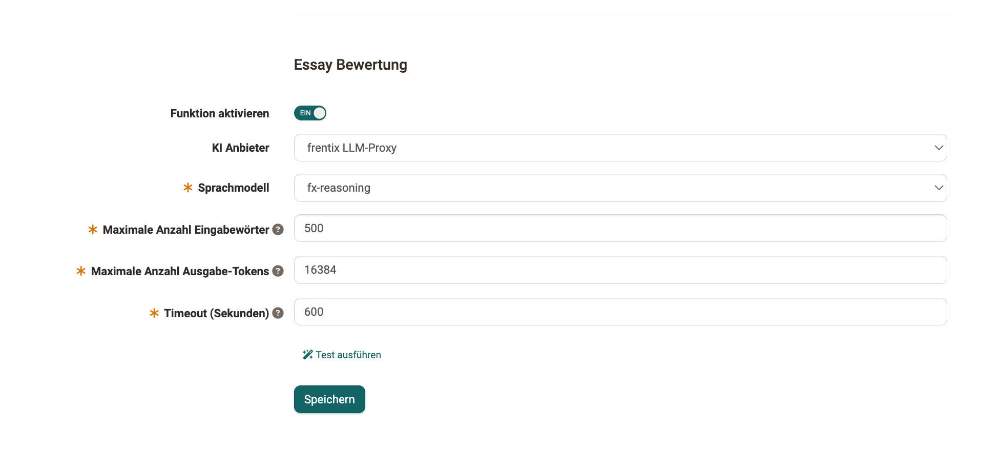
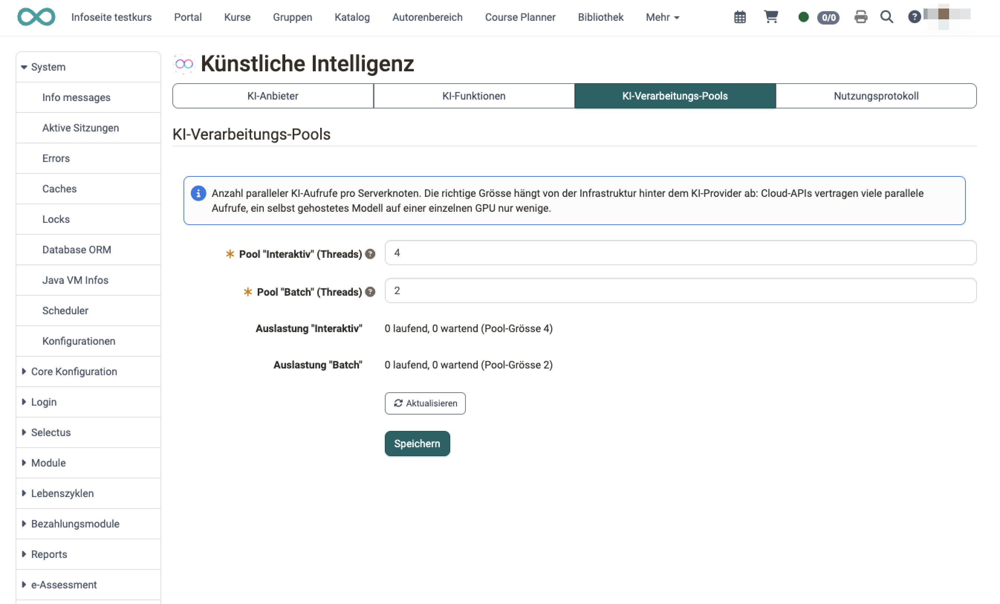
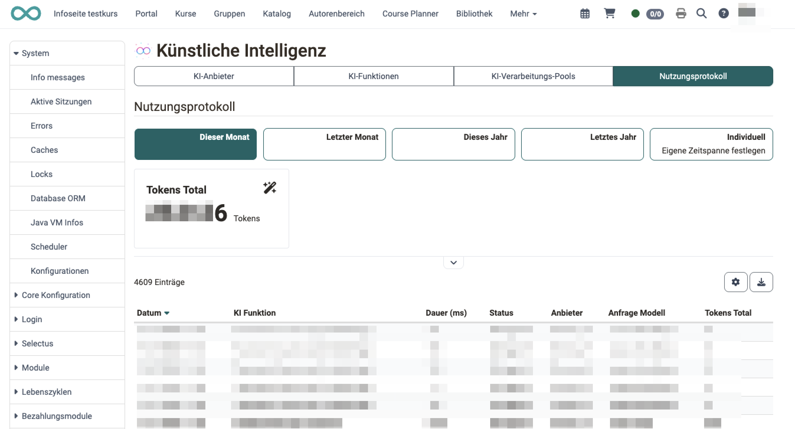

# Externe Werkzeuge: KI Modul {: #ai}


In OpenOlat werden Sie an verschiedenen Stellen durch KI unterstützt. Dazu müssen die verwendeten KI Anbieter in den externen Werkzeugen konfiguriert werden. Das KI Modul unterstützt mehrere KI Anbieter; welcher Anbieter und welches Modell verwendet wird, legen Sie pro KI Funktion fest [:octicons-tag-16:{ title="ab Release 20.3.0 (OO-9253)" }](https://track.frentix.com/issue/OO-9253){:target="_blank"}.

Das KI Modul ist Teil der externen Werkzeuge, siehe [Externe Werkzeuge: Übersicht >](External_Tools_-_Administration.de.md). Es liegt in der System-Administration und wird von Administrator:innen und Systemadministrator:innen konfiguriert. Andere Rollen erreichen die System-Administration nicht. Wie Rollen vergeben werden, beschreibt [Rollen zuweisen >](../usermanagement/Assign_roles.de.md).

!!! tip "Unterstützung durch frentix"

    Kunden von frentix kontaktieren für die Anbindung eines KI Anbieters bitte [contact@frentix.com](mailto:contact@frentix.com). frentix unterstützt bei der Wahl von Anbieter und Modell, beim API Schlüssel und beim Betrieb eines selbst gehosteten Modells. Bei Systemen mit dem fx-Release werden diese Anpassungen durch frentix vorgenommen.

    **Nicht Hosting-Kunde von frentix?** Fragen Sie Ihren Systembetreiber!


## Konfiguration {: #config}

Die Einstellungen des KI Moduls finden Sie in der System-Administration unter:<br>
`Administration > Externe Werkzeuge > KI Modul`

Sie sind in vier Bereiche (Tabs) gegliedert:

* **"KI-Anbieter"**: die verwendeten KI-Dienste anbinden und mit einem API Schlüssel hinterlegen.
* **"KI-Funktionen"**: pro Einsatzort festlegen, ob KI genutzt wird und mit welchem Anbieter und Modell.
* **"KI-Verarbeitungs-Pools"**: steuern, wie viele KI-Aufrufe gleichzeitig verarbeitet werden.
* **"Nutzungsprotokoll"**: alle KI-Aufrufe der Instanz mit Tokens und Status auswerten.

{ class="shadow lightbox" }

[Zum Seitenanfang ^](#ai)

---


### KI Anbieter {: #ai_provider}

In OpenOlat bezieht sich der Begriff "KI Anbieter" auf den Dienstleister, dessen KI-Modelle für die verschiedenen KI-gestützten Funktionen in der Plattform genutzt werden.

Aktivieren und konfigurieren Sie die KI Anbieter, die Sie verwenden möchten, mit dem **Button "KI Anbieter hinzufügen"** rechts oben.

Als Betreiberin der Plattform sind Sie verpflichtet, Ihre Benutzer:innen auf die Verwendung eines KI Services hinzuweisen.

!!! warning "Achtung"

    Der Tab "KI-Anbieter" weist darauf hin, dass sich die KI-Funktionalität in einer Versuchsphase befindet. Bei der Verwendung können Fehler auftreten.

Für jeden konfigurierten KI Anbieter stehen folgende Aktionen zur Verfügung:

* **Toggle "Aktivieren"**: Der Anbieter kann vorübergehend deaktiviert und wieder aktiviert werden. Die Konfiguration bleibt dabei erhalten.
* **Button "API Schlüssel prüfen"**: Der hinterlegte Schlüssel wird direkt beim Anbieter validiert. Bei Erfolg wird die Anzahl der verfügbaren Modelle angezeigt, im Fehlerfall die Fehlermeldung des Anbieters. Beim generischen KI Anbieter heisst der Button "Verbindung prüfen".
* **Button "Konfiguration löschen"**: Entfernt den Anbieter inklusive API Schlüssel und aller Konfigurationen.

{ class="shadow lightbox" }


**Anthropic Claude**

Wenn Sie die KI-Modelle von Anthropic Claude benutzen wollen, können Sie hier Ihren API Schlüssel hinterlegen. Bitte beachten Sie, dass die Verwendung des Anthropic Claude Dienstes Kosten in Ihrem Anthropic Konto verursachen kann.


**OpenAI**

Wenn Sie die KI-Modelle von OpenAI benutzen wollen, können Sie hier Ihren API Schlüssel hinterlegen. Bitte beachten Sie, dass die Verwendung des OpenAI Moduls Kosten in Ihrem OpenAI Konto verursachen kann.


**Generischer KI Anbieter**

In diesem Abschnitt können Sie einen generischen OpenAI-kompatiblen KI Anbieter konfigurieren, z.B.

* vLLM
* Ollama
* LiteLLM
* NeuralMagic
* ...

Dafür stehen folgende Felder zur Verfügung:

* **"Anbietername"**: der Name, unter dem der Anbieter in den KI Funktionen zur Auswahl steht.
* **"Basis URL"**: die Adresse der OpenAI-kompatiblen Schnittstelle, zum Beispiel `https://mein-server:8000/v1/`.
* **"API Schlüssel (optional)"**: nur nötig, wenn der Server eine Authentifizierung verlangt.
* **"Verfügbare Modelle"**: komma-getrennte Liste der Modellnamen auf diesem Server. Nötig, wenn die Modelle nicht automatisch erkennbar sind.

Mit dem **Button "Verbindung prüfen"** testen Sie die Erreichbarkeit des Servers.

[Zum Seitenanfang ^](#ai)

---


### KI Funktionen {: #ai_functions}

Die Konfiguration der KI-Integration erfolgt individuell pro Funktion, wobei die verfügbaren Modelle direkt vom jeweiligen Anbieter geladen werden.

**Sie bestimmen**:

* ob KI verwendet werden soll (Toggle "Funktion aktivieren"),
* welcher KI Anbieter (Feld "KI Anbieter")
* und welches Modell verwendet werden soll (Feld "Sprachmodell"; beim Bildbeschreibungs-Generator "Vision Modell", bei der Taxonomie-Zuordnung "Einbettungsmodell").

**Derzeit kann KI in den folgenden Funktionen eingebunden werden**:

* Taxonomie-Zuordnung (Embeddings): Zuordnung zur passenden Taxonomieebene per Einbettungsmodell, siehe [Modul Taxonomie >](Modules_Taxonomy.de.md) [:octicons-tag-16:{ title="ab Release 21.0 (OO-9428)" }](https://track.frentix.com/issue/OO-9428){:target="_blank"}
* MC Fragen Generator (Erstellung von MC-Fragen), genutzt im [Fragenpool: Fragen erstellen >](../../manual_user/area_modules/Question_Bank_Create_Questions.de.md)
* Bildbeschreibungs-Generator (Erstellung von Bildbeschreibungen, Alternativ-Texten, Schlagwörtern), genutzt im [Media Center: Informationen und Einstellungen zu Einzelmedien >](../../manual_user/basic_concepts/Media_Center_Items.de.md) [:octicons-tag-16:{ title="ab Release 20.3.0 (OO-9355)" }](https://track.frentix.com/issue/OO-9355){:target="_blank"}
* Essay Fragen Generator (Erstellung von Freitextfragen samt Bewertungskriterien)
* Essay Bewertung (formatives KI-Feedback zu Freitextantworten), genutzt im Fragenpool und im [Content Editor >](../../manual_user/basic_concepts/Content_Editor.de.md) [:octicons-tag-16:{ title="ab Release 21.0 (OO-9496)" }](https://track.frentix.com/issue/OO-9496){:target="_blank"}

Welchen Nutzen diese Funktionen für Autor:innen haben und an welchen Orten sie wirken, zeigt die Konzeptstudie [KI Funktionen: Anwendungsmap >](../../manual_user/area_modules/AI_Features_Map.de.md).

{ class="shadow lightbox" }

Kopieren Sie einen Fachtext in das vorgesehene Eingabefeld. Direkt in OpenOlat werden dann z.B. Multiple-Choice-Fragen mit Antwortmöglichkeiten erstellt, sowie eine Reihe von Metadaten zu den einzelnen Frage-Items (Schlagworte, Thema und Taxonomie) vorausgefüllt.

Zu jeder Funktion ausser der Taxonomie-Zuordnung zeigt der Link "Test ausführen" ein KI-generiertes Muster. Der Link erscheint, sobald Anbieter und Modell gewählt sind.

**Beispiel MC Fragen Generator:**<br>
{ class="shadow lightbox" }

**Beispiel Bildbeschreibungs-Generator:**<br>
{ class="shadow lightbox" }


#### Limits pro Funktion [:octicons-tag-16:{ title="ab Release 21.0.2 (OO-9677)" }](https://track.frentix.com/issue/OO-9677){:target="_blank"} {: #ai_function_limits}

Pro KI Funktion legen Sie zusätzlich fest, wie viel Text an das Modell gesendet wird, wie viel Text das Modell erzeugen darf und wie lange OpenOlat auf die Antwort wartet. Die Standardwerte reichen auch für Reasoning-Modelle, also für Modelle, die vor der eigentlichen Antwort interne Denkschritte ausführen.

* **"Maximale Anzahl Ausgabe-Tokens"**: begrenzt, wie viel Text das Modell erzeugen darf. Ein Reasoning-Modell verbraucht einen Teil dieses Budgets für seine Denkschritte. Ist das Budget zu klein, bleibt für die Antwort nichts übrig und der Aufruf schlägt fehl. Kleinster zulässiger Wert: 1024.
* **"Timeout (Sekunden)"**: legt fest, wie lange OpenOlat auf die Antwort des KI Anbieters wartet, bevor der Aufruf abgebrochen wird. Reasoning-Modelle und selbst gehostete Modelle brauchen deutlich länger als Cloud-Standardmodelle. Kleinster zulässiger Wert: 10.
* **"Maximale Anzahl Eingabezeichen"**: begrenzt den Quelltext, der zur Fragengenerierung an das Modell gesendet wird. Kleinster zulässiger Wert: 1000.
* **"Maximale Anzahl Eingabewörter"**: begrenzt die Antwortlänge, die zur Essay Bewertung angenommen wird. Längere Antworten lehnt OpenOlat mit einer Fehlermeldung ab, bevor ein KI-Aufruf erfolgt. Die Meldung nennt den eingestellten Wert. Kleinster zulässiger Wert: 50.

Die Standardwerte je Funktion:

| KI Funktion | Eingabegrenze | Maximale Anzahl Ausgabe-Tokens | Timeout (Sekunden) |
|---|---|---|---|
| MC Fragen Generator | 60000 Eingabezeichen | 16384 | 180 |
| Bildbeschreibungs-Generator | keine | 8192 | 180 |
| Essay Fragen Generator | 60000 Eingabezeichen | 16384 | 180 |
| Essay Bewertung | 400 Eingabewörter | 16384 | 600 |

{ class="shadow lightbox" }

{ class="shadow lightbox" }

Für ein Reasoning-Modell oder ein selbst gehostetes Modell belassen Sie die Standardwerte oder erhöhen sie. Reicht der Standard nicht, erhöhen Sie zuerst den Timeout und danach die Ausgabe-Tokens.

[Zum Seitenanfang ^](#ai)

---


### KI-Verarbeitungs-Pools {: #ai_pools}

Im Tab "KI-Verarbeitungs-Pools" legen Sie fest, wie viele KI-Aufrufe pro Serverknoten gleichzeitig ausgeführt werden. Die passende Grösse hängt von der Infrastruktur hinter dem KI Anbieter ab: Cloud-Dienste vertragen viele parallele Aufrufe, ein selbst gehostetes Modell auf einer einzelnen GPU nur wenige.

* **Pool "Interaktiv" (Threads)**: für KI-Aufgaben, auf die Benutzer:innen aktiv warten, zum Beispiel die KI-Korrektur von Freitextantworten.
* **Pool "Batch" (Threads)**: für langlaufende Aufträge wie die Fragengenerierung aus Seiteninhalten; ein Auftrag kann mehrere Minuten dauern.

Standardmässig stehen 8 Threads für "Interaktiv" und 2 Threads für "Batch" zur Verfügung. Der Wert je Pool muss zwischen 1 und 64 liegen.

Unter den beiden Feldern zeigt die Auslastung je Pool, wie viele Aufrufe gerade laufen und wie viele warten. Der Button "Aktualisieren" liest diese Werte neu ein.

{ class="shadow lightbox" }

[Zum Seitenanfang ^](#ai)

---


### Nutzungsprotokoll [:octicons-tag-16:{ title="ab Release 21.0 (OO-9393)" }](https://track.frentix.com/issue/OO-9393){:target="_blank"} {: #ai_usage_log}

Das "Nutzungsprotokoll" zeichnet jeden KI-Aufruf der Instanz auf und macht so nachvollziehbar, welche KI-Funktionen wie oft genutzt werden und wie viele Tokens dabei anfallen. Die Tabelle enthält unter anderem Datum, KI Funktion, Anbieter, Modell, Status und Dauer sowie Eingabe Tokens, Ausgabe Tokens und Tokens Total.

Zur Auswertung stehen zur Verfügung:

* **Zeitbereich**: "Dieser Monat" (Vorauswahl), "Letzter Monat", "Dieses Jahr", "Letztes Jahr" sowie "Individuell" für eine eigene Zeitspanne.
* **Spaltenfilter** für "KI Funktion" und "Status".
* **Excel-Download** der gefilterten Tabelle.

Das Widget "Tokens Total" über der Tabelle zeigt die Summe aller Tokens im gewählten Zeitbereich.

{ class="shadow lightbox" }

[Zum Seitenanfang ^](#ai)

---


### Vorkonfiguration via olat.properties [:octicons-tag-16:{ title="ab Release 20.3.4 (OO-9546)" }](https://track.frentix.com/issue/OO-9546){:target="_blank"} {: #ai_properties}

KI Anbieter und KI Funktionen können auch direkt in der Konfigurationsdatei `olat.properties` vorbelegt werden. Das eignet sich besonders für zentral verwaltete Deployments (z.B. Ansible oder Docker-Images), bei denen derselbe KI Anbieter auf allen Instanzen voreingestellt sein soll.

Dabei gilt folgendes Prioritätsprinzip: Die Werte aus `olat.properties` wirken als Standardwerte. Sobald ein Wert im KI Modul gespeichert wird, hat der gespeicherte Wert dauerhaft Vorrang. Die Presets werden unabhängig davon geladen, ob Anbieter oder Funktion aktiviert sind; zur Nutzung genügt das Aktivieren im KI Modul.

```properties
# OpenAI (GPT) Anbieter
ai.openai.enabled=false
ai.openai.api.key=
# Anthropic (Claude) Anbieter
ai.anthropic.enabled=false
ai.anthropic.api.key=
# Generischer OpenAI-kompatibler Anbieter (z.B. vLLM, Ollama, LiteLLM)
# Leere Basis-URL bedeutet: kein generischer Preset-Anbieter
ai.generic.preset.enabled=false
ai.generic.preset.name=
ai.generic.preset.base.url=
ai.generic.preset.api.key=
# Komma-getrennte Liste der Modellnamen, falls nicht automatisch erkennbar
ai.generic.preset.models=
# Aktivierung, Anbieter (spi) und Modell pro KI Funktion
# Moegliche spi-Werte: OpenAI, Anthropic, Generic_0
ai.feature.mc-question-generator.enabled=false
ai.feature.mc-question-generator.spi=
ai.feature.mc-question-generator.model=
ai.feature.image-description-generator.enabled=false
ai.feature.image-description-generator.spi=
ai.feature.image-description-generator.model=
ai.feature.essay-generation.enabled=false
ai.feature.essay-generation.spi=
ai.feature.essay-generation.model=
ai.feature.essay-grading.enabled=false
ai.feature.essay-grading.spi=
ai.feature.essay-grading.model=
# Limits pro KI Funktion
ai.mc.generator.max.input.chars=60000
ai.mc.generator.max.output.tokens=16384
ai.mc.generator.timeout.seconds=180
ai.img.desc.max.output.tokens=8192
ai.img.desc.timeout.seconds=180
ai.essay.generation.max.input.chars=60000
ai.essay.generation.max.output.tokens=16384
ai.essay.generation.timeout.seconds=180
ai.essay.grading.max.input.words=400
ai.essay.grading.max.output.tokens=16384
ai.essay.grading.timeout.seconds=600
# Groesse der Verarbeitungs-Pools (Threads pro Serverknoten)
ai.task.pool.interactive.size=8
ai.task.pool.batch.size=2
# Taxonomie-Zuordnung
taxonomy.matching.enabled=false
taxonomy.matching.spi=
taxonomy.matching.model=
# Minimale Uebereinstimmung, ab der eine Taxonomie-Ebene zugeordnet wird
taxonomy.matching.min.score=0.65
# pgvector wird automatisch verwendet, wenn verfuegbar (PostgreSQL mit pgvector).
# Ist pgvector nicht verfuegbar, laeuft die Zuordnung ueber die Suche im Arbeitsspeicher.
taxonomy.matching.pgvector.enabled=true
taxonomy.matching.local.model.dir=${userdata.dir}/ai/models
# Optionale Praefixe. Leer lassen fuer die automatische Erkennung anhand des Modellnamens.
taxonomy.matching.query.prefix=
taxonomy.matching.passage.prefix=
```

!!! info "Wichtig"

    Der generische Preset-Anbieter ist auf jeder Installation unter der festen ID `Generic_0` verfügbar. Er wird im Tab "KI-Anbieter" angezeigt, kann dort aber nicht gelöscht werden. Weitere generische Anbieter legen Sie im Tab "KI-Anbieter" an.

[Zum Seitenanfang ^](#ai)

---


## Weiterführende Informationen {: #further_information}

[Externe Werkzeuge: Übersicht >](External_Tools_-_Administration.de.md)<br>
[KI Funktionen: Anwendungsmap (Konzeptstudie) >](../../manual_user/area_modules/AI_Features_Map.de.md)<br>
[Rollen zuweisen >](../usermanagement/Assign_roles.de.md)<br>
[Modul Taxonomie >](Modules_Taxonomy.de.md)<br>
[Fragenpool: Fragen erstellen >](../../manual_user/area_modules/Question_Bank_Create_Questions.de.md)<br>
[Media Center: Informationen und Einstellungen zu Einzelmedien >](../../manual_user/basic_concepts/Media_Center_Items.de.md)<br>
[Content Editor >](../../manual_user/basic_concepts/Content_Editor.de.md)

[Zum Seitenanfang ^](#ai)
