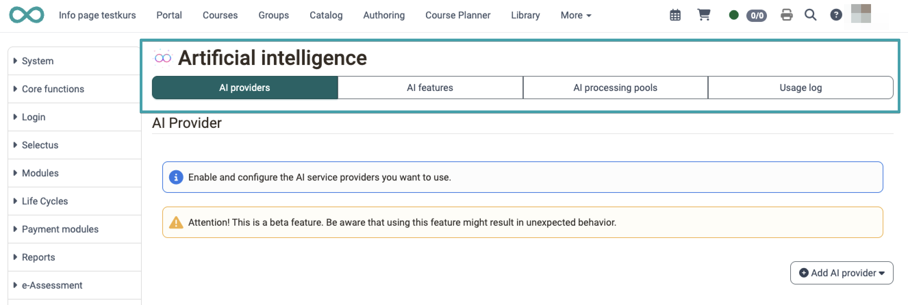
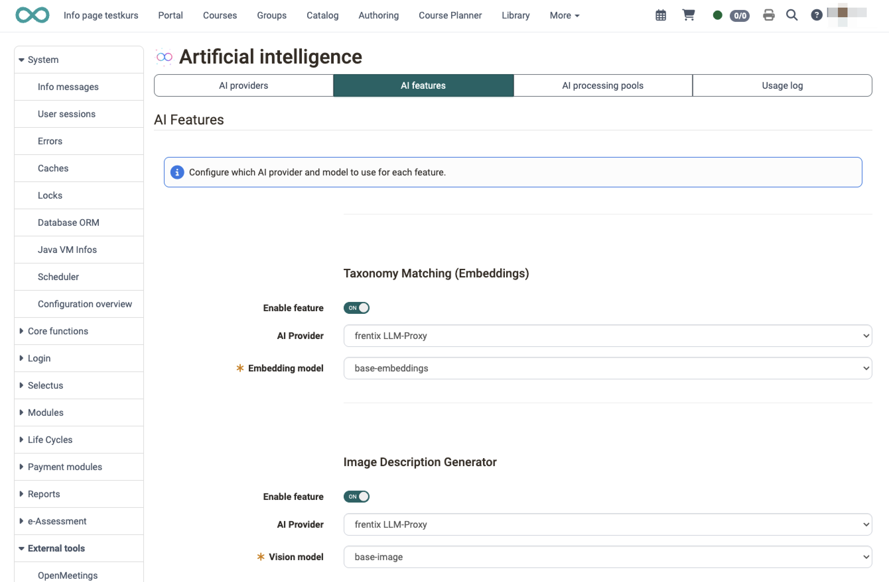
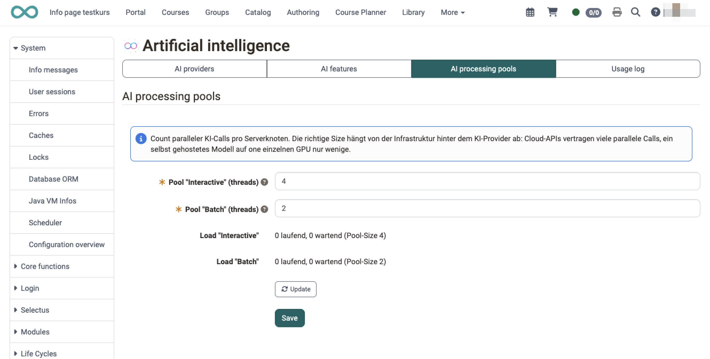
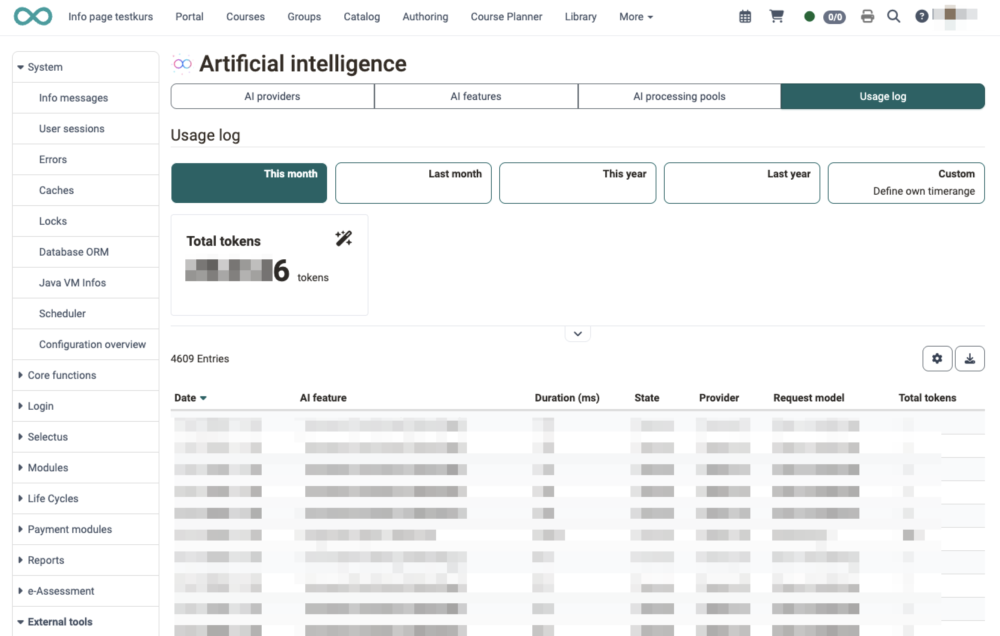

# External tools: AI module {: #ai}


In OpenOlat you are supported by AI at different points. To do this, the AI tools used must be configured in the external tools. The AI module supports multiple AI providers; you define per feature which provider and which model is used [:octicons-tag-16:{ title="from Release 20.3.0 (OO-9253)" }](https://track.frentix.com/issue/OO-9253){:target="_blank"}.


## Configuration {: #config}

The AI module settings are located under `Administration > External tools > AI module`. They are organised into four areas (tabs):

* **"AI providers"**: connect the AI services used and store an API key.
* **"AI features"**: define per location whether AI is used and with which provider and model.
* **"AI processing pools"**: control how many AI calls are processed simultaneously.
* **"Usage log"**: review all AI calls on the instance with tokens and status.

{ class="shadow lightbox" }

[To the top of the page ^](#ai)

---

### AI provider {: #ai_provider}

In OpenOlat, the term “AI provider” refers to the service provider whose AI models are used for the various AI-powered features on the platform.

Enable and configure the various AI providers you want to use by clicking the **"Add AI Provider" button** in the upper-right corner.

The following actions are available for each configured AI provider:

* **"Enable" toggle**: The provider can be temporarily disabled and enabled again. The configuration is retained.
* **"Check API key" button**: The stored key is validated directly with the provider. On success, the number of available models is displayed; in case of an error, the provider's error message is shown. For the generic AI provider the button is called "Check connection".
* **"Delete configuration" button**: Removes the provider including the API key and all configurations.

!!! note "Please note:"

    On the one hand, integrating many different AI tools allows users to leverage each tool’s specific strengths. On the other hand, AI tools train themselves and take previous dialogues into account. If tasks are distributed and assigned to many different AI tools, none of the tools has access to the complete history of the dialogues.


**Anthropic Claude**

If you want to use Anthropic Claude's AI models, you can enter your API key here. Please note that using the Anthropic Claude service may incur charges on your Anthropic account.


**OpenAI**

If you want to use OpenAI's AI models, you can enter your API key here. Please note that using the OpenAI module may incur charges on your OpenAI account.


**Generic AI provider**

In this section, you can configure a generic OpenAI-compatible AI provider, such as

* vLLM
* Ollama 
* LiteLLM
* NeuralMagic
* ...

For further specification, list the model names available on this server.

[To the top of the page ^](#ai)

---

### AI functions {: #ai_functions}

The AI integration is configured individually for each function, with the available models being downloaded directly from the respective provider.

**You define**:<br>
* whether to use AI (toggle button to enable it),
* which AI provider
* and which model should be used.

**Currently, AI can be integrated into the following functions**:<br>
* Assignment to the matching taxonomy level via embedding model [:octicons-tag-16:{ title="from Release 21.0 (OO-9428)" }](https://track.frentix.com/issue/OO-9428){:target="_blank"}
* MC Question Generator (creation of multiple-choice questions)
* Image Description Generator (creation of image descriptions, alternative text, and keywords) [:octicons-tag-16:{ title="from Release 20.3.0 (OO-9355)" }](https://track.frentix.com/issue/OO-9355){:target="_blank"}
* Essay Question Generator (creation of open-text questions with grading criteria) [:octicons-tag-16:{ title="from Release 21.0 (OO-9496)" }](https://track.frentix.com/issue/OO-9496){:target="_blank"}
* Essay Grading (formative AI feedback on open-text answers) [:octicons-tag-16:{ title="from Release 21.0 (OO-9496)" }](https://track.frentix.com/issue/OO-9496){:target="_blank"}

{ class="shadow lightbox" }

Copy a subject-specific text into the designated input field. OpenOlat will then automatically generate multiple-choice questions with answer options, as well as pre-fill a range of metadata for each question item (keywords, topic, and taxonomy).

For each function, you can view an AI-generated sample by clicking the "Run Test" link.

**Example MC Question Generator:**<br>
{ class="shadow lightbox" }

**Example Image Description Generator:**<br>
{ class="shadow lightbox" }

[To the top of the page ^](#ai)

---

### AI processing pools {: #ai_pools}

In the "AI processing pools" section, you define how many AI calls are executed simultaneously per server node. The appropriate size depends on the infrastructure behind the AI provider: cloud services handle many parallel calls, a self-hosted model on a single GPU only a few.

* **Pool "Interactive"**: for AI tasks a user is actively waiting on, for example the AI correction of free-text answers.
* **Pool "Batch"**: for long-running jobs such as question generation from page content; one job can take several minutes.

The value per pool must be between 1 and 64.

{ class="shadow lightbox" }

[To the top of the page ^](#ai)

---


### Usage log [:octicons-tag-16:{ title="from Release 21.0 (OO-9393)" }](https://track.frentix.com/issue/OO-9393){:target="_blank"} {: #ai_usage_log}

The "Usage log" records every AI call on the instance, making it traceable which AI features are used how often and how many tokens are consumed. The table contains, among other things, date, AI feature, provider, model, status and duration as well as input, output and total tokens.

The following are available for analysis:

* **Time range**: "Last month", "This month", "Last year", "This year" or a custom time range.
* **Column filters** for "AI feature" and "Status".
* **Excel download** of the filtered table.

A widget above the table shows the sum of the total tokens for the selected time range.

{ class="shadow lightbox" }

[To the top of the page ^](#ai)

---


### Preconfiguration via olat.properties [:octicons-tag-16:{ title="from Release 20.3.4 (OO-9546)" }](https://track.frentix.com/issue/OO-9546){:target="_blank"} {: #ai_properties}

AI providers and AI features can also be preset directly in the configuration file `olat.properties`. This is particularly suitable for centrally managed deployments (e.g. Ansible or Docker images) where the same AI provider should be preconfigured on all instances.

The following priority principle applies: The values from `olat.properties` act as default values. As soon as a value is saved in the administration interface, the saved value permanently takes precedence. The presets are loaded regardless of whether the provider or feature is enabled; to use them, enabling them in the administration interface is all that is needed.

```properties
# OpenAI (GPT) provider
ai.openai.enabled=false
ai.openai.api.key=
# Anthropic (Claude) provider
ai.anthropic.enabled=false
ai.anthropic.api.key=
# Generic OpenAI-compatible provider (e.g. vLLM, Ollama, LiteLLM)
# An empty base URL means: no generic preset provider
ai.generic.preset.enabled=false
ai.generic.preset.name=
ai.generic.preset.base.url=
ai.generic.preset.api.key=
# Comma-separated list of model names if not auto-detectable
ai.generic.preset.models=
# Provider (spi) and model per AI feature
# Possible spi values: OpenAI, Anthropic, Generic_0
ai.feature.mc-question-generator.spi=
ai.feature.mc-question-generator.model=
ai.feature.image-description-generator.spi=
ai.feature.image-description-generator.model=
```

!!! info "Important"

    The generic preset provider is available on every installation under the fixed ID `Generic_0`. It is displayed in the administration interface but cannot be deleted there. Additional generic providers can still be created via the administration interface.

[To the top of the page ^](#ai)

---


 