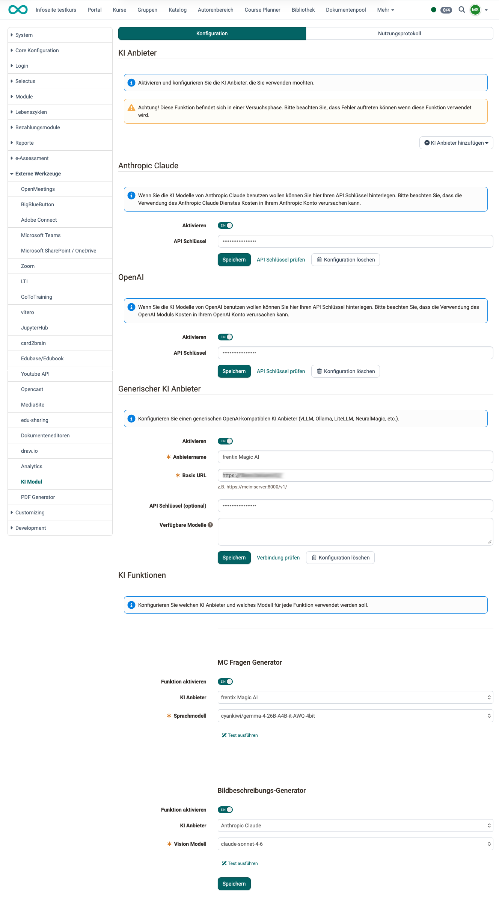
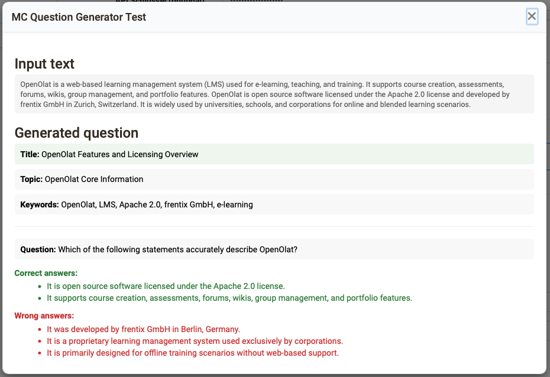
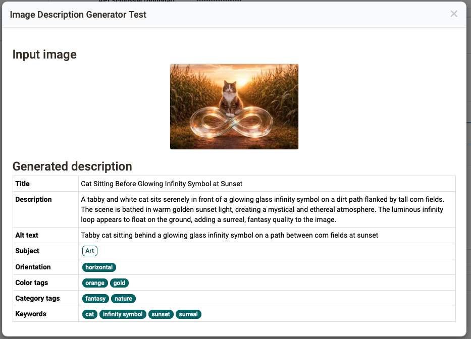
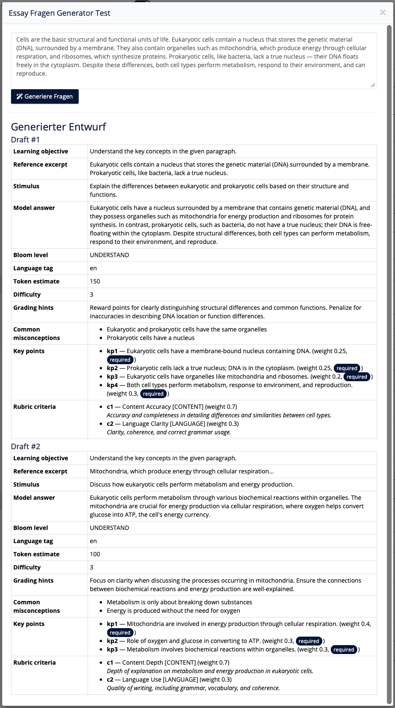
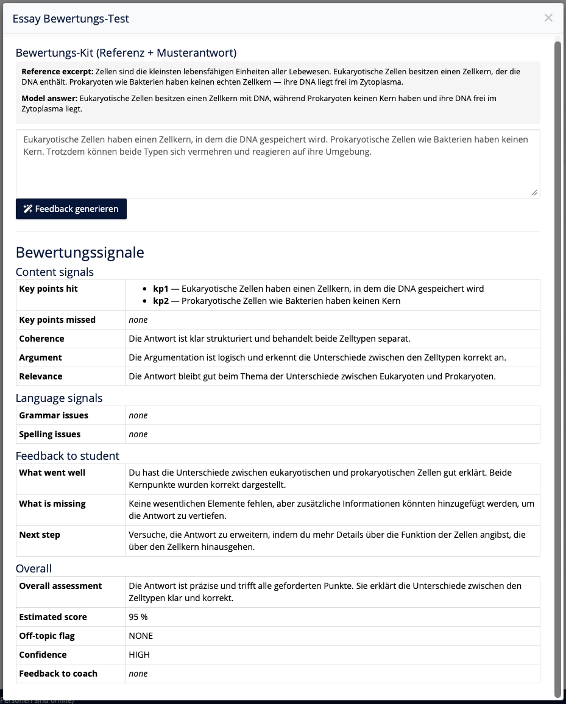
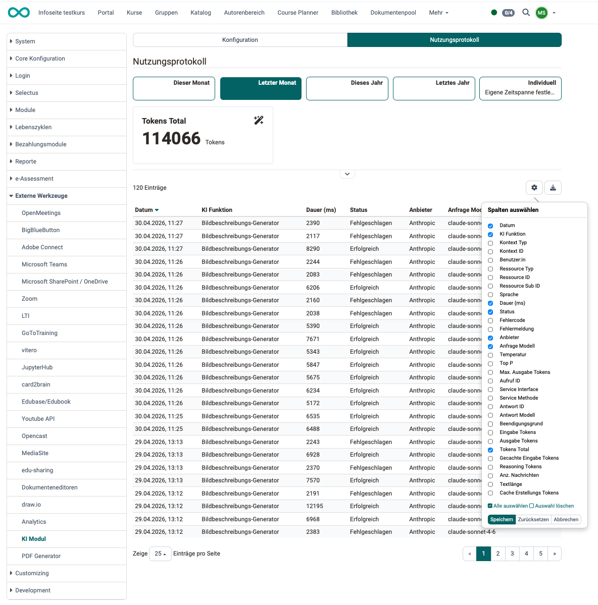

# External tools: AI module {: #ai}

:octicons-tag-16: as of Release 21

In OpenOlat you are supported by AI at different points. To do this, the AI tools used must be configured in the external tools. 

## Tab Configuration {: #config}

{ class="shadow lightbox" }

[To the top of the page ^](#ai)

---

### AI provider {: #ai_provider}

In OpenOlat, the term “AI provider” refers to the service provider whose AI models are used for the various AI-powered features on the platform.

Enable and configure the various AI providers you want to use by clicking the **"Add AI Provider" button** in the upper-right corner.

!!! hint "Please note:"

    On the one hand, integrating many different AI tools allows users to leverage each tool’s specific strengths. On the other hand, AI tools train themselves and take previous dialogues into account. If tasks are distributed and assigned to many different AI tools, none of the tools has access to the complete history of the dialogues.

[To the top of the page ^](#ai)

---

### Anthropic Claude {: #anthropic_claude}

If you want to use Anthropic Claude's AI models, you can enter your API key here. Please note that using the Anthropic Claude service may incur charges on your Anthropic account.

[To the top of the page ^](#ai)

---

### OpenAI {: #open_ai}

If you want to use OpenAI's AI models, you can enter your API key here. Please note that using the OpenAI module may incur charges on your OpenAI account.

[To the top of the page ^](#ai)

---

### Generic AI provider {: #generic_ai_provider}

In this section, you can configure a generic OpenAI-compatible AI provider, such as

* vLLM
* Ollama 
* LiteLLM
* NeuralMagic
* ...

For further specification, list the model names available on this server.

[To the top of the page ^](#ai)

---

### AI functions {: #ai_functions}

The AI integration is configured individually for each function, with the available models being downloaded directly from the respective provider.

In the "AI functions" section, you can configure all locations and functions in OpenOlat that can be enhanced with AI.

* whether to use AI (toggle button to enable it),
* which AI provider
* and which model should be used.

Currently, AI can be integrated into the following functions:

* Multiple-choice question generator (creation of multiple-choice questions)
* Image description generator (creation of image descriptions, alternative text, and keywords)
* Essay Question Generator
* Essay assessment

Copy a subject-specific text into the designated input field. OpenOlat will then automatically generate multiple-choice questions with answer options, as well as pre-fill a range of metadata for each question item (keywords, topic, and taxonomy).

For each function, you can view an AI-generated sample by clicking the "Run Test" link.

**Example MC Question Generator:** 
{ class="shadow lightbox" }

**Example image description generator:** 
{ class="shadow lightbox" }

**Example Essay Question Generator:** 
{ class="shadow lightbox" }

**Sample Essay Assessment:** 
{ class="shadow lightbox" }

[To the top of the page ^](#ai)

---

## Tab Usage log {: #usage_log}

In the "Usage Log" tab, you'll find detailed usage data showing how AI has been used in OpenOlat.

To view the details you need, click the gear icon to display the relevant columns. 

{ class="shadow lightbox" }

[To the top of the page  ^](#ai)

 