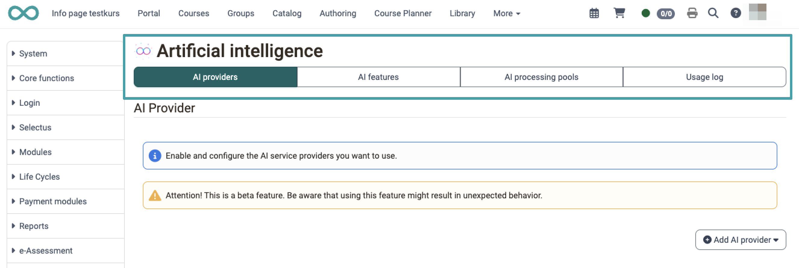
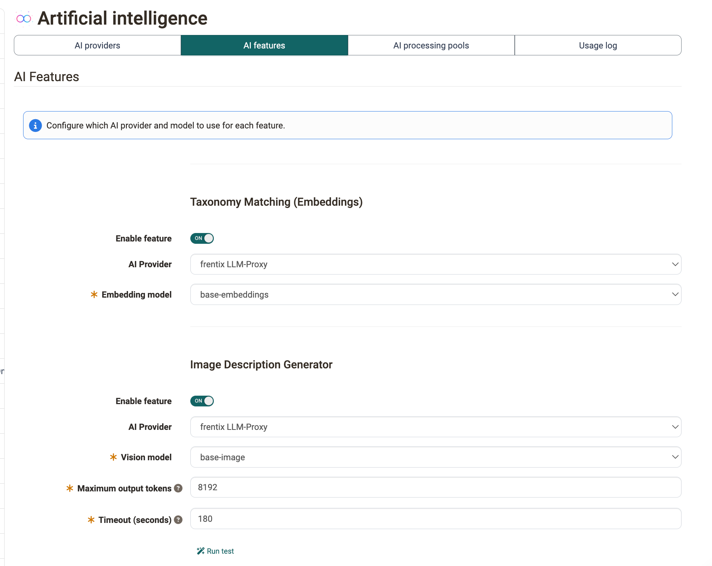
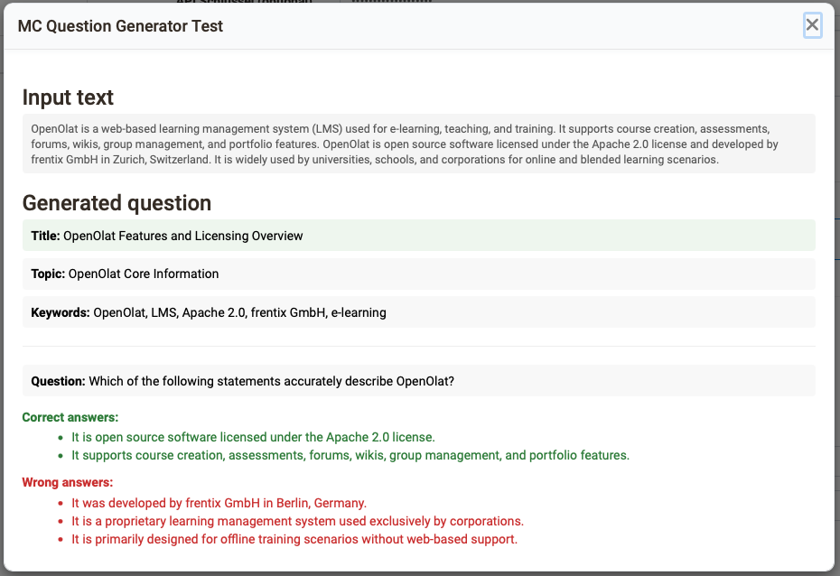
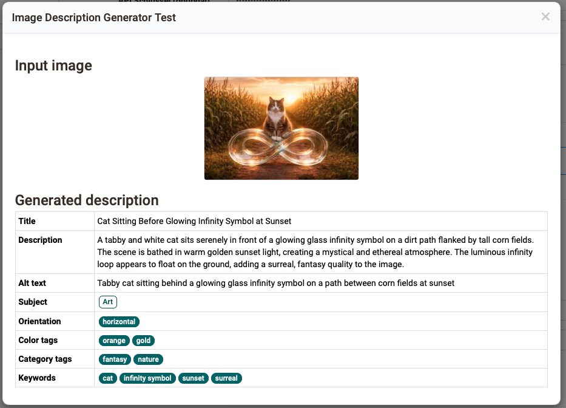
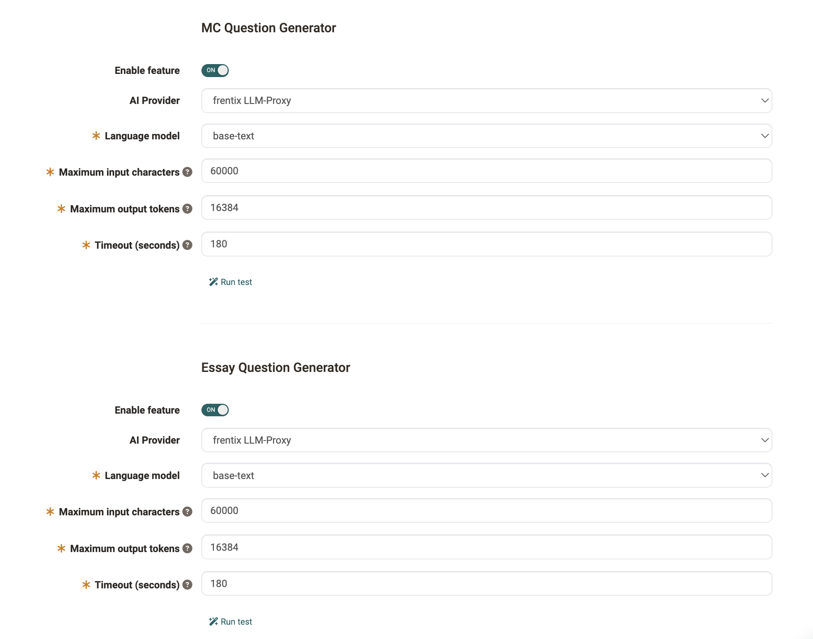
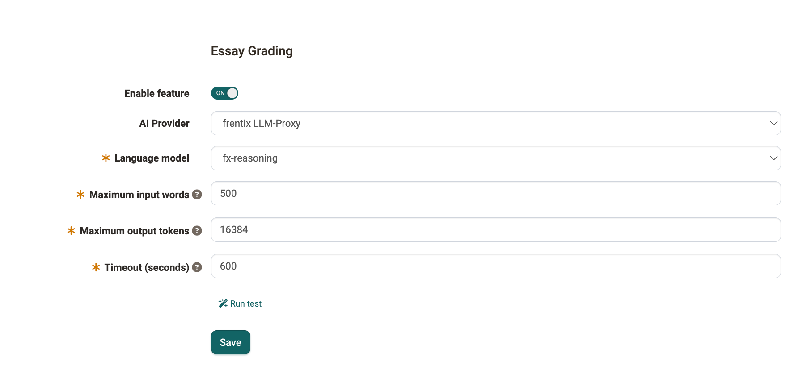
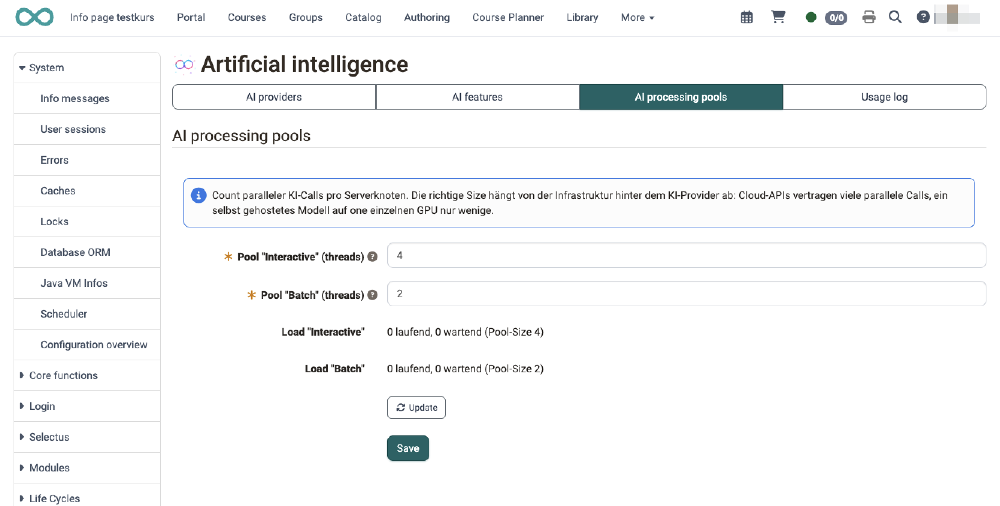
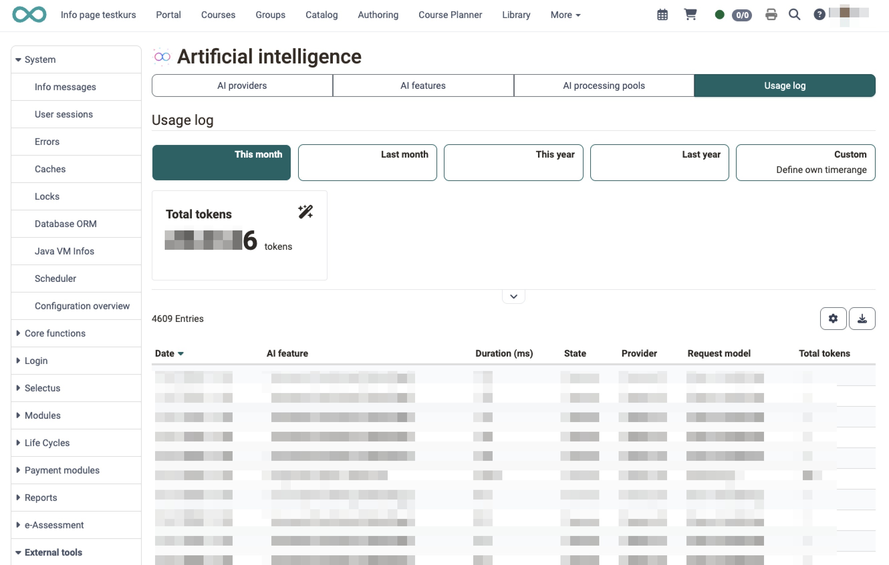

# External tools: AI module {: #ai}


In OpenOlat you are supported by AI at different points. To do this, the AI providers used must be configured in the external tools. The AI module supports multiple AI providers; you define per AI feature which provider and which model is used [:octicons-tag-16:{ title="from Release 20.3.0 (OO-9253)" }](https://track.frentix.com/issue/OO-9253){:target="_blank"}.

The AI module is part of the external tools, see [External Tools: Overview >](External_Tools_-_Administration.md). It is located in the system administration and is configured by administrators and system administrators. Other roles do not reach the system administration. How roles are granted is described in [Assign roles >](../usermanagement/Assign_roles.md).

!!! tip "Support by frentix"

    Customers of frentix please contact [contact@frentix.com](mailto:contact@frentix.com) for connecting an AI provider. frentix supports the choice of provider and model, the API key and the operation of a self-hosted model. For systems with the fx-Release, these adjustments are made by frentix.

    **Not a frentix hosting-client?** Please ask your local system operator!


## Configuration {: #config}

The AI module settings are located in the system administration under:<br>
`Administration > External tools > AI module`

They are organised into four areas (tabs):

* **"AI providers"**: connect the AI services used and store an API key.
* **"AI features"**: define per location whether AI is used and with which provider and model.
* **"AI processing pools"**: control how many AI calls are processed simultaneously.
* **"Usage log"**: review all AI calls on the instance with tokens and status.

{ class="shadow lightbox" }

[To the top of the page ^](#ai)

---

### AI provider {: #ai_provider}

In OpenOlat, the term "AI provider" refers to the service provider whose AI models are used for the various AI-powered features on the platform.

Enable and configure the various AI providers you want to use by clicking the **"Add AI provider" button** in the upper-right corner.

As the operator of the platform you are legally obliged to inform your users about the usage of an AI service.

!!! warning "Attention"

    The "AI providers" tab points out that the AI functionality is a beta feature. Using it may result in unexpected behaviour.

The following actions are available for each configured AI provider:

* **"Enable" toggle**: The provider can be temporarily disabled and enabled again. The configuration is retained.
* **"Check API key" button**: The stored key is validated directly with the provider. On success, the number of available models is displayed; in case of an error, the provider's error message is shown. For the generic AI provider the button is called "Check connection".
* **"Delete configuration" button**: Removes the provider including the API key and all configurations.


**Anthropic Claude**

If you want to use Anthropic Claude's AI models, you can enter your API key here. Please note that using the Anthropic Claude service may incur charges on your Anthropic account.


**OpenAI**

If you want to use OpenAI's AI models, you can enter your API key here. Please note that using the OpenAI module may incur charges on your OpenAI account.


**Generic AI provider**

In this section, you can configure a generic OpenAI-compatible AI provider, such as

* vLLM
* Ollama
* LiteLLM
* NeuralMagic
* ...

The following fields are available:

* **"Provider name"**: the name under which the provider is offered for selection in the AI features.
* **"Base URL"**: the address of the OpenAI-compatible interface, for example `https://my-server:8000/v1/`.
* **"API Key (optional)"**: only needed if the server requires authentication.
* **"Available models"**: comma-separated list of the model names on this server. Needed if the models are not auto-detectable.

Use the **"Check connection" button** to test whether the server can be reached.

[To the top of the page ^](#ai)

---

### AI features {: #ai_functions}

The AI integration is configured individually for each feature, with the available models being loaded directly from the respective provider.

**You define**:

* whether to use AI ("Enable feature" toggle),
* which AI provider ("AI Provider" field)
* and which model should be used ("Language model" field; "Vision model" for the Image Description Generator, "Embedding model" for Taxonomy Matching).

**Currently, AI can be integrated into the following features**:

* Taxonomy Matching (Embeddings): assignment to the matching taxonomy level via embedding model, see [Module Taxonomy >](Modules_Taxonomy.md) [:octicons-tag-16:{ title="from Release 21.0 (OO-9428)" }](https://track.frentix.com/issue/OO-9428){:target="_blank"}
* MC Question Generator (creation of multiple-choice questions), used in [Question pool: Create Questions >](../../manual_user/area_modules/Question_Bank_Create_Questions.md)
* Image Description Generator (creation of image descriptions, alternative text, and keywords), used in [Information and settings for items in the Media Center >](../../manual_user/basic_concepts/Media_Center_Items.md) [:octicons-tag-16:{ title="from Release 20.3.0 (OO-9355)" }](https://track.frentix.com/issue/OO-9355){:target="_blank"}
* Essay Question Generator (creation of open-text questions with grading criteria)
* Essay Grading (formative AI feedback on open-text answers), used in the question pool and in the [Content Editor >](../../manual_user/basic_concepts/Content_Editor.md) [:octicons-tag-16:{ title="from Release 21.0 (OO-9496)" }](https://track.frentix.com/issue/OO-9496){:target="_blank"}

The benefit of these features for authors and the places where they take effect are shown in the concept study [AI features: Application map >](../../manual_user/area_modules/AI_Features_Map.md).

{ class="shadow lightbox" }

Copy a subject-specific text into the designated input field. OpenOlat will then automatically generate multiple-choice questions with answer options, as well as pre-fill a range of metadata for each question item (keywords, topic, and taxonomy).

For each feature except Taxonomy Matching, the "Run test" link shows an AI-generated sample. The link appears as soon as a provider and a model are selected.

**Example MC Question Generator:**<br>
{ class="shadow lightbox" }

**Example Image Description Generator:**<br>
{ class="shadow lightbox" }


#### Limits per feature [:octicons-tag-16:{ title="from Release 21.0.2 (OO-9677)" }](https://track.frentix.com/issue/OO-9677){:target="_blank"} {: #ai_function_limits}

For each AI feature you additionally define how much text is sent to the model, how much text the model may produce and how long OpenOlat waits for the response. The default values are also sufficient for reasoning models, that is, models that perform internal reasoning steps before the actual answer.

* **"Maximum output tokens"**: limits how much text the model may produce. A reasoning model uses part of this budget for its reasoning steps. If the budget is too small, nothing is left for the answer and the call fails. Smallest permitted value: 1024.
* **"Timeout (seconds)"**: defines how long OpenOlat waits for the response of the AI provider before the call is cancelled. Reasoning models and self-hosted models take considerably longer than standard cloud models. Smallest permitted value: 10.
* **"Maximum input characters"**: limits the source text that is sent to the model for question generation. Smallest permitted value: 1000.
* **"Maximum input words"**: limits the length of an answer that is accepted for essay grading. OpenOlat rejects longer answers with an error message before any AI call is made. The message states the configured value. Smallest permitted value: 50.

The default values per feature:

| AI feature | Input limit | Maximum output tokens | Timeout (seconds) |
|---|---|---|---|
| MC Question Generator | 60000 input characters | 16384 | 180 |
| Image Description Generator | none | 8192 | 180 |
| Essay Question Generator | 60000 input characters | 16384 | 180 |
| Essay Grading | 400 input words | 16384 | 600 |

{ class="shadow lightbox" }

{ class="shadow lightbox" }

For a reasoning model or a self-hosted model, keep the default values or increase them. If the default is not sufficient, increase the timeout first and the output tokens afterwards.

[To the top of the page ^](#ai)

---

### AI processing pools {: #ai_pools}

In the "AI processing pools" tab, you define how many AI calls are executed simultaneously per server node. The appropriate size depends on the infrastructure behind the AI provider: cloud services handle many parallel calls, a self-hosted model on a single GPU only a few.

* **Pool "Interactive" (threads)**: for AI tasks a user is actively waiting on, for example the AI correction of free-text answers.
* **Pool "Batch" (threads)**: for long-running jobs such as question generation from page content; one job can take several minutes.

By default, 8 threads are available for "Interactive" and 2 threads for "Batch". The value per pool must be between 1 and 64.

Below the two fields, the load per pool shows how many calls are currently running and how many are waiting. The "Refresh" button reloads these values.

{ class="shadow lightbox" }

[To the top of the page ^](#ai)

---


### Usage log [:octicons-tag-16:{ title="from Release 21.0 (OO-9393)" }](https://track.frentix.com/issue/OO-9393){:target="_blank"} {: #ai_usage_log}

The "Usage log" records every AI call on the instance, making it traceable which AI features are used how often and how many tokens are consumed. The table contains, among other things, date, AI feature, provider, model, status and duration as well as Input tokens, Output tokens and Total tokens.

The following are available for analysis:

* **Time range**: "This month" (preselected), "Last month", "This year", "Last year" as well as "Custom" for an own time range.
* **Column filters** for "AI feature" and "Status".
* **Excel download** of the filtered table.

The "Total tokens" widget above the table shows the sum of all tokens in the selected time range.

{ class="shadow lightbox" }

[To the top of the page ^](#ai)

---


### Preconfiguration via olat.properties [:octicons-tag-16:{ title="from Release 20.3.4 (OO-9546)" }](https://track.frentix.com/issue/OO-9546){:target="_blank"} {: #ai_properties}

AI providers and AI features can also be preset directly in the configuration file `olat.properties`. This is particularly suitable for centrally managed deployments (e.g. Ansible or Docker images) where the same AI provider should be preconfigured on all instances.

The following priority principle applies: The values from `olat.properties` act as default values. As soon as a value is saved in the AI module, the saved value permanently takes precedence. The presets are loaded regardless of whether the provider or feature is enabled; to use them, enabling them in the AI module is all that is needed.

```properties
# OpenAI (GPT) provider
ai.openai.enabled=false
ai.openai.api.key=
# Anthropic (Claude) provider
ai.anthropic.enabled=false
ai.anthropic.api.key=
# Generic OpenAI-compatible provider (e.g. vLLM, Ollama, LiteLLM)
# An empty base URL means: no generic preset provider
ai.generic.preset.enabled=false
ai.generic.preset.name=
ai.generic.preset.base.url=
ai.generic.preset.api.key=
# Comma-separated list of model names if not auto-detectable
ai.generic.preset.models=
# Enabled flag, provider (spi) and model per AI feature
# Possible spi values: OpenAI, Anthropic, Generic_0
ai.feature.mc-question-generator.enabled=false
ai.feature.mc-question-generator.spi=
ai.feature.mc-question-generator.model=
ai.feature.image-description-generator.enabled=false
ai.feature.image-description-generator.spi=
ai.feature.image-description-generator.model=
ai.feature.essay-generation.enabled=false
ai.feature.essay-generation.spi=
ai.feature.essay-generation.model=
ai.feature.essay-grading.enabled=false
ai.feature.essay-grading.spi=
ai.feature.essay-grading.model=
# Limits per AI feature
ai.mc.generator.max.input.chars=60000
ai.mc.generator.max.output.tokens=16384
ai.mc.generator.timeout.seconds=180
ai.img.desc.max.output.tokens=8192
ai.img.desc.timeout.seconds=180
ai.essay.generation.max.input.chars=60000
ai.essay.generation.max.output.tokens=16384
ai.essay.generation.timeout.seconds=180
ai.essay.grading.max.input.words=400
ai.essay.grading.max.output.tokens=16384
ai.essay.grading.timeout.seconds=600
# Size of the processing pools (worker threads per node)
ai.task.pool.interactive.size=8
ai.task.pool.batch.size=2
# Taxonomy matching
taxonomy.matching.enabled=false
taxonomy.matching.spi=
taxonomy.matching.model=
# Minimum score at which a taxonomy level is assigned
taxonomy.matching.min.score=0.65
# pgvector is used automatically when available (PostgreSQL with pgvector).
# If pgvector is not available, matching still works via the in-memory search path.
taxonomy.matching.pgvector.enabled=true
taxonomy.matching.local.model.dir=${userdata.dir}/ai/models
# Optional prefix overrides. Leave empty for auto-detection based on the model name.
taxonomy.matching.query.prefix=
taxonomy.matching.passage.prefix=
```

!!! info "Important"

    The generic preset provider is available on every installation under the fixed ID `Generic_0`. It is displayed in the "AI providers" tab but cannot be deleted there. Additional generic providers are created in the "AI providers" tab.

[To the top of the page ^](#ai)

---


## Further information {: #further_information}

[External Tools: Overview >](External_Tools_-_Administration.md)<br>
[AI features: Application map (concept study) >](../../manual_user/area_modules/AI_Features_Map.md)<br>
[Assign roles >](../usermanagement/Assign_roles.md)<br>
[Module Taxonomy >](Modules_Taxonomy.md)<br>
[Question pool: Create Questions >](../../manual_user/area_modules/Question_Bank_Create_Questions.md)<br>
[Information and settings for items in the Media Center >](../../manual_user/basic_concepts/Media_Center_Items.md)<br>
[Content Editor >](../../manual_user/basic_concepts/Content_Editor.md)

[To the top of the page ^](#ai)
