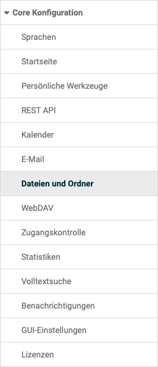
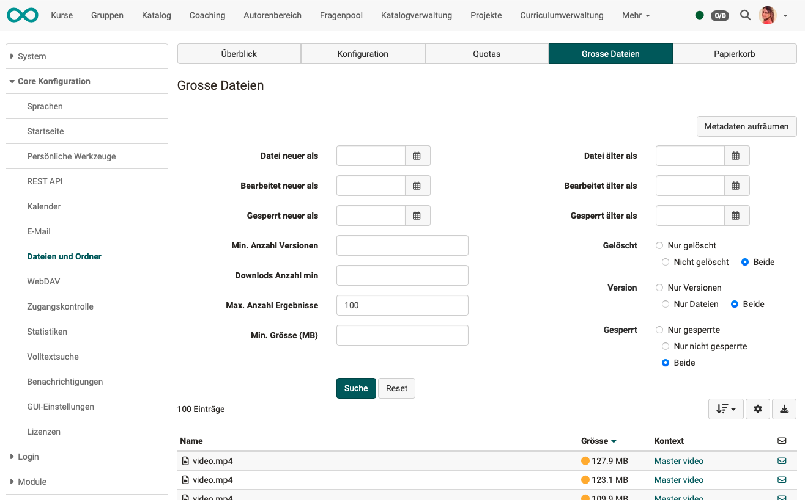
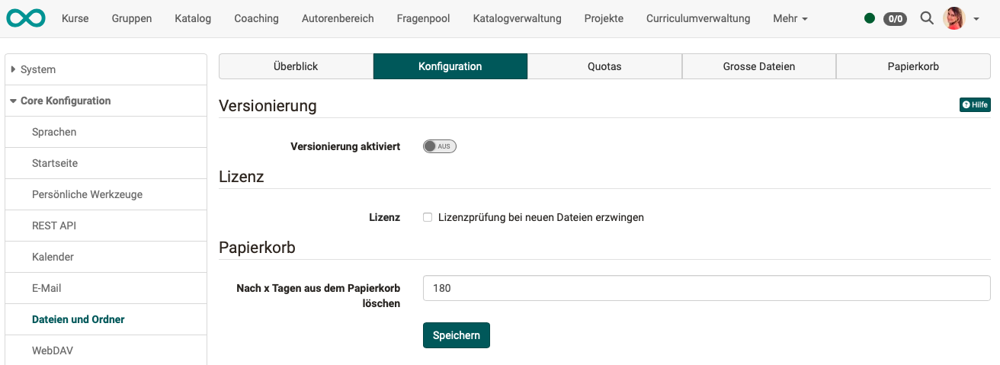

# Dateien und Ordner {: #files_and_folders}

{ class="aside-right lightbox"}

Für allgemeine Einstellungen/Konfigurationen betreffend Dateien und Ordnern finden Sie hier die Tabs

* [Übersicht](Files_and_Folders.de.md##files_and_folders_overview)
* [Konfiguration](#files_and_folders_configuration) für Einstellungen zu
    * [Versionierung](#files_and_folders_configuration_versions)
    * [Lizenzen](#files_and_folders_configuration_license)
    * der [endgütligen Löschung des Papierkorbs](#files_and_folders_configuration_trash)
* [Quotas](#files_and_folders_quotas) zur Festlegung des Speicherplatzes für alle Ordner
* [Grosse Dateien](#files_and_folders_large_files) für das Herausfiltern (und evtl. Löschen) besonders grosser Dateien, die die Quota belasten
* [Papierkorb](#files_and_folders_trash) zur Ansicht des Papierkorb-Inhalts

---

## Tab Überblick {: #files_and_folders_overview}

{ class="shadow lightbox" }

Im Tab Überblick erhalten Administratoren einen schnellen Gesamtüberblick über die Anzahl und die Größe von OpenOlat Dateien, Versionen, gelöschten Dateien und Miniaturansichten und können diesbezüglich Aktionen vornehmen.

[zum Seitenanfang ^](#files_and_folders)

## Tab Konfiguration {: #files_and_folders_configuration}

{ class="shadow lightbox" }

### Versionierung {: #files_and_folders_configuration_versions}

Bei eingeschalteter Versionierung werden Dateien nicht überschrieben, sondern als neue Version (auch Revision genannt) angelegt. Ältere Versionen eines Dokumentes können heruntergeladen und bei Bedarf wiederhergestellt werden. Werden Dateien gelöscht, so erscheinen Sie in der Liste der gelöschten Dateien und können wiederhergestellt werden. Ist die Versionierungsfunktion eingeschaltet, so können Dateien auch gesperrt werden, z.B. wenn eine Person an einem Dokument arbeitet und verhindern möchte, dass eine andere Person zwischenzeitlich eine neue Version erstellt.

Die Versionierung ist in allen Ordnern des Systems vorhanden: persönliche Ordner, Gruppenordner, Kursordner, Ressourcenordner und Kursbausteine "Ordner".

Im **Abschnitt "Versionierung"** kann die maximale Anzahl von Versionen für eine Datei
definiert werden.

**Button "Versionen aufräumen"** 
Die Versionierung kann von der Anzahl her angepasst werden. Wird jetzt beispielsweise von 5 Versionen auf 2 Versionen geändert, sind pro Dokument 3 Versionen überflüssig. Diese werden jedoch nicht direkt gelöscht. Wenn Sie die Anzahl wieder auf 5 Versionen stellen, werden sie wieder sichtbar. Um jedoch diese Versionen ganz zu löschen, klicken Sie auf Versionen aufräumen. Anschliessend können die Versionen nicht mehr wiederhergestellt werden.

### Lizenz {: #files_and_folders_configuration_license}

Im **Abschnitt "Lizenz"** kann gewählt werden, ob bei neu erstellten Dateien eine Lizenzangabe gemacht werden muss. Es erscheint dann bei fehlender Lizenzangabe eine Aufforderung zur Angabe des Lizenzgebers und eine Auswahl verschiedener Lizenzierungsmöglichkeiten (z.B. CC BY-N-ND u.a.).

### Papierkorb {: #files_and_folders_configuration_trash}

Im **Abschnitt "Papierkorb"** wird festgelegt, nach welcher Zeit die im Papierkorb liegenden Dateien endgültig gelöscht werden.

Den aktuellen Inhalt des Papierkorbs sehen Sie im separaten Tab "Papierkorb".

[zum Seitenanfang ^](#files_and_folders)

## Tab Quotas {: #files_and_folders_quotas}

{ class="shadow lightbox" }

Im Tab **"Quotas"** kann die maximale Speichergröße und das Upload-Limit für
bestimmte Pfade definiert und angepasst werden.

Folgende Standardwerte gelten systemweit:

Systemweite Quotas | Anwendungsbereich
---------|----------
::DEFAULT::BLOGSPODCASTS | Lernressourcen Blog und Podcast
::DEFAULT::COACHFOLDER | Betreuer-Ordner im Kurs
::DEFAULT::COURSEDOCUMENTS | KursTool "Dokumente" (Kursmenü)
::DEFAULT::COURSEFOLDERS | Kurs-Ablageordner (ohne Kurselement-Unterordner) und Ressourcenordner (Shared Folder)
::DEFAULT::GROUPS | Ordner in Gruppen
::DEFAULT::NODEFOLDERS | Kursbaustein "Ordner"
::DEFAULT::NODEPARTFOLDERS | Kursbaustein "Teilnehmer-Ordner"
::DEFAULT::POWERUSERS | Persönlicher Ordner von Autoren
::DEFAULT::REPOSITORY | Lernressourcen wie Content Package oder Tests
::DEFAULT::USERS | Persönlicher Ordner von Benutzern ohne zusätzliche Systemrechte

Es können individuelle Quotas ergänzt werden. Diese übersteuern den Standardwert und gelten beispielsweise nur für einen ganz bestimmten Kursordner oder den persönlichen Ordner eines ganz bestimmten Benutzers / einer bestimmten Benutzerin.

Spezifische Quotas | Anwendungsbereich
---------|----------
/course/101032323838456/coursefolder | Kursbaustein "Ordner" in einem bestimmten Kurs
/cts/folders/BusinessGroup/414156565 | Ordner in einer bestimmten Gruppen
/homes/mmusterfrau | Persönlicher Ordner von der Benutzerin M. Musterfrau
/HomeSite/ < id-des-benutzers > /MediaCenter/0/My/0 | Anpassung einer persönlichen Quota im Media Center

[zum Seitenanfang ^](#files_and_folders)

## Tab Grosse Dateien {: #files_and_folders_large_files}

{ class="shadow lightbox" }

Im Tab "**Grosse Dateien**" können Administratoren gezielt nach grossen Dateien suchen und sich weitere Details zu diesen Dateien anzeigen lassen.

Mit dem **Button "Metadaten aufräumen"** wird ein Abgleich zwischen dem File-System und dem in der OpenOlat-Datenbank gespeicherten Abbild vorgenommen. Sollten Unstimmigkeiten vorliegen, wird das Abbild in der Datenbank aktualisiert.

{ class="shadow lightbox" }

[zum Seitenanfang ^](#files_and_folders)

## Tab Papierkorb {: #files_and_folders_trash}

{ class="shadow lightbox" }

Alle gelöschten Dateien der Instanz gelangen zunächst in den Papierkorb. Dort werden sie nach einer bestimmten Zeit automatisch gelöscht oder können von Administrator:innen gezielt ausgewählt und sofort endgültig gelöscht werden.

Das Wiederherstellen von Dateien im Papierkorb ist den Personen überlassen, die die Datei in den Papierkorb verschoben ("gelöscht") haben. Sie haben jeweils selbst die Möglichkeit, eine Datei aus dem Papierkorb zurück zu holen.

Die Verweildauer der gelöschten Dateien im Papierkorb bis zur endgültigen Löschung wird unter dem Tab "Konfiguration" bestimmt.

{ class="shadow lightbox" }

[zum Seitenanfang ^](#files_and_folders)

---

## Gelöschte Dateien (vor Version 19)

Im Tab "**Gelöschte Dateien**" können von bestimmten Pfaden Dateien endgültig gelöscht werden.

## Orphan Versionen löschen (vor Version 19)

Alle Dokumente, welche manuell gelöscht werden oder für welche keine Versionierung mehr zur Verfügung steht, werden in eine Art Papierkorb gelegt. (Dieser Papierkorb unterscheidet sich vom Papierkorb ab Version 19.) Von dort könnten sie wiederhergestellt werden, benötigen jedoch auch nach wie vor dieselbe Speichermenge. Mit "Orphan Versionen löschen" wird dieser Papierkorb gelöscht. Die Versionen können nicht mehr wiederhergestellt werden, benötigen jedoch auch keinen Speicher mehr.  

[zum Seitenanfang ^](#files_and_folders)

