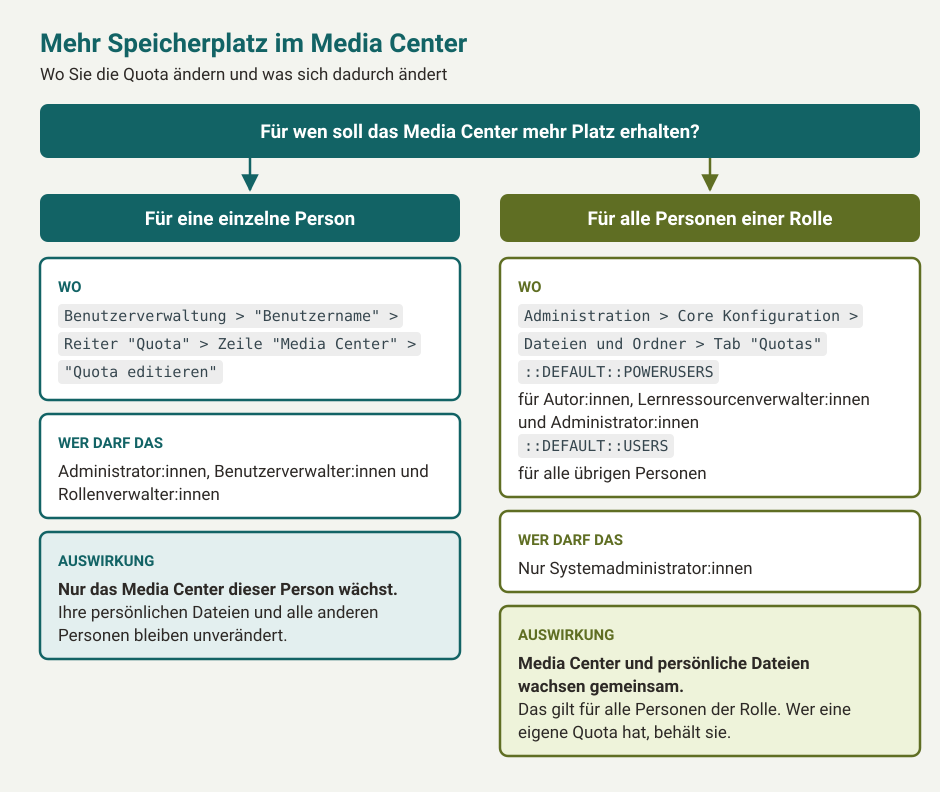
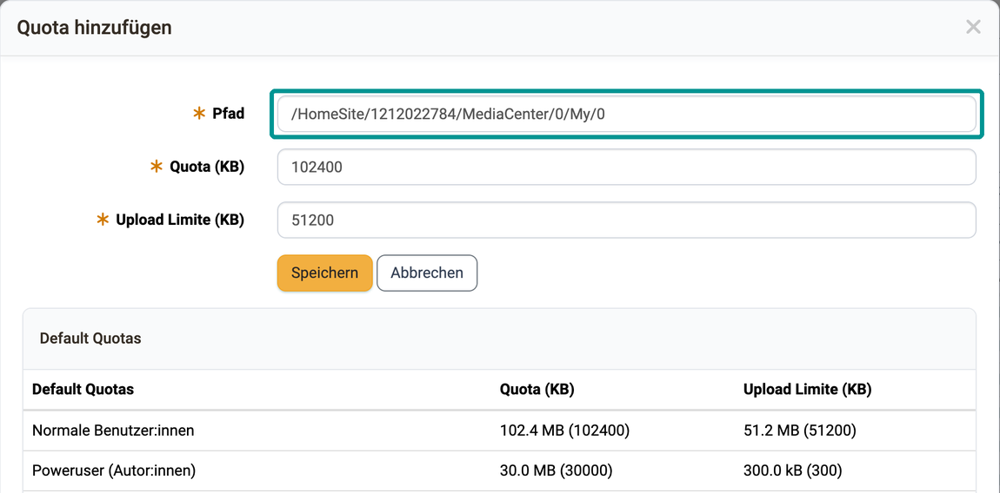

# Dateien und Ordner {: #files_and_folders}

{ class="aside-right lightbox" }

Die allgemeinen Einstellungen zu Dateien und Ordnern finden Sie in der System-Administration unter: 
`Administration > Core Konfiguration > Dateien und Ordner`

Der Bereich enthält folgende Tabs:

* [Überblick](#files_and_folders_overview) mit Kennzahlen zu Dateien, Versionen, gelöschten Dateien und Miniaturansichten
* [Konfiguration](#files_and_folders_configuration) für Einstellungen zu
    * [Versionierung](#files_and_folders_configuration_versions)
    * [Lizenz](#files_and_folders_configuration_license)
    * der [endgültigen Löschung des Papierkorbs](#files_and_folders_configuration_trash)
* [Quotas](#files_and_folders_quotas) zur Festlegung des Speicherplatzes für alle Ordner
* [Grosse Dateien](#files_and_folders_large_files) für das Herausfiltern (und evtl. Löschen) besonders grosser Dateien, die die Quota belasten
* [Papierkorb](#files_and_folders_trash) zur Ansicht des Papierkorb-Inhalts

---

## Tab Überblick {: #files_and_folders_overview}

Im Tab Überblick erhalten Administrator:innen einen schnellen Gesamtüberblick über die Anzahl und die Grösse von OpenOlat Dateien, Versionen, gelöschten Dateien und Miniaturansichten.

Aus dem Überblick führen Links direkt in die zugehörigen Ansichten: "Zeige grosse Dateien", "Zeige gelöschte Dateien" und "Zeige Versionseinstellungen". Mit "Miniaturansichten zurücksetzen" wird der Status nicht erzeugter Miniaturansichten zurückgesetzt. Der Button "Neu berechnen" ermittelt die Kennzahlen neu.

[zum Seitenanfang ^](#files_and_folders)

## Tab Konfiguration {: #files_and_folders_configuration}

### Versionierung {: #files_and_folders_configuration_versions}

Bei eingeschalteter Versionierung werden Dateien nicht überschrieben, sondern als neue Version (auch Revision genannt) angelegt. Ältere Versionen eines Dokumentes können heruntergeladen und bei Bedarf wiederhergestellt werden. Werden Dateien gelöscht, so erscheinen sie in der Liste der gelöschten Dateien und können wiederhergestellt werden. Ist die Versionierungsfunktion eingeschaltet, so können Dateien auch gesperrt werden, z.B. wenn eine Person an einem Dokument arbeitet und verhindern möchte, dass eine andere Person zwischenzeitlich eine neue Version erstellt.

Die Versionierung ist in allen Ordnern des Systems vorhanden: "Persönliche Dateien", Gruppenordner, Kursordner, Ressourcenordner und Kursbausteine "Ordner".

Im Abschnitt "Versionierung" schalten Sie die Funktion mit dem Schalter "Versionierung aktiviert" ein oder aus. Erst bei eingeschalteter Versionierung erscheinen die Auswahlliste "Anzahl Versionen", die Angabe "Versionen Grösse" und der Button "Versionen aufräumen". In der Auswahlliste "Anzahl Versionen" legen Sie die maximale Anzahl von Versionen für eine Datei fest; der Wert "Unlimitiert" hebt die Begrenzung auf.

**Button "Versionen aufräumen"** 
Die Versionierung kann von der Anzahl her angepasst werden. Wird jetzt beispielsweise von 5 Versionen auf 2 Versionen geändert, sind pro Dokument 3 Versionen überflüssig. Diese werden jedoch nicht direkt gelöscht. Wenn Sie die Anzahl wieder auf 5 Versionen stellen, werden sie wieder sichtbar. Um jedoch diese Versionen ganz zu löschen, klicken Sie auf "Versionen aufräumen". Anschliessend können die Versionen nicht mehr wiederhergestellt werden.

### Lizenz {: #files_and_folders_configuration_license}

Im Abschnitt "Lizenz" bestimmt die Checkbox "Lizenzprüfung bei neuen Dateien erzwingen", ob bei neu erstellten Dateien eine Lizenzangabe gemacht werden muss. Es erscheint dann bei fehlender Lizenzangabe eine Aufforderung zur Angabe des Lizenzgebers und eine Auswahl verschiedener Lizenzierungsmöglichkeiten (z.B. CC BY-N-ND u.a.).

### Papierkorb {: #files_and_folders_configuration_trash}

Im Abschnitt "Papierkorb" legt das Feld "Nach x Tagen aus dem Papierkorb löschen" fest, nach welcher Zeit die im Papierkorb liegenden Dateien endgültig gelöscht werden.

Den aktuellen Inhalt des Papierkorbs sehen Sie im separaten Tab "Papierkorb".

[zum Seitenanfang ^](#files_and_folders)

## Tab Quotas {: #files_and_folders_quotas}

Damit der Platz der Instanz planbar bleibt, legen Sie im Tab "Quotas" fest, wie viel Speicher die Ordner und das Media Center höchstens belegen dürfen. Je Pfad gelten zwei Werte: "Quota (KB)" begrenzt den ganzen Ordner, "Upload Limite (KB)" eine einzelne hochgeladene Datei.

Den Button "Quota hinzufügen" und die Aktionen zum Bearbeiten und Löschen einer Quota sehen Administrator:innen und Systemadministrator:innen. Die Standardwerte, deren Pfad mit "::DEFAULT::" beginnt, ändern nur Systemadministrator:innen.

Folgende Standardwerte gelten systemweit:

Systemweite Quotas | Anwendungsbereich
---------|----------
::DEFAULT::BLOGSPODCASTS | Lernressourcen Blog und Podcast
::DEFAULT::COACHFOLDER | Betreuer:innen Ordner im Kurs
::DEFAULT::COMMENTS | An Kommentare angehängte Dateien (Button "Datei anhängen") [:octicons-tag-16:{ title="ab Release 19.0.4 (OO-7759)" }](https://track.frentix.com/issue/OO-7759)
::DEFAULT::COURSEDOCUMENTS | Kurstool "Dokumente" (Kursmenü)
::DEFAULT::COURSEFOLDERS | Ablageordner des Kurses (ohne Unterordner von Kursbausteinen) und Ressourcenordner (Shared Folder)
::DEFAULT::GROUPS | Ordner in Gruppen
::DEFAULT::NODEFOLDERS | Kursbaustein "Ordner"
::DEFAULT::NODEPARTFOLDERS | Kursbaustein "Teilnehmer:innen Ordner"
::DEFAULT::POWERUSERS | "Persönliche Dateien" und Media Center von Autor:innen, Lernressourcenverwalter:innen und Administrator:innen
::DEFAULT::REPOSITORY | Lernressourcen wie Content Package oder Tests
::DEFAULT::USERS | "Persönliche Dateien" und Media Center aller übrigen Benutzer:innen

Im Dialog "Quota editieren" führt die Liste "Default Quotas" die beiden Werte als "Normale Benutzer:innen" und "Poweruser (Autor:innen)".

Für das Media Center gibt es keinen eigenen systemweiten Standardwert. "::DEFAULT::USERS" und "::DEFAULT::POWERUSERS" gelten zugleich für die persönlichen Dateien und für das Media Center einer Person. Wer einen dieser Werte erhöht, gibt damit allen Personen, für die er gilt, mehr Platz in beiden. Soll nur eine einzelne Person mehr Platz im Media Center erhalten, setzen Sie für sie eine individuelle Quota. Sie vergrössert nur das Media Center, die persönlichen Dateien dieser Person behalten ihren Wert. [:octicons-tag-16:{ title="ab Release 18.1 (OO-7024)" }](https://track.frentix.com/issue/OO-7024)

{ class="shadow lightbox" title="Mehr Speicherplatz im Media Center" }

Individuelle Quotas übersteuern den Standardwert und gelten beispielsweise nur für einen ganz bestimmten Kursordner oder für die persönlichen Dateien einer ganz bestimmten Person. Sie legen eine individuelle Quota mit dem Button "Quota hinzufügen" an und tragen im Feld "Pfad" den Pfad des Ordners ein.

{ class="shadow lightbox" }

Spezifische Quotas | Anwendungsbereich
---------|----------
/course/101032323838456/coursefolder | Kursbaustein "Ordner" in einem bestimmten Kurs
/cts/folders/BusinessGroup/414156565 | Ordner in einer bestimmten Gruppe
/homes/mmusterfrau | "Persönliche Dateien" der Person mit dem Anmeldenamen mmusterfrau
/HomeSite/**"Identität"**/MediaCenter/0/My/0 | Media Center einer bestimmten Person

Die Identität ist die Nummer, die OpenOlat jedem Konto fest zuteilt. Sie ist nicht dasselbe wie der Anmeldename: Der Pfad der persönlichen Dateien enthält den Anmeldenamen (`/homes/mmusterfrau`), der Pfad des Media Centers dagegen die Identität, etwa `/HomeSite/1212022784/MediaCenter/0/My/0`. Sie finden die Nummer in der Benutzerverwaltung: 
`Benutzerverwaltung > "Benutzername"` 
Auf der Seite "Kontoeinstellungen verwalten" steht sie in der Tabelle oben in der ersten Zeile "Identität".

Die Quotas für die persönlichen Dateien und das Media Center einer Person legen Sie einfacher in der Benutzerverwaltung an, im Reiter "Quota" ihres Kontos. Dort entsteht derselbe Eintrag, ohne dass Sie den Pfad eintippen, siehe [Konto konfigurieren](../usermanagement/Configure_User.de.md#quota).

[zum Seitenanfang ^](#files_and_folders)

## Tab Grosse Dateien {: #files_and_folders_large_files}

Im Tab "Grosse Dateien" können Administrator:innen gezielt nach grossen Dateien suchen und sich weitere Details zu diesen Dateien anzeigen lassen.

Mit dem **Button "Metadaten aufräumen"** gleicht OpenOlat die Dateien im Dateisystem mit den Metadaten in der OpenOlat-Datenbank ab. Bei Unterschieden aktualisiert OpenOlat die Metadaten in der Datenbank. 
In diesem Zusammenhang werden auch die Miniaturansichten aktualisiert:

* Konnten Miniaturansichten nicht erzeugt werden (normalerweise aus technischen Gründen), wird ihr Status zurückgesetzt.
* Es werden keine **bestehenden** Miniaturansichten gelöscht oder neu erzeugt.
* Für Dateien mit **fehlender** Miniaturansicht versucht das System, die Miniaturansicht neu zu erstellen. (Je nach Dateityp kann es sein, dass der Versuch nicht erfolgreich ist.)
* Erstellt wird die Miniaturansicht dann, wenn der betreffende Ordner geöffnet wird. Das bedeutet, dass es jeweils einen Moment dauern kann, bis die Miniaturansicht erscheint.

Die Suchmaske kombiniert Zeit-, Mengen- und Statusfilter:

* "Datei neuer als" und "Datei älter als" für das Erstellungsdatum
* "Bearbeitet neuer als" und "Bearbeitet älter als" für die letzte Änderung
* "Gesperrt neuer als" und "Gesperrt älter als" für den Zeitpunkt der Sperrung
* "Min. Anzahl Versionen", "Downloads Anzahl min" und "Min. Grösse (MB)" als Untergrenzen
* "Max. Anzahl Ergebnisse" für die Länge der Trefferliste
* "Gelöscht", "Version" und "Gesperrt" zur Einschränkung auf einen Zustand oder auf beide

Mit dem Button "Suche" wird die Trefferliste erstellt, mit "Reset" werden die Filter geleert.

{ class="shadow lightbox" }

Die Trefferliste zeigt Name, Grösse und Kontext jeder Datei. In der letzten Spalte schickt die Aktion "E-Mail absenden" eine vorformulierte Nachricht an die Person, welche die Datei abgelegt hat. Die Nachricht bittet darum, die Datei zu prüfen und bei Bedarf zu entfernen.

[zum Seitenanfang ^](#files_and_folders)

## Tab Papierkorb [:octicons-tag-16:{ title="ab Release 19.0 (OO-7541)" }](https://track.frentix.com/issue/OO-7541) {: #files_and_folders_trash}

Alle gelöschten Dateien der Instanz gelangen zunächst in den Papierkorb. Dort werden sie nach einer bestimmten Zeit automatisch gelöscht oder können von Administrator:innen gezielt ausgewählt und sofort endgültig gelöscht werden.

Das Wiederherstellen von Dateien im Papierkorb ist den Personen überlassen, die die Datei in den Papierkorb verschoben ("gelöscht") haben. Diese Personen können eine Datei selbst aus dem Papierkorb zurückholen.

Die Verweildauer der gelöschten Dateien im Papierkorb bis zur endgültigen Löschung wird unter dem Tab "Konfiguration" bestimmt.

{ class="shadow lightbox" }

[zum Seitenanfang ^](#files_and_folders)

## Weiterführende Informationen {: #further_information}

**Auf dieser Seite erwähnt** 
[Konto konfigurieren >](../usermanagement/Configure_User.de.md)

**Weiterführend** 
[Media Center: Konzept >](../../manual_user/basic_concepts/Media_Center_Concept.de.md) 
[Persönliche Werkzeuge: File Hub >](../../manual_user/personal_menu/File_Hub.de.md) 
[Mit welchen Massnahmen kann ich den Speicherverbrauch reduzieren? >](../../manual_how-to/reduce_storage_consumption/reduce_storage_consumption.de.md)

[zum Seitenanfang ^](#files_and_folders)
