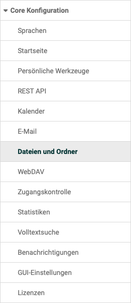
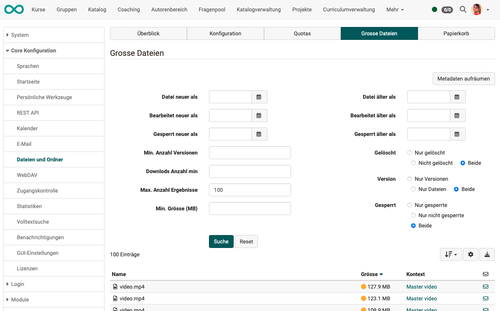
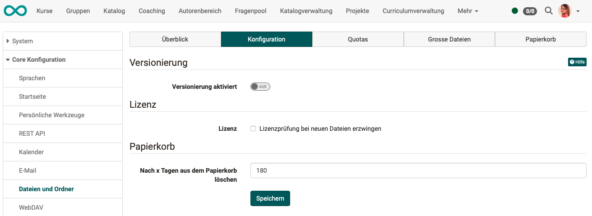

# Dateien und Ordner {: #files_and_folders}

{ class="aside-right lightbox" }

Die allgemeinen Einstellungen zu Dateien und Ordnern finden Sie in der System-Administration unter: 
`Administration > Core Konfiguration > Dateien und Ordner`

Der Bereich enthält folgende Tabs:

* [Überblick](#files_and_folders_overview) mit Kennzahlen zu Dateien, Versionen, gelöschten Dateien und Miniaturansichten
* [Konfiguration](#files_and_folders_configuration) für Einstellungen zu
    * [Versionierung](#files_and_folders_configuration_versions)
    * [Lizenz](#files_and_folders_configuration_license)
    * der [endgültigen Löschung des Papierkorbs](#files_and_folders_configuration_trash)
* [Quotas](#files_and_folders_quotas) zur Festlegung des Speicherplatzes für alle Ordner
* [Grosse Dateien](#files_and_folders_large_files) für das Herausfiltern (und evtl. Löschen) besonders grosser Dateien, die die Quota belasten
* [Papierkorb](#files_and_folders_trash) zur Ansicht des Papierkorb-Inhalts

---

## Tab Überblick {: #files_and_folders_overview}

{ class="shadow lightbox" }

Im Tab Überblick erhalten Administrator:innen einen schnellen Gesamtüberblick über die Anzahl und die Grösse von OpenOlat Dateien, Versionen, gelöschten Dateien und Miniaturansichten.

Aus dem Überblick führen Links direkt in die zugehörigen Ansichten: "Zeige grosse Dateien", "Zeige gelöschte Dateien" und "Zeige Versionseinstellungen". Mit "Miniaturansichten zurücksetzen" wird der Status nicht erzeugter Vorschaubilder zurückgesetzt. Der Button "Neu berechnen" ermittelt die Kennzahlen neu.

[zum Seitenanfang ^](#files_and_folders)

## Tab Konfiguration {: #files_and_folders_configuration}

{ class="shadow lightbox" }

### Versionierung {: #files_and_folders_configuration_versions}

Bei eingeschalteter Versionierung werden Dateien nicht überschrieben, sondern als neue Version (auch Revision genannt) angelegt. Ältere Versionen eines Dokumentes können heruntergeladen und bei Bedarf wiederhergestellt werden. Werden Dateien gelöscht, so erscheinen Sie in der Liste der gelöschten Dateien und können wiederhergestellt werden. Ist die Versionierungsfunktion eingeschaltet, so können Dateien auch gesperrt werden, z.B. wenn eine Person an einem Dokument arbeitet und verhindern möchte, dass eine andere Person zwischenzeitlich eine neue Version erstellt.

Die Versionierung ist in allen Ordnern des Systems vorhanden: persönliche Ordner, Gruppenordner, Kursordner, Ressourcenordner und Kursbausteine "Ordner".

Im Abschnitt "Versionierung" schalten Sie die Funktion mit dem Schalter "Versionierung aktiviert" ein oder aus. Erst bei eingeschalteter Versionierung erscheinen die Auswahlliste "Anzahl Versionen", die Angabe "Versionen Grösse" und der Button "Versionen aufräumen". In der Auswahlliste "Anzahl Versionen" legen Sie die maximale Anzahl von Versionen für eine Datei fest; der Wert "Unlimitiert" hebt die Begrenzung auf.

**Button "Versionen aufräumen"** 
Die Versionierung kann von der Anzahl her angepasst werden. Wird jetzt beispielsweise von 5 Versionen auf 2 Versionen geändert, sind pro Dokument 3 Versionen überflüssig. Diese werden jedoch nicht direkt gelöscht. Wenn Sie die Anzahl wieder auf 5 Versionen stellen, werden sie wieder sichtbar. Um jedoch diese Versionen ganz zu löschen, klicken Sie auf "Versionen aufräumen". Anschliessend können die Versionen nicht mehr wiederhergestellt werden.

### Lizenz {: #files_and_folders_configuration_license}

Im Abschnitt "Lizenz" bestimmt die Checkbox "Lizenzprüfung bei neuen Dateien erzwingen", ob bei neu erstellten Dateien eine Lizenzangabe gemacht werden muss. Es erscheint dann bei fehlender Lizenzangabe eine Aufforderung zur Angabe des Lizenzgebers und eine Auswahl verschiedener Lizenzierungsmöglichkeiten (z.B. CC BY-N-ND u.a.).

### Papierkorb {: #files_and_folders_configuration_trash}

Im Abschnitt "Papierkorb" legt das Feld "Nach x Tagen aus dem Papierkorb löschen" fest, nach welcher Zeit die im Papierkorb liegenden Dateien endgültig gelöscht werden.

Den aktuellen Inhalt des Papierkorbs sehen Sie im separaten Tab "Papierkorb".

[zum Seitenanfang ^](#files_and_folders)

## Tab Quotas {: #files_and_folders_quotas}

{ class="shadow lightbox" }

Im Tab "Quotas" kann die maximale Speichergrösse und das Upload-Limit für
bestimmte Pfade definiert und angepasst werden.

Folgende Standardwerte gelten systemweit:

Systemweite Quotas | Anwendungsbereich
---------|----------
::DEFAULT::BLOGSPODCASTS | Lernressourcen Blog und Podcast
::DEFAULT::COACHFOLDER | Betreuer:innen Ordner im Kurs
::DEFAULT::COURSEDOCUMENTS | Kurstool "Dokumente" (Kursmenü)
::DEFAULT::COURSEFOLDERS | Ablageordner des Kurses (ohne Unterordner von Kursbausteinen) und Ressourcenordner (Shared Folder)
::DEFAULT::GROUPS | Ordner in Gruppen
::DEFAULT::NODEFOLDERS | Kursbaustein "Ordner"
::DEFAULT::NODEPARTFOLDERS | Kursbaustein "Teilnehmer:innen Ordner"
::DEFAULT::POWERUSERS | Persönlicher Ordner von Autor:innen
::DEFAULT::REPOSITORY | Lernressourcen wie Content Package oder Tests
::DEFAULT::USERS | Persönlicher Ordner von Benutzer:innen ohne zusätzliche Systemrechte

Es können individuelle Quotas ergänzt werden. Diese übersteuern den Standardwert und gelten beispielsweise nur für einen ganz bestimmten Kursordner oder den persönlichen Ordner einer ganz bestimmten Person.

Spezifische Quotas | Anwendungsbereich
---------|----------
/course/101032323838456/coursefolder | Kursbaustein "Ordner" in einem bestimmten Kurs
/cts/folders/BusinessGroup/414156565 | Ordner in einer bestimmten Gruppe
/homes/mmusterfrau | Persönlicher Ordner der Benutzerin M. Musterfrau
/HomeSite/"Benutzer-ID"/MediaCenter/0/My/0 | Anpassung einer persönlichen Quota im Media Center

[zum Seitenanfang ^](#files_and_folders)

## Tab Grosse Dateien {: #files_and_folders_large_files}

{ class="shadow lightbox" }

Im Tab "Grosse Dateien" können Administrator:innen gezielt nach grossen Dateien suchen und sich weitere Details zu diesen Dateien anzeigen lassen.

Mit dem **Button "Metadaten aufräumen"** wird ein Abgleich zwischen dem File-System und dem in der OpenOlat-Datenbank gespeicherten Abbild vorgenommen. Sollten Unstimmigkeiten vorliegen, wird das Abbild in der Datenbank aktualisiert. 
In diesem Zusammenhang werden auch die Vorschaubilder aktualisiert:

* Konnten Vorschaubilder nicht generiert werden (normalerweise aus technischen Gründen), wird ihr Status zurückgesetzt.
* Es werden keine **bestehenden** Vorschaubilder gelöscht oder neu generiert.
* Für Dateien mit **fehlendem** Vorschaubild, versucht das System das Vorschaubild neu zu erstellen. (Je nach Dateityp kann es sein, dass der Versuch nicht erfolgreich ist.)
* Erstellt wird das Vorschaubild dann, wenn der betreffende Ordner geöffnet wird. Das bedeutet, dass es jeweils einen Moment dauern kann, bis das Vorschaubild erscheint.

Die Suchmaske kombiniert Zeit-, Mengen- und Statusfilter:

* "Datei neuer als" und "Datei älter als" für das Erstellungsdatum
* "Bearbeitet neuer als" und "Bearbeitet älter als" für die letzte Änderung
* "Gesperrt neuer als" und "Gesperrt älter als" für den Zeitpunkt der Sperrung
* "Min. Anzahl Versionen", "Downloads Anzahl min" und "Min. Grösse (MB)" als Untergrenzen
* "Max. Anzahl Ergebnisse" für die Länge der Trefferliste
* "Gelöscht", "Version" und "Gesperrt" zur Einschränkung auf einen Zustand oder auf beide

Mit dem Button "Suche" wird die Trefferliste erstellt, mit "Reset" werden die Filter geleert.

{ class="shadow lightbox" }

Die Trefferliste zeigt Name, Grösse und Kontext jeder Datei. Über das Briefsymbol in der letzten Spalte lässt sich mit "E-Mail absenden" eine vorformulierte Nachricht an die Person schicken, welche die Datei abgelegt hat. Die Nachricht bittet darum, die Datei zu prüfen und bei Bedarf zu entfernen.

[zum Seitenanfang ^](#files_and_folders)

## Tab Papierkorb [:octicons-tag-16:{ title="ab Release 19.0 (OO-7541)" }](https://track.frentix.com/issue/OO-7541) {: #files_and_folders_trash}

{ class="shadow lightbox" }

Alle gelöschten Dateien der Instanz gelangen zunächst in den Papierkorb. Dort werden sie nach einer bestimmten Zeit automatisch gelöscht oder können von Administrator:innen gezielt ausgewählt und sofort endgültig gelöscht werden.

Das Wiederherstellen von Dateien im Papierkorb ist den Personen überlassen, die die Datei in den Papierkorb verschoben ("gelöscht") haben. Diese Personen können eine Datei selbst aus dem Papierkorb zurückholen.

Die Verweildauer der gelöschten Dateien im Papierkorb bis zur endgültigen Löschung wird unter dem Tab "Konfiguration" bestimmt.

{ class="shadow lightbox" }

[zum Seitenanfang ^](#files_and_folders)

---

## Gelöschte Dateien (vor Version 19)

Im Tab "**Gelöschte Dateien**" können von bestimmten Pfaden Dateien endgültig gelöscht werden.

## Orphan Versionen löschen (vor Version 19)

Alle Dokumente, welche manuell gelöscht werden oder für welche keine Versionierung mehr zur Verfügung steht, werden in eine Art Papierkorb gelegt. (Dieser Papierkorb unterscheidet sich vom Papierkorb ab Version 19.) Von dort könnten sie wiederhergestellt werden, benötigen jedoch auch nach wie vor dieselbe Speichermenge. Mit "Orphan Versionen löschen" wird dieser Papierkorb gelöscht. Die Versionen können nicht mehr wiederhergestellt werden, benötigen jedoch auch keinen Speicher mehr.  

[zum Seitenanfang ^](#files_and_folders)

