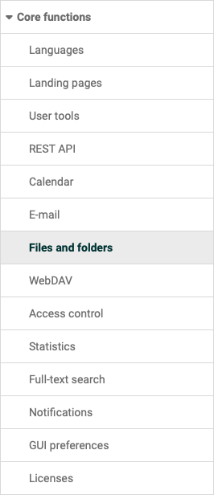
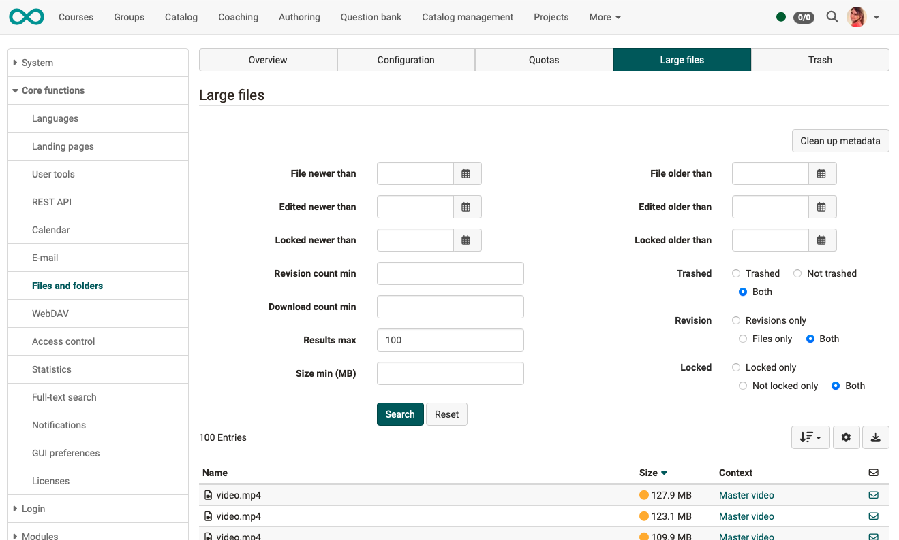
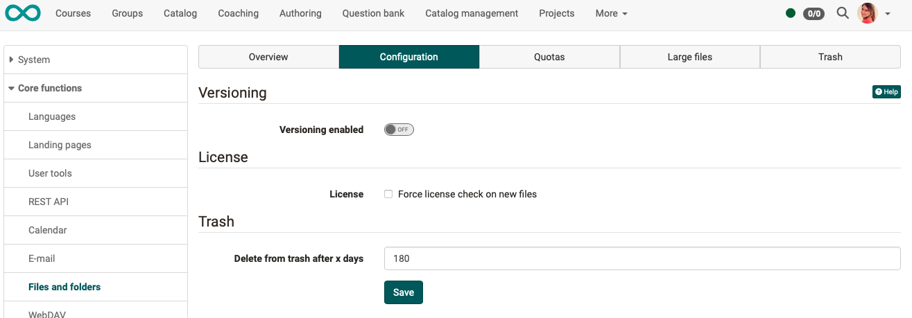

# Files and Folders {: #files_and_folders}

{ class="aside-right lightbox"}

For general settings/configurations relating to files and folders, you will find the tabs

* [Overview](Files_and_Folders.md##files_and_folders_overview)
* [Configuration](#files_and_folders_configuration) for settings about
    * [Versions](#files_and_folders_configuration_versions)
    * [Licenses](#files_and_folders_configuration_license)
    * the [the final deletion of the trash](#files_and_folders_configuration_trash)
* [Quotas](#files_and_folders_quotas) to define the storage space for all folders
* [Large files](#files_and_folders_large_files) for filtering out (and possibly deleting) particularly large files that burden the quota
* [Trash](#files_and_folders_trash) to view the contents of the recycle bin

---

## Tab Overview {: #files_and_folders_overview}

{ class="shadow lightbox" }

In the Overview tab, administrators can get a quick overview of the number and size of OpenOlat files, versions, deleted files and thumbnails, and can take actions in this regard.

[To the top the page ^](#files_and_folders)

## Tab Configuration {: #files_and_folders_configuration}

{ class="shadow lightbox" }

### Versions {: #files_and_folders_configuration_versions}

If versioning is enabled, files are not overwritten but created as a new version (also called revision). Older versions of a document can be downloaded and restored if necessary. If files are deleted, they appear in the list of deleted files and can be restored. If the versioning function is enabled, files can also be locked, e.g. if a user is working on a document and wants to prevent another user from creating a new version in the meantime.

Versioning is available in all folders of the system: personal folders, group folders, course folders, resource folders and course elements "folders".

In the **"Versions" section**, the maximum number of versions for a file can be defined.

**Button "Clean up versions"** 
The number of versions can be adjusted. If, for example, 5 versions are now changed to 2 versions, 3 versions per document are superfluous. However, these are not deleted directly. If you set the number back to 5 versions, they will become visible again. However, to delete these versions completely, click on Clean up versions. Afterwards, the versions can no longer be restored.

### Lizenz {: #files_and_folders_configuration_license}

In the **"License"** section, you can select whether a license must be specified for newly created files. If the license is missing, a request to enter the licensor and a selection of different licensing options will appear (e.g. CC BY-N-ND u.a.).

### Trash {: #files_and_folders_configuration_trash}

In the **section "Trash"** it is determined, after which time the files in the trash are permanently deleted.

You can see the current contents of the trash in the separate "Trash" tab.

[To the top the page ^](#files_and_folders)

## Tab Quotas {: #files_and_folders_quotas}

{ class="shadow lightbox" }

In the tab "**Quotas**" the maximum storage size and the upload limit for certain paths can be defined and adjusted.

The following default values apply system-wide:

System-wide quotas | Scope
---------|----------
::DEFAULT::BLOGSPODCASTS | Learning resources Blog and Podcast
::DEFAULT::COACHFOLDER | Coach folder in the course
::DEFAULT::COURSEDOCUMENTS | Course tool "Documents" (Course menu)
::DEFAULT::COURSEFOLDERS | Course storage folder (without course element subfolders) and Resource folder (Shared folder)
::DEFAULT::GROUPS | Folders in groups
::DEFAULT::NODEFOLDERS | Course element "Folder"
::DEFAULT::NODEPARTFOLDERS | Course element "Participant Folder"
::DEFAULT::POWERUSERS | Personal folder of authors
::DEFAULT::REPOSITORY | Learning resources like content package or tests
::DEFAULT::USERS | Personal folder of users without additional system rights

Individual quotas can also be added. These override the default value and apply, for example, only to a very specific course folder or the personal folder of a very specific user.

Specific Quotas | Scope
---------|----------
/course/10103238456/coursefolder | Course element "Folder" in a specific course
/cts/folders/BusinessGroup/4141565 | Folder in a specific group
/homes/mmusterfrau | Personal folder of the user M. Musterfrau
/HomeSite/ < id-of-the-user > /MediaCenter/0/My/0 | Adjustment of a personal quota in the Media Center

[To the top the page ^](#files_and_folders)

## Tab Large Files {: #files_and_folders_large_files}

{ class="shadow lightbox" }

In the "**Large Files**" tab, administrators can search specifically for large files and view more details about them.

The **"Clean up metadata"** button is used to compare the file system with the image stored in the OpenOlat database. If there are any discrepancies, the image in the database is updated.

{ class="shadow lightbox" }

[To the top the page ^](#files_and_folders)

## Tab Trash {: #files_and_folders_trash}

{ class="shadow lightbox" }

All deleted files in the instance are first sent to the trash. They are automatically deleted there after a certain period of time or can be specifically selected by the administrator and permanently deleted immediately.

Restoring files in the trash is left to the people who moved ("deleted") the file to the trash. You have the option of retrieving a file from the trash yourself.

The length of time the deleted files remain in the trash until final deletion is determined under the "Configuration" tab.

{ class="shadow lightbox" }

[To the top the page ^](#files_and_folders)

---

## Deleted Files (before version 19)

In the "**Deleted Files**" tab, files can be permanently deleted from specific paths.

## Delete Orphan Versions (before version 19)

All documents which are manually deleted or for which versioning is no longer available are placed in a kind of trash (This trash differs from the trash from version 19 onwards.) From there they could be restored, but they still need the same amount of memory. With Delete Orphan Versions this recycle bin is deleted. The versions can no longer be restored, but they also no longer require any memory. 

[To the top the page ^](#files_and_folders)

