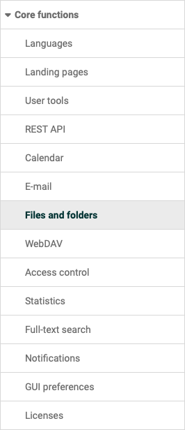
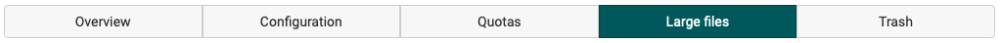
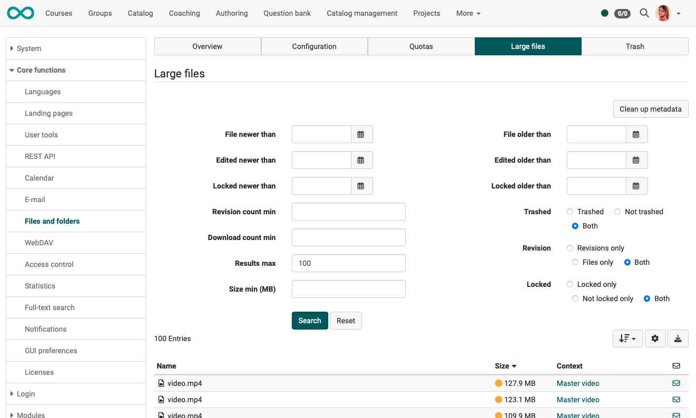
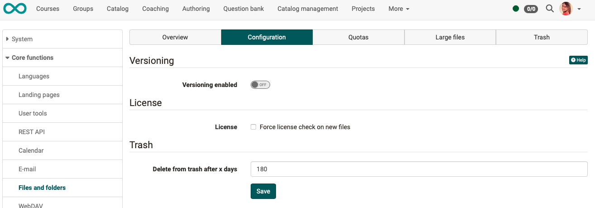

# Files and Folders {: #files_and_folders}

{ class="aside-right lightbox" }

You will find the general settings for files and folders in the system administration under: 
`Administration > Core functions > Files and folders`

The area contains the following tabs:

* [Overview](#files_and_folders_overview) with key figures on files, versions, deleted files and thumbnails
* [Configuration](#files_and_folders_configuration) for settings about
    * [Versioning](#files_and_folders_configuration_versions)
    * [License](#files_and_folders_configuration_license)
    * the [final deletion of the trash](#files_and_folders_configuration_trash)
* [Quotas](#files_and_folders_quotas) to define the storage space for all folders
* [Large files](#files_and_folders_large_files) for filtering out (and possibly deleting) particularly large files that burden the quota
* [Trash](#files_and_folders_trash) to view the contents of the trash

---

## Tab Overview {: #files_and_folders_overview}

{ class="shadow lightbox" }

In the Overview tab, administrators get a quick overall view of the number and size of OpenOlat files, versions, deleted files and thumbnails.

From the overview, links lead directly to the corresponding views: "Show large files", "Show trash" and "Show version settings". "Reset thumbnails" resets the status of preview images that could not be generated. The "Recalculate" button determines the key figures anew.

[To the top of the page ^](#files_and_folders)

## Tab Configuration {: #files_and_folders_configuration}

{ class="shadow lightbox" }

### Versioning {: #files_and_folders_configuration_versions}

If versioning is enabled, files are not overwritten but created as a new version (also called revision). Older versions of a document can be downloaded and restored if necessary. If files are deleted, they appear in the list of deleted files and can be restored. If the versioning function is enabled, files can also be locked, e.g. if a person is working on a document and wants to prevent another person from creating a new version in the meantime.

Versioning is available in all folders of the system: personal folders, group folders, course folders, resource folders and course elements "Folder".

In the "Versioning" section, you switch the function on or off with the "Versioning enabled" toggle. The "Number of versions" selection list, the "Versions size" information and the "Cleanup limit exceeding versions" button only appear when versioning is enabled. In the "Number of versions" selection list, you define the maximum number of versions for a file; the value "Unlimited" removes the limit.

**Button "Cleanup limit exceeding versions"** 
The number of versions can be adjusted. If, for example, 5 versions are now changed to 2 versions, 3 versions per document are superfluous. However, these are not deleted directly. If you set the number back to 5 versions, they will become visible again. However, to delete these versions completely, click on "Cleanup limit exceeding versions". Afterwards, the versions can no longer be restored.

### License {: #files_and_folders_configuration_license}

In the "License" section, the checkbox "Force license check on new files" determines whether a license must be specified for newly created files. If the license is missing, a request to enter the licensor and a selection of different licensing options will appear (e.g. CC BY-N-ND u.a.).

### Trash {: #files_and_folders_configuration_trash}

In the "Trash" section, the field "Delete from trash after x days" determines after which time the files in the trash are permanently deleted.

You can see the current contents of the trash in the separate "Trash" tab.

[To the top of the page ^](#files_and_folders)

## Tab Quotas {: #files_and_folders_quotas}

{ class="shadow lightbox" }

In the "Quotas" tab, the maximum storage size and the upload limit for
certain paths can be defined and adjusted.

The following default values apply system-wide:

System-wide quotas | Scope
---------|----------
::DEFAULT::BLOGSPODCASTS | Learning resources Blog and Podcast
::DEFAULT::COACHFOLDER | Coach folder in the course
::DEFAULT::COURSEDOCUMENTS | Course tool "Documents" (Course menu)
::DEFAULT::COURSEFOLDERS | Storage folder of the course (without subfolders of course elements) and Resource folder (Shared folder)
::DEFAULT::GROUPS | Folders in groups
::DEFAULT::NODEFOLDERS | Course element "Folder"
::DEFAULT::NODEPARTFOLDERS | Course element "Participant Folder"
::DEFAULT::POWERUSERS | Personal folder of authors
::DEFAULT::REPOSITORY | Learning resources like content package or tests
::DEFAULT::USERS | Personal folder of users without additional system rights

Individual quotas can also be added. These override the default value and apply, for example, only to a very specific course folder or the personal folder of a very specific person.

Specific Quotas | Scope
---------|----------
/course/101032323838456/coursefolder | Course element "Folder" in a specific course
/cts/folders/BusinessGroup/414156565 | Folder in a specific group
/homes/mmusterfrau | Personal folder of the user M. Musterfrau
/HomeSite/"User ID"/MediaCenter/0/My/0 | Adjustment of a personal quota in the Media Center

[To the top of the page ^](#files_and_folders)

## Tab Large files {: #files_and_folders_large_files}

{ class="shadow lightbox" }

In the "Large files" tab, administrators can search specifically for large files and view more details about them.

The **"Clean up metadata"** button is used to compare the file system with the image stored in the OpenOlat database. If there are any discrepancies, the image in the database is updated. 
The preview images are also updated in this context:

* If preview images could not be generated (usually for technical reasons), their status is reset.
* No **existing** preview images are deleted or regenerated.
* For files with a **missing** preview image, the system attempts to recreate the preview image. (Depending on the file type, the attempt may not be successful.)
* The preview image is created when the folder in question is opened. This means that it may take a moment for the preview image to appear.

The search mask combines time, quantity and status filters:

* "File newer than" and "File older than" for the creation date
* "Edited newer than" and "Edited older than" for the last change
* "Locked newer than" and "Locked older than" for the time of locking
* "Revision count min", "Download count min" and "Size min (MB)" as lower limits
* "Results max" for the length of the result list
* "Trashed", "Revision" and "Locked" to restrict to one state or to both

The "Search" button creates the result list, "Reset" clears the filters.

{ class="shadow lightbox" }

The result list shows the name, size and context of each file. Via the envelope symbol in the last column, "Send mail" sends a pre-formulated message to the person who stored the file. The message asks to check the file and to remove it if it is no longer needed.

[To the top of the page ^](#files_and_folders)

## Tab Trash [:octicons-tag-16:{ title="from Release 19.0 (OO-7541)" }](https://track.frentix.com/issue/OO-7541) {: #files_and_folders_trash}

{ class="shadow lightbox" }

All deleted files in the instance are first moved to the trash. They are automatically deleted there after a certain period of time or can be specifically selected by administrators and permanently deleted immediately.

Restoring files in the trash is left to the people who moved ("deleted") the file to the trash. These people can retrieve a file from the trash themselves.

The length of time the deleted files remain in the trash until final deletion is determined under the "Configuration" tab.

{ class="shadow lightbox" }

[To the top of the page ^](#files_and_folders)

---

## Deleted Files (before version 19)

In the "**Deleted Files**" tab, files can be permanently deleted from specific paths.

## Delete Orphan Versions (before version 19)

All documents which are manually deleted or for which versioning is no longer available are placed in a kind of trash. (This trash differs from the trash from version 19 onwards.) From there they could be restored, but they still need the same amount of memory. With "Delete Orphan Versions" this trash is deleted. The versions can no longer be restored, but they also no longer require any memory.

[To the top of the page ^](#files_and_folders)

