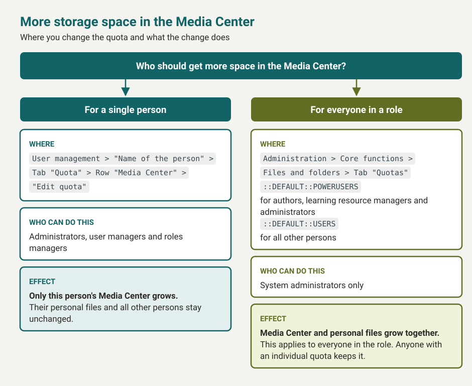
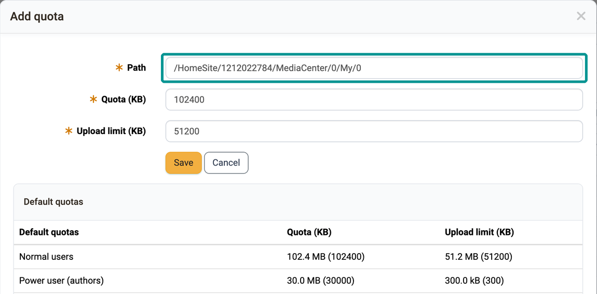

# Files and Folders {: #files_and_folders}

{ class="aside-right lightbox" }

You will find the general settings for files and folders in the system administration under: 
`Administration > Core functions > Files and folders`

The area contains the following tabs:

* [Overview](#files_and_folders_overview) with key figures on files, versions, deleted files and thumbnails
* [Configuration](#files_and_folders_configuration) for settings about
    * [Versioning](#files_and_folders_configuration_versions)
    * [License](#files_and_folders_configuration_license)
    * the [final deletion of the trash](#files_and_folders_configuration_trash)
* [Quotas](#files_and_folders_quotas) to define the storage space for all folders
* [Large files](#files_and_folders_large_files) for filtering out (and possibly deleting) particularly large files that burden the quota
* [Trash](#files_and_folders_trash) to view the contents of the trash

---

## Tab Overview {: #files_and_folders_overview}

In the Overview tab, administrators get a quick overall view of the number and size of OpenOlat files, versions, deleted files and thumbnails.

From the overview, links lead directly to the corresponding views: "Show large files", "Show trash" and "Show version settings". "Reset thumbnails" resets the status of thumbnails that could not be created. The "Recalculate" button determines the key figures anew.

[To the top of the page ^](#files_and_folders)

## Tab Configuration {: #files_and_folders_configuration}

### Versioning {: #files_and_folders_configuration_versions}

If versioning is enabled, files are not overwritten but created as a new version (also called revision). Older versions of a document can be downloaded and restored if necessary. If files are deleted, they appear in the list of deleted files and can be restored. If the versioning function is enabled, files can also be locked, e.g. if a person is working on a document and wants to prevent another person from creating a new version in the meantime.

Versioning is available in all folders of the system: "Personal files", group folders, course folders, resource folders and course elements "Folder".

In the "Versioning" section, you switch the function on or off with the "Versioning enabled" toggle. The "Number of versions" selection list, the "Versions size" information and the "Cleanup limit exceeding versions" button only appear when versioning is enabled. In the "Number of versions" selection list, you define the maximum number of versions for a file; the value "Unlimited" removes the limit.

**Button "Cleanup limit exceeding versions"** 
The number of versions can be adjusted. If, for example, 5 versions are now changed to 2 versions, 3 versions per document are superfluous. However, these are not deleted directly. If you set the number back to 5 versions, they will become visible again. However, to delete these versions completely, click on "Cleanup limit exceeding versions". Afterwards, the versions can no longer be restored.

### License {: #files_and_folders_configuration_license}

In the "License" section, the checkbox "Force license check on new files" determines whether a license must be specified for newly created files. If the license is missing, a request to enter the licensor and a selection of different licensing options will appear (e.g. CC BY-N-ND u.a.).

### Trash {: #files_and_folders_configuration_trash}

In the "Trash" section, the field "Delete from trash after x days" determines after which time the files in the trash are permanently deleted.

You can see the current contents of the trash in the separate "Trash" tab.

[To the top of the page ^](#files_and_folders)

## Tab Quotas {: #files_and_folders_quotas}

To keep the storage space of the instance plannable, you define in the "Quotas" tab how much storage the folders and the Media Center may occupy at most. Two values apply per path: "Quota (KB)" limits the whole folder, "Upload limit (KB)" a single uploaded file.

Administrators and system administrators see the "Add quota" button and the actions for editing and deleting a quota. Only system administrators change the default values whose path starts with "::DEFAULT::".

The following default values apply system-wide:

System-wide quotas | Scope
---------|----------
::DEFAULT::BLOGSPODCASTS | Learning resources Blog and Podcast
::DEFAULT::COACHFOLDER | Coach folder in the course
::DEFAULT::COMMENTS | Files attached to comments ("Attach file" button) [:octicons-tag-16:{ title="from Release 19.0.4 (OO-7759)" }](https://track.frentix.com/issue/OO-7759)
::DEFAULT::COURSEDOCUMENTS | Course tool "Documents" (Course menu)
::DEFAULT::COURSEFOLDERS | Storage folder of the course (without subfolders of course elements) and Resource folder (Shared folder)
::DEFAULT::GROUPS | Folders in groups
::DEFAULT::NODEFOLDERS | Course element "Folder"
::DEFAULT::NODEPARTFOLDERS | Course element "Participant Folder"
::DEFAULT::POWERUSERS | "Personal files" and Media Center of authors, learning resource managers and administrators
::DEFAULT::REPOSITORY | Learning resources like content package or tests
::DEFAULT::USERS | "Personal files" and Media Center of all other users

In the "Edit quota" dialog, the "Default quotas" list shows the two values as "Normal users" and "Power user (authors)".

There is no separate system-wide default value for the Media Center. "::DEFAULT::USERS" and "::DEFAULT::POWERUSERS" apply to both the personal files and the Media Center of a person. Whoever increases one of these values gives all persons to whom it applies more space in both. If only a single person is to receive more space in the Media Center, set an individual quota for this person. It only enlarges the Media Center, the personal files of this person keep their value. [:octicons-tag-16:{ title="from Release 18.1 (OO-7024)" }](https://track.frentix.com/issue/OO-7024)

{ class="shadow lightbox" title="More storage space in the Media Center" }

Individual quotas override the default value and apply, for example, only to a very specific course folder or to the personal files of a very specific person. You create an individual quota with the "Add quota" button and enter the path of the folder in the "Path" field.

{ class="shadow lightbox" }

Specific Quotas | Scope
---------|----------
/course/101032323838456/coursefolder | Course element "Folder" in a specific course
/cts/folders/BusinessGroup/414156565 | Folder in a specific group
/homes/mmusterfrau | "Personal files" of the person with the username mmusterfrau
/HomeSite/**"Identity"**/MediaCenter/0/My/0 | Media Center of a specific person

The identity is the number that OpenOlat permanently assigns to each account. It is not the same as the username. The path of the personal files contains the username (`/homes/mmusterfrau`), whereas the path of the Media Center contains the identity, for example `/HomeSite/1212022784/MediaCenter/0/My/0`. You find the number in the user management: 
`User management > "Name of the person"` 
On the "Manage user settings" page, it is shown in the table at the top, in the first row "Identity".

You create the quotas for the personal files and the Media Center of a person more easily in the user management, in the "Quota" tab of their account. The same entry is created there without you having to type the path, see [Configure user](../usermanagement/Configure_User.md#quota).

[To the top of the page ^](#files_and_folders)

## Tab Large files {: #files_and_folders_large_files}

In the "Large files" tab, administrators can search specifically for large files and view more details about them.

With the **"Clean up metadata"** button, OpenOlat compares the files in the file system with the metadata in the OpenOlat database. If there are any differences, OpenOlat updates the metadata in the database. 
The thumbnails are also updated in this context:

* If thumbnails could not be created (usually for technical reasons), their status is reset.
* No **existing** thumbnails are deleted or created anew.
* For files with a **missing** thumbnail, the system attempts to recreate the thumbnail. (Depending on the file type, the attempt may not be successful.)
* The thumbnail is created when the folder in question is opened. This means that it may take a moment for the thumbnail to appear.

The search mask combines time, quantity and status filters:

* "File newer than" and "File older than" for the creation date
* "Edited newer than" and "Edited older than" for the last change
* "Locked newer than" and "Locked older than" for the time of locking
* "Revision count min", "Download count min" and "Size min (MB)" as lower limits
* "Results max" for the length of the result list
* "Trashed", "Revision" and "Locked" to restrict to one state or to both

The "Search" button creates the result list, "Reset" clears the filters.

{ class="shadow lightbox" }

The result list shows the name, size and context of each file. In the last column, the action "Send mail" sends a pre-formulated message to the person who stored the file. The message asks to check the file and to remove it if it is no longer needed.

[To the top of the page ^](#files_and_folders)

## Tab Trash [:octicons-tag-16:{ title="from Release 19.0 (OO-7541)" }](https://track.frentix.com/issue/OO-7541) {: #files_and_folders_trash}

All deleted files in the instance are first moved to the trash. They are automatically deleted there after a certain period of time or can be specifically selected by administrators and permanently deleted immediately.

Restoring files in the trash is left to the people who moved ("deleted") the file to the trash. These people can retrieve a file from the trash themselves.

The length of time the deleted files remain in the trash until final deletion is determined under the "Configuration" tab.

{ class="shadow lightbox" }

[To the top of the page ^](#files_and_folders)

## Further information {: #further_information}

**Mentioned on this page** 
[Configure user >](../usermanagement/Configure_User.md)

**Further reading** 
[Media Center Concept >](../../manual_user/basic_concepts/Media_Center_Concept.md) 
[Personal tools: File Hub >](../../manual_user/personal_menu/File_Hub.md) 
[What measures can I take to reduce storage space consumption? >](../../manual_how-to/reduce_storage_consumption/reduce_storage_consumption.md)

[To the top of the page ^](#files_and_folders)
