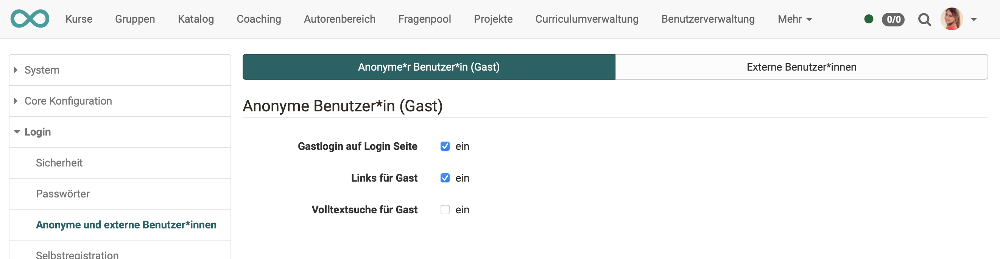
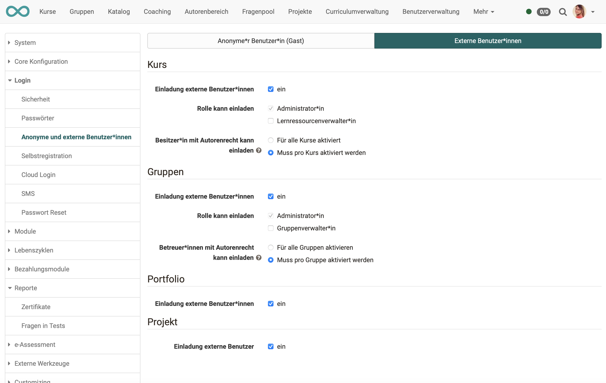

# Anonyme und externe Benutzer:innen

OpenOlat kann neben registrierten Benutzern auch benutzt werden von

* **Gästen** (anonym)
* **externen Benutzer:innen** (per Mail nur in einen bestimmten Kurs/Gruppe/Portfolio/Projekt eingeladen)

Administrator:innen können festlegen, ob und in welchem Umfang OpenOlat so genutzt werden kann.

  
{ class="shadow lightbox" }

* **"Gastlogin auf Login Seite":**   
Bedeutet, dass der Gastzugang auf der Login-Seite ausgewählt werden kann.

*  **"Links für Gast":**   
In der Zugangskonfiguration können so Kurse auch an Gäste freigegeben werden.

*  **"Volltextsuche für Gast":**   
Ermöglicht es Gästen, für sie freigeschaltete Kurse systemweit zu durchsuchen.

 

{ class="shadow lightbox" }

*  **"Einladung externe Benutzer:innen":**   
Hier wird aktiviert, ob externe Benutzer:innen grundsätzlich für diesen Bereich zugelassen sind und eingeladen werden können. 

